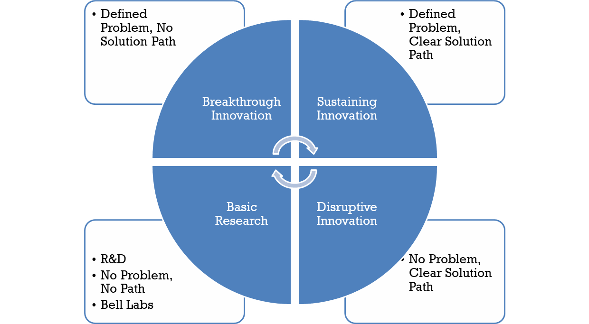
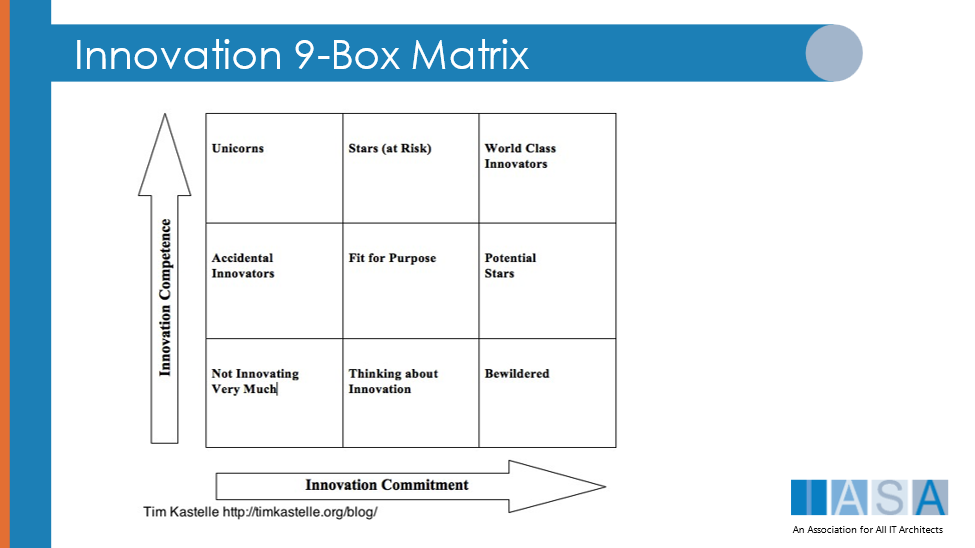
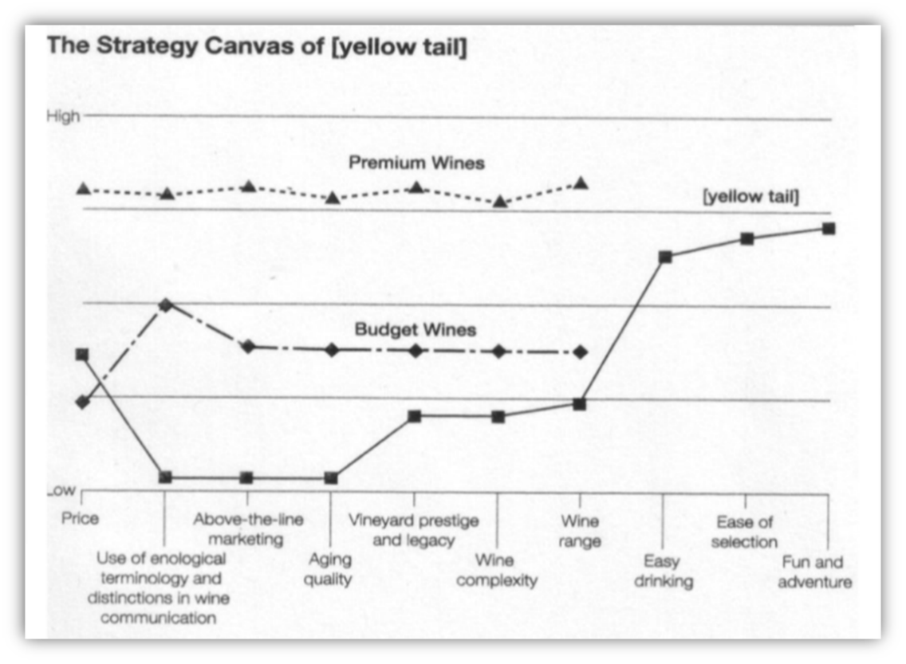
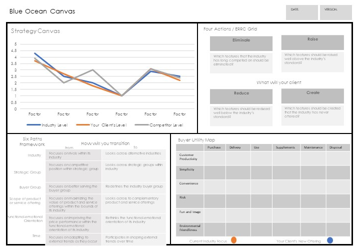
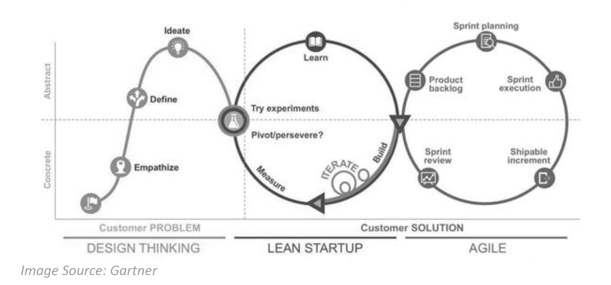
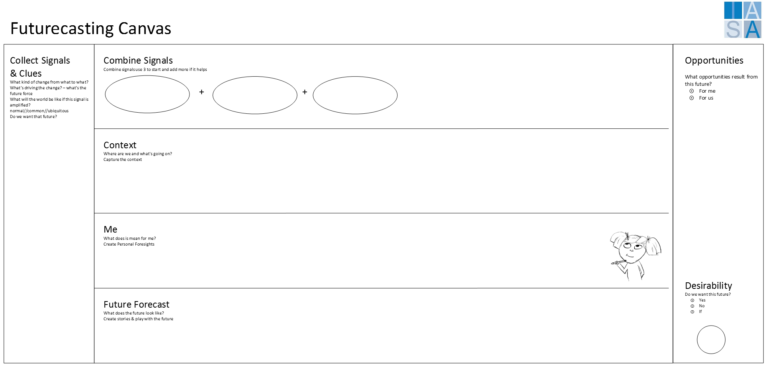

> "For good ideas and true innovation, you need human interaction, conflict, argument, debate."
**Margaret Heffernan**

# What Does it Mean to Innovate

verb (used without object), in-no-vat-ed, in-no-vat-ing.

"to introduce something new; make changes in anything established.the managing of every stage of a production process to make certain that the goods being produced are of the intended standard"- **dictionary.com**

The standard definition of innovation is the introduction of a new idea, which also applies to new services, products, methods, tools, including alterations to existing methods. Interestingly, the concept of outcome, measurement or positive result are not included in the definition. This is because innovation by itself is neither positive or negative as it is being introduced or more accurately the impact, outcome and measured change cannot be known in advance or it is simply mimicry. This is extremely important as the BTABoK is based on a primarily innovation-driven architecture practice which comes with associated risk, possible reward, and clear responsibility.

"Between calculated risk and reckless decision-making lies the dividing line between profit and loss." Charles Duhigg, Journalist

To innovate is to have ideas and to try them. To have an innovation based architecture practice means that the majority of work done by the architects, both internal and external, working for or with the organization are working on new, value-based activities where value is measured by objectives important to the organizations business model. The percentage of innovation activities versus control or governance activities is of course a matter for the architecture practice to determine.

See Getting Started for why the BTABoK uses active verbs for the Internal and External Outcome Model Events (the Diamonds).

# Continuous Innovation as Internal and External

Innovation is ideas put into motion. Innovation is to try something new and to succeed or fail at it. Innovation happens everywhere, everyday. A new API is published by a vendor. A competitor is able to reduce their prices due to a better supply-chain. A line employee comes up with an idea which drastically alters customers perception. A new way of working remotely helps collaboration with teams. Some of these innovations succeed. Some of them fail. Most fall somewhere in between. But the critical element is that ideas do not come from one place and they cannot be known to be successful before they are tried.

Innovation, strategy and value are fundamentally different concepts which combined into an actionable process and method create an environment which generate significant growth and return. To understand how they differ, consider the following definitions. Innovation is about introducing new ideas. There is an implied notion that the change or idea itself has merit but generally innovation is a messy concept where there are significant numbers of bad or at least less desirable ideas than others. However, without innovation there are no new ideas at all causing stagnation and an inability to accomplish objectives.

Strategy on the other hand is simply a plan, method or series of steps to obtain a goal. Good strategies are those that meet or exceed the goal state based on some unit of measurement. The way in which we measure the success of a strategy or an innovation is called value. Value is RELATIVE to something, most commonly money, but in actuality the measurement can be relative to anything the individuals or stakeholders perceive as valuable.

By combining innovation and strategy and effectively measuring and communicating value architecture programs of any type will be successful. While this is a true statement in general we will be learning to do so based on rigorous architecture practice.

Innovation is an overloaded term similar to architecture and agile. Often corporate executives throw the term around without understanding that a truly innovative culture requires commitment and dedication. As a part of our education as architects we must become active innovators as well as strategists but it is important to realize that for a company to become innovation driven it must be across the entire company not just the architecture team. In fact great innovations are generally all around us and come from our partners, our management and our customers. A great innovation culture often begins organically. In many architecture driven transformation initiatives the innovative culture started as a part of a single project team trying to do things differently. Never think that you have to have a huge budget and corporate-wide initiative to begin an innovation driven process. Often you cant get these until you have shown the value of an innovation focus.

# Why is Innovation Important to Architects

Figure 1 MIT Sloan Innovation and Disruption

The architecture practice is a major source of innovation for the digital advantage of a company within the limits of risk-appetite and safety and liability limits of the organization.

# Innovation Approach

Although people tend to think of products when they think of innovations, there are many other types

of innovations. Thinking of innovation in broad terms can help a company look for sources of new value outside of traditional products.

| **Type** | **Example** |
| --- | --- |
| New Products, Services or Technologies | Consider the impact of products such as the light bulb, automobile, personal computer and the Internet |
| New Customer Experiences | Furniture retailing was transformed by having customers\
co-create and assemble furniture |
| New Processes | Dell's build-to-order personal computer process has dramatically changed the way people purchase technology |
| New Channels | Netflix transformed the movie rental business by using the Internet and mail to rent DVDs with no late fees |
| New Business Models | Southwest Airlines, JetBlue, and other low-cost airline business models have demonstrated profitability and changed the nature of competition in the airline industry. |
| New Markets | Novocaine was developed for general surgery, but took off among dentists (much to the dismay of its inventor) |
| New Organizations | eBay has thousands of "employees" who pay the company to work for it! |

## Types of Innovation

Greg Satel has done a great deal of work in the innovation space. This diagram defines the types of innovation programs you can run. Most organizations benefit from having multiple innovation programs from each of the areas instead of one huge innovation program. The primary axies for this model is based on whether you have a defined problem you are trying to solve and whether you have some idea how to get there. In basic R&D processes you are looking for completely new ideas based on very little existing information and potentially without a problem to solve. In breakthrough innovation you have a good handle on the problem to solve but no real solution path. This would be the case for Apple's ipod. Getting 1000 songs in someones pocket is a great problem but initially they started with no real idea of how to get there. Sustained innovation on the other hand has a reasonably well defined problem and potential solution path. This would be the case with the ipod nano in which the form factor for the ipod had to be reduced but most of the other elements were already understood. Finally in disruptive innovations a company may have a good idea of direction and solution methods but they are targeting an undefined or underdefined problem that happens at the bottom of a market. For example cell phones disrupted the established telephony businesses and VOIP solutions have disrupted the cell phone market.

Tim Kastelle has also done significant work in the innovation space. He defines his matrix based on how well the group does innovation and how committed to innovation it is.

## Blue Ocean Strategy

A seminal work in innovative strategy is Blue Ocean Strategy from W. Chan Kim and Renee Mauborgne. Many innovation processes are looking for new ways of doing business in existing business spaces and changing business models to better compete or even find uncontested market spaces in existing marketplaces. Blue ocean strategy uses strategy canvas maps and value mapping strategies to identify open market spaces. You will be using blue ocean strategy maps in the valuation and strategy sections of this module. However it is important to connect them to your innovation process as well especially if your teams searching for disruptive innovations.

As an architect especially as a heavily technical architect it is essential that you know how to lead business strategy based on new technologies change the potential market dynamics of your industry opening up new opportunities for growth.

## Blue Ocean Canvas

# Managing and Maximizing Innovation

While Blue Ocean strategies may create uncontested space, it will not always stay uncontested. There are a number of factors which can influence the difficulty that competitors will have in duplicating the Blue Ocean Strategy. Try to implement as many of these factors in your strategy as possible to lengthen the time that the strategy in uncontested. It can also help to constantly improve the value offering to continue to open new space through improved buyer utility and lower cost. As the value curves on the strategy canvas of competitors begin to merge, it is time to Value innovate again. Look for new Blue Ocean space to create new uncontested space.

This means the architecture practice must create and manage their innovation methods. Using the BTABoK engagement model methods, the architects design their own practice.

Architects can enable the R&D processes, but can also help embed technology in products, and facilitate feedback on existing products (trending, usage).  The practice can help in other ways, too, by freeing up cash (greater efficiency) and serving as a test lab.

One can create conditions where innovation is more likely, one can do analysis of current state of a business, but it is impossible to "mandate" innovation, IMHO.  Programs like Google's 10% however are worth studying because there is broad consensus that spending time on innovation and ideation helps both the organization's public perception (and stock price), as well as provides the probability above 0% that something will come along.

## Is the Organization Ready for Innovation and By How Much

There are two primary blockers to innovation. One is effectively the maturity of the organization or the derivative maturity of its technology capabilities. In this case the organization is unable to stably deliver technology and therefore is generally blocked from being innovative in the way the BTABoK describes it. This may be due to technical debt that is unpaid or may also be due to poor understanding of digital by business executives and therefore significantly lower funding and importance placed on technology at the organization. This is often seen in industries that are heavily physical or risk averse.

The industries and business which impact lives or are dangerous such as medical care, drilling, oil and gas and government are often highly risk averse and areas are often also slower to move forward with innovation and for very good reasons. In these environments [Safety and Liability](safety_liability.md){:target="_blank"} often play extremely critical roles and therefore the architecture team may be more [Governance](governance.md){:target="_blank"} focused and the innovations used in the industry will be fewer than in less risk averse areas. This is very important and architects must be extremely aware of how to implement engagement models that allow for reasonable innovation while ensuring the outcomes are safe and secure.

## Is We Greater Than Me?

This is something of a haunting question for architects. Value is achieved through cooperation and team work, but truly great architects also bring a vision of their own as well as a personal style. They are both great fascilitators and actual leaders. They drive but also listen, measure, ask questions and help others to be successful. The BTABoK competency model includes many human dynamics competencies.

There is a current concept of the servant leader, which Richard Webb speaks about frequently in the CITA-Distinguished meetings and elsewhere. This is someone who approaches an organization with humility and creates success for others as much as for themselves. This approach has been used successfully by many architects.

Innovation, leadership, team success, product success are all interrelated and the BTABoK is  built to capture techniques that work in industry including stakeholder, success and human dynamics techniques. These will be a strong focus for BTABoK 4.

## Innovation as a Service

Some teams make innovation a fundamental part of their architecture practice. By building 'yes, let's try that' teams. This is similar to research and development but focuses on more lean startup principles and ideation methods. This innovation services of the architecture practice then allows the organization to try new ideas quickly with a pre-prepared innovation testing mechanishm, direct pilot/prototype mechanism and fast speed to full production and scaled products/projects process with direct architecture assignment (meaning architects have been proactively involved from ideation to delivery. This method can also relate to changing the culture in relation to digital innovation and stakeholders.

The following shows a Gartner version of the quick ideation and design thinking methods combined with lean startup and agile delivery. Notice the gating is related to experiments and value demonstration.

## Innovation and Future-Casting

The idea that people can see the future is clearly ridiculous. What they can do is see what's around them, imagine what could be and tell stories about the future for others.

Futurecasting is simply envisioning a potential future based on a certain set of assumptions about the world and usually constrained or bounded in some way.

-   Linear approaches to dealing with the future lead to missed opportunities
-   People lack to tools to describe potential futures
-   Missed opportunities where key trends were ignored
-   There is no safe space to imagine and play with ideas

In thinking about the future it's critical to create the sense of urgency that the future is coming faster and that the waves will simply not stop coming not matter how hard we wish them to. With wave after wave of disruption coming in increasingly shorter cycles, how valid are the linear multi-year plans we create based on assumption about the future that are eroded as soon as we hit save.

There are many big things coming with significant research and data that foreshadows the future. Megatrends are major trends that have amplified effects globally. For example Urbanisation and the move to cities, the rise of the global middle class etc.

As a species we are addicted to certainty and this addiction leads us into believing that we have the ability to predict the future.

-   Assumptions are not information
-   Assumptions are the absence of information
-   Assumptions once accepted or documented are treated as information

Our job when futurecasting is to create space to imagine and storytell while remaining grounded about our inability to predict future events accurately.

The future isn't certain. We struggle to understand the impact of the future and fail to see the signals that are right in front of our eyes

Challenges

-   We miss signals that could impact our organisations
-   We have no process to understand the signals
-   We miss opportunities to benefit from these potential futures
-   We drift into unwanted futures

There is an excellent technique and metaphor described by Jane McGonigal.

Figure 2 Future Casting -- Artwork by Gar Mac Criosta

The future sends signals, the team can think of those signals as jellybeans. Jellybeans have a flavour, combined with other jellybeans they can create new and interesting flavours some they love and others they hate.

This technique has been turned into the future-casting signal card and future-casting canvas below.

Figure 3 Signal Cards

Figure 4 Future Casting Canvas

# References and Further Reading

[https://sloanreview.mit.edu/article/how-useful-is-the-theory-of-disruptive-innovation/](https://sloanreview.mit.edu/article/how-useful-is-the-theory-of-disruptive-innovation/){:target="_blank"}

HBR article on Taxonomy of Innovation

BTABoK 3.0 by [IASA](https://iasaglobal.org/) is licensed under a [Creative Commons Attribution-NonCommercial 4.0 International License](http://creativecommons.org/licenses/by-nc/4.0/). Based on a work at [https://btabok.iasaglobal.org/](https://btabok.iasaglobal.org/)