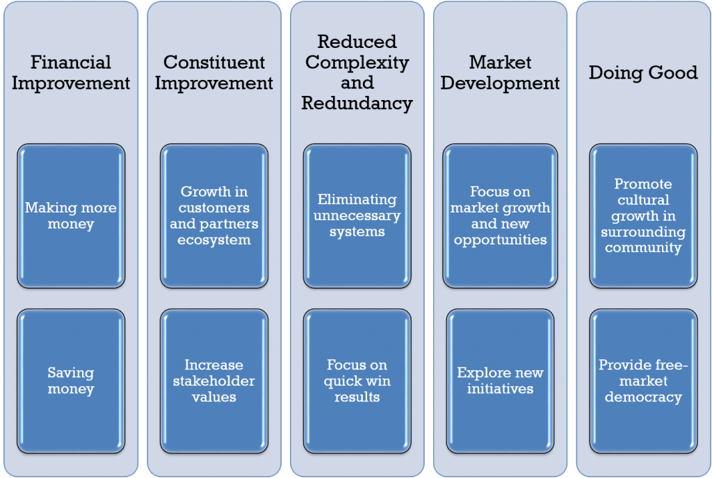
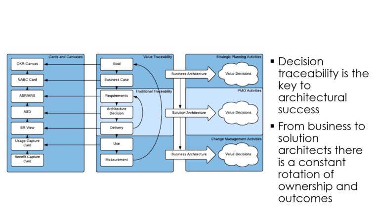

> "The placing of funds into the proper investment vehicles based on the investor's future goals, time horizon, and priorities. This also takes into account the safety of the investments [..]"
**investorwords.com**

# What is Investment Planning

Investment planning is the process an organization goes through in some form of cycle to decide what areas, programs, activities to fund in an upcoming timeframe. Traditionally, funding is distributed via budgets though other avenues of funding may exist. To term this activity investment planning is a play on traditional investment vehicles but is useful in aligning architecture thinking and activity with the concept of IT as an investment as opposed to a cost which is a fundamental principle of the BTABoK.

Investment planning then refers not to just financial investment objects such as stocks, etc. but to investments in technology as a direct impact to future cash flows. The goal of investment planning for architecture is to directly impact the level of investment in technology to be optimized alongside of other investment vehicles. The BTABoK presumes that technology if properly funded in the right areas will drastically increase the worth of the organization to its primary mission, vision or direction including non-financially driven organizations such as the governments and non-profits.

Investment planning involves multiple activities which impact the final outcome and which are important

-   Budgeting: the allocation of money to activities, people or groups for spending within a given time horizon,
-   Business case: a type of request for funding which demonstrates the potential value of spending money on a particular activity (investing) with a potential positive return (financial or non-financial),
-   Demand management: the management of incoming requests for change to the technology landscape,
-   Accounting: the method by which an organization tracks and plans its expenditures including reporting to internal and external sources,
-   Operating and capital expenditures: Categories of spending which define the type of expenditure based on both total amount (size) and other factors,
-   Financial planning cycle: the timeframe in which the organization puts its financial plan in place and the cycles in which it is reviewed and adjusted,
-   Cost and benefits calculations: methods for understanding and communicating potential benefits to the organization based on amount of investment.

# Why architects need investment planning skills

Investment planning may be the most important change management control an organization undergoes in change management as it exposes the goals, aspirations and visions of the leadership and employees and sets them into motion. Thus an architecture practice that is focused on leading digital advantage should be heavily focused on being involved in this process as much from the beginning as possible if they wish to lead change in business and technology strategy. Even governance focused architecture practices should be heavily involved in the investment planning cycle to ensure they are aware of incoming demand.

For the agile and innovation focused architecture practice, investment planning is the series of steps necessary to ensure that spending is aligned with the most effective elements of the strategic roadmap and that technology itself is fully covered in budgets, cost and benefits, business cases and financial planning. If the team is effective in engaging the investment planning activities it also provides a deep level of connection with stakeholders and credibility throughout the architecture lifecycle.

# Investment Planning Approach

There are many different types of organizations each with their own internal planning method, though they tend to stabilize into a few forms the larger the company gets. In addition the type of organization, whether it is for profit, governmental, non-profit or military will impact the investment planning approach and especially the stakeholder management tools necessary to become involved in a positive way.

The article assumes that the architecture team will be getting involved as if they never have been before though of course many architecture practices are already partially involved in the investment planning practice in one way or another.

## Investment planning and value creation

The BTABoK uses a modified version of a value management framework from D. Rico to help prioritize outcomes for different types of organizations. It creates buckets of value which include different areas an organization might want to focus or create value.

The framework describes value in terms of financial improvement, constituent improvement, reduced complexity, market development and doing good. Different parts of larger organizations may focus efforts on different 'buckets' of value. For example, a government agency might primarily focus on doing good, or its mission to increase safety, whereas a for-profit retail organization might focus in on market development or financial improvement as its primary target. In reality large organizations fund approaches that increase value in all the areas, like a large conglomerate putting money into disaster relief or other 'doing good' initiatives.

This is not the only area of benefits measures the BTABoK focuses on but it provides the top level framework for characterizing benefits measures and aligning them to differing initiatives in which the organization might wish to invest. To understand more of the value management framework and benefits realizations review the Value Management, Benefits Realization and Goals articles.

## Investment Planning is NOT just budgeting

One of the more common tools, if not the most common tool, in investment planning is the budget. The budget provides the framework by which managers and other groups request set aside funds to spend on initiative that will hopefully create the value the organization requires to grow or achieve its objectives.

However, the budget is only a single tool to understand investments and what this article refers to is the steps prior to budget allocation that is interesting to investments and investment planning.

## "Attack the PMO"

This is a lighthearted expression which describes the importance of being involved in the planning process of change initiatives whether there is a project management office or not. It is a principle of the BTABoK for the architects to make one of their first goals to become involved in this process.

This is the first step in being actively involved in the investment process is to find where decisions about spending in technology are made.

## Asking the Right Questions

There are many simple questions that lead to identifying techniques employed by the organization

-   "Who is the sponsor for this project?" -- If you are project or product focused you can often find out who the sponsor was and more. Utilize [stakeholder](stakeholders.md){:target="_blank"} management techniques to find out more.
-   "How is the project funded?" -- this will often lead you to the budget information about a project. That information can be used to find the owners of the budget line item or the funding source.
-   "Is it possible for me to understand and learn the funding method for our projects?" -- often sponsors and funding methods are readily available and stakeholders are eager to talk about the value they are creating.
-   "What other projects were considered when this project was funded?" -- this leads to information on the types of techniques used in comparing projects for investment.
-   "What is the timeframe for planning our next iteration/projects/initiatives?" -- this information will allow you to plan to meet and discuss with stakeholders related to project funding.

Above all, focus on good stakeholder management techniques. The architect team will need to show value to these initiatives before being welcomed into the inner halls of the senior executives that fund them. Start with learning the lay of the land and understanding the stakeholders relationships to the process. There are many organizations where key stakeholders are the source of funding.

## Look for ways to add value

When you have found access to a number of the initiatives, begin to review the information available for ways architects can add value. Most often you will find spreadsheets in budget focused organizations and possibly simple business cases. These initiatives will have a lot of opportunity for offering strategic technical advice on direction and outcomes.

## Start creating simple business cases

The BTABoK and many other bodies of knowledge describe the business case as an essential element of investment planning as it brings together the ideas of initiatives with the possible benefits and costs related to it. It is one of the most commonly used planning tools within industry to plan initiatives.

The Iasa has two primary templates for use in business case planning. The NABC or Needs Approach Benefits and Consideration, card is effectively a business case on a page and can be very useful where large numbers of business cases need to be evaluated together or against each other.

Figure 1 The NABC -- Needs Approach Benefits Considerations

The second option is the full business case template which you can download here (LINK WILL FOLLOW SOON) in word format which is used for large initiatives or where detailed information is required for the investment.

In either case each initiative comes with a set of other tools and techniques which aid in filling out the business case. These tools are a part of the broader benefits realization and value management techniques in the BTABoK.

As a team begin practicing creation of simple NABCs and discuss the initiatives in comparison with each other. Is technology truly shaping this business case? Could it be? How many areas of impact will it have? What is its strategic importance?

## Use [roadmapping](roadmap.md){:target="_blank"} to understand initiatives relationships to each other and architecture goals

The business cases will describe initiative timelines and their budgets and some general shaping descriptions. Use the roadmapping tools to derive relationships between the projects and their technology and business benefits. Also using the assignment methods tools the architect team can generate priority statements about the implementation of these initiatives. These activities can be timeboxed to ensure that the team is able to handle their regular workloads while getting more actively involved.

Principle: All architects should be involved in understanding initiatives in groups up to 20 or 30. Beyond that further techniques are needed.

## Start sharing opportunities with related stakeholders

The initiation of the activity will be the most difficult part as the team develops relationships with key stakeholders and demonstrates possible scenarios and advice which could derive value for them and the programs.

Start by sharing interesting results related to business case evaluation and opportunities. Watch for negativity in this space as stakeholders are often heavily invested in the outcomes of their projects. Look for big simple wins which attract the attention of powerful stakeholders but also are clear and easy to understand opportunities that may have been over looked. For example, shared components or services in the roadmap can reduce the scope of an initiative. Things like better security, more features, better products or services on the market that do not disrupt timelines or existing relationships too much can be appreciated. In addition, often during this process the team will identify additional business cases and [experiments](experiments.md){:target="_blank"} which might generate value for the [stakeholder](stakeholders.md){:target="_blank"} or initiative and these can be created and shared.

## Begin developing a standard approach to architect involvement

Often business architects form the tip of the spear in more advanced architecture practices where they work heavily with business stakeholders where they help formulate business cases based off of larger business architecture areas. Look for ways the entire architecture team related to a [value stream](value_streams.md){:target="_blank"} or [capability](business_capabilities.md){:target="_blank"} can participate in this process and for solid hand off methods between business, solution and specialist architects. This will not only create a strong architecture community, it will scale the architecture practice horizontally to better cover entire business areas. Again be careful not to push to fast or too broad until you have generated the value and stakeholder support to do so.

The BTABoK contains many tools for developing the architecture standard practice. For example the Engagement Process tool can be used to evaluate the current and future state documentation, process and tools the architects use to manage their lifecycles and handoffs. For mor information review the Lifecycle article.

# Applying investment planning techniques in practice

Baseline involvement in the investment cycle gives the architecture team a great deal of visibility and influence over technology strategy and the opportunity to create truly robust digital ecosystems both internal to the organization as well as with partners, suppliers, synergistic businesses (which participate in the [customers ecosystem](ecosystem.md){:target="_blank"}, and in some cases even competitors. Advanced capabilities in practice will allow the team to truly create a horizontal mindset aligned to value streams and delivery of value.

Principle: Creating a horizontal mindset in architecture removes the top down ivory tower approach.

## Use Busines Architecture to Shape Demand

Both innovation and ideation occur frequently near the 'edges' of the enterprise, meaning they occur during customer, citizen, soldier interactions in traditional business units. Business architects are experts and helping to shape these opportunities into demand for architecture and technology innovation. Many traditional business architecture disciplines lose sight of this activity in their effort to shape the actual business. Both efforts are valuable however to maintain a healthy community and architecture practice, the disciplines of business, solution, software and other architects must be aligned to the basic value proposition of the profession. The BTABoK first and foremost describes the business architecture function as a business technology strategy role where significant effort in business shaping creates a clear pipeline of technology opportunities and ensures solution and specialist architects have the tools, information and connections needed to truly create digital advantage.

Using business architecture tools related to digital business models, mission models, capabilities, services, customer-focused outcomes and value management guides as well as technology strategy fully included in investment tools like the business case optimizes the flow between demand and supply of architecture activities and value delivery. It also creates a tight bond between the business architect community and the solution architect community, an often stressful or even non-extant relationship. This creates full value stream connectivity as well as a change lifecycle that can create an optimal flow of digital transformation that results in digital advantage.

## Scope of investment or value creation should power assignment

Architects are generally a very scarce resource in an organization. Many teams comprise less than 1% of the total IT footprint (size of staff plus consultants and vendors). This means that architect teams must be careful with their time. When value and effort are properly aligned in the investment value stream architects will spend little or no time on low value activities and leave that work to traditional technical and business staff. The following chart shows how proper investment planning can impact architecture work. For more information review the [Assignment article.](assignment.md){:target="_blank"}

## How many business cases do architects create

One of the methods described in the BTABoK maturity model to describe how architects participate in the innovation and investment portion of the business related to digital strategy is how many business cases are created (owned), influenced, or evaluated by the architecture practice. A healthy involvement in the innovation lifecycle will have architects creating a significant number of business cases which are technology led (not owned necessarily) by architects, and a percentage of those selected for implementation. This method continuously shows the value of architecture to business and IT leaders.

Principle: Architects should be creating a significant number of business cases.

## The language of value is the primary driver of investment planning and business

The BTABoK is the most comprehensive value management guide for architecture in the world. It gives detailed guidance on how to describe initiatives, metrics and processes in terms that traditional businesses can understand. It is important to remember that to properly participate in the investment planning process the architect team must become adept at providing translation between technology investment and business (shareholder/owner/leadership) metrics and not just technology measures such as uptime, mean time between failure, or cyclomatic complexity. This translation is at the heart of being effective as an architecture practice overall. It should be understood that while all architects (software, infrastructure, cloud, information, etc) must have a strong grounding in these competencies (BTS competency pillar), business architects often excel and specialize in this area.

## Continuous Evolution

The modern digital landscape and business has learned to constantly evolve. This process, partially related to agile delivery and service orientation allows these businesses to constantly evolve their planning and investment based on quick reactions to market changes. Architect teams must also be able to continuously evolve their planning and target milestones creating both technical and business flexibility. This means there is a goal to structure spending into very short term increments as well as understand advanced planning methods such as real options and other significantly powerful tools to change direction quickly. It also means the team must be connected to incoming stresses and changes in the ecosystem of the business to anticipate changes. Given the rather inflexible nature of technology and its connections this means that more component/service oriented approaches as well as asynchronous indirect connections at significant points of inflection in business, must  become a part of the toolkit.

# References and further reading

**TOGAF ADM**
[TOGAF ADM](https://pubs.opengroup.org/architecture/togaf8-doc/arch/chap03.html){:target="_blank"}

**The Real Business of IT, Richard Hunter, George Westerman, HBR Press**

**Decoding the IT Value Problem, Gregory J Fell, Wiley**

**Leading the Epic Revolution, Hunter Muller, Wiley**

BTABoK 3.0 by [IASA](https://iasaglobal.org/) is licensed under a [Creative Commons Attribution-NonCommercial 4.0 International License](http://creativecommons.org/licenses/by-nc/4.0/). Based on a work at [https://btabok.iasaglobal.org/](https://btabok.iasaglobal.org/)