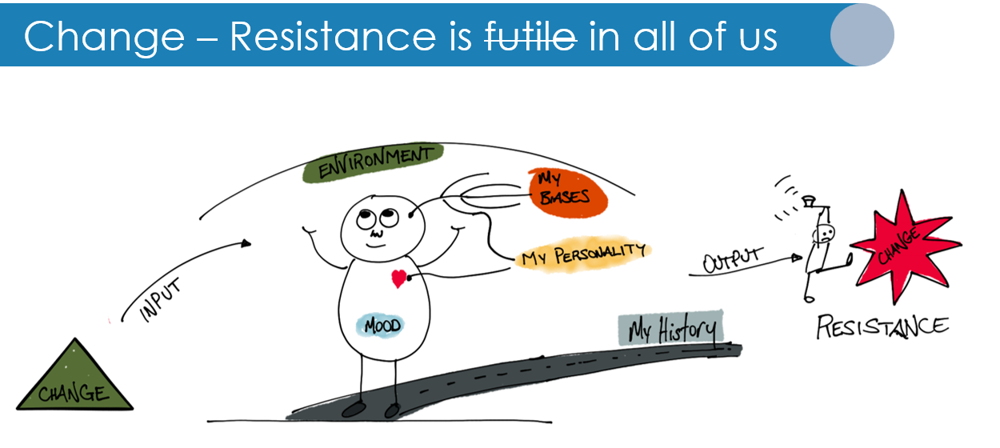
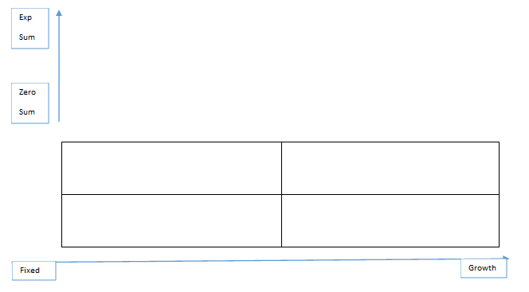
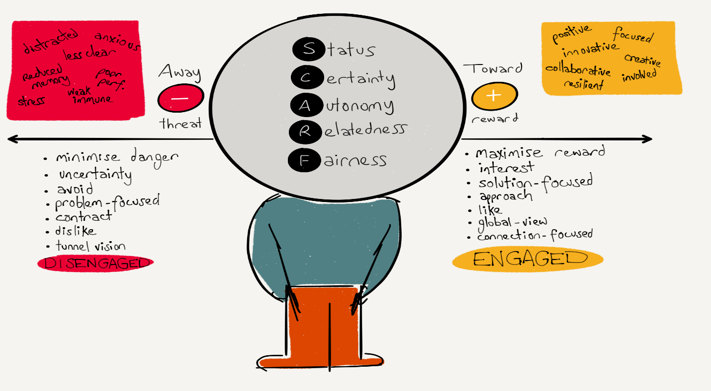

> "The mind is just like a muscle – the more you exercise it, the stronger it gets and the more it can expand."
**Idowu Koyenikan**

# What Is A Digital Mindset 

“Employees’ beliefs about technological change, their “digital mindsets,” are likely to influence their engagement in, or withdrawal from, their company’s digital transformation initiatives. Employees’ beliefs regarding the malleability of personal ability (fixed/growth mindset) and their beliefs about the availability of situational resources (zero-sum/expandable-sum mindset) influence the extent to which  

they see new technologies as providing opportunities for professional growth or as encroaching on their ability to display competency.“ ( Digital Mindsets)  

A digital mindset is one that is compatible with the creation of digital outcomes in what may or may not have been a previously manual, operational, or human-based activity and to see that as a positive outcome both personally and for the company. A true change in mindset happens when employees, managers, and investors see technology as a fundamental force in the success of the organization’s mission and vision.  

A digital mindset is personal. Swati Kamath from Knolskape gives the following example: 

> “A 50-year old man calls his 24-year old son, “I have received an important image on Whatsapp which I want on my email,” he said. “Well, that’s simple. You either: 

>    Open your email on your phone and attach the image from your gallery, or 

>    Sync your photos to the cloud so you can access them anywhere with your email ID, or 

>    Access Whatsapp on your computer, download the image, and attach it to your email.” 

> Leaving his father confused, the young man had his father forward him the image on Whatsapp and shared it with his father via email. 

> Those of you reading this will likely have one of two thoughts: 

>    It’s so simple, how did the father not know what to do? or 

>    What on earth was the son talking about?” 

Let’s assume the person in the example is a general manager at a manufacturing plant with 1,000 employees. He is frustrated with something that seems to him should be very simple. Then he is asked to buy into a robotic process automation investment for his plant which will be managed by phone and web applications as well as AI. What will his degree of investment be? How will he feel about the possibility of success, especially as this might put many of his workers and friends out of jobs? This is the nature of change in a digital mindset.  

# How Does Mindset Interact with [Culture](culture.md){:target="_blank"} 

Digital culture is the outcome of a change in the employee, partner, and customer [ecosystem](ecosystem.md){:target="_blank"} and the mindset of its participants. The root of that change is in the digital mindset of its [stakeholders](stakeholders.md){:target="_blank"}. Thus a single change in the mindset of a person in the organization can take root in the culture and expand to begin changing all of it. However, it is important to note that this must take root in many places in the modern enterprise to create the kind of digital advantage that allows technology to become a fundamental pillar of business [strategy](strategy.md){:target="_blank"}.  

KPMG defines four key aspects of the impact of Digital Mindset:  

*   Courage to act/challenge: this encourages the notion that everyone is a leader 
*   Connecting end to end: which provides the basis of enterprise [complexity](structural_complexity.md){:target="_blank"} and cross-organizational [objectives](objectives.md){:target="_blank"} 
*   Growth mindset: which welcomes flexibility, agility, and rapid change 
*   Everyone is an innovator: which describes how anyone should be able to generate ideas that shape the organization’s outcomes 

These elements of mindset can seriously impact the ability of an organization to take advantage of technology to shift its day-to-day work into true digital [business models](business_models.md){:target="_blank"}. For each stakeholder there is a a need to understand their personal relationship with technology and its impact on their work and lives.  

_Change Resistance – Art by Gar Mac Criosta_ 

# Why is Mindset Important to Architects 

Mindset is the fundamental approach and status that impacts how individuals will respond to change. Digital mindset then is the approach and beliefs that impact the ability of an organization to achieve digital advantage with facilitation or resistance to digital changes. Thus stakeholders and customers and management as individuals will carry a mindset and will either help or hinder a digital initiative. The architecture practice according to the BTABoK is one of the key enablers of shifting these individuals to a positive outlook on digital change.  

## Psychology is Critical in Change 

Mindset is a general term that describes a persons overall approach to change and how they discuss, describe, react to digital concepts. However, it is important to realize there is a strong sociological and psychological element to this that go far beyond this paper. It is essential to get Human Resources and organizational experts and experience when dealing with mindset shifts as they are also a part of other aspects of employee interactions. Many analysts and firms have found that organizational psychology is critical when shifting the basis for culture and power within a system of people.  

## Mindset in the Architecture Practice 

In addition mindset forms the basis of the architecture practice itself. In many organizations the architects have fixed mindsets that focus on reactive techniques and governance/control oriented thinking and practice methods. They then wonder why they are not a part of digital transformation journeys. This is because these journeys require a group to be proactive/innovation focused and have a growth/expandable-sum mindset. The BTABoK is designed to make that conversion objective and achievable.  

The architecture practice is the combination of all of the working architects within an organization including vendors and service integrators. It cannot be stressed enough that the first step in creating a digital mindset in the overall organization is to ensure that the architecture practice has formally addressed this.  

# Approaches to Mindset 

In their work on digital mindsets, Solberg, Traavik, and Wong make the case that mindset has a direct relationship to how an individual views their own ability to acquire new skills (growth vs fixed), and the availability of and completion for resources (zero-sum vs expandable-sum). This translates directly into their participation style to technology change. Added to this cognitive biases, personal history and the change roles described in the SATIR change model create many opportunities for resistance to technology changes. This resistance when added or multiplied against the large numbers of employees often creates the negative outcomes associated with digital transformation.  

Architects need to take into account each of these elements in their approach to digital outcomes. The single largest hurdle to technology change is the resistance met from both management and employees.  

Architects are the organizations most essential asset when handling this kind of resistance as they often are able to allay the fears of both business and technical staff through strong communication of expected outcomes.  

## Become a Aware of Our Own Mindset 

While most architects grew to their role and title through the technology organization, that does not necessarily mean they are deeply comfortable with change even if they have been involved in numerous initiatives already. Many architects have actually achieved their status by being critical of change initiatives and risk averse. These approaches are neither good nor bad in their own right but it is essential to understand their own mindset first and then understand how that impacts the overall architecture practice. If the practice is composed of critical and risk averse architects (governance and control focused), then it will be unlikely that it will be directly involved in the transformation to digital advantage.  

## Become a Change Agent or Modify the Practice 

By critically examining the overall practice it becomes clear that architects with change agent mindsets must drive a significant portion of the overall direction of the architecture engagement model for it to become the engine of digital transformation. Without this aspect then more top-down, governance-oriented approaches will slow any true underlying change in the organization. To understand more about decisions about appropriate engagement, review the engagement models articles.  

## Use a Stakeholder Driven Approach

While many if not most successful architects have a natural set of human dynamics competencies whether from natural inclination or the demands of the job, very few use a rigorous stakeholder driven approach. This is an approach which uses multiple tools to understand the stakeholder ecosystem to drive the Digital Employee. Using this approach can drastically alter the success of the architecture practice by enabling the architects to make clear and objective decisions and proactively engage stakeholders in ways that are most comfortable to them. In many cases it also uncovers many areas of resistance which might have gone unknown otherwise.  

One example of using the SDA (stakeholder driven approach) helps to empathize with a stakeholder or stakeholder persona.  

## Stabilize and Quantify the Message 

Much of the resistance to both digital initiatives and architectural approaches is based on mis-information, lack of clear understanding, and generally fuzzy or generic value statements whereas the risks, threats and changes to employees lives seem very real and immediate. The role of the change agent and therefore the architecture practice is to appropriately quantify, stabilize and clarify the objectives of digital transformation in terms of both organizational business capabilities as well as stakeholder outcomes. This value based language customized to stakeholders can alter their approach to what might otherwise be viewed as a threat to their work.  

## Invest in Ideas Not Just Titles 

Many architecture practices work hard to get access to stakeholders at very high levels in an organization. In some cases, Enterprise Architecture focused practices the executive outcomes may in fact be the only level that architects focus on. However, ideas for transformation and advantage come from everywhere in the ecosystem. They come from everywhere inside and outside of the organization. The customer and partner ecosystem, innovation externally, and all levels of stakeholders. To achieve Architecture Driven Digital Advantage the architects must embrace ideas over titles and then quantify and create strategy around those ideas.  

## Align with Resource Allocation/Debate Points  

As discussed in [Investment Prioritization](investment_planning.md){:target="_blank"}, the architecture practice can benefit the organization most by interacting at key areas of the [lifecycle](architecture_lifecycle.md){:target="_blank"} where resources are allocated or consumed. These points tend to create tension and zero-sum thinking and behavior especially where a digital agenda may appear to conflict with or even override traditional investments into operations, people or processes. It is essential that growth oriented/expandable sum leadership be available and involved in those discussions to help alleviate the fears of other stakeholders and ensure that digital outcomes are considered alongside more traditional goals.  

## Using the SCARF Assessment in Stakeholder Analysis 

David Rock has done excellent work in understanding how stakeholders react to change and its personal impact. In the SCARF assessment method, the team can understand how digital changes affect a stakeholder or stakeholder community. SCARF stands for Status, Certainty, Autonomy, Relatedness and Fairness. It can be used with the provided scarf assessment card to assess the perceived impact to a particular stakeholder group.  

_SCARF Impact_ 

_SCARF Assessment_

Context: Enterprise Transformation 

*   Focus: Understand the impact of a change on a stakeholder 
*   Prioritize: What changes are the riskiest 

# Architecture Objectives in Digital Mindset 

In the outcome model of the BTABoK it is necessary to map outcomes to architectural approaches. This means the practice must decide how to use architecture concepts to impact measures of digital mindset.   

## Technology Fairness  

The concept of fairness must enter communications plans early in the lifecycle of a digital change as it may deeply impact certain roles more than others. By treating fairness as a measurable objective the change will be significantly more likely to succeed.  

What percentage of the organization views or feels that technology is creating fair outcomes for the employees? 

How is the impact to individuals not directly involved in an initiative measured during scoping and decision-making?  

## Mindset as Value 

Digital mindsets in an organization can be treated as a measurable objective themselves. By using culture-changing methods the type of and availability of digital change mindsets can be quantified and applied to large groups.  

How many of your employees fall into a growth/expandable-sum mindset and how might you gather this information? Can these employees or managers be put in points where they can help guide and mentor others who have more limited views of the positive outcomes of digital change? 

How does digital fit into the day in day out statements and satisfaction of your employees and managers? This can be measured using standard questionnaires and management based reviews. These figures will give you an indication of the success of a digital transformation or resistance to it.  

## Mindset as Architecture Maturity 

In the architecture maturity model proposed by the BTABoK mindset is an outcome of excellence in architecture practice. As an outcome it is less about a particular set of tasks and more related to excellence in operating, value, and people model concepts. Here are the primary related concepts to creating digital mindset outcomes.   

| **Concept**  | **Relationship**  | **Measures (If Any)**  |
| --- | --- | --- |
| **Stakeholders**  | How effectively architects manage their primary stakeholders.   | SSAT (stakeholder satisfaction), NPS, architect ambassadors, CoE  |
| **Community**  | How well the architects in the organization coordinate and communicate as one.  | CoE, basic architecture message, brand, professional level  |
| **Assignment**  | How architects are aligned with work and products/projects.  | Ratio of architects to other staff types, project success, value dashboard   |
| **Competencies**  | How skilled the architects are within the context that they are working.   | Competency dashboard, NPS, individual interactions, promotion based on measured competency mastery  |
| **Experimentation**  | How rapidly architects respond, lead and relate to new ideas and innovation.   | Experiments run, idea triage, time to respond, number of business cases submitted  |
| **Roles/Lifecycle**  | How architects are aligned with the organization and how roles are filled. When and where do architects engage and to what depth.   | Effectiveness of architecture engagements, project/product success, trusted advisors, systems thinking, value dashboard, lifecycle ownership  |
| **Objectives**  | How architects are aligned with organization vs individual outcomes.   | Value dashboard, traceability repository, measured by business outcomes  |
| **Scope/Coverage**  | The amount of scope and impact the architects have and the amount of coverage of technology strategy to delivery.   | Percent architects to change initiatives, flexibility and adaptability of outcomes, stakeholder reviews/responses  |

# Creating Digital Mindsets 

It should be noted that architects alone cannot mature an organizations digital culture nor the entirety of the staff. This requires executive sponsorship and support at the board level. However, architects should function as catalysts for this dialog and trusted advisors/mentors wherever they interact with stakeholders and customers.  

## Executive/Employee Coaching 

Not all architects fall into the full change agent category and that is good for the practice. However this needs to be decided in the Engagement Model based on a number of complex factors. See Creating an Engagement Model Step 1 for more information on that topic.  

However a good percentage of the architecture practice should be engaged in changing hearts and minds to the digital mindset. The first step to changing minds is being open to communication and providing accurate and relevant information to the organization. It is not uncommon for architecture practices to hold internal and external coaching, training and information sessions.  

## Breaking the Barriers to Communication 

The largest block to digital culture and mindset is the often predefined barriers to communication within the organization. For example, many organizations look down on ‘IT’ people talking to ‘business’ people in unofficial ways. In addition in many organizations there is a tendency to let the executives work it out before becoming proactive in following their directives. This kind of communication barrier breeds the fear of learning and reduces the organizations maturity. It is essential that architects play an active role in communicating to any and all types of staff they can reach.  

## Bottom-Up Mentoring 

Many architects worry about not being able to reach executives, however, coaching and mentoring at the ‘bottom’ is often both more effective and more rewarding. Coaching teams in delivery, operations and support can have a larger impact on business delivery especially where Agility is another priority outcome for the organization.  

## Truth Above Convenience 

As professionals it is the architects responsibility to give truth over convenience or preference. This does not mean being negative but that architects must specialize in the ability to deliver value and objectivity in reasoning to any stakeholder. This may mean being realistic that someone’s preferred direction is not actually the best solution to a problem or it may mean championing an unpopular opinion. Becoming a trusted advisor to the organization is a difficult process but ethically it is essential and will ultimately result in a much more powerful role for architects all the way from ideation to utilization of digital business.  

# References and Further Reading

[https://cmr.berkeley.edu/2020/08/62-4-solberg/](https://cmr.berkeley.edu/2020/08/62-4-solberg/){:target="_blank"}

[https://www.knolskape.com/blog-what-is-a-digital-mindset-and-why-is-it-important/#.YWfnRRyxVaY](https://www.knolskape.com/blog-what-is-a-digital-mindset-and-why-is-it-important/#.YWfnRRyxVaY){:target="_blank"}

[https://www.deepdyve.com/lp/sage/digital-mindsets-recognizing-and-leveraging-individual-beliefs-for-U6wPQrFdo9](https://www.deepdyve.com/lp/sage/digital-mindsets-recognizing-and-leveraging-individual-beliefs-for-U6wPQrFdo9){:target="_blank"}

[https://www.forbes.com/sites/joemckendrick/2020/02/29/5-rules-for-developing-a-digital-mindset/?sh=2a050e606664](https://www.forbes.com/sites/joemckendrick/2020/02/29/5-rules-for-developing-a-digital-mindset/?sh=2a050e606664){:target="_blank"}

[https://home.kpmg/xx/en/home/insights/2020/07/kpmg-digital-mindset.html](https://home.kpmg/xx/en/home/insights/2020/07/kpmg-digital-mindset.html){:target="_blank"}

[https://www.mindtools.com/pages/article/SCARF.htm](https://www.mindtools.com/pages/article/SCARF.htm){:target="_blank"}

BTABoK 3.0 by [IASA](https://iasaglobal.org/) is licensed under a [Creative Commons Attribution-NonCommercial 4.0 International License](http://creativecommons.org/licenses/by-nc/4.0/). Based on a work at [https://btabok.iasaglobal.org/](https://btabok.iasaglobal.org/)