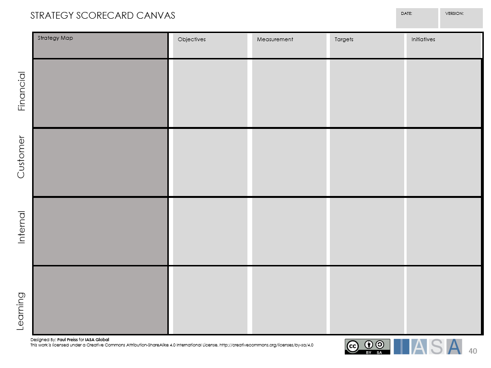

> "The end toward which effort is directed"
**Merriam-Webster dictionary, definition of Objective.**

# What is a Objective

A Objective is a statement of an aim or purpose to which effort is
directed. Objectives are applied to all areas of business to provide
direction and focus business activity, and IT architecture is no
exception. Objectives have a strong relation to value, and are created
to express what has to be achieved in order to reach the desired value.

In this article, working with Objectives is considered in two contexts.
The role of the architect in helping the business plan and manage
Objectives, and Objectives which are related to the Architecture
Practice as a way of facilitating the business Objectives.

# Why we need Objectives

Objectives provide a way of ensuring that all the stakeholders have a
common understanding of the aims and are all pulling in the same
direction. They give a motivating factor for proposed changes and
decisions. When deciding whether to invest in an activity or make an
important decision, we can support the decision by showing how the
decision or change helps to meet the defined Objectives. Objectives also
help in prioritizing activities, activities which have a significant
effect in achieving Objectives gain a high priority, activities which
have no effect in achieving Objectives may not even merit investment.

Objectives can be used to help measure if we have achieved what we set
out to do. They are useful in monitoring progress and assessing if the
implemented changes in the architecture achieved what was expected.

# Objectives Approach

## Ensure there is stakeholder motivation

Objectives are a way of setting a collective direction for stakeholders
in the business. Therefore, it is important when defining a Objective
that there is stakeholder buy-in for the Objective. Objectives which do
not have stakeholder motivation or interest are likely to fail since the
stakeholders are not likely to expend power or influence in achieving
the Objective.

## Some Objectives are more important than others

When defining Objectives it is important to understand which Objectives
carry significant importance, and which Objectives are "nice to have".
Prioritizing Objectives provides focus for the business and
stakeholders, this helps to guide which objectives to focus on,
especially if resources or time become constrained. Assigning Objectives
the same priority should be avoided, having many Objectives with the
same importance may reduce business focus. This can result in many
Objectives only being partly achieved, and none being fully achieved.

## Meeting a Objective provides value

Objectives are value driven, and should result in an effect which
provides value to the business. When defining a Objective the value
should be clearly explained, this puts the Objective in context. It may
even be the case that several Objectives aim to contribute to the same
expected value. Without the statement of value it can be difficult to
make a case for achieving the Objective.

# Objectives are SMART

Setting Objectives is important, as it provides the drive for an
architecture practice or business and ensures that everyone is pulling
in the same direction. How a Objective is expressed is equally
important, if the stakeholders do not understand the Objective or
believe in the Objective, it is unlikely they will incorporate it in
their daily architecture thinking. In order to ensure that Objectives
are expressed in a way which motivates the members of the architecture
practice or business, the SMART criteria can be applied. The SMART
criteria indicates that Objectives should be formulated with the
following attributes:

- **S**pecific - it should be clear what is to be achieved by the
  Objective

- **M**easurable -- the effect of the Objective should be measurable

- **A**ssignable - it should be clear who is responsible for achieving
  the Objective

- **R**ealistic - the Objective should be attainable with the given
  resources

- **T**ime bound - it should be stated when the Objective is expected
  to be achieved

Using SMART helps to provide clarity and focus in defining Objectives,
but this is not set in stone. Sometimes when Objectives are very long
term, it can be difficult to give precise indications, for example in
time or measurability. However, SMART can still be used as a reference
criteria for defining these types of Objectives, even if it is difficult
to fully meet the criteria.

# Objectives, Objectives and Key Results

When working with Objectives in practice, it is commonplace that the
term objective is also used. The term Objective and objective are
interchangeable as they have almost the same meaning. In some cases, the
term Objective is used to define abstract or long-term aims, while
objective is used to describe an aim which is actionable. A typical
Objective or objective may read as follows:

> *"The architecture practice will increase the number of senior
> architects in the company by 20% before the first quarter of 2022."*

The above Objective conforms to the SMART criteria, however it does not
give a detailed indication of the outcome which is required to achieve
the Objective. This is where Key Results are useful, as they provide a
statement of the expected outcome of the Objective/objective which can
be explicitly measured.

From the above Objective we may define the following three Key Results:

> *"Employ 5 new senior business architects during Q1 2021."*
> 
> *"Ensure all architects with +4 years experience have CITA-S
> certification."*
> 
> *"Establish mentoring program for architects which will launch in Q2
> 2021."*

The Objectives and objectives often provide the starting point for
planning projects or work packages.

# Working with Business Objectives

Business Objectives are often focused on direct value. That is to say,
these Objectives are defined for clear and specific business gains. The
[business cases]businesscase.md){:target="_blank"} in the organization express a value gain,
often linked to the core business purpose, or the consumer of the
business services and products (Customer). Business Objectives are often
related to or support the execution of a [business case]businesscase.md){:target="_blank"}.
Typical business Objectives focus on business outcomes, such as
profitability, market share or cost optimization. For example:

> "Increase the customer base for Super Product by 20% before Q4 2021."

The above Objective states a clear business value in terms of increasing
market share. This indicates direct value to the business. These
Objectives have an indirect effect on the architecture, for example, in
order to increase the customer base, the architecture practice may have
to set Objectives for increasing architecture development productivity.

Traditionally the architect has played a supporting role in achieving
business Objectives, however, as technology now forms a core part of
many businesses, the architect has an active role which is much closer
to direct business value. This places the IT Architect in a different
position, not only supporting the achievement of business Objectives but
actively defining business Objectives and objectives, with other
business leaders. The architect must now consider how technology can
drive business value.

The architect drives architecture objectives to achieve business value.
For example, the architect may be able to define the following
Objective:

*"Increase productivity in manufacturing by 5% within the next year."*

The architect may define this business Objective and define a number of
technology or automation Key Results. The value, in this case
productivity, is of direct value to the business.

# Objectives for the Architecture Practice

The Architecture Practice, is as the name suggests, concerned with how
the business practices architecture. The Architecture Practice works
with the process of developing architecture in an effective way, in
order to facilitate the Objectives of the business. This may involve
maintaining architecture standards, defining working processes and
developing the architecture [lifecycle]lifecycle.md){:target="_blank"}. As opposed to
business Objectives, the Objectives for the architecture practice often
work with indirect value. That is to say, that the business value of the
architecture practice Objectives may not be immediately apparent, but
business Objectives may depend heavily on the architecture practice
Objectives.

For example, a business Objective may be defined to release 5 new
products within the next year. Clearly the increase in new products
affects the architecture practice and they may define the following
Objective:

*"Increase number of architects by 10% within the next six months"*

The architecture practice has to facilitate the business Objective by
increasing the architect capacity. Architecture Practice Objectives are
often linked to business Objectives. The following are examples of the
types of Objectives which an Architecture Practice may define:

- **Coverage** - the coverage of the architecture standards and
  lifecycles within the business, aimed at re-use, alignment and
  improving maintainability

- **Maturity/Quality** - the maturity of the architecture lifecycle
  within the business, aimed at growing architecture practices and
  increasing quality

- **Skills** - the knowledge and skills of the architects within the
  business, aimed at increasing general architecture competence, or
  even for gaining access to niche skill areas

- **Capacity** - the quantity of architects within the practice, aimed
  at ensuring the architect capacity meets the business demand

- **Productivity** - the ability to develop architectures with a high
  degree of effectivity, aimed at gaining architecture outcomes faster
  while maintaining quality

# Defining Strategic Objectives

Strategic Objectives are often set at the executive level within an
organization and focus on long-term objectives. They are often set in a
time frame of at least one year, and often more. These Objectives are
created and measured from the executive perspective and based upon the
[strategy]strategy.md){:target="_blank"} of the organization.

A common technique for taking the strategy of the organization through
to an executable plan is to use a balanced scorecard. This method relies
on the definition of a strategy map based on specific perspectives
(financial, customer, internal processes, learning and growth) where the
organization specifies the strategic Objectives in reach perspective and
indicates the relationship between these Objectives.

The scorecard also defines measure (or KPI) by which the Objectives can
be assess and provides a target which often expresses a value to be
achieved by a given time period.

 

The Strategy Scorecard Canvas above shows a representation of a balanced
scorecard, where Objectives (or objectives), measurements, targets and
initiatives are defined.

The following is an example objective in the customer perspective:

| Strategy Map   | **Objective**             | **Measurement**                     | **Targets**                        | **Initiatives** |
| -------------- | ------------------------- | ----------------------------------- | ---------------------------------- | --------------- |
| ***Customer*** | Increase customer loyalty | Number of loyalty card applications | Increase by  50 000 by end of 2023 |                 |

It can be seen in the example how the balanced scorecard aligns well
with the SMART criteria. Using the balanced scorecard method provides
the architect together with executives a way of turning the strategy
into an executable set of objects which can be measured.

# Agile Objectives with OKRs

The stakeholders in the business, including the architects, are likely
to have a number of proposals for short-term objectives. When planning
these objectives, we want to ensure that they are measurable, so that we
can quickly to facilitate progress, and ultimately the success of the
objective.

The OKR (Objective Key Result) method provides an agile and transparent
way to plan and monitor objectives which are shared throughout the
organization. The objective states what is to be achieved and the key
results provide a set of expected results against which the success of
the objective can be measured.

The following OKR Card method provides a way of defining an OKR and
continually assessing the key results.

**Step 1: Describe the objective**

Provide a description of the objective using the SMART method of
defining Objectives and objectives. Ensure that there is commitment from
the stakeholders to the objective. The following is an example statement
of an objective:

*"Increase the market coverage in Asia for MyProduct by 10%"*

 

**Step 2: Objective Alignment**

The objective alignment describes the drivers behind the objective and
puts the objective in a context. This helps in understanding how the
objective connects to strategy, other objectives and stakeholders. The
objective alignment may be expressed in a short text.

**Step 3: Define the key results**

Consider the expected effect of the objective and how this can be
expressed in a way which is measurable. These are the key results. There
may be several key results related to the objective, these are usually
limited to no more than 5, otherwise the assessment of the objective may
become too complex. The following are some examples of key results based
on the objective in step 1:

*"Establish 3 new data centers in Asia before 2022 Q1"*

*"Increase software development capacity from 10 to 15 teams."*

**Step 4: OKR reviews**

Once the OKR is defined work can begin on trying to achieve the
objective. The OKR is reviewed on a regular basis where a reasonable
review period is every 90 days, although they can be reviewed more
regularly.

During the review each of the key results can be assessed using a Key
Result Retrospective. The following status can be assigned to each key
result:

- **Stuck** -- there is no result.

- **Not Even Close** -- there is value in the result but nowhere close
  to what was expected

- **Nearly** - there is a clear value in the result but not quite what
  was expected

- **Achieved** - the result meets expectations

- **Exceeded** - the value from the result exceeds the expectations

This retrospective is intended to give simple feedback on progress
towards the objective and helps review the Key Results. The OKR is not
static, so if the Key Results are continually showing poor value, then
the Key Results may need re-worked in order to meet the objective, or
the objective itself may no longer be relevant and can be discarded.

At each review the value that was achieved since the last review and any
lessons learned should be noted. This can be noted under the Value and
Learning section of the card, and provides a practical record of gains.
These experiences can be used for other means, such as improving the
architecture [lifecycle]lifecycle.md){:target="_blank"}.

The OKR card may be versioned by date, so previous cards can be
referenced to assess the journey from the initial planning of the
objective, to the current state.

# Aligning the Balanced Scorecard and OKRs

The balanced scorecard provides a traditional method often used at the
executive level for making a strategy executable. However, the
objectives and Objectives on the balanced scorecard are created from the
executive perspective with a long-term view. These Objectives may also
lack relevance at the lower organization levels (management and
employees), since these levels of the organization operate on a
short-term view. OKRs are transparent and based on short-term gains,
this makes them more relevant at the lower levels of the organization.

Aligning the strategy map from the balanced scorecard with OKRs delivers
the strong advantage of providing a long-term view of Objectives at the
executive level, while providing the relevance of OKRs at the lower
organizational levels. This supports the idea of "cascading Objectives"
where Objectives at the executive level cascade down to the lower levels
of the organization, which then results in the creation of further
Objectives which are relevant to that level of the organization. This
provides a synchronization of Objectives and objectives at all
organizational levels.

This method is described in the "Two Speed Execution" approach as
detailed by Paul Niven.

# References and further reading
Doran, G. T. (1981). **"There\'s a S.M.A.R.T. Way to Write Management's
Objectives and Objectives"**, Management Review, Vol. 70, Issue 11, pp.
35-36.

**"What is an OKR? Definition and Examples"**
[What is an OKR?](https://www.whatmatters.com/faqs/okr-meaning-definition-example/){:target="_blank"}

**"Using Two Speed Execution (2SE) to Capture the Value You've Been Missing"**, 
Paul R. Niven

BTABoK 3.0 by [IASA](https://iasaglobal.org/) is licensed under a [Creative Commons Attribution-NonCommercial 4.0 International License](http://creativecommons.org/licenses/by-nc/4.0/). Based on a work at [https://btabok.iasaglobal.org/](https://btabok.iasaglobal.org/)