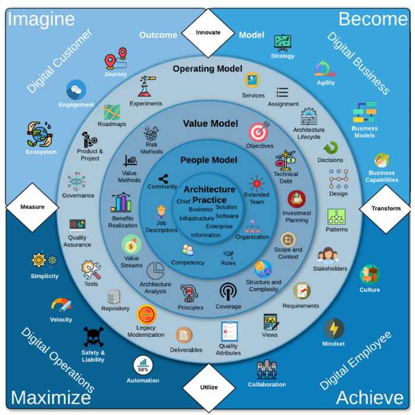

# The Engagement Model

The following chart shows the engagement model representing the IASA world of architecture. The engagement model is composed of four sub-models represented by rings in the diagram. The sub-models contain elements representing essential architecture topics. Click on the elements to learn more about the architecture topics.

<map name="rage_image_map">
    <area shape="rect" href="https://iasa-global.github.io/btabok/ecosystem.html" coords="45,199,95,261" alt="" target="_blank">
    <area shape="rect" href="https://iasa-global.github.io/btabok/engagement.html" coords="101,134,155,180" alt="" target="_blank">
    <area shape="rect" href="https://iasa-global.github.io/btabok/journey.html" coords="175,78,222,127" alt="" target="_blank">
    <area shape="rect" href="https://iasa-global.github.io/btabok/innovate.html" coords="322,30,381,78" alt="" target="_blank">
    <area shape="rect" href="https://iasa-global.github.io/btabok/strategy.html" coords="464,59,496,97" alt="" target="_blank">
    <area shape="rect" href="https://iasa-global.github.io/btabok/agility.html" coords="528,101,569,148" alt="" target="_blank">
    <area shape="rect" href="https://iasa-global.github.io/btabok/business_models.html" coords="597,176,639,229" alt="" target="_blank">
    <area shape="rect" href="https://iasa-global.github.io/btabok/business_capabilities.html" coords="622,261,674,304" alt="" target="_blank">
    <area shape="rect" href="https://iasa-global.github.io/btabok/transform.html" coords="619,334,684,370" alt="" target="_blank">
    <area shape="rect" href="https://iasa-global.github.io/btabok/culture.html" coords="605,440,648,497" alt="" target="_blank">
    <area shape="rect" href="https://iasa-global.github.io/btabok/mindset.html" coords="546,537,577,583" alt="" target="_blank">
    <area shape="rect" href="https://iasa-global.github.io/btabok/collaboration.html" coords="428,612,475,654" alt="" target="_blank">
    <area shape="rect" href="https://iasa-global.github.io/btabok/utilize.html" coords="326,631,379,678" alt="" target="_blank">
    <area shape="rect" href="https://iasa-global.github.io/btabok/automation.html" coords="224,601,267,646" alt="" target="_blank">
    <area shape="rect" href="https://iasa-global.github.io/btabok/safety_liability.html" coords="142,550,171,611" alt="" target="_blank">
    <area shape="rect" href="https://iasa-global.github.io/btabok/velocity.html" coords="87,501,122,546" alt="" target="_blank">
    <area shape="rect" href="https://iasa-global.github.io/btabok/simplicity.html" coords="57,426,96,467" alt="" target="_blank">
    <area shape="rect" href="https://iasa-global.github.io/btabok/measures.html" coords="23,334,81,368" alt="" target="_blank">
    <area shape="rect" href="https://iasa-global.github.io/btabok/services.html" coords="414,126,441,164" alt="" target="_blank">
    <area shape="rect" href="https://iasa-global.github.io/btabok/assignment.html" coords="460,150,502,175" alt="" target="_blank">
    <area shape="rect" href="https://iasa-global.github.io/btabok/architecture_lifecycle.html" coords="506,183,535,230" alt="" target="_blank">
    <area shape="rect" href="https://iasa-global.github.io/btabok/decisions.html" coords="546,240,572,273" alt="" target="_blank">
    <area shape="rect" href="https://iasa-global.github.io/btabok/design.html" coords="556,292,586,331" alt="" target="_blank">
    <area shape="rect" href="https://iasa-global.github.io/btabok/architecture_pattern_repository.html" coords="552,351,582,391" alt="" target="_blank">
    <area shape="rect" href="https://iasa-global.github.io/btabok/stakeholders.html" coords="537,420,575,454" alt="" target="_blank">
    <area shape="rect" href="https://iasa-global.github.io/btabok/requirements.html" coords="490,480,527,519" alt="" target="_blank">
    <area shape="rect" href="https://iasa-global.github.io/btabok/views.html" coords="442,525,469,567" alt="" target="_blank">
    <area shape="rect" href="https://iasa-global.github.io/btabok/quality_attributes.html" coords="372,546,404,596" alt="" target="_blank">
    <area shape="rect" href="https://iasa-global.github.io/btabok/deliverables.html" coords="298,556,330,592" alt="" target="_blank">
    <area shape="rect" href="https://iasa-global.github.io/btabok/legacy_modernization.html" coords="234,522,260,565" alt="" target="_blank">
    <area shape="rect" href="https://iasa-global.github.io/btabok/repository.html" coords="181,490,206,521" alt="" target="_blank">
    <area shape="rect" href="https://iasa-global.github.io/btabok/architecture_tools.html" coords="139,437,169,479" alt="" target="_blank">
    <area shape="rect" href="https://iasa-global.github.io/btabok/quality_assurance.html" coords="112,368,148,413" alt="" target="_blank">
    <area shape="rect" href="https://iasa-global.github.io/btabok/governance_em.html" coords="115,294,149,330" alt="" target="_blank">
    <area shape="rect" href="https://iasa-global.github.io/btabok/product_project.html" coords="138,228,166,265" alt="" target="_blank">
    <area shape="rect" href="https://iasa-global.github.io/btabok/roadmap.html" coords="178,178,204,213" alt="" target="_blank">
    <area shape="rect" href="https://iasa-global.github.io/btabok/experiments.html" coords="234,134,263,176" alt="" target="_blank">
    <area shape="rect" href="https://iasa-global.github.io/btabok/objectives.html" coords="422,210,454,245" alt="" target="_blank">
    <area shape="rect" href="https://iasa-global.github.io/btabok/technical_debt.html" coords="467,258,498,298" alt="" target="_blank">
    <area shape="rect" href="https://iasa-global.github.io/btabok/investment_planning.html" coords="484,324,520,372" alt="" target="_blank">
    <area shape="rect" href="https://iasa-global.github.io/btabok/scope_context.html" coords="471,396,500,436" alt="" target="_blank">
    <area shape="rect" href="https://iasa-global.github.io/btabok/structural_complexity.html" coords="431,447,461,487" alt="" target="_blank">
    <area shape="rect" href="https://iasa-global.github.io/btabok/coverage.html" coords="372,482,396,518" alt="" target="_blank">
    <area shape="rect" href="https://iasa-global.github.io/btabok/principles.html" coords="305,479,332,519" alt="" target="_blank">
    <area shape="rect" href="https://iasa-global.github.io/btabok/analysis.html" coords="250,449,275,494" alt="" target="_blank">
    <area shape="rect" href="https://iasa-global.github.io/btabok/value_streams.html" coords="209,394,234,448" alt="" target="_blank">
    <area shape="rect" href="https://iasa-global.github.io/btabok/benefits_realization.html" coords="191,329,223,383" alt="" target="_blank">
    <area shape="rect" href="https://iasa-global.github.io/btabok/value_methods.html" coords="207,266,234,308" alt="" target="_blank">
    <area shape="rect" href="https://iasa-global.github.io/btabok/risk_methods.html" coords="243,219,268,257" alt="" target="_blank">
    <area shape="rect" href="https://iasa-global.github.io/btabok/extended_team.html" coords="416,300,447,340" alt="" target="_blank">
    <area shape="rect" href="https://iasa-global.github.io/btabok/organization.html" coords="411,371,445,406" alt="" target="_blank">
    <area shape="rect" href="https://iasa-global.github.io/btabok/roles.html" coords="373,421,399,452" alt="" target="_blank">
    <area shape="rect" href="https://iasa-global.github.io/btabok/competency.html" coords="299,412,329,446" alt="" target="_blank">
    <area shape="rect" href="https://iasa-global.github.io/btabok/job_description.html" coords="254,348,287,391" alt="" target="_blank">
    <area shape="rect" href="https://iasa-global.github.io/btabok/community.html" coords="259,293,291,318" alt="" target="_blank">
    <area shape="rect" href="https://iasa-global.github.io/btabok/architecture_practice.html" coords="327,323,380,374" alt="" target="_blank">
</map>


## The Outcome Model

```
[COMMENT]: DESCRIPTION HERE...
```


Access the elements in the outcome model by clicking on them in the Engagement Model Chart, or by navigating to the element in the sidebar.

## The Operating Model

```
[COMMENT]: DESCRIPTION HERE...
```


Access the elements in the operating model by clicking on them in the Engagement Model Chart, or by navigating to the element in the sidebar.

## The Value Model

```
[COMMENT]: DESCRIPTION HERE...
```


Access the elements in the value model by clicking on them in the Engagement Model Chart, or by navigating to the element in the sidebar.

## The People Model

```
[COMMENT]: DESCRIPTION HERE...
```


Access the elements in the people model by clicking on them in the Engagement Model Chart, or by navigating to the element in the sidebar.

# The ITUM Lifecycle

```
[COMMENT]: TEXT TAKEN FROM dictionary.md
```
Each of these phases may overlap as they are implemented, and each often has a defined synchronization point -- illustrated by the "spikes" -- towards the end, to ensure that the team and the stakeholders are all in agreement.

These spikes represent change points within an organization and may be visible outside as well.  The spikes are Innovation, Transformation, Utilization and Measurement. Innovation and disruption occur both on purpose (from the inside) and from the outside-in and are a direct result of digital strategy. Transformative change also occurs both from the outside and within, indicating what is coming. Utilization (first use) and measurement and are used both positively and negatively by both employees as well as customers, suppliers, partners and the marketplace at large. Together, these four points in the lifecycle determine how rapidly an organization achieves its digital transformation outcomes.

You may look at this initially and see a lifecycle model; after delving into the sections you have the most use for initially, you may return to this model and find quality and maturity aspects to bring to your growing practice.  As a mature architect, you may contribute back to the model your own experiences combining models in your organization and creating a collaborative solution design process.  Through your growth as an architect, the concepts in this engagement model will be explored, brought into your personal practice, and expanded as you adapt them in your organization.


## Innovate

```
[COMMENT]: TEXT TAKEN FROM dictionary.md
```

The IT Architecture Organisation is in an exploratory mode, it is identifying areas of creativity and solutions to improve the current organisation state.

PP: Innovation is constantly occurring both inside and outside of the organization. An organizations ability to harness innovation and convert it to strategy within its current business model or by creating new ones, defines its ability to survive through creating value for its customers. Digital innovation is the focus of the BTABoK and the architect teams ability to create and harness it into an effective digital strategy at the multiple scopes in the organization. The team should view its primary focus as the ability to bring the highest total amount of successful digital innovation through transformation and into utilization.

## Transform

```
[COMMENT]: DESCRIPTION HERE...
```


## Utilize

```
[COMMENT]: TEXT TAKEN FROM dictionary.md
```

The IT Architecture Organisation has successfully completed the activities and changes.   The organisation is using the current state in line with the improvement objectives.

PP: Much like the other spikes, utilization is an ongoing process. Utilization is the usage patterns of employees, customers, suppliers, partners and even other systems, where the usage represents both positive and negative outcomes which are consistently being measure either officially or unofficially. These usage patterns define the overall success of the digital transformation and business model. They are measured constantly and concurrently.

## Measure

```
[COMMENT]: TEXT TAKEN FROM dictionary.md
```

The IT Architecture Organisation identifies the Key Performance Indicators and tracks these throughout the engagement life cycle.

PP: Measurement is a set of techniques used to identify positive and negative outcomes throughout the entire change management lifecycle. It is done both officially and unofficially at many levels of scope with the goal of having measurements that roll up into higher levels and form a set of clear indicators of technology contribution to value outcomes. Further levels of measures include the set of external measures used to evaluate the health of a company or a government. As architects measure become a critical factor in understanding the efficacy of technology and business models and are primarily understood through the Value Model.

# The Digtal Stakeholders


## The Digital Customer

```
[COMMENT]: TEXT TAKEN FROM dictionary.md
```

First digital systems are concepts, in the imagination of an organization's (potential) customers or business partners.  In the thinking phase we participate in and drive innovation and an understanding of the direction of the organization and how technology impacts its primary objectives in its markets, its products, and its capabilities.  The architect will apply techniques such as business envisioning, customer journeys or service thinking to understand the relative merits of each concept in a structured evaluation, possibly an innovation review.

(Source IASA Document Library)

PP: The digital customer, also digital citizen in government, is the driving force for digital transformation. All innovation starts with creating value for the customer and to do so the architect must understand the ecosystem in which the customer thinks and acts, their journey through their interactions with the organisation and their engagement in the process. The architect team works to achieve innovation in business and employee engagement to create value for the customer.

## The Digital Business

```
[COMMENT]: TEXT TAKEN FROM dictionary.md
```

As we understand how digital systems work within existing or new business models, they take shape with a specific vision and scope.  We change certain technology strategies and certain business processes in ways that impact the ecosystem of customers the involvement of our customer experience and their journey with our company.  The architect applies envisioning and goal-setting techniques to define the business case for a new solution and assesses our alternatives.

(Source IASA Document Library)

Digital business is derived from the native digital companies that have formed over the last two decades. Building a digital business requires a deep understanding of how technology impacts business models and the capabilities necessary to implement them. From digital health to SAAS companies the digital business focuses on business agility and strategy to allow it to compete for the digital customer. The architects work to transform the business model to achieve customer driven outcomes. The digital business also achieves a new level of sophistication and capability for the digital employee.

## The Digital Employee

```
[COMMENT]: TEXT TAKEN FROM dictionary.md
```

Having selected a solution approach, the architect works within the organization's culture to establish a team to implement and uses design techniques to socialize the key aspects.  We look at the utilization of these changes how they've spread through the digital employee, based and how they're being adopted by different groups and by the customer themselves.

(Source IASA Document Library)

Achieving a digital employee is no easy task but absolutely necessary in operating a digital business for its customers. Workforce dynamics and culture are all equally different in a transformed business model with its customers. Everything from collaboration to decision making are changed as the business pushes further and further to empower its employees at the edges. The promise of a digital employee is one that can deliver fully on the business model while maintaining operational excellence.

## The Digital Operations

```
[COMMENT]: TEXT TAKEN FROM dictionary.md
```

As the product or solution is implemented, the architect looks to the future -- ensuring that the organization is ready for the solution (change management), that the solution is ready for the environment (DevOps), and that the stakeholders can realize the benefits (value realization and governance).  We look at improving and augmenting our operational excellence by reviewing these changes to invest in the next phase of thinking, changing, using, and reviewing.

(Source IASA Document Library)

Digital operations from DevOps through change management are absolutely necessary to maximize the value delivery from Customer, Business, and Employee. Creating a modern landscape for digital operations and ensuring that technical debt remains low or that it is being serviced properly allows the achievement of velocity, simplicity (to the extent possible) and automation are delivered to the organization. The goal of the architecture team is to achieve these outcomes from the single team level all the way through the group's total outcome set.
