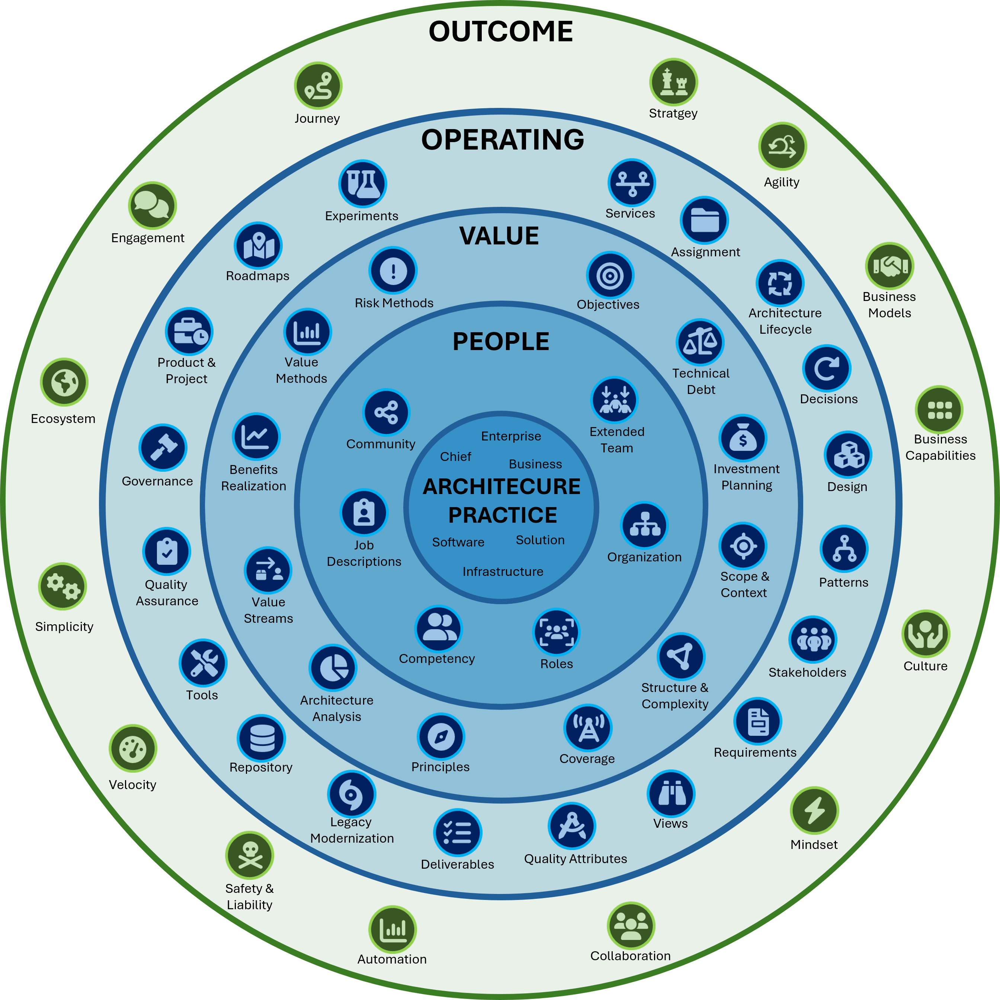

# The Engagement Model

The following chart shows the engagement model representing the IASA world of architecture. Click on the elements to learn more about the architecture topics.

# The Outcome Model

<Short descritpion of what the outcome model is>

Access the elements in the outcome model by clicking on them in the Engagement Model Chart, or by navigating to the element in the sidebar.

# The Operating Model

<Short descritpion of what the operating model is>

Access the elements in the operating model by clicking on them in the Engagement Model Chart, or by navigating to the element in the sidebar.

# The Value Model

<Short descritpion of what the value model is>

Access the elements in the value model by clicking on them in the Engagement Model Chart, or by navigating to the element in the sidebar.

# The People Model

<Short descritpion of what the people model is>

Access the elements in the people model by clicking on them in the Engagement Model Chart, or by navigating to the element in the sidebar.
