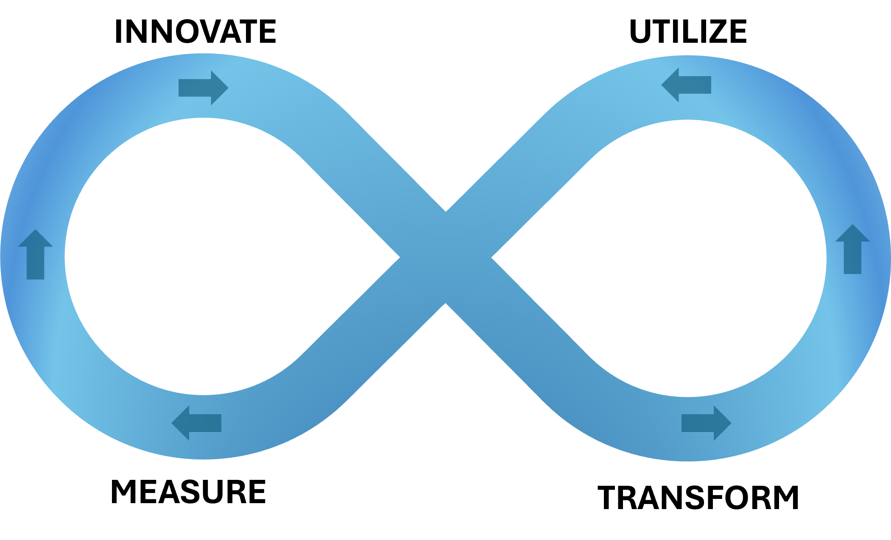

# The Engagement Model

The following chart shows the engagement model representing the IASA world of architecture. Click on the elements to learn more about the architecture topics.


## The Outcome Model

```
[COMMENT]: DESCRIPTION HERE...
```


Access the elements in the outcome model by clicking on them in the Engagement Model Chart, or by navigating to the element in the sidebar.

## The Operating Model

```
[COMMENT]: DESCRIPTION HERE...
```


Access the elements in the operating model by clicking on them in the Engagement Model Chart, or by navigating to the element in the sidebar.

## The Value Model

```
[COMMENT]: DESCRIPTION HERE...
```


Access the elements in the value model by clicking on them in the Engagement Model Chart, or by navigating to the element in the sidebar.

## The People Model

```
[COMMENT]: DESCRIPTION HERE...
```


Access the elements in the people model by clicking on them in the Engagement Model Chart, or by navigating to the element in the sidebar.

# The ITUM Lifecycle



## Innovate

```
[COMMENT]: DESCRIPTION HERE...
```


## Transform

```
[COMMENT]: DESCRIPTION HERE...
```


## Utilize

```
[COMMENT]: DESCRIPTION HERE...
```


## Measure

```
[COMMENT]: DESCRIPTION HERE...
```


# The Digtal Stakeholders


## The Digital Customer

```
[COMMENT]: DESCRIPTION HERE...
```


## The Digital Business

```
[COMMENT]: DESCRIPTION HERE...
```


## The Digital Employee

```
[COMMENT]: DESCRIPTION HERE...
```


## The Digital Operations

```
[COMMENT]: DESCRIPTION HERE...
```

