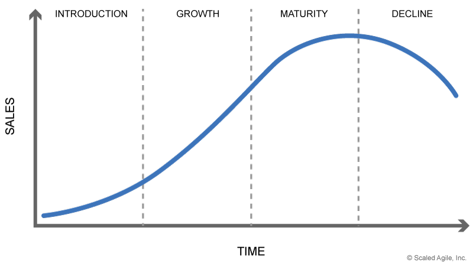

> "A project is temporary in that it has a defined beginning and end in time, and therefore defined scope and resources. It is unique in that it is not a routine operation, but a specific set of operations designed to accomplish a singular goal."
**pmi.org**

# What are Products and Projects?

For many years the primary approach to planning the development of IT solutions to business problems has been based on putting together project teams. This is a temporary team focused on building software which was funded for the duration of the build, justified by the production of a business case. This was usually supported by a waterfall SDLC and could often deliver pretty good results. This could work because in the past many systems were digitizing a manual business process which was well understood and slow to evolve.

> A project is temporary in that it has a defined beginning and end in time, and therefore defined scope and resources. It is unique in that it is not a routine operation, but a specific set of operations designed to accomplish a singular goal.
>
> *pmi.org*

If you want to discover more about projects there are many sources available, useful resources can be found here: https://www.apm.org.uk/

The increased rate of business change and the focus on B2C has exposed the flaws in the traditional project approach and, to cut a long story short, [*agile*](agility.md){:target="_blank"} SDLCs emerged. Where we are focused on growing value by building 
*[business capabilities](business_capabilities.md){:target="_blank"}* in response to rapid market evolution and increasing technical complexity.

This shift toward agile means the delivery of new functionality can be a steady flow of change rather than fixed big releases. The problem with this is that the concept of projects doesn't align well with the concept of long-lived teams producing value continuously. So, in recent years a much longer view has emerged by focusing the product, this looks at the lifetime of the business problem being addressed. In fact this shift actually aligns naturally with the responsibilities of the architects who have always had to think about the lifetime of the systems, because you need to consider thing like migration, the total cost of ownership and *[Quality Attributes](quality_attributes.md){:target="_blank"}* when making architecture *[decisions](decisions.md){:target="_blank"}*.

> **A definition:**\
> A product is something (physical or not) that is created through a process and that provides benefit to a market.  
>
> *mountaingoatsoftware.com*

Interestingly neither SAFE nor Less provide a simple definition of what a product is, although the concept is central to their frameworks, so we need to clarify this further to make it useful.

Sriram Narayan provides a useful side by side comparison of products and projects in [his blog post](https://martinfowler.com/articles/products-over-projects.html){:target="_blank"}.

# Why are Products Important?

A product is how the organisation presents one or more *[Business Capabilities](business_capabilities.md){:target="_blank"}* to a group of its customers, in simple terms -- what is it selling?  Frequently, there is a specific pricing model associated with a product.

In small organizations or startups there is often a simple mapping between what is sold and what is delivered by the engineering teams. When looking a larger or more mature organisations there is often a difference between how the sales and marketing people describe a product and a Product Catalogue and how this is delivered within the IT organization which has adopted a Scrum based agile approach, where a Product Owner defines what is delivered by the engineering team.

# A Product Approach

We need a way of bridging this gap in meaning, thinking about the business view of Products they:

-   Must create measurable value for the business​,
-   Must have clear value propositions tailored to the target market or users group,
-   Often has a Product Manager (PM) who is responsible for delivering this value to the business​.

Before you start developing a new product or feature from the business perspective, you should be able to answer the following questions:​

-   What challenge, problem or opportunity have we identified for the business?​
-   How important is this problem we are trying to solve to our market/users?​
-   Can we accurately describe and engage with this target market or user?​
-   Have we validated our assumptions and if not, what is the best way to quickly validate them?​
-   How will we measure if we are successful or not?​

Looking at the products on the technology side they:

-   Are the building blocks that make up the Business Products that ultimately deliver value to your business
-   May be defined with shareability in mind (to enable multiple Business Products)
-   Early in a products life may not have an actual technical solution identified

When you are looking at how to build the IT solutions to deliver these business products, thing start to get complicated. Ideally to deliver maximum business agility from the product features you would have a direct one to one mapping to the work products delivered by the IT organization. However, this would lead to huge amounts of duplication and waste, as well as data being siloed within these systems.

**Consider the following scenario:\
**A Business has multiple products which deliver the same functionality to different markets -- for example: a bank provides corporate accounts and personal accounts. There is a large overlap in functionality required, but the bank will treat these as completely different business products with separate Product Managers. Looking at the systems -- technology products -- that delivers this functionality, it is very likely that there are many shared components which are managed as products with a Product Owner.

The relationship between the business products to the technical products is an area where the Architect works closely with the Product Managers and Product Owners to define the most appropriate mapping, taking into consideration the functional requirements, quality attributes, delivery timescales, cost and risk and the tradeoffs between them. Shaping the product involves making many *[decisions](decisions.md){:target="_blank"}*, using the appropriate techniques, such Last Responsible Moment and Trade-off Analysis.

When you have defined the product, it is valuable to put together a [*product development roadmap. *](roadmap.md){:target="_blank"}These are used for long term planning of a single specific product. Product development roadmaps are focused on releases, features and events.

## The Product Lifecycle

The product approach defines an approximate lifecycle that all products go through, to support this journey there should be a long-lived team which continues to deliver business value as the needs change.  

The key focus of the architect in these phases of the life cycle are:

-   Introduction -- Innovation and exploring the solution
-   Growth -- focus on delivering quality attributes, assessing the impact of new features and managing technical debt
-   Maturity -- watching for unexpected changes in use that might impact quality attributes and ensuring that the applications that deliver the product are evergreened
-   Decline -- controlled release of the IT resources

## Product Owner Role

The role of the product owner is critical in the Scrum based agile approaches as they provide direction for the engineering team. It is important that the architect works closely with the product owner, but their responsibilities are different:

| **Product Owner** | **Architect** |
| --- | --- |
| Decides what features will be built and in which order focus on business priority | Advices on the order of features bases on efficiency and technical dependencies |
| Choices the release date and content | Advices on risk and cost of these dates |
| Ensures profitability (ROI) | Identifies TCO |
| Prioritizes features and outcomes according to market value | Identifies possible technical debt incurred in prioritization |
| Accepts or rejects work results | Ensures quality of work results |

The architect plays an important part in delivering a successful product over the whole of it lifetime.

# References and Further Reading

**Here are some materials which may prove useful, if you would like to find out more about projects and products**

Useful resources on project management can be found here:[https://www.apm.org.uk/"](https://www.apm.org.uk/){:target="_blank"}

[Ken Schwaber -- "Agile Project Management with Scrum"](https://www.amazon.com/Agile-Project-Management-Developer-Practices/dp/073561993X/){:target="_blank"}

[Scrum.org](https://www.scrum.org/){:target="_blank"}

[Agile Alliance](https://www.agilealliance.org/){:target="_blank"}

[SAFe](https://www.scaledagileframework.com/){:target="_blank"}

BTABoK 3.0 by [IASA](https://iasaglobal.org/) is licensed under a [Creative Commons Attribution-NonCommercial 4.0 International License](http://creativecommons.org/licenses/by-nc/4.0/). Based on a work at [https://btabok.iasaglobal.org/](https://btabok.iasaglobal.org/)