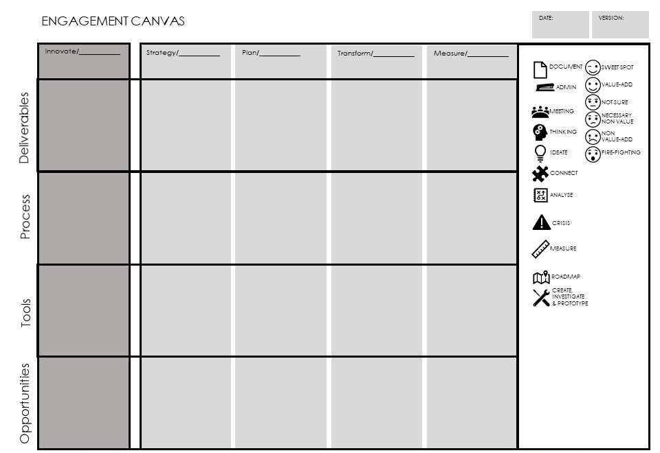

> "I had found my religion: nothing seemed more important to me than a book. I saw the library as a temple."
**Jean-Paul Sartre**

# Architecture Repository

The architecture repository is the methods, tools and techniques used by the architecture team to store essential architecture artifacts and information. It represents the framework of knowledge about the architecture of systems, programs, and the business entity for the team.

Architecture repositories can become very complex topics in large teams and even small ones and are one of the key stumbling blocks for architecture teams everywhere.

Engagement Principle: The repository is first for architects then for the enterprise.

The repository includes all of the deliverables and artifacts that describe and influence architectural decisions.

## Practice

The architecture repository can range from a very simple set of documents or deliverables to an extremely complicated enterprise wide set of systems. This level of complexity causes a great deal of confusion in the industry.

Engagement Principle: Architecture is Not Documentation

A repository will likely be seen a documentation tool. However true this may be from a technology perspective, the purpose of the repository is to provide two fundamental elements to the architecture team. First, better decision making in digital strategy. Second, quick and transparent communication among architecture and extended team members. The third goal of a repository is almost mythical. It is the ability to have a rigorous and fully up-to-date description of the target state of digital strategy which can be queried to evaluate decisions. While this goal is possible in certain environments (large enough architecture team, government requirements and regulation) it is extremely rare and tends towards documentation over strategy.

## Take Care of the Architects First

The first engagement principle says the repository is first for architects. That means the architecture practice needs to be able to achieve its goals first and the repository should contain only what is necessary to do so and only what architects have agreed to keep 'ever green' (the concept of ever green means the deliverables which should at best be always up to date).

The difficulty of architecture repositories is that architects often have a difficult time distinguishing between deliverables to [stakeholders](stakeholders.md){:target="_blank"} and critical elements of architecture which need to be up to date and easily identifiable to other architects.

As a part of the [Engagement Model](engagement.md){:target="_blank"} development process the team should identify the elements of the architecture which must be kept up to date and stored and which elements may be stored in the standard enterprise content management system or as a part of another process.

Most architecture teams will need very little documentation to describe an architecture within the team. This should be factored in to [decisions](decisions.md){:target="_blank"} about what is needed for the team vs what is desired for the entire enterprise.

For example, many organizations use capability models to describe their enterprise and in many of those environments the architecture team is responsible for introducing the model as well as maintaining it. These models are extremely useful to both stakeholder as well as architecture decisions. However, commonly the architecture team needs a very minimal version of the capability model whereas the enterprise requires a much more robust and well maintained version. In this scenario the team would design a capability model for its use first. Then introduce the model to the enterprise. If other stakeholders found value in this model, they should be willing and able to maintain it, otherwise the team should switch back to the original easy to maintain version useful to the architects.

## Repository v Usage

The architecture repository is only as good as what is maintained and how it is used. There are numerous case studies of large deliverables of excellent quality which have very little consumption within the enterprise. Given the low ratio of architects to other stakeholders and their essential function in the organization for digital advantage this must be avoided at all costs.

In addition the level of maintenance for aspects of the repository must be considered as a part of the job description and the overall architecture lifecycle. It is well known that documentation will not be maintained unless it is essential and directly a part of the performance expectations of the architect.

## Design Repository Structure

A repository must have some loose structure at least which guides what types of things should be stored and how. Probably the most well know structural model of an architecture repository is the TOGAF architecture repository description. This standard provides an enterprise-level description of architecture repositories.

Figure 1 TOGAF Repository Structure

## Meta-Model Elements

The table emphasizes the primary elements stored in a repository and how they relate to each other.

| **Element** | **Maintenance** | **Usage** | **Guidance** |
| --- | --- | --- | --- |
| Decision Registries | Low | High | The decision registry should be one of the first and best maintained elements of the repository |
| Models and Meta-Models | High | Medium | There are thousands to tens of thousands of models in use in the enterprise and they require significant maintenance. Be very careful which ones are stored in the repository. Prune unused elements regularly. |
| [Value Methods](value_methods.md){:target="_blank"} | Medium | High | Value or Benefits Realization elements form the baseline for value reporting and understanding delivered value through the enterprise. |
| Principles and Standards | Low | Medium | [Principles](principles.md){:target="_blank"} including ethical, engagement and delivery principles help inform delivery. These principles may apply to different scopes and contexts. |
| Capability and Service Models | Medium | High | Capability and service models are extremely common in the modern company and form the basis for many organizational dependencies. Services models are the technical instantiation of the capabilities and are harder to model and manage over time. |
| Business Deliverables | Low | High | Business deliverables such as business model canvas and business strategies are used to help shape decisions within technology strategy. |
| Transformation Deliverables | Very High | High | Transformation deliverables include project and product deliverables such as solution architectures and infrastructure architectures, they are extremely valuable if the right artifacts are stored and kept up to date. |
| Assessments and Analysis | High | Low | Assessments include ATAM, PBAAM and SARM analysis which would be put into the standard repository and decision registries. |
| Competencies | Low | High | Competency management may not make sense in an average repository but it is essential in the management of architecture as it is mapped directly to the outputs of the individuals. |
| Groups and Learning | Low | High | The management of relationships in the team and its environment and stakeholders. |

Table 1 Repository Meta-Model

## Top Down vs Bottom Up Loading

> "Keep a Light Backpack... the slower we move, the faster we die"
**George Clooney, Up in the Air**

The BTABoK suggests that the lighter-weight an architecture repository is while still meeting the minimum goals for the architecture team, the more Agile the team remains as it is weighed down by fewer tools, documents and models. This would also suggest that there is no such thing as a complete repository as we effectively 'pull it behind' the team. The options between top and bottom loading are mostly driven based on team preferences and the quality of understanding of the engagement model among the team and its stakeholders.

Bottom-Up Loading depends primarily on the gathering architectures as they are created from the product/project level. This would be things like architecture models and descriptions, views and viewpoints as well as essential decision records. The risk in this method will be that too many detailed deliverables are put into the repository which poor quality and it will quickly fill up with less useful artifacts that remain unused and unmaintained for long periods of time.

Top-Down Loading suggests that the team define a rigorous set of artifacts necessary for the practice and begins to populate it from the 'top' of the stack. This is often the case with business-focused artifacts such as business model canvas or capability models. Many of these are extremely useful to the architecture team but often take on a life of their own, pulling the team away from delivery of value within their primary capacity. The life and quality of top-down models needs to be managed such that the architecture team is not maintaining the documentation of other groups and is first concerned only with the elements which inform digital strategy and then only to the minimum degree necessary.

## Repository and Tools

The marketplace is filled with tools for the architect. When considering tools it is best to understand when and how it will be used within the architecture delivery methodology. The team can use the process engagement canvas to determine the appropriate level of artifacts, information and tools necessary to support their current engagement. 

The Process Engagement Canvas allows a team to define the artifacts and processes the tooling needs to support.

## Architect Engagement Workshop -- Repository

The goal of the workshop should be to define the working aspects of the repository such that it integrates with the ADLC. This should be handled as a part of the engagement model steering group activity.

**Step 1: Decide the scope of engagement**

The scope of the engagement is defined using the number of architects, their interactions within the enterprise, the review of the stakeholder community and the goals of the team. A dedicated team of 200 architects will have a much larger scope of involvement than two architects in a smaller startup.

**Step 2: Define the interaction points in the lifecycle**

Look at each 'phase' in the [lifecycle](architecture_lifecycle.md){:target="_blank"} by type of interaction, scope and coverage. Thing about the phases in terms of a) where ideas are generated and captured, b) how those ideas are compared and invested in, c) how teams and groups are assigned to those products, d) how they are delivered, e) how they are optimized and measured.

**Step 3: Define the owned/influenced artifacts which need to be stored**

Identify to-be state information about what tools, techniques, artifacts and tasks the architects will want to use in those phases.

**Step 4: Identify repository elements which need to be included**

The following table identifies repository elements which are important for

| **Components** | **Description** | **Guidance** |
| --- | --- | --- |
| Knowledge Management | The knowledge management components allow the repository to cross-reference elements with each other through ontologies, taxonomies, tagging and meta-model. | Choose a repository that will support the most basic form of tagging and linking necessary for  |
| Document Management | How the repository handles common document formats and the ability to import and export. The means to extract, load, tag documents. | Document management is by far the most difficult element of the repository as it very quickly fills up with old office documents, images and spreadsheets which are disconnected from the knowledge management framework. |
| Model Support | The means and methods by which model and model elements are supported both in storage and retrieval as well as integration with other components. |   |
| Tool Support | The method for connecting with other architecture and non-architecture tools such as Jira, modeling tools like archimate or sparx. The quality of tool support also includes collaboration, documentation, standards and IT configuration tools. |   |
| Reporting | The quality and flexibility of the repository for BI, reporting and dashboards based on dynamic queries to the stored information. |   |
| Data Integration | How the repository connects to the enterprise data strategy and its ability to integrate with other tools as a part of a joint digital strategy platform. |   |
| Presentation Integration | How well the repository provides interfaces and inclusion in presentation tools like PowerPoint. The quality and usability of the reports, interfaces and presentations options. |   |
| Collaboration | The repository support for collaboration and communication between architects and stakeholders. |   |
| [Automation](automation.md){:target="_blank"} | The automated integration of the repository in meaningful operations, collaboration and integration flows. |   |

Engagement Principle: Repository management is the responsibility of every architect on the team and should be a part of the job description and team performance review.

A knowledge management process needs to be in place that can be operationalized, consider how long artefacts will be maintained. By setting a date for retirement of an artefact and assigning a role to maintain the repository the IT Architect will help make sure the repository stays fresh and current. The end result will be higher reuse of IP and stronger tendency to store information in a single store.

## References

[https://sparxsystems.com/enterprise_architect_user_guide/14.0/guidebooks/ea_architecture_repository.html](https://sparxsystems.com/enterprise_architect_user_guide/14.0/guidebooks/ea_architecture_repository.html){:target="_blank"}

[https://pubs.opengroup.org/architecture/togaf92-doc/arch/](https://pubs.opengroup.org/architecture/togaf92-doc/arch/){:target="_blank"}

[https://www.sciencedirect.com/science/article/pii/B9780124199842000045](https://www.sciencedirect.com/science/article/pii/B9780124199842000045){:target="_blank"}

[https://bizzdesign.com/blog/5-top-tips-for-organizing-your-architecture-repository/](https://bizzdesign.com/blog/5-top-tips-for-organizing-your-architecture-repository/){:target="_blank"}

[https://docs.aws.amazon.com/whitepapers/latest/establishing-enterprise-architecture/enterprise-architecture-repository.html](https://docs.aws.amazon.com/whitepapers/latest/establishing-enterprise-architecture/enterprise-architecture-repository.html){:target="_blank"}

BTABoK 3.0 by [IASA](https://iasaglobal.org/) is licensed under a [Creative Commons Attribution-NonCommercial 4.0 International License](http://creativecommons.org/licenses/by-nc/4.0/). Based on a work at [https://btabok.iasaglobal.org/](https://btabok.iasaglobal.org/)