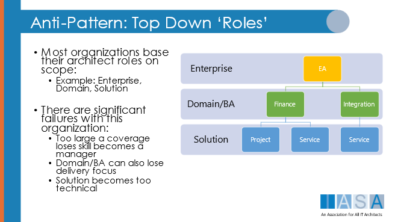

> "All the world's a stage, and all the men and women but merely players."
**William Shakespeare**

# What are Roles

> "...The function assumed or part played by a person or thing in a particular situation.."
**definition from Oxford Dictionary**

The definition of role provides a unique insight into the need for very careful analysis of the difference between a role of a regular employee and role(s) for professionals. These are very different concepts. The role of a regular employee may be somewhat agreed upon by human resources or other external resources, but there is extreme variation in the industry based on the needs of the individual organization. A profession on the other hand manages the activities of its members with extreme care and they must adhere within the scope of professional activities to modern best practices as defined by the overarching body of professionals. This may include enforcement through legislation, litigation, liability, and other methods.

It is important to note however that a professional may act in other capacities and other roles for an employer or client. However, these will not constitute protected activities nor do they reflect their primary function. For example, many organizations' leaders listen to their chief legal counsel in many areas of business that do not strictly reflect legal advice or issues of legality. However, when working on areas of protected work it is only a legitimate and licensed attorney that is allowed to make decisions.

# Why Are Roles Important

With the competency model and the job definitions provided by the BTABoK, there might seem to be no need for the definition of roles within the body of knowledge. However, if competencies are the way to measure an architect and job descriptions are the way to hire them, roles are the way they work within the engagement model with stakeholders, customers, and essential but undocumented job functions. These functions may include many other outcomes and activities in addition to the focus of the profession. For example, in a role as chief architect, a professional may be called upon to give advice on many different aspects of the business which extend far beyond their professional decision rights. However, for architecture to be a profession, there is a protected set of decision rights that must have their approval.

# Architect Roles and Specializations Approach

This topic is at the core of creating a profession from the chaotic mess that is today's technology world.  While there are many successful deliveries, the chaos described here is more about the massive difficulties in repeating those successes regularly and efficiently across employers and clients. Effectively, the world of architecture must move to official designations with meaning derived from successful practice, not just successful career advancement. This is best highlighted in how one achieves titles and how one advances to senior levels within their specialization or within the overall profession. In a practice model, a large group of organizations must change the following:

1.  Adopting an externally agreed competency model for architects and measuring achievements within those competencies during the professional's employment (most of this will be done for the organization by the external professional association... Iasa, and the individuals themselves).
2.  Applying the title only to those who have achieved externally verifiable evidence of advancement in those competencies.
3.  Removing the title based on ethical breaches, principles, and practices from those that cannot or will not deliver successfully.
4.  Creating opportunities to practice the competencies under guided mentoring from qualified mentors either internally or externally.
5.  Supporting a career advancement method based primarily on achievements within the competency model.
6.  Adopting a method by which the most critical see [Safety and Liability](safety_liability.md){:target="_blank"} class of problems/solutions cannot be worked on by non-professionals.
7.  Requiring (or at least preferring) vendors and external partners to adhere to the same levels of standards of practice.

This list may sound very intense to individuals in today's chaotic environment. However, the techniques involved may be adopted gradually, with significant benefits to all parties involved. In addition, if a practice adopts these methods according to the recommended engagement model methods, it will significantly lower the total cost of architecture, increase the value generated and effectively pay for itself.

## Chief Architects Over Enterprise Architects

(Note from the Iasa CEO, Paul Preiss: We are fully aware of the incendiary nature of this section and the following statements and fully intend to continue documenting and structuring the BTABoK around successful practices including successful enterprise architects, we ask only that you understand that true professions must follow very specific and powerful guidelines for them to be successful overall. I believe this article will demonstrate those forces and guidelines, but we remain as always open to the ongoing discussions which will lead to the most useful body of knowledge for ALL architects. Regardless of the popularity of these statements our commitment remains to create a true profession.)

The basic stance of the BTABoK is, what is known as enterprise architecture is actually the combined effort of every architect working with an organization and is therefore not a job title, but the combined effort of all architects both junior and senior.

The BTABoK and Iasa have in some ways over the years been seen as 'anti-enterprise architecture'. This is due to a few fundamental principles of professions that form the core of the association as well as strong statistical and anecdotal evidence of the difficulty enterprise architects have faced in the industry. Stated simply, evidence strongly suggests that the enterprise is too large a [scope](scope_context.md){:target="_blank"} to effectively be proactive in the delivery of the primary value proposition of architects, business technology strategy. The focus is on the word delivery, not value nor evidence that excellent and successful enterprise architects exist. What the evidence of corporate assessments and critical authors suggests is that enterprise architecture ONLY teams end up focused on executive and management style techniques as opposed to active participation in delivery. Think of it this way, the lead executive of a hospital is concerned with profitability, technology, legal issues, employment, finance, administration, management, etc. However, they do not and are not allowed to treat patients, no matter their length of employment. The chief of medicine is often concerned with all of the same issues, and may in practice also report to the board of directors. However, the chief of medicine and all the chiefs of the 'domain' or specialization areas are required to see patients, and based on our research, they are actively engaged in seeing patients up to 70-80% of the time, **regardless of their additional duties**. This is the area of translation needed between specialists and 'enterprise' architects.  

## [Competencies](competency.md){:target="_blank"} and Enterprise Architecture

This article has described the essential nature of a competency model for a profession to function. Iasa has undergone years of research into competencies and how they relate to each other and what 'types' of architects need those competencies to be effective. This includes specializations such as business architects, software architects, etc. The findings of this process have indicated that all of the competencies which are important to enterprise architects are found either in the Core Competencies (the five pillars) or within one of the specializations.

In addition, there is a level of scope at which one cannot be proactively engaged with the delivery of technology strategy which leads to competency or skill atrophy. Think about it this way, at some point, enterprise architects often function without applying the skills from two or three of the foundation pillars for years. Without that application, those skills become less applicable to modern technology strategy. In these cases, the architects have effectively 'phased out' of practice into more of a management role. However, one of the forces and guidelines of a true profession, is that core skills and modern approaches must be constantly maintained through practice.

## The BTABoK Answer to the Challenge -- Chief Architects over Enterprise Architects

This situation has created a major dilemma for this Body of Knowledge since the term Enterprise Architect(ure) is in such common use, and there is a risk of alienating a large body of the leadership of the practices around the world. However, the BTABoK has found a solution to this issue that solves the problems previously identified. The solution is to move to a Chief of ____ Architecture method of titles and career advancement over the use of the Enterprise Architect title. This is the method employed by the medical profession and it has worked well. Examples include the chief of integration architecture, chief of security architecture, chief of consumer banking architecture... It becomes apparent very quickly that these individuals retain their seniority in the architecture practice but also retain their very real delivery responsibilities. In addition, it allows the architecture role to cover many specialized domains, both in terms of business and technology.

This is an area the BTABoK will continue to explore, through polling, interviews, architecture practice assessments, and debates.

Specializations in Architecture
===============================

The primary focus of an architecture practice is to maximize the value created from technology strategy throughout an organization. This is extremely well documented in the value article as well as throughout the BTABoK. However, it is in the nature of complex professions like architecture for individuals to specialize in specific functions of this objective. In many cases, specialists will be involved in activities that aren't exactly architecture as well.

**The first rule of specialization is that ALL specialization is based on a common competency foundation.** As long as that is the case, specialization creates a significant advantage, especially in large architecture practices.

In the BTABoK all architects are required to have a minimum level of competence in the 5 pillars of architecture. This creates the common language, shared purpose, and value potential of the entire practice model.

Once baseline competence is established, preferably early in a practitioner's career, then specialization is mostly based on two very poorly understood competency models seen below.

## Technical to Business And Breadth to Depth

One of the most critical factors in understanding architects and their specializations is based on a) the amount of technical versus business competence, and b) the breadth versus depth in knowledge and experience of the architect. This spectrum to a large degree creates many misunderstandings, role, role confusion, and difficulty with titles in the technology industry as well as specifically in architecture.

The BTABoK competency model would suggest for example that business architects spend a significant portion of their time in the right-hand section of the diagram and thus their competencies will be significantly higher in those areas. Software architects and infrastructure architects spend a large percentage of their time in areas on the left side of the diagram, which is optimal as long as all of the architects in the practice have the foundation knowledge at the center of the graph and maintain that knowledge over time.  

## Scope of Impact and Level of Specialized Knowledge

The other area of impact to specialization is the level of specificity or specialized knowledge of the individual compared with their scope of impact, or more accurately, the scope of impact of their decisions. This scope question is what creates so many titles which are not in fact competency-based but scope based such as Enterprise Architect, Domain Architect, Platform Architect, etc. These titles are generally based not on competency measures but scope and area of knowledge. For example, the title Enterprise Architect for Payments in Consumer Banking is based solely on a) a semi-understood enterprise level of scope in a company and b) highly specialized domain knowledge in the area.

In the BTABoK scope of impact is addressed not by title but by career path level and specialization. For example, the Chief Architect for a particular domain area would be a) board-certified in their specialization and b) that specialization would be highly aligned with their area of work. So in the previous example, the BTABoK would suggest the title Chief Architect of Payments or Chief Architect of Consumer Banking and the individual would likely need to have achieved the CITA-Distinguished in Business Architecture before qualifying for the job. While this may seem complicated at first, the BTABoK method almost guarantees a much higher degree of quality in communication, outcomes, role interactions, and professional capability in the industry.

# What are the Recognized/Certified Specializations?

The BTABoK recognizes five primary specializations which can be board certified and delivered as a part of the working architecture practice. BIISS or Business, Information, Infrastructure, Software, and Solution architects. These specializations include all of the competencies necessary to support an architect in any activity within their area of focus. In addition, the BTABoK recognizes several sub-specializations which are extremely specialized areas of knowledge but at a higher scope. The BTABoK includes Role Descriptions for each of these specializations which can be used for hiring purposes.

The profession must be based on equal buy in to descriptions -- possible relationship to numbers of architects in the world.

## Business Architects

The business architect specialization focuses deeply on integrating with all areas of the organization's business and operational units. Their primary responsibility is to work with business stakeholders to optimize business strategy with the maximum strategic digital gain. Business architects spend significant portions of their time working with models and canvases that are distinctly about business decisions. However, in the BTABoK (as opposed to other competency models) business architects retain a strong degree of technical skill, thus allowing them to function as a digital strategists partnered with other business units. The degree of technical skill retained is primarily based on their background and is very well defined if they follow the BTABoK competency and career path. This structure for the business architect specialization creates significant benefits for the architecture practice:

-   Business architects are able to work alongside more technical specialists and speak the same language
-   The career path for all architects remains based on the same competency model
-   The architecture practice helps to shape strategy throughout the organization, optimizing digital outcomes
-   The architecture practice is able to acquire the business information, insights, and objectives that allow for effective decisions in the more technical/depth areas of architecture
-   The architecture practice generates more measurable business outcomes for the organization
-   Success is measured at value stream, capability, and objectives levels instead of at IT delivery
-   The architecture practice may communicate directly with areas it does not traditionally reach

In the BTABoK, board-certified Chief Business Architects largely replace the business-facing portion of the 'enterprise architect' practice.

## Information Architects

Information architects may be the most poorly understood and most fragmented specialization in the architecture field. This group of architects is responsible for the usage, transformation, storage and retrieval, and analysis of information as it impacts digital advantage. They function at all levels of scope much like the other architect specializations. The reason for the confusion lies in the backgrounds of the current practitioners.

A review of current job titles in industry, membership, and job boards indicates 3 primary ways the title is currently used.

One is very usage and usability focused for example in web applications or website or user interface design.

The second is in integration, transformation, and movement of information within the organization and between the organization and its business ecosystem.

The third is focused specifically on data, information management, and analytics. This focus is on the storage, retrieval, and analytics of the data itself with a strong focus on knowledge management.

The BTABoK competency model unifies these into an underlying information architecture baseline and treats the three focus areas as sub-specializations and topic areas. Iasa supports board certification of information architects and training in topic areas for the sub-specializations.

## Infrastructure Architects

Infrastructure architects were traditionally thought of as big data center architects. Effectively those that designed and operated data centers. However, the BTABoK treats infrastructure architects differently. The specialization is based on the use of hardware resources, network resources, compute resources that exist in the organization, in partner organizations, and the organization's products. For example, there are running machines that connect to watches, software, and home networks as well as product partners, etc. These edges compute, cloud, IoT and other compute, storage, connect environments are the purview of the infrastructure architects as much as the traditional data center, employee device management, collaboration, and many other significant business outcomes. It should be noted however there is almost as much fragmentation in the infrastructure architecture space as there is in information architecture. The BTABoK roadmap includes a significant focus on these areas of architecture knowledge and techniques.

## Software Architects

Software architecture is probably the most understood of the architecture specializations. Iasa software architects have strong business competencies which form their ability to drive value decisions deep in technology delivery. Software architects focus on the delivery of value through small to extremely large software-intensive systems. They work in partnership with engineering/development (which the BTABoK treats as entirely separate professions) as well as product, program management to deliver measured business outcomes, value, and structurally sound software systems.

## Solution Architects and Other Generalists

The industry treats the title of solution architect as a catch-all for those who work to deliver technically driven outcomes. There are infrastructure architects titled solution architects as well as information and software architects that also have that title. The BTABoK treats solution architects as expert generalists focused on the delivery of value through a time-constrained set of activities for large products, programs, or projects. This essentially boils down to a scope issue much like enterprise architects however the solution architect is focused on the delivery of something in particular. In general solution, architects are those who lead other specialists through major deliveries. The BTABoK pairs solution architects with business architects at the value stream and program level working effectively together. Solution architects are certified by Iasa by a mixed board of specialists.

## Sub-Specialization, Topic Areas, and Technical Expert

There are numerous depth areas within reach of architects in both business and technology. Many of these areas are also extremely broad by themselves. For example, security, integration, business domain areas, cloud, AI, government areas, are all examples of extremely deep fields of study. The BTABoK does not currently recognize these depth areas as full architect specializations for two primary reasons, a) there is plenty of room in the industry for technical and business experts who are not architects and without a significant percentage of them in architecture practices there is no reason they need to achieve the architect's foundation competencies, and b) the practitioners are often deeply expert in their area but lack the foundation competencies to function as architects. However, the BTABoK includes Topic Area certifications in these areas which include certifications for achievements and experience though these certifications should not be seen a career levels. These topic areas may become full specializations in the future. Topic areas currently include Cloud Architecture, Integration Architecture, Security Architecture, and AI Architecture.

# Strategies for Role Development

While the basis for roles is specialization, there are other more complicated aspects of roles that architects play within scope and context.  

## Professions Can Have Secondary Benefits

It is very common for professionals to provide 'secondary benefits'. This phrase is used to show their value beyond their primary professional function. These benefits most commonly are associated with the role's primary interaction points, stakeholders, and functions within the practice engagement model. This is an extremely important distinction in the maturing architecture profession. It is very common in circles to hear about a business architect working on a pure business strategy that does not involve digital outcomes. This is a 'secondary benefit' in the BTABoK. Their work on pure business strategy may be extremely valuable but does not fall within their work as a business technology architect. The same can be true of a software architect who delivers working code on a project/product that is in crisis or lacks the skilled development staff it needs. The value of these secondary benefits can be very great especially in situations where no legitimate architecture work has been done before. The value of a business architect who is primarily engaged with other business professionals is that it gives reach in both scope and coverage for the architecture practice. The same can be said for software, infrastructure, information specializations as well as the scope-based roles -- chief, enterprise, domain, and solution.

## Secondary Benefits are not the Profession

It is absolutely essential that secondary benefits nor other role activities not be construed as the primary purpose of the profession. This results in the utter chaos of the current professional marketplace. For example, the phrase 'going native' is often applied to software architects who double as software engineers. And many business and enterprise architects use the phrase 'architecting the business' which is an abuse of the term as it implies that the secondary benefit of having a part in the design of a business strategy is their primary function. As a side note, even this expression is inaccurate as architecture is not a verb and thus it should have been 'designing the business'. This is a point of serious contention in the industry, though the BTABoK method clarifies this very specifically. Architecture as used in the modern enterprise and not referring to protected uses such as building or marine architecture is business technology strategy and decision rights protection, methods and competencies extend only to business/technical strategy and execution.  

## Architects Wear Multiple Masks

In many cases, architects must act as different types of people to accomplish their goals and the outcomes and value of the profession.

The architect may act as an advisor to others, or an archeologist digging up old kernels of technology decisions and execution. These masks are useful in the day in and day out the practice of architecture though it is essential to understand how and when to use them. The twelve masks listed in the image do not constitute a complete list but serve as a reminder that architects must remain flexible in their approach to implementing the practice.

## Architects Will Acquire Digital Decision Rights

It must be said that decision rights are the primary component of professionalization. Certain decisions are reserved for certain classes of professionals. For example, a layperson cannot prescribe drugs, conduct surgeries, represent someone in court or approve financial instruments. These classes of decisions have been reserved for specific professionals with as much protection for the common person as possible, including ethical considerations.

The BTABoK is the beginning of decision rights for the technology field, specifically in regards to architects and non-professional roles within the field. While this is emerging, there will continue to be the kind of chaos and confusion that exists in modern technology strategy and delivery. It should be noted that decision rights are reserved for experientially certified architects and do not extend to those who have not achieved similar status. This is explored heavily in the engagement model and decision articles.

## Roles in Immature Practices

The most difficult role of an architect is in immature practices, which include most architecture practices today as well as the thousands of businesses who do not benefit from an architecture practice at all. The role of architecture in these areas is often to establish the concept of technology strategy as a valuable addition to the business or organization. This entails working with business and technology staff to understand the importance of technology in the IBAM outcome model. In addition, it is much more likely that architects in an immature practice will play multiple roles and may/or may not be confused as to their primary focus area.

## Roles in Society

Enough cannot be said about an architect's potential role in society. In an increasingly complicated digital world, it is beyond the layperson's or the average business person's understanding and ability to make critical decisions related to the impact of technology. Further, technology's impact on society is increasing in areas of Safety and Liability. This foundation requires that architects play a leading role in protecting, guiding, and leading in critical societal functions related to technologies use and application.

# References and Further Reading

[http://grahamberrisford.com/AM%201%20Methods/6PRODUCTSandTECHNIQUES/nitiationAndContextAM%20203%20Some%20architecture%20role%20definitions%2030.pdf](http://grahamberrisford.com/AM%201%20Methods/6PRODUCTSandTECHNIQUES/nitiationAndContextAM%20203%20Some%20architecture%20role%20definitions%2030.pdf){:target="_blank"}

[https://www.linkedin.com/pulse/structuring-forest-architecture-roles-harald-van-der-weel/](https://www.linkedin.com/pulse/structuring-forest-architecture-roles-harald-van-der-weel/){:target="_blank"}

[https://pubs.opengroup.org/architecture/togaf9-doc/arch/chap46.html](https://pubs.opengroup.org/architecture/togaf9-doc/arch/chap46.html){:target="_blank"}

[The Layman's Guide to IT Architecture Roles](https://morphological.wordpress.com/2017/01/26/the-laymans-guide-to-it-architecture-roles/){:target="_blank"}

[https://www.pmi.org/disciplined-agile/process/enterprise-architecture/enterprise-architecture-roles-and-responsibilities](https://www.pmi.org/disciplined-agile/process/enterprise-architecture/enterprise-architecture-roles-and-responsibilities){:target="_blank"}

[https://www.simplilearn.com/it-architect-article](https://www.simplilearn.com/it-architect-article){:target="_blank"}

BTABoK 3.0 by [IASA](https://iasaglobal.org/) is licensed under a [Creative Commons Attribution-NonCommercial 4.0 International License](http://creativecommons.org/licenses/by-nc/4.0/). Based on a work at [https://btabok.iasaglobal.org/](https://btabok.iasaglobal.org/)