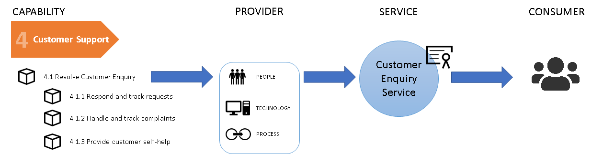
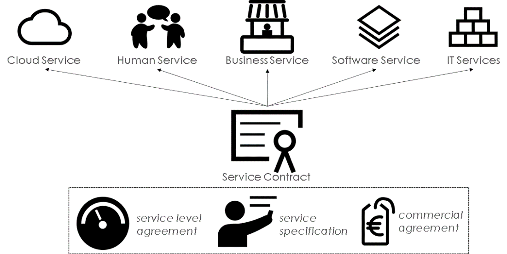
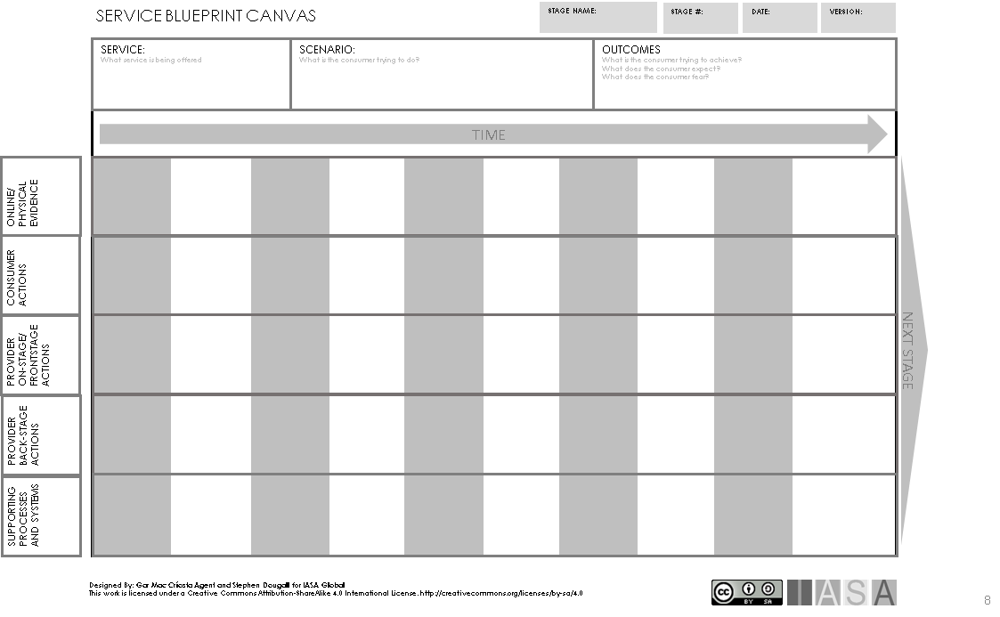
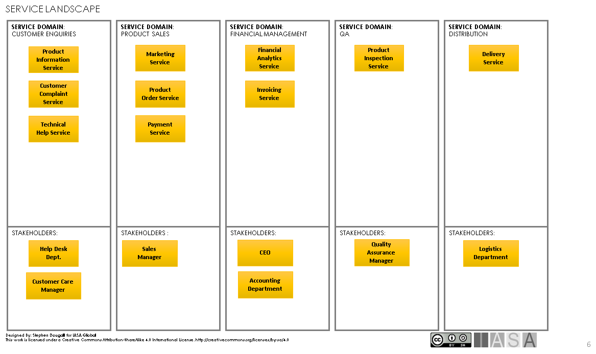

> "A service is a logical representation of a repeatable activity that has a specified outcome. It is self-contained and is a 'black box' to its consumers." 
**Open Group, Service-Oriented Architecture Ontology Version 2.0**

# What is a Service

In the IT sector the term "service" is widely used in a number of
contexts. In the context of this article, services are a way of
realising a of realizing a [capability](business_capabilities.md){:target="_blank"}. This is to say that
a capability will deliver value though providing services.

The Open Group provides a description of the characteristics of service
as follows:

1. It is a logical representation of a repeatable business activity
   that has a specified outcome

2. It is self-contained

3. It may be composed of other services

4. It is a "black box" to consumers of the service
   (this means that the consumer of the service does not have to know
   about the inner workings of the service)

The services which are provided by a capability may be manual, automated
or more often a mix of both. Just as a capability is composed of people,
processes and technology, a service may also be composed of people who
provide the service, process which describes the workings of the service
and technology which automates the service.

 

In this article services are considered in two contexts:

- **business service** -- services which provide business value from
  the capability to the consumer

- **technical services** -- automated services using technology to
  provide value to the consumer

# Why we need Services

Services provide a flexible and adaptable way to build business and a
technical architecture. The nature of service-orientation is a focus on
the consumption of the service and the outcome. This aligns well with
business where we are **interested in what** the service provides
**rather than how** the service achieves the result. This is why
services are a "black box" to the consumer, the consumer only needs to
worry about what is provided to the service and the outcome of the
service.

Another advantage of services is that they are self-contained. This
allows the inner workings of the service to change without changing the
surrounding consumers of the service. The scope of change is reduced, so
optimizing implementations, changing technologies or even whole systems
has a lesser impact on the surrounding IT landscape.

Services promote re-use. If services already exist, they can be
incorporated in other services. This means that new services can quickly
be created by composing a series of existing services (this may be
referred to as Service Orchestration). This provides a fast way to
create value from resources which already exist.

# Service Approach

SOA (Service-Oriented Architecture) is an architecture style which
facilitates the provisioning of services, often with focus on technical
services but the key principles can be applied to all types of services.
SOA architectures are widely used in industry and there are many
articles and books written on the subject, and therefore this article
does not cover SOA architectures in detail but instead focuses on
services. The following are some of the key factors in successfully
developing services and a SOA architecture.

## Service contract is key

The service contract is the link between the consumer and the provider
of the service. This forms the agreement and expectations of the
service. Getting the service contract right and maintaining it is key to
ensure that the consumers of the service are satisfied.

## Hide the inner workings

Services do not expose the inner workings of the service to the
consumer. This is reduces complexity in consuming the service but more
importantly provides the benefit of being able to change how a service
works without having to change how the service is consumed. This make
maintenance of the service easier and is a key factor in facilitating a
quick reaction to business changes.

## Services are published

In order to gain significant effect from a service architecture the
potential consumers of the service need to be able to find the services
and understand how to use them. This places a requirement on providing
good documentation or descriptions on how to interact with the service,
and ensuring that services are publish and promoted to potential
consumers.

## Design for re-use

When designing services consider that the service should be re-useable
by a number of consumers. Creating services which have a highly
specialized contract reduces re-usability and increases dependency.
Enabling re-use of services brings significant business benefits and
make maintenance of services easier.

## Services play together

When developing services, it is important to consider how services work
together. A business service may be composed of a number of technical
services, and a technical service may also be composed of some other
technical services. Re-use and decomposition of services is a strong
factor in building an architecture as it provides a way to break complex
activities into a number of less complex activities, with the added
option of re-using any existing activities.

## Keep services stateless

Keeping services stateless promotes scalability in the architecture. If
the service itself maintains a state that state has to be managed if we
scale the service to a number of instances. In other words, the service
has to be aware of its consumers. Keeping the service stateless allows
the service to be scaled, meaning that any number of consumers can use
any instance of the service and still achieve the expected result from
the service. This avoids complex problems in the infrastructure as
demands on capacity, availability and performance grow.

## Avoid Fragmentation

Services are a good way be break up a large business activity into a
number of smaller activities and provide flexibility in the
architecture. However, the granularity of services comes with an
overhead. As the number of services increase the effort for managing the
services also increases. This may include, for example, managing
versions, deployments, installation, operations and monitoring. If the
cost for managing the services outweighs the benefits of flexibility it
may be more advantageous to consolidate services and avoid
fragmentation.

# Delivering Services

Services have a strong relationship with the [capabilities](business_capabilities.md){:target="_blank"}.
While the capabilities describe **what** a business does or needs to do,
the service provides a way of realizing capabilities and delivering them
to consumers.

 

In the diagram above example capabilities are shown for customer support
at various levels. In order to deliver the "Resolve Customer Enquiry"
capabilities the provider needs to implement how to deliver the
capabilities using people, technology and processes. This is packaged
into a service which provides these capabilities to the consumer. The
provider of the service performs the work required to deliver the
service using people, technology and processes. In order for a consumer
to use the service, the consumer and provider have to agree on the terms
of the service, this is done though a service contract.

In the case above the Customer Enquiry Service will provide consumers
with a contract for:

- Responding to and tracking request

- Managing complaints

- Self-help

This is valid for both business services and technical services, however
when providing technical services, the provider will heavily depend on
technology to automate service delivery. An important factor in the
provision of services is that the consumer only needs to know about the
contract for the service, the consumer does not need to know about the
inner workings of the service as implemented by the provider.

# The Service Contract

The Service Contract is central to the delivery of services and provides
an agreement between the consumer and the provider of a service. This is
a particularly important aspect of a service as it provides a
description of how the service can be used and what can be expected from
the service. A Service Contract applies to business services and
technical services, although the description of the contract may be very
different.

 

The following three areas describe a Service Contract for both business
and technical services:

**Service Level Agreement** - defines the Quality of Service (QoS) that
can be expected of the Service

- should state obligations on both Service Provider and Service
  Consumer in terms of the performance, availability and security
  provided by the Service.

- for a Business Service it may extend to warranty and support terms

**Service Specification** -- describes how the service can be used

- identifies the Capabilities provided by the Service

- defines the behavior of the Service as seen through the use of its
  Interface

- used by the Service Consumer to discover Services that provide the
  required Capabilities

- understand how Service Interfaces can be used.

**Commercial Agreement** - defines the commercial terms for using the
Service

- cost of use

- period/term of use

- penalty clauses

The context of the service may determine how complex the Service
Contract is. For example, a service which is only used within a single
solution may be covered by the commercial agreement or service level
agreement for the solution. However, a service which is used
specifically by external parties may have a Service Level Agreement and
Commercial Agreement per customer.

Before considering the detail design or blueprint of a service the
contract of the service can be defined. This provides the consumer view
of the service. The following canvas can be useful in defining contracts
for services. The following method can be used:

**Step 1: State the goal and purpose of the service**

It is important to state the goal and purpose of the service as this
will provide a statement of the business activity and the expected
outcome of the service.

**Step 2: Service Specification**

List the capabilities which are provided through the service. These can
also be seen as the interaction between the consumer and the service.
For each interaction with the consumer, consider what is required from
the consumer to perform the interaction and what is the result of that
interaction. For example, the service may provide a "Register Customer"
capability, where "Customer Details" are required from the consumer, and
the result of the interaction is that the consumer receives a "Customer
Membership Number".

 

**Step 2: Service Level Agreement**

Consider the service level which will be agreed between the consumer and
provider. While the service specification addresses the capabilities of
the service (or functional aspect of the service), the service level
agreement often addresses non-functional requirements placed on the
service. Examples of service level agreement attributes are, capacity in
terms of numbers of users, number of transactions per day, level of
security, availability or access to support. The service level agreement
normally has a direct relation to the commercial agreement since a
higher level of service drives costs.

It is also important to consider that the same service specification may
be delivered under different service level agreements. For example, the
same service capabilities may be provided to consumers under a "Silver"
service level agreement with a support response of 24hrs, however "Gold"
service level agreement may provide support response within 1h.

**Step 3: Commercial Agreement**

The commercial agreement addresses the terms of use for the consumer.
Consider the business model for the use of the service. The consumer may
pay a fee or a subscription to gain access to the service for a given
time period, or a fee per transaction.

The commercial agreement should also include items which are constraints
on the consumer use of the service. For example, restrictions on reuse
of data or information provided by the service.

# The Service Blueprint

While the service contract focuses on **what** the service provides to
the consumer, the service blueprint describes **how** the service works
and the way in which the consumer and provider work with the service.
The service blueprint provides a way to design or analyze services.

The service blueprint is often applied to a specific scenario since a
service can be used in a number of different ways to achieve the same
outcome. The service blueprint considers the following aspects:

- **Online/Physical Evidence (or Resources)** - items or resources
  which are required in order for the provider and consumer to
  interact

- **Consumer Actions** - action the consumer performs to interact with
  the service, these may be partly defined in the service
  specification (Service Contract)

- **Provider Frontstage Actions** - actions the provider performs as
  part of the service to interact with the consumer, these may be
  partly defined in the service specification (Service Contract)

- **Provider Backstage Actions** - actions which the provider performs
  in order to deliver the service, these are the inner workings of the
  service

- **Supporting Processes and Systems** - other processes, systems or
  services which are required in order for the provider to perform a
  frontstage or backstage action

The service blueprint is used to describe how the service works with
respect to time. It also identifies important resources and
dependencies. The service blueprint can be used with both business
services and technical services.

The following service blueprint canvas can be used with teams in a
workshop or individually to help with the design and analysis of
services. The following method can be used:

**Step 1: Detail the Service and Scenario**

Fill in the service name and the scenario which the blueprint will
describe. It recommended to start with the simple commonplace scenarios
before tackling more complex or special case scenarios.

Detail the expected outcome the service will provide from the scenario.

**Step 2: Consumer and Provider Frontstage actions**

The service blueprint is divided into time slots (columns). Starting
with the first time slot start to detail the consumer actions and the
provider frontstage actions in each time slot that describe the given
scenario. This will detail the interaction between the consumer and the
service. For example, the consumer may "Register Details", and the
provider may "Register Arrival" of the consumer.

**Step 3: Online/Physical Evidence (resources)**

From the consumer and provide frontstage actions consider which items or
resources must be available to the consumer and provider in order to
interact with the service. For example, in order for the consumer to
register details a "Front Desk" with personnel must be in place.

**Step 4: Provider Backstage Actions and Supporting Processes/Systems**

Detail the inner working of the service for each time slot considering
which activities are performed by the provider. For example, "Prepare
Documents", "Inform Personnel of Arrival". These are activities that the
provider is aware of but not the consumer. While detailing these
activities consider if there are any dependencies to other
processes/systems/services. For example, in order to prepare documents,
there may be a dependency to the "Document Management Service".

On completion, the Service Blueprint provides a detailed description of
how a service works in a particular scenario, as well as the resources
and dependencies required in order for the service to be delivered
successfully.

# The Service Landscape

When delivering many services within a large organization, services have
to be placed within some sort of organizational structure, otherwise it
would be difficult to know who owns the service, where services can be
found and how to get access to services. The description of how services
are organized is the service landscape. The service landscape is rather
like a map for services and contains number of service domains, where a
service domain is a logical grouping of services. Service domains can be
grouped in a number of ways, for example:

- a capability (e.g. Vehicle Sales Services, Financial Services)

- a technology (e.g. Business Intelligence Services, Cloud Services)

- a solution (e.g. SAP Services, Azure Services)

Services placed in a particular service domain become the responsibility
of that service domain. While the service provider is responsible for
the development and delivery of the services. The service domain is
responsible for the managing the strategy and lifecycle of its services.

The structure of the service domains is an important part of the
architecture to ensure that services are easy to find and manage. The
structure of the service domains can depend on a number of factors such
as culture of the company, specialist skills or organizational
structure.

The canvas above shows a simple way to create a service landscape using
service domains and stakeholders. This can be performed by individual
architects or in a team using a whiteboard and sticky notes. There are
two approaches to creating the service landscape:

1. Service first -- firstly list all the services on the canvas, then
   organize the services into logical groupings, these form the service
   domains

2. Service Domain first - set the structure for the service domains,
   then decide which services belong in the services domains

After placing the services in the service domain it is important to
define who are the stakeholders for the service domain. These
stakeholders are often decision makers who play an active part in
managing the strategy for services and their lifecycle. Without the
stakeholders it will be unclear who is responsible for the service
domain.

Using the service domain, stakeholders can take decisions to control the
scope and context of the service. Some services may only be used
internally within the domain and some services may be exposed outside
the domain. Exposing services to other service domains, or business
capabilities provides an advantage in re-use but also requires another
level of control as the service will have wider scope. With services
which are internal to the service domain, managing change is perhaps
easier as the scope of use is reduced to the domain. Delivering services
outside the service domain creates dependencies to other domains,
capabilities or external consumers, which requires more effort in
maintenance and operation of the services.

To help the stakeholders manage a service domain the following Service
Domain Canvas can be used. This canvas can be used to describe the
current strategy for services in the service domain providing the basis
for a target architecture.

When working with the Service Domain Canvas it is recommended that a
workshop method is used and that the stakeholders for the service domain
are participants. The canvas can be placed on a whiteboard and sticky
notes can be used to attach information to the canvas. The following
method can be used perform the workshop:

**Step 1: Confirm the Service Domain**

To start the workshop make a short statement describing the Service
Domain and ensure that all participants in the workshop are agreed upon
the scope and context of the Service Domain.

**Step 2: List the services**

Participants list the existing services in the domain and required
services on sticky notes and place each service on a row in the canvas.
When listing the services, indicate whether the service is an existing
service or a new service.

**Step 3: Analyze services**

For each service the participants list the following attributes on
sticky notes:

- **Service Type** -- indicates whether the service is manual (human),
  semi-automated or fully automated.

- **Value** -- a statement of the value which is provided by the
  service

- **Dependencies** -- indicates if the service is internal to the
  service domain, or if it has dependencies to other service domains
  or external consumers

- **Strategic Intention** -- indicates the intention of the
  stakeholders in maintaining the service using the TIME method
  (tolerate, invest, migrate or eliminate)

The notes are then placed in the correct column on the canvas and the
participants discuss the attributes until agreement is reached.

Step 3 should be repeated for all services on the canvas.

Once the canvas is complete the participants will have a proposal for
managing services within the service domain. The service type gives an
indication of the type of resources needed in order to deliver the
service, technical, human or both. It should be clear from the strategic
intention which services receive investment and which services are
marked for retirement. This is motivated by the value provided by the
service, high value services should receive more investment. The
dependencies give an indication of the effort that will be required to
achieve the strategic intention, for example, a service with many
dependents may require significant effort to eliminate or migrate the
service.

# References and further reading

**SOA Principals of Service Design** -- Tomas Erl

**Service Oriented Architecture Standards** -- The Open Group

**Gartner's TIME model**
[Gartner's TIME model](https://www.gartner.com/en/documents/3905663/use-time-to-engage-the-business-for-application-and-prod){:target="_blank"}

**What is Service-Oriented Architecture**
[What is Service-Oriented Architecture](https://www.infoworld.com/article/2071889/what-is-service-oriented-architecture.html){:target="_blank"}

**Service-Oriented Architecture**
[Service-Oriented Architecture](https://www.geeksforgeeks.org/service-oriented-architecture/){:target="_blank"}

BTABoK 3.0 by [IASA](https://iasaglobal.org/) is licensed under a [Creative Commons Attribution-NonCommercial 4.0 International License](http://creativecommons.org/licenses/by-nc/4.0/). Based on a work at [https://btabok.iasaglobal.org/](https://btabok.iasaglobal.org/)
