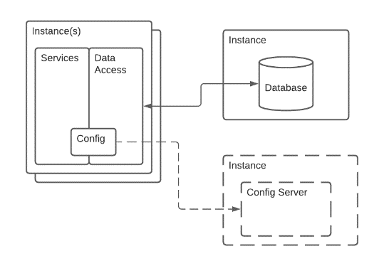

> "Simplicity is the final achievement. After one has played a vast quantity of notes and more notes, it is simplicity that emerges as the crowning reward of art."
**Frederic Chopin**

# What Is Simplicity

Simplicity, noun

1.  the quality or condition of being easy to understand or do.
2.  the quality or condition of being plain or uncomplicated in form or [design](design.md){:target="_blank"}.

Simplicity as a function of an enterprise, business context or design is difficult to fully define especially in modern complex businesses, projects and [ecosystems](ecosystem.md){:target="_blank"}. The goal is to make our environments 'as simple as possible but no simpler', though Einstein's actual quote was much more complex.

Simplicity can be thought of in two ways based on its definitions. Easy to understand is itself somewhat complicated as an expert might find something easy to understand that is complicated and confusing to a novice and a layman. This notion that something is easy to understand

# Why is Simplicity Important to Architects

The simplicity concept is noted here as a measurement of business success. If two businesses of the same size, with relatively similar [business models](business_models.md){:target="_blank"} compete in a marketplace, and with similarly skilled staff, the one with more simplicity should be able to compete better. The reasoning behind this is that they will be able to respond to market demands faster and that they will have fewer errors/issues in satisfying customers.

In this article, simplicity, then, is not just the lack of complexity but a way of looking at a system of people, process and technology to optimize it for understanding, action and form or design.

## Simplicity as a Basis for Competition

Corporate strategy seeks to enable experimentation in [business models](business_models.md){:target="_blank"}, [value streams](value_streams.md){:target="_blank"}, and customer delight while minimizing change impact on the corporate landscape. For example, Amazon's offer of a Prime Video service was a radical shift requiring significant investment across the company and created a great deal of complexity in terms of business model. This level of separation between models, shipping and movie production, are not necessarily compatible. While Amazon's profitability holds the two together a less profitable company would find this kind of business model complexity difficult to maintain and stay competitive.

Simplicity for competitive purposes would describe a business model which explores surrounding ecosystem business models, [innovations](innovate.md){:target="_blank"}, and [customer journeys](customer_journey.md){:target="_blank"} which augment or extend the primary model of the company while enhancing competitive stance. For example, many air travel companies offer package deals for cars and hotels through partnerships. While today this is not new, at the time it was created it more attractive deals to customers who flew on the airline. Similar examples of partnerships and innovation in business models provides background on targeting the simplest business model which can compete and innovate.

## Simplicity as a Protection Against Technical Debt

[Technical debt](technical_debt.md){:target="_blank"} can limit the competitiveness, effectiveness and longevity of a product within the enterprise. There are numerous areas where a simplicity goal as a principle of solution architecture and system delivery will protect against technical debt.

## Modernize or Die

Targets in simplicity will impact the prioritization of modernizing applications which may be moving towards obsolescence.  Technical debt which accrues due to inability to fund or prioritize modernization efforts, especially those that do not deliver the same level of functionality as the original system, are often the result of a poor understanding of the value of simplicity in critical enterprise systems. It is necessary to describe the value of modernization in terms of simplicity to help identify the impacts of continuous modernization.

## New Might Not Be Better

The opposite pattern to modernization is the acquisition of new technology solutions for existing patterns without thought as to the complexity created by the resulting proliferation of [design patterns](../patterns/architecture_pattern_repository.md){:target="_blank"}, technologies in production and spread of skills and maintenance required. Curbing the desire to implement the 'bleeding edge' of frameworks, libraries and tools may be the best outcome an organization can achieve.

## Everything and the Kitchen Sink

Most often this arises when the solution becomes bloated with features that are not used or are used very seldom. These features then cause the solution teams to invent structural design paradigms which complicate the overall architecture. Thus the system becomes weighed down with complex patterns which may not be needed to provide the most effective solution. By making simplicity a target of architecture output (and the architects themselves in their job description and role) the enterprise can help offset the risk associated with over-designing systems. This serves as a front-line defence against growth in [technical debt](technical_debt.md){:target="_blank"}.

## Simplicity as a Set of [Objectives](objectives.md){:target="_blank"}

There are many papers on understanding code complexity in traditional code bases, however modern architecture has significantly higher numbers of connections, complications, integrations and quality attribute concerns than a single code base. Consider microservices as built by a set of 15 different teams, with significant interdependencies. Simplicity in this scenario must be looked at from a higher vantage point than a single team.

In addition to code, technology dependencies and tools for delivery, there are objectives related to customer, employee, benefits realization and business capabilities which are also key objectives in simplicity. We may deliver solutions which underscore business processes which can be simplified themselves. To achieve simplicity it is necessary to understand deeply the relationship between business capabilities and technical services.

To do this, the architects create a set of objectives using measures defined by areas of optimization, elegance and conformance. This target state is as simple as possible to achieve the value outcomes needed and no simpler.

# Approaches to Simplicity

Simplicity and Complexity/Structure go hand in hand. The goal of this article is to present simplicity as an enterprise and management level objective while the Complexity and Structure article describe how architects should specifically address complexity in their work.

## Create a Simplicity/Complexity Counter for Architecture(s)

There are many many papers on understanding code complexity in traditional code bases, however modern architecture has significantly higher numbers of areas where complexity can hide. Thus it is important

| Area | Description | Types of Measures |
| --- | --- | --- |
| Cyclomatic | The number of pathways through a code base or set of services during execution. | Cyclomatic Complexity |
| Delivery | The method used to create code and deploy to production. | DevOps, Development Lead Times, Code Commits, Production Releases per Month/Year, Framework Utilization |
| Integration | Service dependencies internal and external and their level of coupling. | Service interface contracts, service SLA, service interdependence, transaction telemetry |
| [Stakeholder](stakeholders.md){:target="_blank"} | Stakeholder power/interest and effectiveness of stakeholder understanding and management | Stakeholder management plans, well understood roles, stakeholder communication |
| [Quality Attribute(s)](quality_attributes.md/){:target="_blank"} | Cross cutting concerns such as security and performance. | Measures by type of quality attribute, up-time, mean time to recovery, systemic performance, infrastructure dashboards |
| Domain | [Value stream](value_streams.md){:target="_blank"} or business area including conceptual or IP based complexity | Domain dependency visualizations, conceptual complexity (ex. DNA modifications vs retail store), [business capability](business_capabilities.md){:target="_blank"} measures, business process measures |
| Political | Simplicity in communication and [culture](culture.md){:target="_blank"} related to human politics. | Architect stakeholder maps with assessments of complex political landscapes |
| Information | Data, Integration and Usage related to complexity of the information stored and used regularly in an organization. | Domain driven design tools, data interdependency, information utilization, information ownership grids |

Another area to look at is Fitness Functions as defined by Neal Ford, Rebecca Parsons and Patrick Kua in their [book on Evolutionary Architectures](https://www.thoughtworks.com/books/building-evolutionary-architectures){:target="_blank"}.

## Think About Simplicity in Business Terms

Beware thinking about simplicity in terms of minimum solution design from a technology perspective alone. Complexity in software, teams and delivery often mirror the complexity inherent in an organization structure, politics or business domain.

The architect team should be able to visualize the simplicity of a set of systems (people, process and technology) and weight or summarize a simplicity rating. This goes further than simply looking for a lack of complexity into targeting innovation around making business outcomes equivalent by using drastically different business processes or capabilities to deliver. This is not an architect owned activity, but should be a consistent dialog with architects and stakeholders.

## Simplicity is Based on Perspective

Simplicity isn't a single perspective, as it is based on the perspective from which the design or system is viewed. Consider the following example microservice based design. The architect is considering whether to add a configuration server to the design.

Would adding a configuration server to the design make things more simple? When looked at through a lens of changing configuration and its impact on the infrastructure the answer would easily be yes. So from a modifiability perspective the proposed design is more simple or less complex. However, the design obviously now holds a new piece of software that needs to be maintained, updated and managed. In addition to provide for high availability there would need to be multiple instances in fail-over regions, so from an operations perspective the design is clearly much more complex.

So how does the architect decide whether adding the configuration server would be a benefit? The answer is to create a measurement of simplicity based on the benefits of adding the service versus the costs. In this case it would be simple enough to determine a figure for the difficulty caused by having to shut down all services for configuration change, the possible risks of using configuration files over a service and the frequency of changes. Comparing those to the operational overhead of managing a basic configuration service would likely result, barring unforeseeable complexity in the environment, in an affirmative decision that adding the service would be simpler.

|   | Config File | Config Server |
| --- | --- | --- |
| Operational Cost (in hrs) |   |   |
| Operational Cost (in money) |   |   |
| Development Cost (in hrs) |   |   |
| Infrastructure Complexity |   |   |
| Software Complexity |   |   |
| Configuration Delta |   |   |
| Risk of Bad Configuration |   |   |

*Relationship to Tech Debt in terms of legacy

# Key Considerations for Simplicity

## Velocity is Related to Simplicity

[Velocity](velocity.md){:target="_blank"} of delivery of value is a critical competitive advantage in todays organization and enterprise. But velocity is impacted by the amount of change required to deliver value to the market. With complex organizations weighed down by technical debt and complex dependent business processes supported by large systems and services, it is difficult to change direction quickly. Thus simplicity has a direct impact on velocity.

## Simple Solutions Become Complex

It is humorous to note that SOAP is an acronym that stands for SIMPLE object access protocol since it has gotten the reputation of being a horribly complex method for integrating systems. This is true of all aspects of modern solutions. They may start out very simple and elegant but grow in complexity as the demands and the vectors of requirements, value, capabilities and quality attributes grow over time. This accumulation of system design responses creates the monstrous big ball of mud style of architecture over time. This should be seen as a correct response in architecture since it is so utterly predictable without robust measures in place for management of technical debt, clear measures of simplicity, consistent use of anti-complexity design methods and innovation in business capability delivery. That is a tall order for most organizations without significant investment in architecture approaches.

## Create a Simplicity Metric for Architecture Engagement

And architecture engagement model should have a simplicity metric measured against the architects involved in the practice. Each member of the practice including extended teams should be measured against this both individually as well as in an organization visible dashboard as it is a clear indicator and enabler of the other more business outcome visible measures.

## Humans Create Complexity on Purpose

A team should be fully aware that complexity is always associated with human systems as they are inherently complex systems themselves and thus cannot help but create complex outcomes. By saying they create complexity on purpose it is not an indictment but instead a measure of culture, value management and communication. The symptomatic aspect of complexity isn't one the architects alone can hope to conquer but instead should make regular attempts to communicate and integrate into an ongoing value management discussion. Introducing simplicity measures gives the organization something to strive towards. In addition, the world itself is constantly evolving and complex thus systems are a reflection of this complexity. Instead of seeing it as a negative, the team should be aware of this and use whatever tools necessary to create a constant attempt to reduce complexity while retaining value.

# References and further reading

**Enterprise Complexity Management**
[Enterprise Complexity Management](https://informationwithinsight.com/2018/01/08/enterprise-complexity-management/){:target="_blank"}

[https://architectelevator.com/architecture/it-complexity/](https://architectelevator.com/architecture/it-complexity/){:target="_blank"}

[https://www.researchgate.net/publication/326845076_An_Enterprise_Complexity_Model_Enterprises_Organizational_Systems_and_Dynamic_Capabilities/link/607aa298881fa114b40a18a7/download](https://www.researchgate.net/publication/326845076_An_Enterprise_Complexity_Model_Enterprises_Organizational_Systems_and_Dynamic_Capabilities/link/607aa298881fa114b40a18a7/download){:target="_blank"}

BTABoK 3.0 by [IASA](https://iasaglobal.org/) is licensed under a [Creative Commons Attribution-NonCommercial 4.0 International License](http://creativecommons.org/licenses/by-nc/4.0/). Based on a work at <https://btabok.iasaglobal.org/>