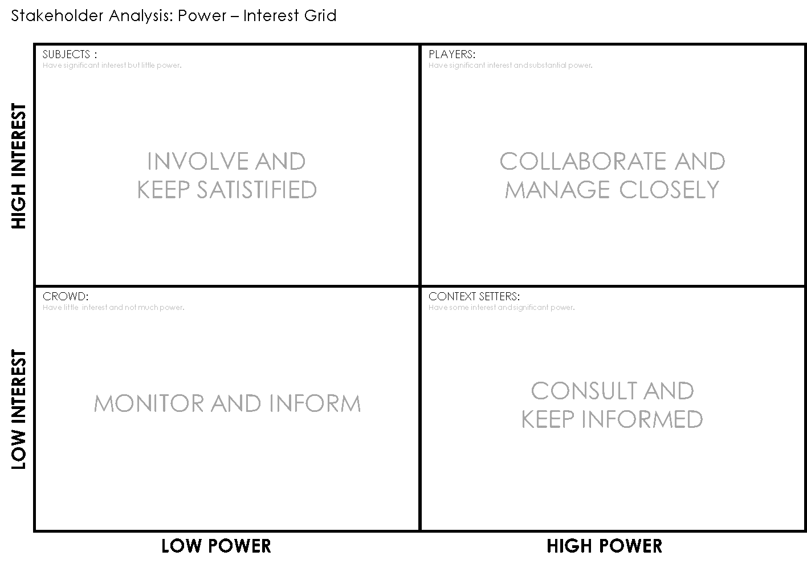
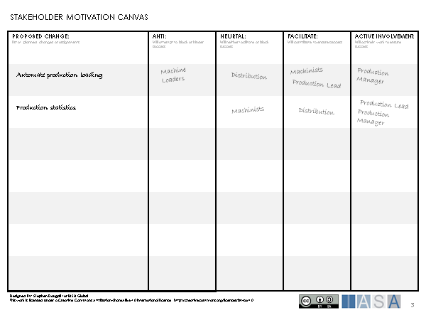
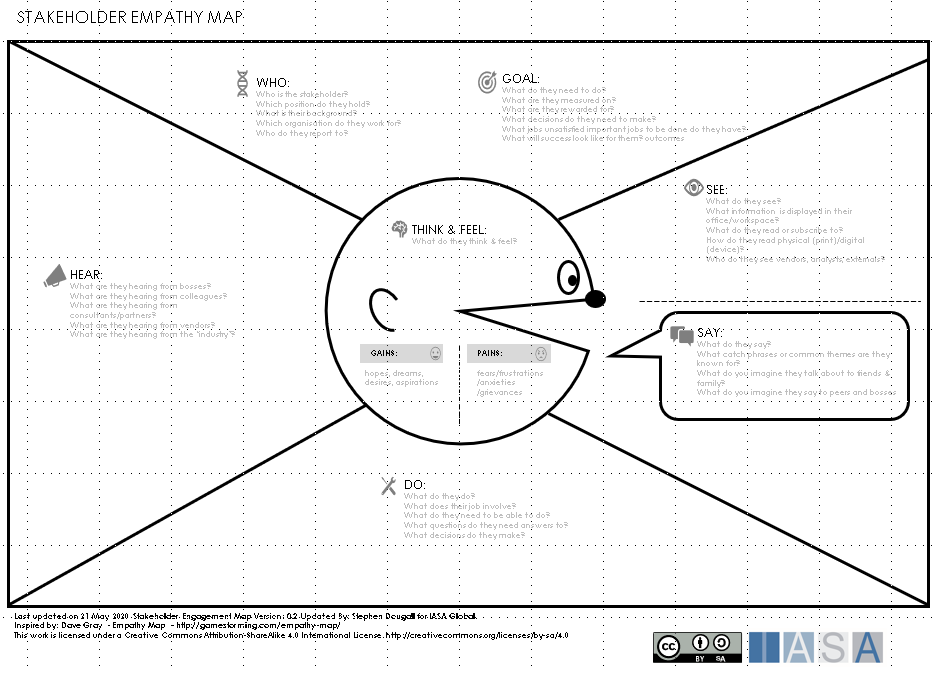
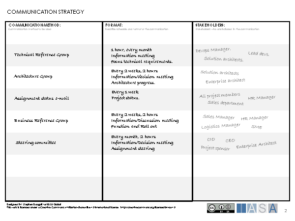

> "A person, group or organization that has interest or concern in an organization."
**www.business dictionary.com**

# What are Stakeholders

A stakeholder is a person or organization which as an interest or
concern in a given [objective](objectives.md){:target="_blank"}, [business case](.\businesscase.md){:target="_blank"} or
[assignment](assignment.md){:target="_blank"}. Stakeholders have a vested interest in the
success of assignments, which can affect the stakeholder positively or
negatively. A stakeholder may use their influence to promote and help an
assignment succeed, or hinder the success of an assignment if the
resulting architecture is negative for the stakeholder. Some
stakeholders may play an active part by contributing to the initiative,
while other stakeholders play a more passive role.

Examples of typical stakeholders are customers, executives or company
departments.

# Why are stakeholders important

Stakeholders are important as they influence the progress of an
[assignment](assignment.md){:target="_blank"} and in some cases can make the difference
between success and failure. Different stakeholders have varying degrees
of influence and needs for information.

*"You can please some of the people all of the time, you can please all
of the people some of the time, but you can't please all the people all
of the time"* - **Poet John Lydgate as made famous by Abraham Lincoln**

Managing stakeholders can take a lot of effort, and where an assignment
has a great many stakeholders this can be very challenging. Ensuring
that influential and key stakeholders are satisfied, substantially
increases the chances of an assignment's success.

Having key stakeholders as a positive influence on an assignment can
deliver significant advantages such as, access to funding, availability
of key personnel or increased priority over other initiatives.

In some cases, a stakeholder may be key, but is affected negatively by
the assignment or the proposed architecture. For example, when replacing
a legacy system, the owner of the legacy system may be key for migrating
data, however migration to a modern system may leave the stakeholder
with less power or budget. In this case it is important to find ways to
mitigate the negativity, perhaps by making compromises in the
architecture, such as a favorable re-organization or a change of roles.

# Stakeholders Approach

The following are some key principles which can help in managing
stakeholders.

## Opinions matter

Stakeholders will want to influence the direction of an assignment in
their own favor, and one way of doing this is sharing their opinions
with the architect. Taking opinions on-board from stakeholders can
create a "buy-in" for the assignment, and this can increase the
stakeholder's interest in the assignment succeeding.

Stakeholders may have conflicting opinions and with many stakeholders it
is challenging to give all opinions the same attention. Choices may have
to be made as to which opinions are satisfied and which are given less
attention. This is where it is important to know which stakeholders hold
the most favor for the assignment (see The Power-Interest Grid).

## What drives the stakeholder

Interest or concern from a stakeholder is born from a driving factor.
The driving factor is the force which drives the stakeholder interest
and influences decision making. For individual persons driving factors
may be: prestige, power, stability, skills advancement. For an
organization the driving factors can depend on the organization culture
and the type of business the organization conducts. Examples of driving
factors for organizations are: growth, increase budget/sales, access to
skills, compliance, competitive advantage.

Knowing what drives the stakeholder makes it easier to promote an
assignment to the stakeholder, and show how the stakeholder can gain
value from the architecture. The driving factors of the stakeholder give
a basis for assessing the stakeholder interest for the various aspects
of the architecture. Understanding what drives the stakeholder makes it
easier to promote an assignment and the architecture, as well as showing
how the stakeholder can gain value.

## Managing stakeholders requires balance

Stakeholders have complex relationships with each other, and to gain
influence and interest from a stakeholder trust is key. This can be a
delicate balancing act as a commitment to one stakeholder may have a
negative effect on the relation with another stakeholder. Negotiation,
diplomacy and conflict management are useful skills in achieving balance
in the architecture and maintaining the trust of the stakeholders.

The available effort for managing stakeholders is not limitless, and
focusing on a narrow band of stakeholders may keep a few important
stakeholders satisfied. However, this can lead to problems with the
broad spectrum of stakeholders who may lose interest in the assignment
or start a negative trend towards the architecture. It is therefore
important to find the right balance in managing the effort expended on
stakeholders

## Identify key dependencies

In some cases, specific stakeholders are critical for the success of the
assignment. It may be the case that a stakeholder holds special skills,
resources or is responsible for other projects/products which the
assignment is dependent on. Identifying the key dependencies between
activities in the assignment and such stakeholders is essential to the
success of the architecture.

## Know the audience

When communicating the architecture, it is important to ensure that the
architecture is presented in a way which the stakeholders understand.
Stakeholders often come from different backgrounds and have different
interests in the architecture. For example, some stakeholders may have
an interest in the technical perspective of the architecture, while
other stakeholders are interested in the business perspective. Selecting
the right architecture [viewpoints](views.md){:target="_blank"} for the right
stakeholders ensures that the information is relevant and increases the
understanding of the architecture.

## Shareholders Over Stakeholders

Stakeholders may have strong opinions but it is the responsibility of
the architect to challenge these opinions and select an appropriate way
forward. Opinions and proposals all need to be tested with different
scenarios and situations to gain the best outcomes. This provides the
architect with the motivation for a proposed change, and gains the
respect of the stakeholders rather than simply following stakeholder
instructions.

# Managing the stakeholders in practice

Managing stakeholders in practice is about maintaining the right balance
in stakeholder motivation with reference to the objectives of the
architect. The following sections provide a description of some tools
which can help the architect analyze stakeholders and decide how best to
manage stakeholders.

These can be used in many different scenarios. The diagram above shows
when these tools can be used to support the management of stakeholders.

When working with stakeholder management we can consider our analysis of
stakeholders on a scale of general to detailed, where the general end of
the scale considers a broad scope of stakeholders and the detailed end
of the scale considers individual stakeholders. In the following
section, tools are provided for management of stakeholders from general
analysis through to detailed.

After analysis, actions need to be taken to actively manage the
stakeholders. The communication strategies tool provides a way for
planning the action.

# **Identifying** and prioritizing Stakeholders

The first step in stakeholder management is to identify the stakeholders
in the assignment or the proposed architecture. A good way to start
identifying and prioritizing stakeholders is to use the Power-Interest
Grid. The motivation behind identifying and prioritizing the stakeholder
is that it gives a basis from which the architect or the team can begin
to plan how to manage the stakeholders.

The Power-Interest Grid can be used either with a team in workshop
format or individually. Working in workshop format will probably provide
better results as a team can identify a broader range of stakeholders
and give a collective view of where the stakeholders belong on the grid.

When working in workshop format the Power-Interest Grid should be pinned
to a wall or drawn on a whiteboard. The workshop should have a focus
context for the stakeholders, such as an assignment or even a particular
aspect of the architecture. All participants should be well versed in
the context before starting the workshop. The following method can be
used with participants in workshop format.

**Step 1: Identify the Stakeholders**

Handout sticky notes to the participants and ask them to write down all
stakeholders they can think of concerning the given context (one
stakeholder per sticky note). This exercise should be time bound,
usually 10-15 mins. The participants should do this without conferring
with each other.

**Step 2: Prioritize the stakeholders**

Ask each participant to place the stakeholders on the Power-Interest
Grid according to the perceived interest and power of the stakeholder.

**Step 3: Reach consensus**

Participants then discuss the stakeholders and adjust them so they fall
into the right place on the board. It may be that several participants
have placed the same stakeholder in different places on the board, or
that there are different opinions about the priority of stakeholders on
the board. Reasons for the prioritization can be discussed and
stakeholders adjusted appropriately to positions on the board which the
participants agree on.

The result of the workshop is that stakeholders can be prioritized into
the following categories:

- **Crowd** - these are stakeholders which have a low interest and a
  reduced ability to influence the context. It is recommended to keep
  these stakeholders informed with general information and
  periodically monitor that their needs are fulfilled.

- **Subjects** - these are stakeholders with a high level of interest
  but with little power to influence the context. They need to be kept
  informed of any major issues and their concerns should be listened
  to. They can be a great help in promoting the context to other
  stakeholders.

- **Context Setters** - these stakeholders have a high degree of power
  but a low level of interest. They should be kept informed with
  relevant information and may be consulted about significant
  decisions as they can help with their influence.

- **Players** - these stakeholders are high priority and are the key
  players in the given context. They require close management and
  should be actively involved in the context. They hold the power to
  influence the context and require regular information updates.

Once the stakeholders are prioritized a communication strategy can be
developed to help satisfy the stakeholder information needs. Important
stakeholders may be selected for further analysis using tools like the
Empathy Map or the Stakeholder Motivation Canvas.

# Stakeholder Ecosystem

No stakeholder is an island, the stakeholders associated with an
assignment or architectural change have relationships which are often
complex. The stakeholder ecosystem describes how stakeholders are
related to each other and the nature of the relationship. Within the
ecosystem the architect team can also be considered as a stakeholder.

The stakeholder ecosystem is important for the architect as it provides
an understanding of how a change in stakeholder motivation affects other
stakeholders, and can also provide a way to assess how to motivate
groups of stakeholders. For example, if we have a stakeholder who is
held in high regard by three other stakeholders, then positively
motivating that stakeholder will likely motivate the other three
stakeholders too. It is also likely that these stakeholders may work
well together in a reference group.

The Stakeholder Ecosystem Canvas provides a way to analyze the
stakeholder ecosystem and propose actions which can be taken to manage
stakeholders. This canvas can be used as an individual tool or with
teams in workshop format. The following method can be used in workshop
format:

**Step 1: Decide the scope of the ecosystem**

Before starting the workshop, the participants should agree on the scope
of the ecosystem. The scope may be, for example, an assignment, an
architectural change or a particular organization. Defining the scope
will ensure that focus is placed on a specific set of stakeholders.

**Step 2: Decide the context of the ecosystem**

The context of the ecosystem is described in the rings on the canvas. In
the example canvas the chosen context is "Power-Interest" taken from the
Power-Interest Grid, this provides a visualization of the importance of
the stakeholder. However, the canvas can be used in other contexts, such
as organizational, roles-based or motivation categories (see Stakeholder
Motivation).

**Step 3: Place the stakeholders in the right context**

Ask the participants to write down the relevant stakeholders for the
scope on sticky notes. Then each participant should place their
stakeholders on the canvas in the appropriate context category. If
participants have placed the same stakeholder in different context
categories the participants should discuss and agree upon the correct
context category for the stakeholder.

**Step 4: Map the relationships between the stakeholders**

After placement of the stakeholders, each participant should take turns
in connecting the stakeholders with relationship lines. At this point
the participants only need to indicate that they are aware that a
relationship exists between stakeholders.

**Step 5: Assess the relationships**

Once the relationships have been drawn on the canvas the participants
should first make a simple assessment of the relationships. For each
relationship on the canvas an assessment can be made from each
stakeholder perspective. A stakeholder may have a positive relationship
(+), a negative relationship (-) or a neutral relationship (o) to the
other stakeholder. This is indicated by placing these symbols next to
the stakeholder end of the line. Up to three + or -- symbols may be used
to indicate the degree of the positivity or negativity. For example, the
Sales Team and the Marketing Team in the example canvas have a really
good relation. However, the CIO and the CEO have a negative relation,
where the CIO is more negative than the CEO.

Once the assessments have been made the participants can also add text
to the relationship which explains the nature or reasoning behind the
assessment. For example, the CEO may have cut the CIO budget, or they
simply just do not get along.

**Step 6: Agree on actions to be taken**

Once the relationships have been assessed the participants have a clear
view of the stakeholder ecosystem. The participants can discuss ways of
managing the stakeholders and consider the effect of actions on the
ecosystem. From the example canvas we may consider: Should the architect
support a CEO proposal? Are there compromise actions to keep both CEO
and CIO happy? Can the Project X Sponsor act as a mediator?

Participants can note actions which should be taken on the canvas with
respect to the agreed scope.

# Stakeholder Motivation

Stakeholder motivation helps in understanding the status of stakeholders
in respect of a particular set of proposed changes. This can be used to
understand how stakeholders position themselves in relation to a
portfolio of assignments but it can also be used to assess how
stakeholders will react to proposed changes in the architecture, and
assess if these changes are feasible.

When working with a team the Stakeholder Motivation Canvas can be used
in a workshop to help map out the stakeholders and their positioning to
proposed changes. The following method can be used:

**Step 1: Set the scope of change**

Before calling the workshop agree on the general subject for change with
the participants. Pin the Stakeholder Motivation Canvas to the wall or
use a whiteboard. Then list the proposed changes associated with the
subject for change. Gain general agreement from all participants that
this is the scope of change.

**Step 2: Identify the stakeholders associated with the changes**

Give each participant a set of sticky notes and ask them to write down
the stakeholders associated with the proposed changes. A single
stakeholder can be associated with more than one of the proposed
changes. Also ask the participants to think about how the stakeholder is
currently positioned to the proposed change.

**Step 3: Position the stakeholders**

For each proposed change ask the participants to place the stakeholders
on the canvas in the motivation category most suited to the current
position of the stakeholder. In some cases, different participants will
place the same stakeholder in different categories. The participants
should discuss the positioning and eventually agree on the most suitable
position.

The result of the analysis can provide a basis for selecting which
proposed changes are most acceptable for the stakeholders, or an
indication of which stakeholders require attention to make a proposed
change more acceptable. Stakeholders which require attention may be the
subject for further analysis, for example, using an empathy map.

# Empathy Map

Sometimes the architect may find that certain stakeholders have great
influence over the assignment and that it is particularly important to
gain positive motivation from the stakeholder. In other cases, a
stakeholder may be negative to the assignment and analysis is required
to assess how the stakeholder can be motivated to a positive position.

An empathy map is used to gain deeper insights into a particular
stakeholder so the architect can empathize with them and better
understand their position. This analysis of the stakeholder will give
the architect a better understanding of how to engage and motivate the
stakeholder.

The empathy map can be used as an individual or by a team of
participants. The following method can be used:

**Step 1: Gather information**

Gather factual information about the stakeholder:

- **Who** -- a description of the stakeholder, role, interests,
  organization.

- **Goal** -- a description of what the stakeholder is required to do,
  objectives, targets, successful outcomes.

**Step 2: Set the context**

Set the context by asking the stakeholder a question often related to
what are the participants trying to achieve. For example, "Why should I
replace the business system?" or "Why should I support the new data
center?".

**Step 3: Put yourself in the stakeholder's shoes**

Using the context, the participants can try to place themselves in the
stakeholder position and consider the following:

- **Think and Feel** -- what does the stakeholder think and feel about
  the context? Worried, happy, excited, defensive.

- **Hear** - what does the stakeholder hear about the context? For
  example, from friends, colleagues, managers.

- **See** -- what does the stakeholder see about the context? Written
  or visual communications. Work environment.

- **Say** - what does the stakeholder say about the context?
  Positively promote, voice concerns.

- **Do** - what does the stakeholder do about the context? Active
  involvement, try to block, positioning.

- **Pains --** what does the stakeholder stand to lose from the
  context? Large investment, loss of skills/personnel, damaged
  relationships, risk.

- **Gains** - what does the stakeholder stand to gain from the
  context? Prestige, financing, knowledge, favors, power.

The result of working with the empathy map is in the process, being
placed in the stakeholder situation with the given context leads to a
deeper understanding of the stakeholder. This can be used to assess how
to engage the stakeholder and positively motivate them. This may involve
a re-assessment of the communication strategy or perhaps change
proposals which influence the stakeholder positively.

# Communication Strategies

Stakeholders have different needs for information, and the architect
will prioritize stakeholders differently. It is important that the
stakeholders receive information that satisfies their needs, and at the
same time the architect distributes effort effectively across the
stakeholders.

A communication strategy is used as a plan to organize the distribution
of information and plan consultation with stakeholders. A communication
strategy can be organized into a number of communication methods. The
communication method provides a channel for providing information and
consultation to stakeholders. Examples of different communication
methods are:

- Reference groups

- Steering groups

- Re-occurring meetings

- E-mail, newsletters

- On-line conferences

A communication method also has a format. The format may describe the
subject of the communication, how often the communication occurs and
communication type (information, consulting, decisions\...).

Each communication method will also have a list of stakeholders whose
needs will be fulfilled by the communication method. The same
stakeholder may be present in a number of communication methods.

The canvas above shows an example of a communication strategy. There are
different ways to work with this canvas, sometimes the stakeholders may
be filled in and then communication method defined, or some
communication methods can be defined first and then stakeholders
assigned. The priority of the stakeholder is an important factor in
determining the communication methods to be used.

Once the communication strategy is complete it can be implemented and
then revisited as the stakeholder ecosystem changes. The communication
strategy gives a practical plan for managing stakeholder communication.

# References and further reading

**Dave Gray - Empathy Map**
[Dave Gray - Empathy Map](http://gamestorming.com/empathy-map/){:target="_blank"}

**TOGAF 9: Stakeholder Management**
[TOGAF 9](https://pubs.opengroup.org/architecture/togaf9-doc/m/chap21.html){:target="_blank"}

BTABoK 3.0 by [IASA](https://iasaglobal.org/) is licensed under a [Creative Commons Attribution-NonCommercial 4.0 International License](http://creativecommons.org/licenses/by-nc/4.0/). Based on a work at [https://btabok.iasaglobal.org/](https://btabok.iasaglobal.org/)
