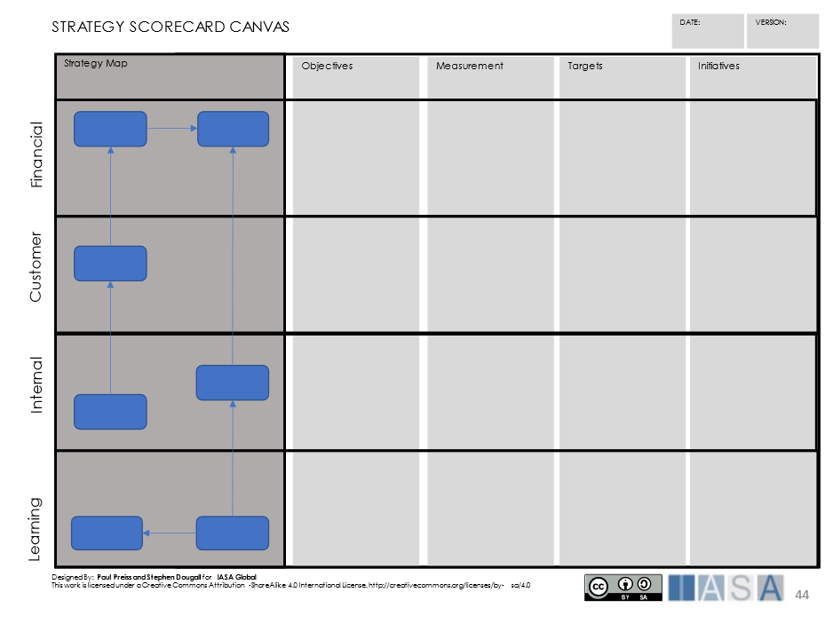
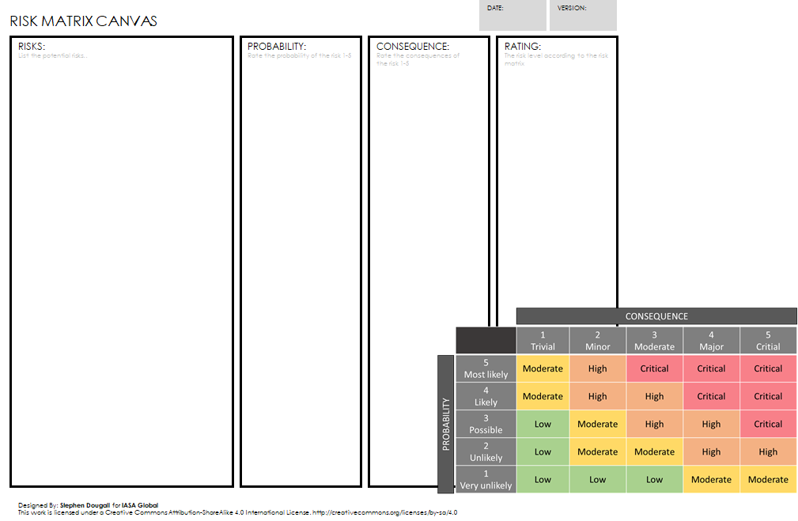
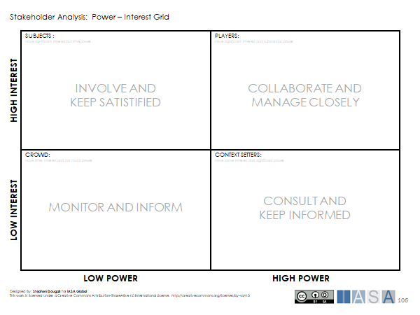

> "A detailed plan for achieving success in situations such as war, politics, business, industry or sport, or the skill of planning for such situations"
**definition of Strategy, Cambridge Dictionary**

# What is strategy

A strategy provides a guide for navigating towards a successful outcome.
Strategies can be created for different scopes, domains or contexts
within an organization, for example, corporate (the whole organization),
business unit (part of the organizational structure) or capability
(specific line of business).

All strategies are different, and depending on the subject of the
strategy, will require input from different strategic perspectives. In
the book "Fruition" by Chris Potts, the following four perspectives are
identified:

- **Environmental** - external context, legislation, regulation,
  politics (outside the organization)

- **Organizational** - organizational structure, culture, internal
  politics

- **Operational** - internal processes and operations

- **Technical** -- specifications, products/services and technologies

When working with a strategy it is useful to evaluate which of the
perspectives are important, this will help to secure people with the
right skills set for working with the strategy.

A key factor of building a strategy is creating objectives and an aim,
as well as the tactics required to succeed. In this article the specific
focus is placed on creating a Business Technology Strategy.

# Why we need a strategy

Very simply, if there is no plan, there is no direction or coordination.
A strategy most importantly provides common aim for all the stakeholders
concerned and makes sure they are all pulling in the same direction. It
connects the vision of the organization to a set of practical and
coordinated objectives, which contribute to achieving success.

There can be a number of different strategies in play in a single
organization, and aligning strategies helps the organization to drive
the corporation, business units and capabilities in the same direction,
optimizing value. For example, there may be a corporate strategy,
business technology strategy and sales strategy in an organization. The
business technology strategy and sales strategy may be aligned with the
corporate strategy. This alignment allows objectives to cascade from the
corporate strategy into the business technology strategy and the sales
strategy.

The strategy provides a measurable target by which the organization can
measure progress. This is important as it allows corporate management to
measure the effect of execution, and for the members of the
organization, who gain motivation from a culture of working towards a
common goal.

# Strategy Approach

## Strategy is everybody's business

In order to effectively execute a strategy, the members in the
organization must be committed to the strategy. This means that the
strategy must be clearly communicated to the organization to get
everyone pulling in the right direction. This can be a delicate exercise
if details in the strategy are sensitive, especially if exposed to
competitors. Therefore, it is important to plan how strategic objectives
are communicated, and different strategies in the organization work
together.

## Generic strategies

According to Porter (Michel Porter - 1980) there are three generic
strategies, Cost Leadership, Differentiation and Market Focused. Each of
these generic strategies flourish in a particular scenario and culture.
A strategy, based on one of the generic strategies, which is not in-line
with the culture of the organization, or the nature of the market, is
often very difficult and time consuming to execute. Failure to consider
this alignment may result in an unsuccessful strategy.

## Make the scope clear

Before starting work with a strategy be clear on the scope. For example,
is the strategy aimed at the whole corporation, the sales department or
the IT capability. The scope has an effect on the perspectives required
(environmental, technical, operational, organizational) to develop the
strategy, which in turn helps to determine the skillsets required from
the personnel on the team.

## Numbers matter

In order to evaluate the strategy, there is a need to quantify
investment and expected value. This means that an important part of the
work with strategy is to assess financial viability. While the actual
numbers may not be directly visible in the strategy, they are required
to support and motivate initiatives and objectives. When the strategy
goes to review, this will help to answer the likely questions of *"What
will it cost?"* and *"What is the benefit?"*.

## Validate cause and effect

When working with a strategy, assumptions are made on the "cause and
effect" relationships between the objectives. For example, "**greater
customer satisfaction** results in **increased profit**". However, in
the example, there is perhaps no proof that greater customer
satisfaction does lead to increased profits, and this can lead to a
failure of the strategy. To avoid making false assumptions regarding the
cause-and-effect relationship of objectives, it is important to validate
these relationships. Techniques such as fishbone diagrams (created by
Kaoru Ishikawa) can help to validate cause-and-effect.

## Strategy is direction over detail

Strategy provides a collective direction for an organization. It aligns
an organization, and all it's working parts so that they travel in the
same direction. When working with strategy it is important not to get
bogged down in detail. Going into too much detail results in planning
operationally rather than providing strategic direction. A strategy with
too much detail may be difficult to communicate broadly across an
organization, and may be difficult for stakeholders at different levels
of the organization to understand.

## IT-Architects influence strategy

IT-Architects have a unique perspective within an organization which
makes them a valuable influencer when working with strategy. Since
technology touches almost all aspects of a business, IT-architects have
a view of the organization and the business, which is somewhat unique.
For example, IT-architects may support the sales, marketing, logistics,
production and financial capabilities of an organization which allows
the architect to view the business from many perspectives. This is a
rather unique and valuable viewpoint when working with a strategy. In
addition, knowledge of technology allows the architect to see
opportunities and threats that other stakeholders may miss.

# Working with Business Technology Strategy

## The Strategic Aim

Every business or organization has an idea or vision of the future. The
description of this vision may be rather abstract, but it is extremely
important as it provides a common aim. The vision is often expressed as
a short textual statement, providing a description of what is to be
achieved and why.

For example:

1. *"Company X is an established provider of flat sheet steel
   throughout Europe and is a primary supplier to the automobile
   industry."*

2. *"The logistics department will provide the company with an
   exceptional service which can ensure delivery of goods to all
   customers in the UK within 2 days."*

These statements give an idea of what is to be achieved, but in order
for them to be used in practice, it is often not enough with a simple
statement. Instead, they need to be refined and expressed in a way that
the organization can work with practically, measure progress and
ultimately achieve.

It is also important to consider the scope of the strategy in question,
the strategy may be the focus of a small or large organizational unit,
or it can be for a whole corporation. The objectives of the strategy are
defined for the scope and the process to be used for steering the
strategy may depend on the scope.

One way to work with strategic objectives is to use a Strategy
Scorecard. The strategy scorecard is a combination of the well-known
strategy map and balanced scorecard techniques (based on the method from
the Balanced Scorecard Institute and Strategy Maps by Kaplan, Robert S;
Norton, David P.).

The strategy map provides a way to map out objectives required in order
to achieve the strategic aims, and to show the relationships between
objectives.

 

Objectives are placed on the strategy map in four perspectives:

- **Financial** -- provides a view of the financial objectives of the
  organization

- **Customer** -- provides a view of objectives from a customer
  perspective

- **Internal** -- provides a view of objectives for the internal
  processes of the organization including services and products

- **Learning and Growth** - provides a view of objectives from a human
  resource, infrastructure or technology perspective

The order of these perspectives is important, learning drives the
internal perspective, the internal perspective drives the customer
perspective and the customer perspective drives the financial
perspective. This is true for most profit-making organizations, but in
some cases where profit may not be the focus of the organization (for
example non-profit organizations, public sector), the customer may be
placed as the top most perspective.

Some examples of objectives in these perspectives are listed below:

* **Financial**: "Increase profit margin"

* **Customer**: "Increase customer satisfaction"

* **Internal**: "Improve service quality"

* **Learning and Growth**: "Improve automated support tools"

On the strategy map relations are drawn between the different objectives
to show cause-and-effect. The arrow between two objectives means that
the source objective will provide an effect on the target objective. For
example, "Increase customer satisfaction" will have an effect on
"Increase profit margin".

Once the strategy map is complete, the scorecard can be used to list the
objectives and define the following:

- **Measurement** - this describes how the objective will be measured
  by listing the performance indicators (KPI's)

- **Targets** -- this describes the target value of the objective for
  the performance indicator

- **Initiatives** -- a list of projects/programs which may be executed
  to help reach the objective

The balanced scorecard and OKR's (Objective Key Results) are strategic
tools which share some common concepts. The balanced scorecard method
tends to be used for "big picture" strategies, for example at corporate
level. The strategy is long-term and objectives are perhaps not as agile
as OKR's. OKR's on the other hand, provide an agile way of managing
objectives with a 90-day perspective. While this works well with
objectives at an individual/team level it perhaps lacks the perspectives
and the "big picture" provided by the scorecard.

Both methods are valid ways to plan objectives, and which method an
organization chooses, may depend on the type of business and the culture
of the organization. It is also fully valid for an organization to run
both methods, using the scorecard method for corporate strategy and
using OKR's to guide objectives at lower levels in the organization.
More information about using OKR's and alignment with the Balanced
Scorecard is provided in the [objectives](objectives.md){:target="_blank"} element of the IASA
Engagement Model.

## Tactics

The tactics of the strategy consider how the strategy is to be executed.
This describes methods and techniques which can be used to gain
advantage and achieve success on the journey towards the objectives. The
tactics consider practicalities such as resources, economic factors and
risk assessment.

An important part of defining tactics is to consider:

- **Drivers** - awareness of the external forces which influence the
  strategy

- **Establish principles** - provide a stable foundation upon which
  the strategy is based

- **Discover opportunities** - increase the chances of success by
  identifying opportunities

- **Identify risks** - assess probability and severity, consider
  mitigation

- **Stakeholders and Partners** -- consider the key partners and
  stakeholders which are required in order to achieve success

- **Refine objectives to initiatives** -- given the objectives from
  the target, refine these to a number of strategic initiatives
  (programs, projects) which help to deliver value

The tactics provide the pre-conditions for planning the execution of the
strategy. The following are some tools which can be used to help assess
and define tactics.

## SWOT Analysis

SWOT analysis is a useful tool for identifying strengths, weaknesses,
opportunities and threats, and thus help in defining tactics to ensure
success. The strengths and weaknesses refer to the internal factors, for
example, a strong ability to deliver globally (strength) or long
recruitment process (weakness). Opportunities and threats are external
factors, for example, high demand for medical products (opportunity) or
highly competitive market (threat). The organization has a greater
degree of influence over the internal factors, and seeks to take
advantage, or mitigate the external factors.

The SWOT analysis works best as a brainstorming tool with a team in a
workshop environment. Before beginning the analysis, it should be clear
to all participants what the subject of the analysis is. The objectives
from the Strategy Scorecard may be used to form the SWOT subject.

Participants discuss, brainstorm and place the different strengths,
weaknesses, opportunities and threats on the canvas.

When the participants have completed their analysis, tactics can be
discussed in order to gain advantages from strengths, improve
weaknesses, take opportunities and mitigate threats.

## PESTEL

A PESTEL analysis considers the surrounding environment of an
organization, and the external factors which influence the organization.
The analysis considers the environment from five aspects:

- **Political** - this aspect is concerned with governmental factors
  which affect the organization. Factors such as government policies,
  political tendance and certain regulations and laws.

- **Economic** -- this aspect refers to the economic factors which are
  relevant to the organization. For example, supply and demand of
  product and services in the relevant market sector, or other
  financial concerns such as interest rates, tax or inflation.

- **Social** -- this aspect refers to the social environment around
  the organization. This considers cultural factors, demographics and
  social well-being.

- **Technological** - the technological aspect describes technology
  factors which influence the organization. This includes innovations,
  technology maturity, trends and disruptors.

- **Environmental** - this aspect considers environmental concerns
  such as climate, ethical sustainability, pollution and
  eco-friendliness.

- **Legal** - the legal aspect refers to laws and regulations which
  affect the organization and its products and services. This may
  include laws or regulations regarding, for example, privacy, health
  and safety, security, pollution or employment.

The working method for performing a PESTEL analysis is similar to SWOT.
This works best in a team workshop using brainstorming techniques to add
factors to each aspect. When the participants feel they have identified
all the factors which influence the organization, they can begin to
discuss tactics to mitigate threats and take advantage of opportunities.
This analysis can be used in combination with SWOT.

## ArchiMate Motivation Model

The ArchiMate motivation model provides a way to map the relationships
between stakeholders, drivers and assessments (strengths, weaknesses,
opportunities, threats). Relations between the assessments can be
created to show how they influence each other, positively or negatively.
The model can then be used to define goals, outcomes, principles,
requirements and constraints.

The motivation model is very much an architect's tool for analyzing and
understanding strategic planning but it is not well suited to
stakeholders who are not familiar with ArchiMate.

## Risk Matrix

Assessing and managing risks is central to the feasibility and the
success of a strategy. The level of risk may determine whether a
strategy moves to execution or an alternative strategy is required. The
early identification of risks enables mitigation, which can reduce
probability and impact.

A risk matrix is a useful way to identify risks and rate them
accordingly. Risks are listed in a column, and each risk is given a
probability rating, from very unlikely (1) to most likely (5). A rating
is also given for the consequences the risk will have if it is realized,
from trivial (1) to critical (5).

The values for probability and consequence are used together with the
risk matrix to provide an overall rating, ranging from low to critical.
After rating the risks, an assessment can be made of the strategy and
tactics required to best provide mitigation.

## Power-Interest Grid

The power-interest grid is a useful tool for identifying tactics based
on stakeholders. The grid is used to identify important strategic
stakeholders based on the stakeholder interest and power (or influence).

[Stakeholders](stakeholders.md){:target="_blank"} with a high level of interest and power are
often central to the success of the strategy, and tactics regarding the
management of these stakeholders should be defined. Further information
about the power-interest grid and stakeholder management can be found in
the stakeholder\'s element.

## Planning the execution

The strategic aims and the tactics for the strategy provide the basis
for what is to be achieved, and the context for how it is to be
achieved. The next step is to provide a plan for the execution of the
strategy. Planning the execution of a strategy links to a number of
engagement model elements.

## Investment planning

[Investment planning](investmentplanning.md){:target="_blank"} considers the prioritization of the
initiatives identified as part of the work with the Strategy Scorecard,
these may be formed as business cases. Investment planning evaluates the
costs, benefits, complexity and value delivered from the initiatives and
plans the investment to maximize value delivery.

## Assignment

[Assignment](assignment.md){:target="_blank"} is about planning how the architecture practice
evaluates and assigns resources to business cases. This is important in
strategic planning, to ensure that the architecture practice has the
architect capacity and competencies required to support business case
execution. The architecture practice is an active participant in
strategic [assignment](assignment.md){:target="_blank"} and [investment planning,](investment_planning.md){:target="_blank"} to help ensure the success of the strategy.

## Roadmap

Creating a strategic [roadmap](roadmap.md){:target="_blank"} organizes objectives and
initiatives across a timeline. This puts the strategy in perspective for
the organization and provides the plan for execution. Without the
roadmap it is difficult for an organization to communicate how the
strategy will be executed, and to steer the strategy on a time-based
perspective.

## Customer Journey

An important part of planning a strategy is to understand the [customer journey](customer_journey.md){:target="_blank"}. This will help to plan objectives and tactics by
understanding how the customer interacts with the business, it's
products and services. Understanding the customer journey provides an
insight into value delivery, this helps in deciding which [business cases](business_capabilities.md){:target="_blank"}
to prioritize in investment planning.

## Track and Adapt

Once a strategy is in play, programs and projects start their execution
in order to deliver value, and meet the strategic objectives. As the
execution progresses it is important to track the success of the
strategy and adapt it as required. This is typically performed as part
of a strategic review. Strategic reviews may be conducted in a set
time-cycle, or when a major disruption requires that the strategy be
reviewed.

Organizations working with OKR's normally use a quarterly time-cycle (90
days) for strategic reviews, while strategies at corporate level may use
longer periods, 6 months or yearly. It is useful to time these reviews
so that they coincide with events which provide stable measurements
which are used as KPI's or Key Results. For example, events such as
quarterly financial reports or results from customer surveys.

During the review the tactics and risks are assessed, and adjustments
made to improve performance as required. If the strategy appears to be
failing to meet objectives, it may be the case that the organization
abandons the strategy or re-thinks objectives.

# References and Further Reading

**Strategy Maps**
[Strategy Maps](https://balancedscorecard.org/bsc-basics/what-is-a-strategy-map/){:target="_blank"}

**"Linking the Balanced Scorecard to Strategy.", California Management
Review, 39 (1) - Kaplan, Robert S; Norton, David P. (1996)**

**Archimate Motivation Model**
[Archimate Motivation Model](https://pubs.opengroup.org/architecture/archimate3-doc/chap06.html){:target="_blank"}

**SWOT Analysis**
[SWOT Analysis](https://corporatefinanceinstitute.com/resources/knowledge/strategy/swot-analysis/){:target="_blank"}

**PESTEL Analysis**
[PESTEL Analysis](https://www.business-to-you.com/scanning-the-environment-pestel-analysis/){:target="_blank"}

**Fishbone Diagrams (Ishikawa) - MindTools**
[Fishbone Diagrams](https://www.mindtools.com/pages/article/newTMC_03.htm){:target="_blank"}

**Porter's Generic Strategies - MindTools**
[MindTools](https://www.mindtools.com/pages/article/newSTR_82.htm#:~:text=According%20to%20Porter's%20Generic%20Strategies,Cost%20Leadership%2C%20Differentiation%20and%20Focus){:target="_blank"}

BTABoK 3.0 by [IASA](https://iasaglobal.org/) is licensed under a [Creative Commons Attribution-NonCommercial 4.0 International License](http://creativecommons.org/licenses/by-nc/4.0/). Based on a work at <https://btabok.iasaglobal.org/>
