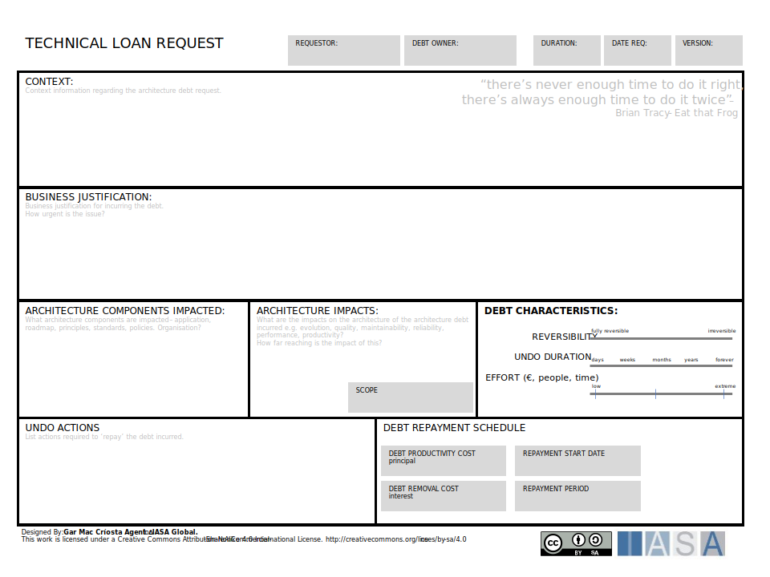

```
title: "Technical Debt"
keywords: 
sidebar: mydoc_sidebar
toc: true
permalink: technical_debt.html
folder: engagement_model
summary: "The term was first used by Ward Cunningham, one of the authors of the Agile Manifesto, who said that some problems with code are like financial debt."
tags:   - value_model
authors:
  - name: "Chris Cooper-Bland"
    role: "Primary Author"
  - name: "Gunnar Menzel"
    role: "Supporting Author"
```

>   "It's OK to borrow against the future, as long as you pay it off." **Ward Cunningham**

# Technical Debt Overview

The concept of Technical Debt is commonly used, and misused, in [agile](agility.md) projects. When used correctly, it can be a valuable way of delivering business value early and avoiding waste; when used badly, it can lead to fragile products which become harder and harder to change. Architects need to understand when to apply the concept effectively to help deliver value to the business.

**A definition:**

>   Technical Debt consists of design or implementation constructs that are expedient in the short term but that set up a technical context that can make a future change more costly or impossible. Technical debt is a contingent liability whose impact is limited to internal system qualities -- primarily, but not only, maintainability and evolvability. **Kruchten, Nord and Ozkaya "Managing Technical Debt" -- 2019**

The term was first used by Ward Cunningham in 1992, one of the authors of the Agile Manifesto, who said that some problems with code are like financial debt. It is OK, and even beneficial, to borrow against the future, as long as you pay it off quickly by refactoring the code. Unfortunately, the last part of the statement gets ignored which has led to technical debt becoming a significant problem in many organisations.

Initially coined from a software development perspective, the concept has evolved to encompass an enterprise perspective, outlining the additional cost and risk for not updating or upgrading existing components such as application components, servers, storage, and network equipment. The commercial implications are substantial, with research indicating that living with technical debt can consume 20-40% of IT budgets on maintaining legacy systems rather than innovation.

There is more information about it here: https://www.agilealliance.org/introduction-to-the-technical-debt-concept/

In recent years the use of the term has exploded everywhere, now all teams seem to talk about technical debt, so it is helpful to extend the original definition to cover the full range of ways the term is used today, which are:

-   **Short term gain over long term pain** -- the original use, to describe the times you do something which will deliver business value now, but, will be more expensive in the long term because it increases complexity or impacts work in the future.
-   **Snowball of Technical Debt** -- an accumulation of the design and development decisions made that product significant negative impact on the maintainability of a software product.
-   **Wither on the Vine** -- as changes are made to a system there is no code or architecture refactoring, so the original decisions, which were fine at the time have become invalidated. Leading to a system that impossible to change.
-   **Legacy debt** -- the technology or approach is old and hard to support. This has become a very widely used meaning for technical debt and is the result of past decisions about upgrading software that negatively affects its future, typically failure to invest or poorly managed risks.
-   **Code Bloat** -- use of unnecessary frameworks or libraries adds complexity and dependencies for little benefit.

These debt classifications or comments are in many ways increasing the problem space, as uninformed debt classification can be as big a problem as not properly calculating debt at all. The appropriate classification and measurement scheme has been adopted and promoted in the BTABoK below.

## The Debt Metaphor

We can look at financial debt management for some interesting guidance on how to cope with technical debt. The debt metaphor is appropriate because taking a shortcut design choice incurs a cost/debt "principal" just like a financial debt, typically the cost to get from the shortcut design to the correct design. It is useful because it helps to understand the problem and provides a mechanism to explain it to non-technical [stakeholders](stakeholders.md){:target="_blank"}.

Like a financial debt, technical debt incurs interest payments in the form of extra effort for future development due to suboptimal design choices. As with monetary debt, technical debt accumulates over time, increasing in complexity and making it increasingly difficult to address; the longer you wait, the more difficult and costly it becomes. There is a choice to keep paying the interest or remove/reduce it by refactoring the shortcut design decision, i.e., paying down the principal. You can't avoid paying the interest; it will continue to be more difficult to maintain the product until the technical debt is removed.

One of the worst aspects is that if you take out more debt without paying off previous debts, the interest payments can become crippling. Multiple short-term suboptimal design decisions will quickly accumulate, resulting in a significantly reduced ability to deliver future features and a decline in quality.

There are problems with the metaphor, generally, when we think of a financial debt, it is structured with a specified interest rate and repayment period. Technical debt is much less controlled, more like borrowing from the Mafia; there can be a demand to repay it at 04:00 am. If we need to make a change that is impacted by severe technical debt, the time and cost to make it will be out of proportion to the size of the change.

In the longer term, technical debt and the tradeoffs an organization will make, will have increased impacts and consequences for the ability of organizations to exploit the technology investments in the future. Industry commentators quote very large numbers for the negative financial impacts of technical debt. The Developer Coefficient from Stripe.com in September 2018 quoted \$300 billion impact on global GDP as the cost of software inefficiencies, of which technical debt was foremost. More recent analysis shows that on average, a developer spends 32% of their time addressing technical debt, meaning that effectively, a developer week only starts on Tuesday afternoon, after having spent 13.5 hours dealing with technical debt.

## Commercial Impact of Technical Debt

Technical debt manifests in three primary areas of commercial impact, each with quantifiable costs that organizations must understand and measure:

### 1. Increased Risk of Outages

Technology has become a critical component of any company, and without IT an organization typically struggles to maintain service levels for particular business services. Modern supply chains and retail operations have become so interconnected that an IT outage can render entire operations inoperable, resulting in loss of sales, productivity, and damage to reputation.

Research conducted by Enterprise Management Associates in February 2024, interviewing 415 IT participants across North America, EMEA, and APAC, found that the average cost of an unplanned IT outage is \$14,056 per minute. IT failures have been shown to result in an average 2% drop in stock prices in the days following the event.

The cost of outages can be categorized into five distinct aspects:

-   **Direct Financial Cost**: Immediate revenue loss
-   **Productivity Cost**: Lost employee productivity during downtime
-   **Recovery and Repair Cost**: Resources required to restore service
-   **Intangible Cost**: Reputation damage and customer trust erosion
-   **Opportunity Cost**: Missed business opportunities during outage periods

### 2. Increased Maintenance and Change Costs

Analysis by [Government Security](https://www.gov.uk/government/publications/organising-for-digital-delivery/organising-for-digital-delivery) in the UK indicated that almost 50% of current Government IT spend (£2.3BN out of a total central Government spend of £4.7BN in 2019) is dedicated to "keeping the lights on" activity on outdated legacy systems, with an estimated £13-22BN risk over the coming five years. This aligns with Capgemini Research Institute findings that 39% of organizational software investments today focus on maintaining legacy products.

The impact extends beyond direct costs to affect staff retention. Running legacy systems with outdated hardware and software can severely impact talent retention, with surveys finding that 35-40% of developers are actively seeking new roles to work with modern technology. In a sector where talent is scarce, operating with technical debt creates additional recruitment and retention costs.

### 3. Increased Cybersecurity Vulnerabilities

There is a growing body of research and expert analysis linking technical debt to an increased risk of successful cyberattacks. Both the US and UK governments have issued clear directives addressing technical debt in relation to minimizing cybersecurity risks. The US Government's January 2022 executive order, mandating that federal agencies adopt Zero Trust Architecture, implicitly addresses technical debt by requiring the modernization of outdated systems and the elimination of legacy vulnerabilities.

The Log4Shell vulnerability exemplifies how unmanaged technical debt can create massive cybersecurity exposure. This vulnerability, present since 2013, became the largest ever cyber-attack vector because Log4j was embedded in millions of Java applications, often as a "transitive" dependency, making it difficult to detect and patch.

## Not Technical Debt

There is a tendency to call anything that is less than perfect technical debt, probably because it creates a false legitimacy, as technical debt is part of the agile ethos now. There is general agreement that the following should definitely not be called technical debt:

-   Unfinished stories -- these are just unfinished stories, trying to legitimize them as technical debt and hoping to catch up later, maybe in a hardening sprint, is the slippery slope to failure.
-   Defects are not Technical Debt -- Low quality in the form of defects is not technical debt because they have an immediate impact and need to be resolved immediately, although defects may be a symptom of technical debt
-   Lack of Process is not Technical Debt -- but lack of process, the wrong process or failure to follow process can result in inappropriate technical debt occurring.
-   New features not yet implemented (for whatever reason) are not Technical Debt, but insufficient initial requirements can lead to shortcuts being taken to plug the perceived gaps, introducing Technical Debt

## Causes of Technical Debt


[Technical Debt Quadrant](https://www.martinfowler.com/bliki/TechnicalDebtQuadrant.html)

-   Prudent vs Reckless -- Prudent is choosing to do something because you understand the consequences, whilst Reckless is not caring or thinking about it.
-   Deliberate vs Inadvertent -- Deliberate is taking the time to make a conscious choice and looking at the options, whilst inadvertent is not knowing or understanding what will happen because of that choice.

In fact, only top right quadrant fits the original definition of Technical Debt, being a conscious decision taken for sound business reasons.

## Reasons for Technical Debt

There are several valid business reasons for an organization incurring significant technical debt. Where the business model is being disrupted by change you may need to react very quickly to stay alive as business and take sub-optimal decisions around your technology choices.

The organization may be subject to high customer demand for new features pressure from their competitors and have to deliver features very quickly or get left behind by the other products. The business may apply pressure to increase the realization of value or reduce costs of delivery and operation on the short-term.

One of the less obvious causes of significant technical debt is a code rewrite or re-platforming. The reason for this is, when an organization builds a new platform the focus will be on new customers because you need to capture new customers to justify the business case. But the existing customers are being supported on the legacy platform and it can take a long time to move those customers across, many years in some cases. During this period, the IT department must support the old and the new platforms, and what about new functionality? Is it implemented twice, the existing customers will be unhappy if they can't access the new features? So, the situation is worse, the technical debt hasn't been removed until all customers are migrated, because, during the period where both systems are running you need to have the skills, tools, and environments for both platforms.

Mergers and acquisitions are a prime source of technical debt, here you purchase the debt either knowingly or inadvertently. Many acquisitions come with products that contain high levels of technical debt, it can be one of the main reasons the owner wants to sell, often new business startups are highly focused on getting features quickly to market and take shortcuts with delivery.

### Managing Healthy Technical Debt

Healthy technical debt, which has a healthy and up-to-date repayment schedule, should not be considered negative and should be accounted for as an ongoing payback against a principal with interest. This can be accounted for in hours, person days, or using budgetary terms.

# Approach to Technical Debt

## Managing technical debt

It is obvious that technical debt is not going to go away by itself, so organizations should be actively managing it. However, they are not. Carnegie Mellon surveyed 1800 organizations, and as can be seen in the chart below, 65% had no standard approach to dealing with technical debt.

The different types of technical debt need to be managed in different ways, by different levels in the organization: Most organizations need a signficant amount of work to create a quantification and categorization scheme for technical debt to be be able to measure it effectively. The following categorization scheme has been created for the BTABoK:

| **Type of Debt**  | **Description**                                                                                                                             | **BTABoK Concept Reference**                                                       |
|-------------------|---------------------------------------------------------------------------------------------------------------------------------------------|------------------------------------------------------------------------------------|
| Code Debt         | Poorly developed code. Including all aspects of software development.                                                                       | Engineering Article                                                                |
| Structural Debt   | This includes large structural decisions and designs most commonly impacting quality attributes.                                            | Complexity, Design, Patterns, Quality Attribute Articles                           |
| Q/A Debt          | This includes poor testing decisions at all levels of scope.                                                                                | Quality Assurance, Governance, Analysis Articles                                   |
| Value Debt        | This includes systems that do not align with the value creation requirements of the business client.                                        | Business Technology Strategy, Valuation, Benefits Realization, Investment Articles |
| Legacy Debt       | This includes legacy that has begun to negatively impact both structural and value outcomes due to the inability to change the technology.  | Legacy Modernization Article                                                       |
| Organization Debt | This includes decisions that do not align with the organizaitonal structures of the client.                                                 | Stakeholders, Culture, Human Dynamics Articles                                     |

## Other Categorization Schemes

| **Scheme**                       | **Example Categories**                                       | **Source**                                                                                                                                   |
|----------------------------------|--------------------------------------------------------------|----------------------------------------------------------------------------------------------------------------------------------------------|
| **Ward Cunningham’s Taxonomy**   | Prudent vs. reckless, deliberate vs. inadvertent             | Ward Cunningham (1992), wiki.c2.com                                                                                                          |
| **Artifact-Based**               | Code, architecture, test, infrastructure, documentation      | Kruchten, Nord & Ozkaya (2012), *IEEE Software*, DOI                                                                                         |
| **Lifecycle Phase-Based**        | Design, requirements, testing, deployment, operations        | Li, Avgeriou & Liang (2015), *Journal of Systems and Software*, DOI                                                                          |
| **Intent-Based**                 | Intentional, unintentional, bit rot, process debt            | Brown et al. (2010), *Managing Technical Debt in Software-Reliant Systems*, [FSE/SDP Workshop](https://ieeexplore.ieee.org/document/5640751) |
| **Risk/Impact-Based**            | High/low risk, visible/invisible                             | Guo & Seaman (2011), *ESEM '11*, DOI                                                                                                         |
| **Tool-Based (e.g., SonarQube)** | Code smells, bugs, vulnerabilities, duplications, complexity | SonarSource Docs, docs.sonarsource.com                                                                                                       |

## Measuring Technical Debt

It is essential to be able to measure debt to be able to manage it, this gives a number of benefits:

-   It allows you to see the size of the problem and although it is unlikely debt can ever be totally eliminated but it can be kept within certain thresholds.
-   With historical data it is possible to see if things are getting better or worse and determine the level of investment required to hit thresholds and objectives.
-   Developers and Managers want to be able to understand analyze the debt and see the impact of investments.
-   Information is needed to help evaluate risk, set priorities and target effort to most effectively reduce debt and avoid paying the interest, especially at short notice.

As part of keeping control of technical debt the expectations must be clear, by having the right things in place such as: a definition of done which includes Quality Attributes, coding standards and peer reviews in place, IT Principles, and capturing your decisions to incur technical debt using an ADR or an Architecture Loan Request for a significant issue.

### Technical Debt Ratio (TDR)

While there is extensive research material related to measuring technical debt, with recent studies citing over 20 separate research papers offering different measurement approaches, there is consensus that technical debt should be expressed as a ratio:

**Technical Debt Ratio = (Remediation Cost + Maintenance Overhead Cost / Development Cost) × 100**

Where:

-   **Remediation Cost**: Estimated effort to fix the issues
-   **Development Cost**: Effort it took to build the system or feature

A Technical Debt Ratio (TDR) of 5% means that for every 100 hours of development, 5 hours are needed to fix technical debt. This metric provides a standardized way to compare technical debt across different systems and applications.

### Measuring Application-Level Technical Debt

For application-specific technical debt assessment, organizations can calculate the TDR for individual systems. For example, a heavily customized SAP platform might show:

| Component | Development Cost | Annual Maintenance | Remediation Cost | TDR |
|-----------|------------------|--------------------|------------------|-----|
| SAP Core  | £800,000         | £120,000           | £80,000          | 25% |

In this example, the overall TDR is 25%, meaning that for every £1 spent on building and maintaining the SAP platform, an additional £0.25 is needed to address technical debt.

### Measuring Infrastructure Technical Debt

The TDR formula can also be applied to hardware components such as servers, storage, and network components. This is particularly important when operating shared platforms that host applications. For infrastructure platforms, organizations can use:

| Component Type | Initial Cost   | Annual TD Cost | TDR     |
|----------------|----------------|----------------|---------|
| Servers        | £1,200,000     | £350,000       | 29%     |
| Storage        | £800,000       | £200,000       | 25%     |
| Network        | £800,000       | £185,000       | 23%     |
| **Total**      | **£2,800,000** | **£735,000**   | **26%** |

Often older and unsupported infrastructure components require additional maintenance effort to keep "the lights on," as well as additional remediation costs per year such as extended support contracts and related services. In the above example, the initial cost of the hardware was £2.8m with an annual additional cost due to technical debt of £735k. This means the organization wastes £735k per year due to old and unsupported hardware. Over 4 years this would equate to £2.9m, equivalent to the initial hardware cost.

### Measuring Cybersecurity Risk from Technical Debt

Calculating the likelihood of cyber-attack risk due to technical debt can be achieved using the Cyber Attack Likelihood (CAL) formula:

**CAL = (V × E × A) / C**

Where:

-   **V** = Number of known vulnerabilities (weighted by severity)
-   **E** = Exposure level (1-10 scale)
-   **A** = Attractiveness to attackers (1-10 scale)
-   **C** = Cyber maturity or control strength (1-10 scale)

#### Vulnerability Scoring (V)

Vulnerabilities are weighted by their CVSS (Common Vulnerability Scoring System) scores:

| Severity Level | CVSS Range | Weight | Meaning                                                  |
|----------------|------------|--------|----------------------------------------------------------|
| Low            | 0.1-3.9    | 1      | Minor risk, unlikely to be exploited                     |
| Medium         | 4.0-6.9    | 2      | Moderate risk, may be exploited under certain conditions |
| High           | 7.0-8.9    | 3      | Serious risk, likely to be exploited                     |
| Critical       | 9.0-10.0   | 5      | Severe risk, easily exploitable and high impact          |

#### Exposure Level (E)

| Score | Description                                                            |
|-------|------------------------------------------------------------------------|
| 1-2   | Fully internal systems, no external access                             |
| 3-4   | Limited external access, strong segmentation                           |
| 5-6   | Some public-facing services, moderate segmentation                     |
| 7-8   | Internet-facing APIs, cloud-hosted apps, some third-party integrations |
| 9-10  | Highly exposed systems, multiple entry points, poor segmentation       |

#### Attractiveness to Attackers (A)

| Score | Description                                                                      |
|-------|----------------------------------------------------------------------------------|
| 1-2   | Low-value data, minimal brand recognition                                        |
| 3-4   | Small business, limited customer data                                            |
| 5-6   | Mid-sized firm, some sensitive data                                              |
| 7-8   | Large enterprise, valuable IP or customer data                                   |
| 9-10  | High-value target (finance, healthcare, government), sensitive or regulated data |

#### Control Strength (C)

| Score | Description                                                             |
|-------|-------------------------------------------------------------------------|
| 1-2   | Minimal controls, no monitoring, slow patching                          |
| 3-4   | Basic controls, limited visibility, reactive response                   |
| 5-6   | Moderate controls, some automation, average patching                    |
| 7-8   | Strong controls, proactive monitoring, fast response                    |
| 9-10  | Mature security program, continuous monitoring, zero-trust architecture |

#### CAL Risk Assessment Scale

| CAL Score | Risk Level    | Interpretation                                     |
|-----------|---------------|----------------------------------------------------|
| 0-100     | Low Risk      | Strong controls, low exposure, few vulnerabilities |
| 101-200   | Moderate Risk | Some exposure or vulnerabilities, but manageable   |
| 201-350   | High Risk     | Significant vulnerabilities or weak controls       |
| 351-500   | Critical Risk | High exposure, many vulnerabilities, poor controls |
| 500+      | Extreme Risk  | Severe systemic risk: urgent remediation needed    |

### Measuring Outage Costs

Calculating the cost of unplanned outages requires dealing with assumptions, direct and indirect costs across five categories:

1.  **Direct Financial Cost**: Immediate revenue loss during downtime
2.  **Productivity Cost**: Lost employee productivity
3.  **Recovery and Repair Cost**: Resources required to restore service
4.  **Intangible Cost**: Reputation damage and customer trust erosion
5.  **Opportunity Cost**: Missed business opportunities


While direct financial, productivity, and recovery costs are relatively straightforward to calculate, estimating intangible and opportunity costs requires more sophisticated modeling based on customer behavior, market conditions, and competitive landscape.

## Handling Technical Debt

It is useful to assess the technical debt you currently have on a periodic basis to understand if it is growing faster than it is being addressed. This is of course dependent on having captured it in a usable form, these can be as technical stories on the Product Backlog.

Due to the nature of technical debt, it can arise when people are under most pressure to deliver, it is frequently not captured at the time. As an architect, when you encounter this situation holding a "no-blame" workshop with the development team is a good first step. Here the team can tease out the problems and identify the possible impacts and remediations. These can then be prioritized based on business value.

The amount of investment you make in technical debt depends on where you are in the life cycle of the product and the organization. The chart provides an indicative view of the journey from a start-up to enterprise level.

Addressing technical debt involves a strategic process that includes:

1.  **Identifying** technical debt through assessment and measurement
2.  **Prioritizing** based on business impact and risk
3.  **Resolving** through systematic remediation programs

Organizations must first outline the level of technical debt they carry and the related additional cost to successfully justify any change initiative. This requires a systematic approach to measurement and ongoing monitoring.

# Methods and tools

## SQALE

**S**oftware **Q**uality **A**ssessment based on **L**ifecycle **E**xpectations (SQALE) is an extensive open-source standardized framework with the objectives of:

-   Supporting the evaluation of a software application's source code in the most objective, accurate, reproducible, and automated way possible.
-   Providing an efficient method for managing Technical Debt.

It is based on the software lifecycle and specifically designed to measure technical debt.

The Standard Definition and multiple whitepapers are available on the site [www.sqale.org](http://www.sqale.org/){:target="_blank"}

In summary, organizations can use SQALE to establish their own concrete definition of "right code" and what constitutes technical debt and what doesn't, by:

-   Providing metrics about how far away the code is from the "right code" and what needs to be done
-   Describing standard graphical and numeric views that provide easy visualization of the debt
-   Giving multiple viewpoints of the analysis, the developer’s point of view, and the owner/user’s point of view

At the basic level, it can give a baseline of the current technical debt levels to start working from and can then be incorporated into the SDLC and CI or Regression to generate live dashboards to see the impact of each build on the debt backlog.

## SonarQube

SonarQube is an open-source platform developed by SonarSource for continuous inspection of code quality to perform automatic reviews with static analysis of code to detect bugs, code smells, and security vulnerabilities on 20+ programming languages. It can be used to implement the SQALE method.

It implements all the SQALE metrics with dashboard visualizations and Plugins can be built (or purchased ones amended) to provide custom support. The output from the analysis can be used to feed the product backlog to address the identified Technical Debt.

Details available on [www.sonarsource.com](http://www.sonarsource.com/){:target="_blank"}

## Architecture Loan Request

The Architecture Loan Request is a canvas that can be used to capture significant decisions to incur significant Technical Debt. It is particularly powerful because it encourages clarification of the approach to paying back that debt.

Work with the Product Owner to identify the business value delivered by the decision and the justification. It is important to identify which components are impacted and the cost of repaying the debt and have a plan for remediation in place.

[The Technical Loan Reques](https://iasa-global.github.io/btabok/technical_loan_request_card.html)

[](https://iasa-global.github.io/btabok/technical_loan_request_card.html)

# Summary

Technical debt is a complex topic that can be used as a valuable tool to deliver business value early or become a convenient way to cover up poor investment decisions. The commercial implications are substantial, with organizations typically spending 20-40% of IT budgets on maintaining legacy systems, while developers spend approximately 32% of their time addressing technical debt issues.

As an architect, whenever you use technical debt or encounter it, the key thing is to capture as much context as possible and identify a plan to address it. This requires:

1.  **Systematic measurement** using established metrics like Technical Debt Ratio
2.  **Comprehensive assessment** covering application, infrastructure, and security dimensions
3.  **Strategic prioritization** based on business impact and risk
4.  **Proactive management** through regular monitoring and remediation programs

Addressing technical debt is not just a matter of improving IT efficiency; it is a strategic imperative for safeguarding business continuity and enhancing overall organizational resilience. Embracing a proactive approach to technical debt management will not only optimize current operations but also pave the way for future innovations and sustainable growth.

The measurement frameworks and assessment methods outlined in this article provide organizations with the tools necessary to quantify technical debt, understand its impact, and make informed decisions about remediation investments. By implementing these approaches, organizations can transform technical debt from a hidden liability into a managed aspect of their technology strategy.

## BTABoK Owner and Author

The BTABoK owner is the primary contributor and concept owner. She chairs any discussions on the update and modification of this contribution. The Iasa and the profession thank our contributors for their serious industry contributions!!

**Chris Cooper-Bland** https://www.linkedin.com/in/chriscooperbland/

Many years experience in IT from programming to IT strategy.

Specialties: IT Architecture, Development methods - RUP, OOAD and UML.

### Major Contributors

**Gunnar Menzel** https://www.linkedin.com/in/gunnarmenzel/

Gunnar joined Capgemini in 2001 and is a Certified Master Architect, a Certified IAF Master, as well as a Fellow at "The Chartered Institute for IT". His main focus is IT Strategy, Architecture and Transformation.

# References and Further Reading

**Kruchten, Nord and Ozkaya "Managing Technical Debt" -- 2019**

**Ward Cunningham explains the debt metaphor** [Debt Metaphor - YouTube](https://www.youtube.com/watch?v=pqeJFYwnkjE)

**Capgemini Research Institute "The Art of Software"** https://prod.ucwe.capgemini.com/wp-content/uploads/2023/11/2023_11_20_-The-Art-of-Software_Capgemini-Report_Press_Release.pdf

**Enterprise Management Associates "The True Cost of IT Outages"** https://www.bigpanda.io/wp-content/uploads/2024/04/EMA-BigPanda-final-Outage-eBook.pdf

**Stripe "The Developer Coefficient"** https://stripe.com/files/reports/the-developer-coefficient.pdf

**UK Government "Organising for Digital Delivery"** [GOV.UK](https://www.gov.uk/government/publications/organising-for-digital-delivery/organising-for-digital-delivery)

**US Government Executive Order on Zero Trust Architecture** https://www.whitehouse.gov/wp-content/uploads/2022/01/M-22-09.pdf

**UK Government Response to Cyber Resilience Legislation** [GOV.UK](https://www.gov.uk/government/consultations/proposal-for-legislation-to-improve-the-uks-cyber-resilience/outcome/government-response-to-the-call-for-views-on-proposals-to-improve-the-uks-cyber-resilience)

https://lostechies.com/derickbailey/2010/10/01/technical-debt-is-like-your-friend-the-mafia-bookie/

BTABoK 3.0 by [IASA](https://iasaglobal.org/) is licensed under a [Creative Commons Attribution-NonCommercial 4.0 International License](http://creativecommons.org/licenses/by-nc/4.0/). Based on a work at <https://btabok.iasaglobal.org/>alue early, or a convenient way to cover up poor investment decisions. As an architect, whenever you use it or come across it, the key thing is to capture as much context as you can and identify a plan to address it.

# References and Further Reading

**Kruchten, Nord and Ozkaya "Managing Technical Debt" -- 2019**

**Ward Cunningham explains the debt metaphor** <https://www.youtube.com/watch?v=pqeJFYwnkjE>

<https://lostechies.com/derickbailey/2010/10/01/technical-debt-is-like-your-friend-the-mafia-bookie/>

<https://stripe.com/files/reports/the-developer-coefficient.pdf>


BTABoK 3.0 by [IASA](https://iasaglobal.org/) is licensed under a [Creative Commons Attribution-NonCommercial--NonCommercial 4.0 International License](http://creativecommons.org/licenses/by-nc/4.0/). Based on a work at <https://btabok.iasaglobal.org/>
