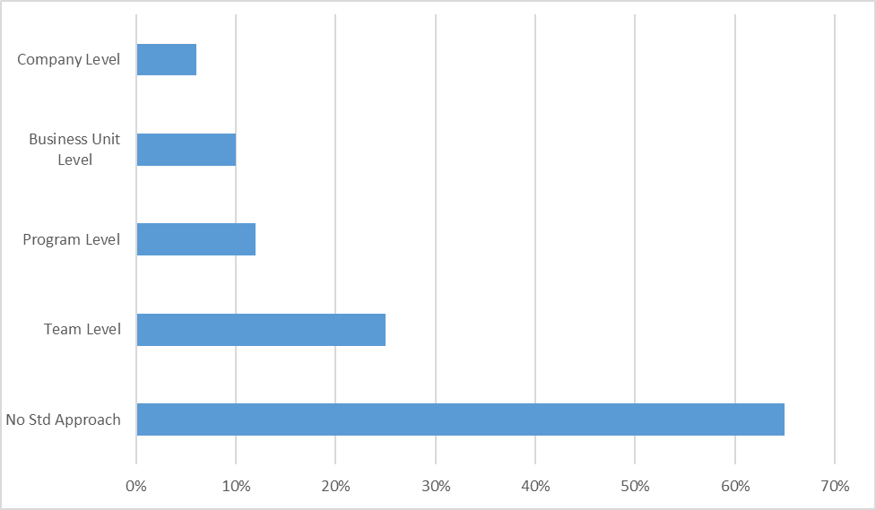
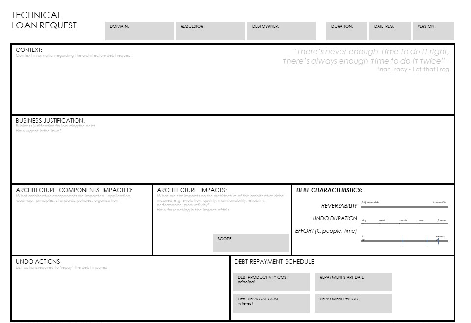

> "It's OK to borrow against the future, as long as you pay it off."
**Ward Cunningham**

# Technical Debt Overview

The concept of Technical Debt is commonly used, and misused, in [agile](agility.md){:target="_blank"} projects. When used correctly it can be a valuable way of delivering business value early and avoiding waste, when used badly it can lead to fragile products which become harder and harder to change. Architects need to understand when to use the concept in the right way to help deliver value for the business.

**A definition:**

> Technical Debt consists of design or implementation constructs that are expedient in the short term but that set up a technical context that can make a future change more costly or impossible. Technical debt is a contingent liability whose impact is limited to internal system qualities -- primarily, but not only, maintainability and evolvability.
**Kruchten, Nord and Ozkaya "Managing Technical Debt" -- 2019**

The term was first used by Ward Cunningham, one of the authors of the Agile Manifesto, who said that some problems with code are like financial debt. It is OK, and even beneficial, to borrow against the future, as long as you pay it off quickly by refactoring the code. Unfortunately, the last part of the statement gets ignored which has led to technical debit becoming a significant problem in many organisations.

There is more information about it here: <https://www.agilealliance.org/introduction-to-the-technical-debt-concept/>

In recent years the use of the term has exploded everywhere, now all teams seem to talk about technical debt, so it is helpful to extend the original definition to cover the full range of ways the term is used today, which are:

-   **Short term gain over long term pain** -- the original use, to describe the times you do something which will deliver business value now, but, will be more expensive in the long term because it increases complexity or impacts work in the future.
-   **Snowball of Technical Debt** -- an accumulation of the design and development decisions made that product significant negative impact on the maintainability of a software product.
-   **Wither on the Vine** -- as changes are made to a system there is no code or architecture refactoring, so the original decisions, which were fine at the time have become invalidated. Leading to a system that impossible to change.
-   **Legacy debt** -- the technology or approach is old and hard to support. This has become a very widely used meaning for technical debt and is the result of past decisions about upgrading software that negatively affects its future, typically failure to invest or poorly managed risks.
-   **Code Bloat** -- use of unnecessary frameworks or libraries adds complexity and dependencies for little benefit.

This classification is useful because different approaches are needed to manage them.

## The Debt Metaphor

We can look at financial debt management for some interesting guidance on how to cope with technical debt. The debt metaphor is appropriate because taking a shortcut design choice incurs a cost/debt "principal" just like a financial debt, typically the cost to get from the shortcut design to the correct design. It is useful because it helps to understand the problem and provides a mechanism to explain it to non-technical [stakeholders](stakeholders.md){:target="_blank"}.

Like a financial debt, the technical debt incurs interest payments in the form of extra effort for future developments because of the sub-optimal design choice. The longer you put off fixing the decision the more it will cost when you do. There is a choice to keep paying the interest or remove/reduce it by refactoring the shortcut design decision, i.e. paying down the principal. You can't avoid paying the interest, it will continue to be more difficult to maintain the product until the technical debt is removed.

One of the worst aspects is that if you take out more debt without paying off previous debts, the interest payments can become crippling. Multiple short-term sub-optimal design decisions will quickly add up resulting in a significantly reduced ability to deliver future features and a reduction in quality.

There are problems with the metaphor, generally when we think of a financial debt it is structured, with a specified interest rate and repayment period. Technical debt is much less controlled, more like borrowing from the Mafia, there can be a demand to repay it at 04:00 am in the morning [3]. If we need to make a change which is impacted by severe technical debt, the time and cost to make it will be out of proportion for the size of the change.

In the longer term, technical debt and the tradeoffs an organization will make, will have increased impacts and consequences for the ability of organizations to exploit the technology investments in the future. Industry commentator quote very large numbers for the negative financial impacts of technical, the Developer Co-efficient [4] from Stripe.com in September 2018 quoted $300 Billion impact on global GDP as the cost of software inefficiencies, of which technical debt was foremost.

## Not Technical Debt

There is a tendency to call anything that is less than perfect technical debt, probably because it creates a false legitimacy, as technical debt is part of the agile ethos now. There is general agreement that the following should definitely not be called technical debt:

-   Unfinished stories -- these are just unfinished stories, trying to legitimize them as technical debt and hoping to catch-up later, maybe in a hardening sprint, is the slippery slope to failure.
-   Defects are not Technical Debt -- Low quality in the form of defects are not technical debt because they have an immediate impact and need to be resolved immediately, although defects may be a symptom of technical debt
-   Lack of Process is not Technical Debt -- but lack of process, the wrong process or failure to follow process can result in inappropriate technical debt occurring
-   New features not yet implemented (for whatever reason) are not Technical Debt, but insufficient initial requirements can lead to shortcuts being taken to plug the perceived gaps introducing Technical Debt

## Causes of Technical Debt

There are a number of causes of poor design, these have been classified by Martin Fowler into

<https://www.martinfowler.com/bliki/TechnicalDebtQuadrant.html>

-   Prudent vs Reckless -- Prudent is choosing to do something because you understand the consequences, whilst Reckless is not caring or thinking about it.
-   Deliberate vs Inadvertent -- Deliberate is taking the time to make a conscious choice and looking at the options, whist inadvertent is not knowing or understanding what will happen because of that choice.

In fact, only top right quadrant fits the original definition of Technical Debt, being a conscious decision taken for sound business reasons.

## Reasons for Technical Debt

There are several valid business reasons for an organization incurring significant technical debt. Where the business model is being disrupted by change you may need to react very quickly to stay alive as business and take sub-optimal decisions around your technology choices.

The organization may be subject to high customer demand for new features pressure from there competitors and have to deliver features very quickly or get left behind by the other products. The business may apply pressure to increase the realization of value or reduce costs of delivery and operation on the short-term.

One of the less obvious causes of significant technical debt is a code rewrite or re-platforming. The reason for this is, when an organization builds a new platform the focus will be on new customers because you need to capture new customers to justify the business case. But the existing customers are being supported on the legacy platform and it can take a long time to move those customers across, many years in some cases. What happens during this period, the IT department must support the old and the new platforms, and what about new functionality. Is it implemented twice, the existing customers will be unhappy if they can't access the new features? So, the situation is worse, the technical debit hasn't been removed until all customers are migrated, because, during the period where both systems are running you need to have the skills, tools, and environments for both platforms.

Mergers and acquisitions are a prime source of technical debt, here you purchase the debit either knowingly or inadvertently. Many acquisitions come with products that contain high levels of technical debt, it can be one of the main reasons the owner wants to sell, often new business startups are highly focused on getting features quickly to market and take shortcuts with delivery.

# Approach to technical debt

## Managing technical debt

It is obvious that technical debt in not going to go away by it's own, so organizations are actively managing it then. Actually, they are not, Carnegie Mellon surveyed 1800 organizations, it can be seen in the chart below that 65% had no standard approach to dealing with technical debit.

The different types of technical debt need to be managed in different ways, by different levels in the organization:

-   **Short term gain over long term pain** -- This is usually a short cut in the code for one product or system. It can be effectively managed at the team level by recording, prioritizing and refactoring
-   **Snowball of Technical Debt** -- When there is a build-up of technical debt this will need an initiative at the programme or product level with investment provided.
-   **Wither on the Vine** -- as system or products age there needs to be active management at the business unit level to keep the right level of investment based on the business value being derived. Often a choice needs to be made to retire a product or system.
-   **Legacy debt** -- when the technology or approach is old and hard to support, but the functionality or products it supports are still needed, careful planning needs to be done to address the problems, the temptation is to re-platform, which brings its own complexities. This will be made at a business unit or company level.
-   **Code Bloat** -- The team who owns the code base should guard against this, it should also be addressed in the centrally controlled IT principles.

Managing technical debt is not easy and depends on the organizational context, but there are some activities which can help.

## Measuring Technical Debt

It is essential to be able to measure debt to be able to manage it​, this gives a number of benefits:

-   It allows you to see the size of the problem and although it is unlikely debt can ever be totally eliminated but it can be kept within certain thresholds.​
-   With historical data it is possible to see if things are getting better or worse and determine the level of investment required to hit thresholds and objectives.
-   Developers and Managers want to be able to understand analyze the debt and see the impact of investments​.
-   Information is needed to help evaluate risk, set priorities and target effort to most effectively reduce debt and avoid paying the interest​, especially at short notice.

As part of keeping control of technical debt the expectations must clear, by having the right things in place such as: a definition of done which includes Quality Attributes, coding standards and peer reviews in place, IT Principles, and capturing your decisions to incur technical debt using an ADR or an Architecture Loan Request for a significant issue.

## Handling Technical Debt

It is useful to assess the technical debt you currently have on a periodic basis to understand if it is growing faster than it is being addressed. This is of course dependent on having captured in a usable form, these can be as technical stories on the Product Backlog.

Due to the nature of technical debt, it can arise when people are under most pressure to deliver, it is frequently not captured at the time. As an architect, when you encounter this situation holding a "no-blame" workshop with the development team is a good first step. Here the team can tease out the problems and identify the possible impacts and remediations. These can then be priorities identified based on business value. (do we want a canvas for this?)

The amount of investment you make in technical debt depends on where you are in the life cycle of the product and the organization.

The chart provides an indicative view of the journey from a start-up to enterprise level.

Once there is a reasonable understanding of what the position is with regards to technical debt the following article describes an a approach to dealing with debt at the code level:

# Methods and tools

## SQALE

**S**oftware **Q**uality **A**ssessment based on **L**ifecycle **E**xpectations (SQALE) is an extensive OpenSource standardized framework with the objectives of:

-   Supporting the evaluation of a software application's source code in the most objective, accurate, reproducible and automated way possible.
-   Providing an efficient method for managing Technical Debt.

It is based on the software lifecycle and specifically designed to measure technical debt.

The Standard Definition and multiple whitepapers are available on the site [www.sqale.org](http://www.sqale.org/){:target="_blank"}

In summary, organizations can used SQALE to establish their own concrete definition of "right code" and what constitutes technical debt and what doesn't, by:

-   Providing metrics about how far away code is from "right code" and what needs to be done
-   Describing standard graphical and numeric views that provides easy visualization of the debt
-   Giving mulitple viewpoints of the analysis, the developer point of view and the owner/user point of view

At the basic level it can give a baseline of the current technical debt levels start to work from and can then be incorporated into the SDLC and CI or Regression to generate live dashboards to see the impact of each build on the debt backlog.

## SonarQube

SonarQube is an open-source platform developed by SonarSource for continuous inspection of code quality to perform automatic reviews with static analysis of code to detect bugs, code smells, and security vulnerabilities on 20+ programming languages. It can be used to implement the SQALE method.

It implements all the SQALE metrics with dashboard visualizations and Plugins can be built (or purchased ones amended) to provide custom support. The output from the analysis can be used to feed the product backlog to address the identified Technical Debt.

Details available on [www.sonarsource.com](http://www.sonarsource.com/){:target="_blank"}

## Architecture Loan Request

The Architecture Loan Request is a canvas that can be used to capture significant decisions to incur significant Technical Debt. It is particularly powerful because it encourages clarification of the approach to paying back that debt.

Work with the Product Owner to identify the business value delivered by the decision, and the justification. It is important to identify which components are impacted and the cost of repaying the debt and have a plan for remediation in place.

# Summary

In summary Technical Debit is a complex topic, it can be used as valuable tool to deliver business value early, or a convenient way to cover up poor investment decisions. As an architect, whenever you use it or come across it, the key thing is to capture as much context as you can and identify a plan to address it.

# References and Further Reading

**Kruchten, Nord and Ozkaya "Managing Technical Debt" -- 2019**

**Ward Cunningham explains the debt metaphor**
<https://www.youtube.com/watch?v=pqeJFYwnkjE>

<https://lostechies.com/derickbailey/2010/10/01/technical-debt-is-like-your-friend-the-mafia-bookie/>

<https://stripe.com/files/reports/the-developer-coefficient.pdf>

BTABoK 3.0 by [IASA](https://iasaglobal.org/) is licensed under a [Creative Commons Attribution-NonCommercial 4.0 International License](http://creativecommons.org/licenses/by-nc/4.0/). Based on a work at [https://btabok.iasaglobal.org/](https://btabok.iasaglobal.org/)