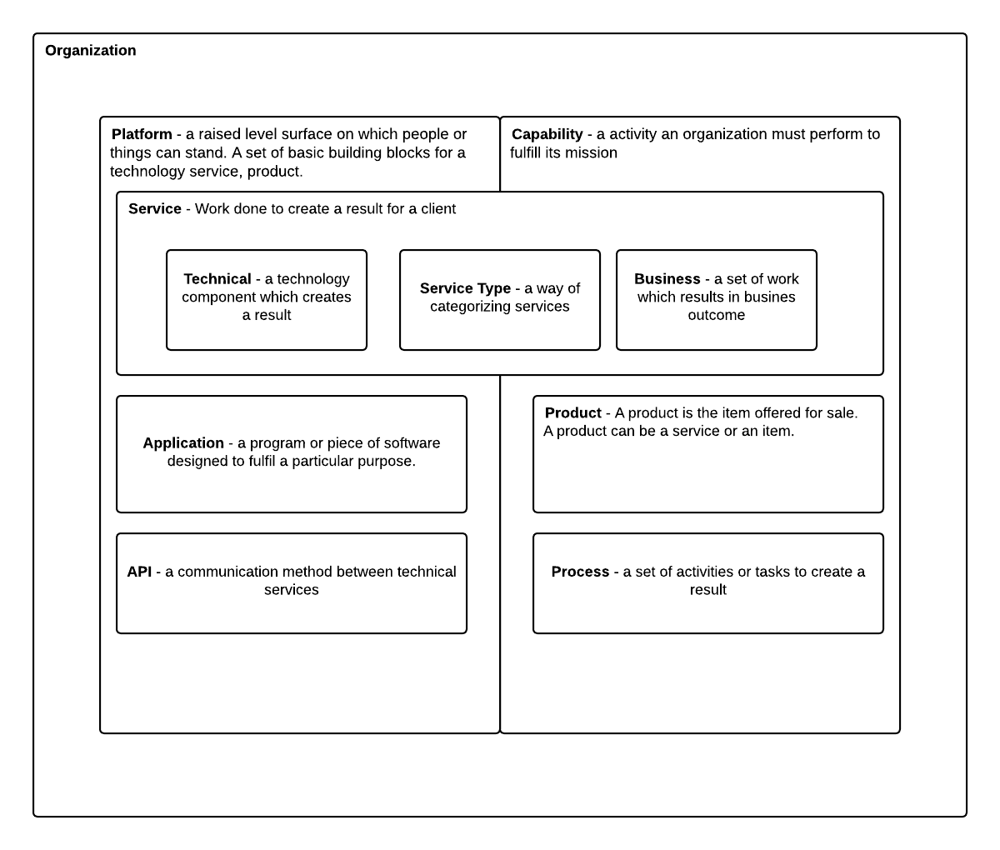

> "It's OK to borrow against the future, as long as you pay it off."
> **Ward Cunningham**

# Technical Landscape Overview

The concept of Technical Debt is commonly used, and misused, in [agile](agility.md){:target="_blank"} projects. When used correctly it can be a valuable way of delivering business value early and avoiding waste, when used badly it can lead to fragile products which become harder and harder to change. Architects need to understand when to use the concept in the right way to help deliver value for the business.

**A definition:**

> Technical Debt consists of design or implementation constructs that are expedient in the short term but that set up a technical context that can make a future change more costly or impossible. Technical debt is a contingent liability whose impact is limited to internal system qualities -- primarily, but not only, maintainability and evolvability.
> **Kruchten, Nord and Ozkaya "Managing Technical Debt" -- 2019**

The term was first used by Ward Cunningham, one of the authors of the Agile Manifesto, who said that some problems with code are like financial debt. It is OK, and even beneficial, to borrow against the future, as long as you pay it off quickly by refactoring the code. Unfortunately, the last part of the statement gets ignored which has led to technical debit becoming a significant problem in many organisations.

There is more information about it here: <https://www.agilealliance.org/introduction-to-the-technical-debt-concept/>

In recent years the use of the term has exploded everywhere, now all teams seem to talk about technical debt, so it is helpful to extend the original definition to cover the full range of ways the term is used today, which are:

- **Short term gain over long term pain** -- the original use, to describe the times you do something which will deliver business value now, but, will be more expensive in the long term because it increases complexity or impacts work in the future.
- **Snowball of Technical Debt** -- an accumulation of the design and development decisions made that product significant negative impact on the maintainability of a software product.
- **Wither on the Vine** -- as changes are made to a system there is no code or architecture refactoring, so the original decisions, which were fine at the time have become invalidated. Leading to a system that impossible to change.
- **Legacy debt** -- the technology or approach is old and hard to support. This has become a very widely used meaning for technical debt and is the result of past decisions about upgrading software that negatively affects its future, typically failure to invest or poorly managed risks.
- **Code Bloat** -- use of unnecessary frameworks or libraries adds complexity and dependencies for little benefit.

This classification is useful because different approaches are needed to manage them.

## The Landscape Metaphor

We can look at financial debt management for some interesting guidance on how to cope with technical debt. The debt metaphor is appropriate because taking a shortcut design choice incurs a cost/debt "principal" just like a financial debt, typically the cost to get from the shortcut design to the correct design. It is useful because it helps to understand the problem and provides a mechanism to explain it to non-technical [stakeholders](stakeholders.md){:target="_blank"}. 

## Current Systems - Application Portfolio

### Modern Architecture Landscape

### Technology Capabilities

### Technology Type Reference Model

###### 

# Approach to Technical Landscape

## Balance the Roadmap

## Ensure the Transformation Agenda

### Only Model What is Necessary - Deliverables

## Experiment But Only Commit to Value

It is obvious that technical debt in not going to go away by it's own, so organizations are actively managing it then. Actually, they are not, Carnegie Mellon surveyed 1800 organizations, it can be seen in the chart below that 65% had no standard approach to dealing with technical debit.

The different types of technical debt need to be managed in different ways, by different levels in the organization:

- **Short term gain over long term pain** -- This is usually a short cut in the code for one product or system. It can be effectively managed at the team level by recording, prioritizing and refactoring
- **Snowball of Technical Debt** -- When there is a build-up of technical debt this will need an initiative at the programme or product level with investment provided.
- **Wither on the Vine** -- as system or products age there needs to be active management at the business unit level to keep the right level of investment based on the business value being derived. Often a choice needs to be made to retire a product or system.
- **Legacy debt** -- when the technology or approach is old and hard to support, but the functionality or products it supports are still needed, careful planning needs to be done to address the problems, the temptation is to re-platform, which brings its own complexities. This will be made at a business unit or company level.
- **Code Bloat** -- The team who owns the code base should guard against this, it should also be addressed in the centrally controlled IT principles.

Managing technical debt is not easy and depends on the organizational context, but there are some activities which can help.

## Innovate in the Application Portfolio

It is essential to be able to measure debt to be able to manage it​, this gives a number of benefits:

- It allows you to see the size of the problem and although it is unlikely debt can ever be totally eliminated but it can be kept within certain thresholds.​
- With historical data it is possible to see if things are getting better or worse and determine the level of investment required to hit thresholds and objectives.
- Developers and Managers want to be able to understand analyze the debt and see the impact of investments​.
- Information is needed to help evaluate risk, set priorities and target effort to most effectively reduce debt and avoid paying the interest​, especially at short notice.

As part of keeping control of technical debt the expectations must clear, by having the right things in place such as: a definition of done which includes Quality Attributes, coding standards and peer reviews in place, IT Principles, and capturing your decisions to incur technical debt using an ADR or an Architecture Loan Request for a significant issue.

### The War on Debt

It is

## Use Legacy Effectively

It is 

# Methods and tools

There are a number of useful

## Business Capability to Technology Capability

**S**oftware **Q**uality **A**ssessment based on **L**ifecycle **E**xpectations (SQALE) is an extensive OpenSource standardized framework with the objectives of:

- Supporting the evaluation of a software application's source code in the most objective, accurate, reproducible and automated way possible.
- Providing an efficient method for managing Technical Debt.

It is based on the software lifecycle and specifically designed to measure technical debt.

The Standard Definition and multiple whitepapers are available on the site [www.sqale.org](http://www.sqale.org/){:target="_blank"}

In summary, organizations can used SQALE to establish their own concrete definition of "right code" and what constitutes technical debt and what doesn't, by:

- Providing metrics about how far away code is from "right code" and what needs to be done
- Describing standard graphical and numeric views that provides easy visualization of the debt
- Giving mulitple viewpoints of the analysis, the developer point of view and the owner/user point of view

At the basic level it can give a baseline of the current technical debt levels start to work from and can then be incorporated into the SDLC and CI or Regression to generate live dashboards to see the impact of each build on the debt backlog.

## Domain Driven Design and Event Storming

SonarQube is an open-source platform developed by SonarSource for continuous inspection of code quality to perform automatic reviews with static analysis of code to detect bugs, code smells, and security vulnerabilities on 20+ programming languages. It can be used to implement the SQALE method.

It implements all the SQALE metrics with dashboard visualizations and Plugins can be built (or purchased ones amended) to provide custom support. The output from the analysis can be used to feed the product backlog to address the identified Technical Debt.

Details available on [www.sonarsource.com](http://www.sonarsource.com/){:target="_blank"}

## Architecture Loan Request

The Architecture Loan Request is a canvas that can be used to capture significant decisions to incur significant Technical Debt. It is particularly powerful because it encourages clarification of the approach to paying back that debt.

Work with the Product Owner to identify the business value delivered by the decision, and the justification. It is important to identify which components are impacted and the cost of repaying the debt and have a plan for remediation in place.

{:target="_blank"}

# Summary

In summary Technical Debit is a complex topic, it can be used as valuable tool to deliver business value early, or a convenient way to cover up poor investment decisions. As an architect, whenever you use it or come across it, the key thing is to capture as much context as you can and identify a plan to address it.

# References and Further Reading

https://community.tbmcouncil.org/viewdocument/tbm-taxonomy-v40-final-documents

[Defining Technology Capabilities | The Essential Project](https://enterprise-architecture.org/university/defining-technology-capabilities/)

[Application Reference Model | The Essential Project](https://enterprise-architecture.org/university/application-reference-model/)

[Value of Technical Capability Models | Phil (aka MP3Monster)&#039;s Blog](https://blog.mp3monster.org/2018/11/01/value-of-technical-capability-models/)

BTABoK 3.0 by [IASA](https://iasaglobal.org/) is licensed under a [Creative Commons Attribution-NonCommercial 4.0 International License](http://creativecommons.org/licenses/by-nc/4.0/). Based on a work at [https://btabok.iasaglobal.org/](https://btabok.iasaglobal.org/)
