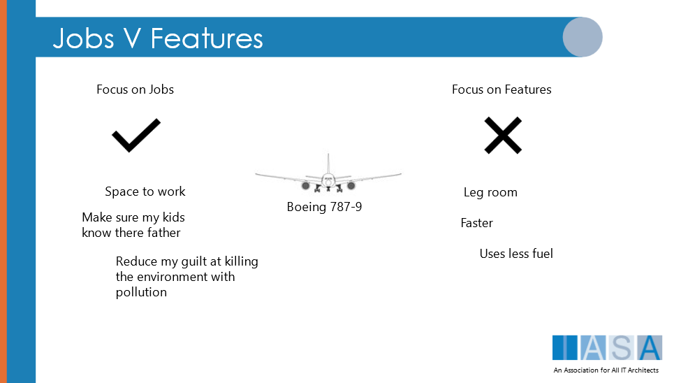
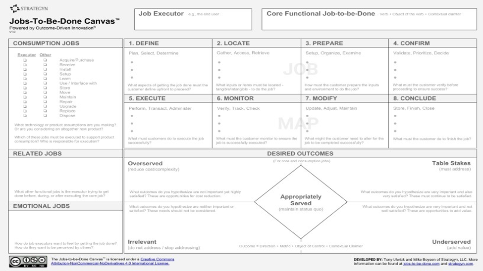

> "Anything that is wasted effort represents wasted time. The best management of our time thus becomes linked inseparably with the best utilization of our efforts."
**Ted Engstrom**

# What does it mean to Utilize

"utilize- to put to use; turn to profitable account"

Utilization in architecture is the most important part of delivering products, capabilities and services. And yet it remains one of the least areas of focus for technology strategy. Even the definition contains the notion of utilizing something well (turn to profitable account), or to achieve something useful. While many in technology focus on the

When we think about utilization this is after delivery when a product is being put to test in the market or with its stakeholders and users. Utilization provides the metrics by which a team measures the objectives that started the project in the first place.

Utilization is the primary gateway to architects impacting many key measures throughout the company, including things like [culture](culture.md){:target="_blank"}, [velocity](velocity.md){:target="_blank"}, and [customer journeys](journey.md){:target="_blank"}. However, utilization is not really about measures, it is about understanding what people and systems are doing now and finding the innovation to change that.

# Continuous Utilization as Internal and External

Utilization of capabilities and services is obviously continuous. Whether the order management system is up or down, does not mean the organization stops taking orders. So utilization can be seen not just as a system event but at as a [business capability](business_capabilities.md){:target="_blank"}  and a services activity.

In addition the capabilities and services on which our business depends are in constant use and [transformation](transform.md){:target="_blank"}. It is in utilization that the team sees all of the ideas, methods, and changes come together to form an understanding of business problems. External organizations use the companies services, customers are satisfied or dissatisfied.

# Why do we need Utilization

It is at first difficult to understand why utilization is required when there is a measurement article. However, utilization and how measurement occurs are very different as utilization is about what is actually happening and how it feels (see [Stakeholders](stakeholders.md){:target="_blank"} and [Customer Journeys](journey.md){:target="_blank"} for understanding empathy in architecture) more than how it is measured. However, this is what is so interesting about utilization as an architecture concept; it is extremely organic, human, connect and practical.

# Utilization Approach

How the [engagement model](engagement.md){:target="_blank"} addresses utilization will describe a great deal about the architecture practice and its effectiveness in the other areas.

## Utilization Throughout the Whole Process

Utilization is clearly understood as an ongoing activity. But the team must decide at what level architects are to engage in this. For example, many architect teams focus solely on problems with utilization of technical or software systems. They are responding to areas where 'there is a fire that needs to be put out'. This kind of focus in utilization would indicate that architects are focused solely on technology, that technology delivery is unstable, and that the engagement model is primarily used for fixing these delivery problems.

## Productivity is Not as Valuable as Profitability/Mission Success and Customers

For many years the holy grail of technology was productivity as it was primarily seen as an enabler of 'the business', or the employees doing the 'real' work. However, time has shown that the BTABoK has been right for many years and that productivity is primarily a social and political construct that describes the happiness with work of employees and not necessarily the value generated by the work. This can best be illustrated by the work of taxi companies and Uber. While Uber's overall profitability is a matter of some question, when compared with the effort, productivity and enablement of technology for even the largest taxi companies, it is clear that they achieved a much more valuable objective by using technology to change the game (create a blue ocean) than by increasing productivity. There are additional lessons in utilization to be learned within that system. Customer journeys when compared between the digital customer and the digital business model of Uber (what is often called a digitally native model) are significantly more satisfying, less risky and more valuable to the customer and the company. Again this differs from measurement in that customers experience is completely different.

## Make Utilization a Part of Architecture Assignment

There are two methods by which utilization becomes important to the architecture team. The first is utilization as an assignment phase of any product/project. Meaning the solution or delivery architect is assigned until utilization is understood (past the system stabilization phase), measures are identified and any value metrics are gathered and cataloged. This allows the architect to continue with business partners. This appears to be a [risky method](risk_methods.md){:target="_blank"} as it is subject to many different and 'silent' ways of not being completed. New projects, too few architects, outsourcing, and even business indifference can lead to architects moving on more quickly than optimal.

The second method is domain focused architects (normally business architects) who are with business partners and customers continuously and therefore are deeply embedded in the value outcomes of any set of activities. This method is stable and tested and appears (based solely at this time on anecdotal evidence) that is is primarily subject to risk in the separation of the architect [community](community.md){:target="_blank"}, practice model, and [competencies.](competency.md){:target="_blank"} That is the architects may 'go native' which is a reality in many specialization areas. It is also subject to a turn-over risk if the architecture repository does not include critical deliverables that are up to date.

## Gemba Walks Are Not Just For Building or Transformation

A Gemba Walk is a technique for 'being at the site of or in the same process as another person'. It could be buying a hamburger, opening a bank account, paying taxes, or watching a team deploy a feature release. Gemba walks are used to understand an event, activity or journey through the eyes of the customer or stakeholder. Thus they are actually about utilization and not just for use when building things.

The architecture team should regularly identify critical areas of the organization to understand deeply. This can be done through capability heatmaps, business processes or other methods. Within these areas of focus the team can be sure to experience what the stakeholder does. This has many positive outcomes but stakeholder relationships and trust is among the highest. Obviously not everyone can be everywhere, but through experimentation, mentoring and other techniques, architects can get outside of their own domain, stakeholder community, and programs for a portion of each month and experience the business from a different angle.

## Utilization and Jobs To Be Done

Utilization should directly impact the jobs that an induvial does and how they execute that job.

-   More than 50 percent of newly launched products fall short of the company's projected expectations.
-   Only 1 in 100 new products covers its development costs.
-   Only 1 in 300 new products has a significant impact on customer purchase behaviour, the product category, or the company's growth trajectory.

The Customer articles go into JBTD in significant detail, but notice that is infact is seeking to understand utilization from the provider and not features or measurements. It is experiential initially which then drives understanding of important measures, correlation to outcomes, and fuels innovation.

Figure 1 Strategyn JTBD Canvas

# Measure Effect and Outcomes

Utilization of a product gives us significant information on how are businesses functioning. Utilization is often like data, it is one of the most important aspects of delivery of Technology Strategy but also one of the most mundane. It is utilization that informs architects of the appropriate direction to take in future products as well as teaches them what was actually successful.

What we need to understand and utilization is how our users are interacting with the software with an understanding that when we deliver there will likely be a significant period of difficulty from the transformation. So what are the areas of in utilization that we're interested in. First we want to understand how users are interacting with a system or system of systems. That means we need to understand how they're using the processes the technology and how that's changing their work activities.

The following areas of measurement can help understand utilization.

| **Measurement** | **Description** |
| --- | --- |
| **Customer Satisfaction** | How well is the current customer feeling? Has it changed? What changed? Why do they feel differently? How are they behaving differently? |
| **Objectives Retrospective(s)** | How well has the activity impacted each OKR? Are they performing as expected? Higher/lower? |
| **Stakeholder Reviews** | How was the stakeholder experience? How do they feel about the outcomes? Were the objectives properly set? What could be done differently next time? |
| **Quality Attribute Measures** | How are usability, security, resilience, etc being measured? How does the average operations person feel? How are bugs or issues handled? What is that experience like? |
| **'Day in the Life' Before/After** | How are impacted individuals lives different? Does it feel better or worse? What jobs are harder? Which ones are easier? |
| **Delivery Measures** | How well did delivery go? Are the developers excited/angry/happy (within reason)? Did the product deliver with methods that were exceptional or new? What learning took place? |

BTABoK 3.0 by [IASA](https://iasaglobal.org/) is licensed under a [Creative Commons Attribution-NonCommercial 4.0 International License](http://creativecommons.org/licenses/by-nc/4.0/). Based on a work at [https://btabok.iasaglobal.org/](https://btabok.iasaglobal.org/)