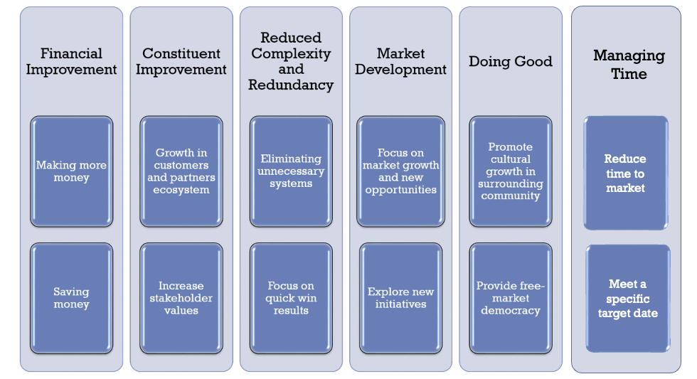

# Value Methods

Architects are not mere stewards of technology—they are creators of the future. Like their counterparts in building architecture, they use structured design, applied science, and human insight to shape environments that unlock potential. In the digital world, architects innovate with code, systems, and ecosystems. They define the frameworks through which value emerges.

Their craft is not limited to systems diagrams or governance meetings. Architects deeply understand how businesses are structured—how money flows, where capabilities exist, and how decisions ripple through an organization. In the modern enterprise, every business outcome is enabled—or constrained—by technology. That means architects do not just influence outcomes; they shape the pathways to achieving them.

Understanding financial models, market forces, experience design, and operational flows is essential. Architects are artists, scientists, and strategists—building the future through measurable impact.

Yet too often, the architecture discipline is treated as a background utility. This misunderstanding stems not from a lack of impact, but a lack of clear articulation. That’s where value methods come in.

This article defines and operationalizes *value methods*—techniques for understanding, measuring, and predicting value in technology investment. These are the tools architects use not only to justify their work but to shape, scale, and evolve the value landscape of the enterprise.

> **Note**: This article merges and extends the original BTABoK Value Methods article with a deeper explanation of each method, more industry references, and clearer examples of application.

## Definitions

Before we explore categories and methods, it’s important to define what we mean by "value" and other key terms:

- **Value** – The measurable benefit realized from a change or investment, relative to its cost and risk. Value may be financial (revenue), operational (efficiency), experiential (user satisfaction), or social (public good).

- **Value Method** – A structured technique for identifying, quantifying, or validating value. Examples include ROI, Net Present Value, and Time-to-Value.

- **Outcome** – A defined result of a change or effort, often expressed as a measurable objective or key result.

- **Architectural Contribution** – The specific impact that architectural work has on an outcome (e.g. reducing rework, enabling reuse, clarifying options).

## A Real-World Framing: "Tinkleman"

Imagine the fictional company Tinkleman, a specialty coffee roaster expanding through a franchise model. They are considering whether to invest in a custom franchise management platform or purchase and customize an off-the-shelf (COTS) solution.

As the architect, your role is to lead value discovery: What is the right path to achieve stakeholder outcomes with the highest overall value?

You apply a method: a side-by-side cost-benefit and strategic alignment analysis. Over two weeks, you:

- Identify six ecosystem integration risks of the COTS option.
- Forecast a 14-month breakeven on a custom build with 20% reduced cost of ownership.
- Model the reuse of three core APIs in future digital services.
- Surface a brand protection KPI aligned to stakeholder goals.

The resulting narrative—"value through speed, control, and future growth"—drives consensus. This is value methods in practice.

## Why Value Methods Matter

Architecture efforts often compete with delivery teams for budget, attention, and strategic trust. Too often, architecture is seen as abstract or indirect—a “soft” function whose value is difficult to quantify. This perception weakens influence, limits early involvement, and invites cutbacks in constrained environments.

**Value Methods directly counter this by equipping architects with ways to define, measure, and demonstrate outcomes in business terms.**

They shift the architect's role from technical expert to *decision enabler*—someone who ensures investments go to the right things, at the right time, in the right way.

### Common Challenges Architects Face Without Value Methods

- Decisions made purely on urgency or intuition

- Projects launched without measurable objectives

- Architecture bypassed in favor of “just building something”

- Governance treated as a bottleneck rather than a value check

- Difficulty influencing strategic planning or roadmaps

### What Value Methods Enable

Each of the five architect specialization defined by the BTABoK leverages value methods in distinct ways to influence technology investment and business outcomes:

- **Business Architects** use value methods to connect business models, capabilities, and strategies to quantifiable outcomes. They often lead the framing of business cases and ensure technology initiatives align with strategic objectives.

- **Information Architects** apply value models to define the impact of data quality, accessibility, and security on business operations. Their metrics include risk avoidance, compliance costs, and information reuse.

- **Software Architects** use value methods to evaluate trade-offs in design, performance, and scalability. They contribute through cost/benefit analysis of different solution approaches and by accelerating time-to-value through reuse and automation.

- **Infrastructure Architects** focus on reliability, scalability, and operational efficiency. Their use of value methods often centers on TCO models, cost reduction, and enabling agility through platform investments.

- **Solution Architects** integrate inputs from all domains and are responsible for ensuring that individual project efforts deliver intended outcomes. They frequently apply ROI, IRR, and risk models to guide delivery teams and stakeholders.

Together, these specializations form a value-aware practice—one that connects architectural insight to measurable impact. Rather than simply responding to business initiatives, architects help initiate, frame, and shape them based on evidence of value.

Value methods empower architects to engage early, aligning technical options with strategic goals. They provide a structured basis for prioritizing initiatives not just by urgency or preference, but by expected return, mission alignment, or speed to value. Trade-offs become transparent: different architectural paths can be evaluated based on the outcomes they enable or constrain.

And because value is measured across time—not just at the start—architects can be continuously validated. Each touchpoint with delivery, governance, and stakeholders becomes an opportunity to reaffirm architecture’s contribution to results.

###### A Short Example

At a regional health provider, an architecture team was asked to validate a new appointment scheduling tool. Rather than evaluate features alone, they modeled:

- Cost to implement

- Cost of current inefficiencies (no-shows, staff churn)

- Benefits of faster turnaround and reduced call center load

They found the savings from reduced call volume alone exceeded implementation costs within 9 months.

**The result**: The proposal moved from low priority to executive-backed—and architecture was given further ownership of integration and patient-facing services.

### A Technical Project Example

At a financial services company, a **Software Architect** working on a digital onboarding platform was tasked with evaluating the performance and maintainability of a customer identity verification service. The service had grown organically and had accumulated high coupling and duplicated logic across its validation and exception handling layers.

Using value methods at the component level, the architect conducted the following analyses:

- **Technical debt scoring**: By using a maintainability index and estimated rework cost, they quantified the effort required to untangle the logic and enforce single-responsibility across three modules.

- **Service invocation profiling**: Analysis of production logs revealed that 78% of error conditions were routed through one shared module with a 600ms delay. The team modeled the impact of refactoring to reduce median response time by 180ms.

- **Time-to-value projection**: By creating a simulation using current regression fix cycles, they predicted a 25% acceleration in bug resolution during integration testing—saving an estimated 70 hours per quarter.

The architect packaged this analysis into a short presentation with pre- and post-refactor graphs, and included a simple ROI calculator. Though the task was scoped as a minor code improvement, the business stakeholders greenlit it as a priority because of the measurable time savings and downstream impact on customer onboarding SLAs.

This is value framing at the component level—making the case for investment not just based on code elegance or intuition, but measurable business impact.

- Communicating value in business terms

- Justifying architecture engagement

- Guiding trade-offs and prioritization

- Measuring what works—and what doesn’t

## The Six BTABoK Value Categories (Expanded)

Each of the six value categories is both a lens and a method space. Below, we detail what each category entails, what techniques are associated with it, and how architects apply them in practice.

### 1. Financial Value

**Definition**: The measurable impact resulting from an architectural decision or investment. This includes revenue generation, cost reduction, cost avoidance, and productivity gains that translate into financial outcomes. More advanced methods begin to approach financial modeling in other capital or IP rich investments. 

**Common Techniques**:

- **Cost-Benefit Analysis (CBA)**: Compares total benefits of a proposal against its costs. This is often the foundational technique.
- **Net Present Value (NPV)**: Calculates the present value of future cash flows using a discount rate. Vital for comparing projects with different timelines.
- **Internal Rate of Return (IRR)**: The discount rate at which NPV equals zero—used for assessing relative project desirability.
- **Return on Investment (ROI)**: Ratio of net gain to cost. Simple but limited—it does not factor in time.
- **Break-Even Analysis**: Identifies the point where costs equal revenue.

**Industry Practice**: Financial valuation is heavily used in enterprise capital planning. Architects should partner with finance teams to ensure assumptions are grounded in real baselines and that models align with project accounting standards.

**Applied Example**: For a $3M cloud modernization, the architecture team models a 28% IRR and a 2.5-year payback period. The model includes not just license savings but also labor and incident cost reductions.

**Scenario**: A Solution Architect working with finance stakeholders identifies that consolidating four separate billing engines into a single cloud-native platform could save over $1.1M in annual licensing and operational overhead. Using a TCO model and projected NPV over five years, the architect demonstrates a 3x return by year three. These findings enable approval and reallocation of funding from a stalled CRM upgrade.

Architects provide the framing for financial value by modeling alternative futures, identifying redundancies, and translating complexity into decision-ready metrics. This ensures that investments are not just technically sound, but economically defensible. Often this role needs deep connection with Finance, Sales and Operations to measure and understand these outcomes. 

### 2. Time Value

**Definition**: Value realized by accelerating delivery, increasing responsiveness, or meeting critical timing constraints such as fiscal, legal, or market-driven deadlines.

**Common Value Methods**:

- Time to Value (TTV)

- Cycle Time Reduction Analysis

- Opportunity Cost Estimation

- Lead Time Metrics

- Timeboxing & Scenario Modeling

**Metrics Examples**:

- Days saved to launch or reach breakeven

- Cycle time reduction per release or iteration

- Project delivery variance against schedule

- Opportunity value of releasing early (revenue gain or market share)

**Techniques**:

- **Cycle Time Reduction Analysis**: Identify slow points in delivery pipelines or operational workflows. Often performed through value stream mapping—a Lean technique used to visualize, analyze, and improve end-to-end delivery flow.

- **Lead Time Metrics**: Track time from request to fulfillment for architectural deliverables, product releases, or technical components. Frequently used in Agile and DevOps performance analysis.

- **Timeboxing & Scenario Modeling**: Estimate project outcomes using different delivery cadences, identifying fast-path versus deferred benefits.

- **Opportunity Cost Estimation**: Model what is lost—financially or competitively—by being late. Particularly relevant in seasonal, launch-driven, or regulatory projects.

These techniques are rooted in Lean and Agile disciplines. Value stream analysis in particular helps architects identify and address architectural bottlenecks that delay flow—enabling smoother, faster delivery across teams.

**Scenario**: An Infrastructure Architect identifies that enabling automated provisioning of dev/test environments using Infrastructure as Code (IaC) can shave 10 days off every sprint cycle for three teams. By modeling cumulative time savings across a year and converting developer days to potential feature throughput, the architect shows how the platform investment would recover costs within two quarters.

Architects drive time value by reducing latency in the delivery lifecycle—whether through standardization, automation, reuse, or early validation. They make time visible as a constraint and a lever in every planning conversation.

### 3. Simplicity Value

**Definition**: Value created by reducing complexity in systems, processes, or decision logic—leading to better maintainability, lower operational costs, and increased change readiness. Simplicity also refers to architectural clarity: fewer components, cleaner contracts, and more reusable elements.

**Common Value Methods**:

- Technical Debt Valuation

- Maintainability Index Scoring

- Architecture Decision Records (ADR) Traceability

- Reuse Impact Estimation

**Metrics Examples**:

- Number of legacy components decommissioned

- Ratio of reused vs duplicated code or services

- Estimated rework hours avoided

- Average time-to-onboard new team members (a proxy for system clarity)

**Techniques**:

- **Technical Debt Valuation**: Assign cost to poor design choices or deferred refactoring. 

- **Modularity Analysis**: Identify and quantify cohesion/coupling issues that increase maintenance cost.

- **System Rationalization Mapping**: Visualize overlapping capabilities or duplicated systems to identify targets for simplification.

- **Service/API Dependency Auditing**: Highlight excessive interdependencies and candidates for consolidation or redesign.

**Scenario**: A Software Architect working on a logistics platform identifies that five internal services all implement near-identical logic for address validation. By consolidating these into a single internal API, the team eliminates 3,500 lines of duplicated code, reduces defect rates by 12%, and cuts onboarding time for new developers by 20%. A rough debt valuation shows an annual savings of over $110K in maintenance effort.

Architects create simplicity by advocating for reuse, establishing clear interfaces, and documenting decisions. They reduce future effort by improving structure today—and use value methods to quantify that benefit for stakeholders who may otherwise overlook it.

### 4. Contextual (Constituent) Value

**Definition**: Contextual value, often considered a form of 'soft value,' refers to improvements in the quality of interaction, trust, understanding, or support between an organization and its ecosystem—whether internal stakeholders, customers, suppliers, or partners. It includes attributes like usability, fairness, clarity, accessibility, and shared alignment.

This category often drives long-term loyalty, reduces friction in collaboration, and builds social capital within digital and operational ecosystems.

**Common Value Methods**:

- Stakeholder Satisfaction Indices

- Net Promoter Score (NPS) or Developer Experience (DX) metrics

- Ecosystem Fit Assessments

- Interoperability Maturity Scoring

**Metrics Examples**:

- Number of partner touchpoints simplified

- Time saved by external teams using exposed APIs

- Stakeholder satisfaction pre/post capability rollout

- Accessibility compliance improvements

**Techniques**:

- **Stakeholder Journey Mapping**: Identify pain points and delays in interaction with architectural components or decisions.

- **Customer Journey Mapping**: Understand how external users or consumers experience the system, focusing on usability, friction, and satisfaction.

- **Partner Enablement Audits**: Analyze the ease with which external or internal consumers can access and adopt solutions.

- **Interoperability Scoring**: Rate the compatibility of systems and services against industry standards or ecosystem norms.

- **Usability Benchmarking**: Especially for internal platforms, developer-facing tools, and shared interfaces.

**Scenario**: A Solution Architect working with a procurement team identifies that third-party vendors experience 4x longer onboarding when interacting with internal integration APIs due to insufficient documentation and inconsistent data contracts. By investing in an API developer portal, contract standardization, and support SLAs, the team cuts vendor integration time by 65% and receives positive partner feedback. While this doesn’t immediately drive revenue, it strengthens the organization's platform position and lowers operational overhead.

Architects unlock contextual value by removing friction—structurally and culturally. They clarify interactions, document assumptions, promote inclusive and standards-aligned designs, and anticipate the needs of external and downstream users. These actions build the invisible but essential scaffolding for trust, speed, and cooperation in the digital business ecosystem.

### 5. Market Development Value

**Definition**: Market development value reflects the architect’s contribution to enabling new business—whether that means reaching new customer segments, launching new products, scaling through partners, or expanding into adjacent markets. It often connects innovation, scalability, and extensibility to revenue potential.

**Common Value Methods**:

- [Market Segmentation Canvas](../structured_canvases/market_segmentation_canvas.md)

- Total Addressable Market (TAM) Modeling

- Product/Platform Fit Analysis

- Revenue Forecasting by Channel

**Metrics Examples**:

- Revenue added through new product or channel

- Time to launch in a new market or segment

- Conversion uplift due to platform capabilities

- Partner co-sell enablement rates

**Techniques**:

- **Innovation Accounting** (from Lean Startup): Tracks learning, pivots, and progress toward validated market fit.

- **Platform Extension Modeling**: Forecasts how modular or API-based offerings enable new third-party contributions or reuse. Focus on both Product articles and Technical Landscape techniques.

- **Opportunity Portfolio Prioritization**: Helps teams compare potential business impact across new offerings. This should be done with the Business Case and Strategic Roadmapping Technique in [Roadmapping](./roadmap.md). 

- **Business Model Experimentation**: Aligns technical prototypes with customer desirability and commercial feasibility.

**Scenario**: A Business and Software Architecture team is working with a telecom company launching prepaid micro-services in underserved markets. By replatforming core billing and customer provisioning into a modular microservice model, they unlock the ability to support white-labeled offerings and regional co-branding. Forecasts show a $6M incremental revenue opportunity across 18 months due to faster market entry and scalable partner engagement.

Architects accelerate market development by designing for extensibility, integration, and experimentation. They enable new business models to emerge by ensuring the underlying systems are scalable, modular, and accessible—technically and contractually. This is how architecture supports not just transformation, but true market innovation.

### 6. Doing Good (Mission Value)

**Definition**: This category encompasses the value created when architecture supports public, ethical, or mission-aligned outcomes—particularly in non-profit, educational, healthcare, and government sectors. It reflects a commitment to equity, access, impact, and purpose-driven goals that transcend financial return.

**Common Value Methods**:

- Mission Model Canvas (MMC)

- Social Return on Investment (SROI)

- Benefit Scoring Against Strategic Objectives

- Outcomes-Based Evaluation

**Metrics Examples**:

- Number of constituents reached or served

- Units of positive impact (e.g. patients treated, students trained)

- Accessibility compliance or equity improvements

- Reduction in service gaps for vulnerable populations

**Techniques**:

- **Mission Mapping**: Aligns architecture work with organization-wide goals around social benefit, transparency, and public good.

- **SROI Modeling**: Uses proxies to assign financial value to non-monetary outcomes (e.g. time saved for a parent applying for benefits).

- **Impact Attribution Modeling**: Distinguishes between direct, indirect, and enabled value across a mission-oriented program.

- **Ethical Framing and Design Criteria**: Architecture artifacts include considerations for fairness, privacy, and access.

**Scenario**: A public health agency is rolling out a regional vaccination appointment platform. An Information Architect ensures that the system meets accessibility standards, supports multiple languages, and integrates seamlessly with legacy health records. The team uses MMC and SROI analysis to project a 2.8x return in terms of public health outcomes, particularly among rural populations. This positions the architecture team as key enablers of a public mission.

Architects amplify mission value by advocating for inclusivity, ethical design, and measurable impact. They elevate the conversation from "what does this cost?" to "who does this serve, and how well?" Even when outcomes are difficult to monetize, architects help define success in human terms—and structure systems to deliver on that definition.

---

## Applying the Value Method Lifecycle

Architecture teams should operationalize value analysis in the same way they do requirements or design. A repeatable lifecycle includes:

### 1. Define Context & Outcomes

- Use OKRs and stakeholder maps
- Identify value categories affected
- Capture constraints, deadlines, expectations

### 2. Select Techniques

- Use a table of techniques (see above) and match to initiative context
- Prioritize methods that clarify investment tradeoffs

### 3. Model Scenarios

- Compare solution paths (e.g., COTS vs. build vs. hybrid)
- Include base, worst, and best-case outcomes

### 4. Evaluate & Communicate

- Visualize with value radar charts, impact maps
- Summarize with confidence levels
- Publish in business cases, dashboards, roadmaps

### 5. Measure & Adjust

- Track KPIs over time
- Integrate into agile/DevOps metrics where possible
- Use retrospectives and benefits realization reviews

> **Tenet**: Value realization must be traced from planning through to operation—not assumed at deployment.

---

## Method Catalog (Extended Table)

| Technique                | Purpose                                     | Tools                      | Use Cases                      |
| ------------------------ | ------------------------------------------- | -------------------------- | ------------------------------ |
| CBA                      | Compare expected benefits to expected costs | Excel, ROI tools           | Business case framing          |
| NPV                      | Present value of future benefits            | Financial modeling         | Multi-year platform shifts     |
| IRR                      | Rate of return vs. discount rate            | Finance tools              | Comparing build/invest options |
| TCO                      | Total lifecycle cost                        | Apptio, FinOps             | Cloud migration analysis       |
| Reuse Index              | % of services reused across systems         | Archimate, CMDB            | Service enablement, simplicity |
| Time-to-Value            | Time from start to measurable outcome       | Jira, Agile metrics        | DevOps, innovation programs    |
| Technical Debt Valuation | Reverse cost of refactoring                 | SonarQube, CAST            | Legacy modernization           |
| SROI                     | Financial proxies for social impact         | Impact frameworks          | Non-profit/mission projects    |
| Interop Score            | Readiness for platform participation        | APIs, standards checklists | Ecosystem integration          |

## Value Measurement Methods

This section outlines foundational and advanced techniques architects can use to evaluate technology investments, especially at the level of components, systems, and service choices.

The purpose of measurement is not to build perfect financial models, but to bring clarity and comparability to decisions. Value measurement gives architects a way to make tradeoffs visible—and defensible.

While advanced valuation practices exist in the finance world, architects can benefit from understanding the basics and applying them with enough rigor to guide priorities and outcomes.

> 📚 For in-depth financial modeling guidance, refer to corporate finance texts or practitioner references such as Brealey & Myers' *Principles of Corporate Finance* or Steven Jenner’s *Benefits Realisation Management*.

Below are practical value measurement methods commonly used in architecture:

### Cost-Benefit Analysis (CBA)

A foundational technique comparing the total cost of an initiative to the estimated benefits. Often used early in business case development.

- Tool: Spreadsheet or financial model

- Challenge: Requires estimation of intangible benefits

### Net Present Value (NPV)

Discounts future cash flows to present value. Helps compare investments with different timelines.

- Tool: NPV formula or financial calculator

- Inputs: Expected annual benefits, discount rate, lifespan

### Internal Rate of Return (IRR)

IRR estimates the annualized effective return rate on an investment. It’s the rate at which NPV becomes zero. However, IRR can be misleading when used on uneven cash flows or projects with multiple periods of negative cash flow—it may yield multiple results or overstate potential returns. For architecture decisions, IRR is best applied cautiously and always in conjunction with NPV or payback periods.

- Tool: Financial calculators, Excel IRR function

- Use case: Comparing technology upgrade paths with consistent benefit streams

### Discounted Cash Flow (DCF)

A method for valuing a project, investment, or system by estimating future cash flows and discounting them to present value. DCF models can be adapted for long-term infrastructure, platforms, or APIs with measurable cost/benefit over time.

- Tool: Spreadsheet templates, financial modeling tools

- Challenge: Requires assumptions on usage/adoption, growth, and maintenance horizon

### Options Pricing for Technology Decisions

A more advanced method from financial economics that treats flexibility (e.g. deferring, expanding, or abandoning a decision) as a *real option*. Architects can use this in scenario modeling where timing, uncertainty, or changeability matter.

- Common tool: Black-Scholes or binomial option models

- Use case: Deferring a platform build in favor of third-party investment that could unlock a better future outcome

> For a deeper dive, refer to: Tom Copeland & Vladimir Antikarov’s *Real Options* or MIT’s Sloan Finance materials.

### Total Cost of Ownership (TCO)

Estimates the full cost over a system’s life: acquisition, maintenance, operations, decommissioning.

- Key to comparing cloud vs. on-prem vs. SaaS

### Technical Debt Valuation

Estimates the cost of deferred decisions. Can be expressed as:

- Cost to refactor

- Increased defects or time-to-change

- Productivity loss

### Social ROI (SROI)

Used in nonprofit and public initiatives to assign proxy financial value to social outcomes (e.g. reduced wait times, increased access).

- Example: “Each early intervention saves $1,100 in healthcare costs.”

### Time to Value (TtV)

Measures how quickly benefits begin to accrue. Especially important in competitive or seasonal markets.

- KPI: “Project breakeven reached in Q3 instead of Q4.”

### Reuse Index

Ratio of reused components to newly built ones.

- Tool: Dependency maps, service catalog audit

---

## Scenario Example: Tinkleman Coffee

Tinkleman is considering building a franchise management platform. Two options:

- Buy and customize a COTS product

- Build a lightweight cloud-native solution

Value Analysis:

- CBA shows build is 20% cheaper over 5 years

- NPV favors build due to extensibility

- Time-to-market favors COTS by 3 months

- Reuse index for build is higher (shared auth and POS integration)

- Contextual alignment better in COTS (partners already using it)

Decision: build, due to long-term reuse and lower TCO. But mitigation is needed for the time delay.

## Value Storytelling: Communication as Practice

Value storytelling is the architect’s most important communication tool. It provides a structured method for connecting business goals to technical proposals. By narrating how architecture enables measurable results, architects bridge the gap between decision-makers and system complexity. It ensures stakeholders not only understand the proposal but are equipped to evaluate its impact in terms that matter to them.

A good value story helps a stakeholder understand the relationship between:

- The desired benefit or outcome

- The technology change proposed

- The trade-offs involved

- The evidence behind the recommendation

Value stories are often structured as a five-step technique:

1. **Describe the Context** – Clarify the business or operational situation that justifies the effort. This might include internal inefficiencies, market shifts, or regulatory triggers.

2. **Define the Benefit** – What specific value is being targeted? Use language appropriate to the stakeholder—financial, operational, reputational, or social.

3. **Propose the Technology Impact** – What solution or change will enable this benefit? Describe the change with just enough technical detail to support credibility.

4. **Evaluate the Trade-offs** – Present the risks, alternatives, and cost/value balance. Use value methods to support the rationale.

5. **Summarize the Recommendation** – Close with a confident, stakeholder-relevant framing: why this change, why now, and what result they can expect.

> Value storytelling turns data into insight, and insight into action. It’s how architecture becomes part of the business conversation, not just the delivery pipeline.

---
# BTABoK Owner and Author

The BTABoK owner is the primary contributor and concept owner. This person is the primary editorial lead for the concept. Any member may contact the Iasa to create a discussion, change or challenge to this article. The primary contributor will help navigate a discussion to update this concept within the btabok based on the challenge criteria. 

*CEO, Iasa - https://www.linkedin.com/in/ppreiss/ 

Paul Preiss is the CEO and Founder of the Iasa, one of the largest business technology architect associations in the world. Through his time at Iasa, Paul has taken the association from a single user group in Austin Tx to an international organization with chapters in over 50 countries. Paul's vision is a unified architecture profession with effective education, credentials and ethics which fully supports corporate strategy and delivery. He is a tireless advocate for the field and speaks on topics ranging form architecture ethics to best the best setup and structure for architecture teams. Paul has spoken at hundreds of events as well as held conferences and training for architects all over the world. He is an expert software and enterprise architect in practice and continues to work with companies on optimizing their technology strategy. 

Prior to developing Iasa, Paul was the chief architect for Dell Pan Asia where he helped to integrate the technology strategy across 14 countries. He also served as the chief architect for the Sears point of sale replacement in North America consisting of 2000 stores and thousands of suppliers as well as the chief architect for a digital asset management firm, Ancept.

## **References**:

**Architecture and Value in Practice**

- IASA Global. BTABoK (Business Technology Architecture Body of Knowledge). [https://iasaglobal.org/](https://iasaglobal.org/)

- The Open Group. TOGAF Standard, 10th Edition. https://pubs.opengroup.org/

- IEEE 1471 / ISO/IEC/IEEE 42010: Systems and software engineering — Architecture description

**Technology Investment and Valuation**

- Brealey, Richard A., and Stewart C. Myers. *Principles of Corporate Finance*, McGraw-Hill.

- Jenner, Steven. *Managing Benefits* and *Benefits Realisation Management*.

- Ward, J., & Peppard, J. *The Strategic Management of Information Systems* (Wiley).

- Copeland, Tom & Antikarov, Vladimir. *Real Options: A Practitioner’s Guide*.

- Amram, Martha & Kulatilaka, Nalin. *Real Options: Managing Strategic Investment in an Uncertain World*.

- MIT Sloan School of Management – Finance Lecture Series. https://mitsloan.mit.edu

- Harvard Business Review articles on digital transformation, agile finance, and innovation metrics

**Public Sector and Mission Value**

- NSW Government, Business Case Guidelines: https://www.finance.nsw.gov.au

- UK HM Treasury, *The Green Book: Appraisal and Evaluation in Central Government*

- OECD Observatory of Public Sector Innovation: https://oecd-opsi.org/

- Social Value UK and Social Value International: https://www.socialvalueint.org/

- Center for Digital Government. Research and guidance on IT investment in the public sector.

**Agile, Lean and Innovation Value Methods**

- Eric Ries. *The Lean Startup*.

- Steve Blank. *The Startup Owner’s Manual*.

- Lean Value Tree and Innovation Accounting: https://leanvaluebook.com

- SAFe (Scaled Agile Framework) guidance on value streams and metrics.

- McKinsey, BCG, and Gartner research on digital platform value and IT economics.

**Ethics, Accessibility, and Human-Centered Value**

- World Wide Web Consortium (W3C) Accessibility Standards: https://www.w3.org/WAI/

- ISO 9241-210: Human-centred design for interactive systems

- Center for Humane Technology. https://www.humanetech.com/

- Inclusive Design Toolkit, University of Cambridge: https://www.inclusivedesigntoolkit.com/

- [Platform Design Toolkit](https://platformdesigntoolkit.com/)

- [Stephen Jenner – Benefits Realisation Management](http://www.stephenjenner.com/my-books/)

- [Ward & Peppard – Strategic Management of Information Systems]

BTABoK 3.0 by [IASA Global](https://iasaglobal.org/) is licensed under a [Creative Commons Attribution-NonCommercial 4.0 International License](http://creativecommons.org/licenses/by-nc/4.0/). Based on a work at [https://btabok.iasaglobal.org/](https://btabok.iasaglobal.org/).
