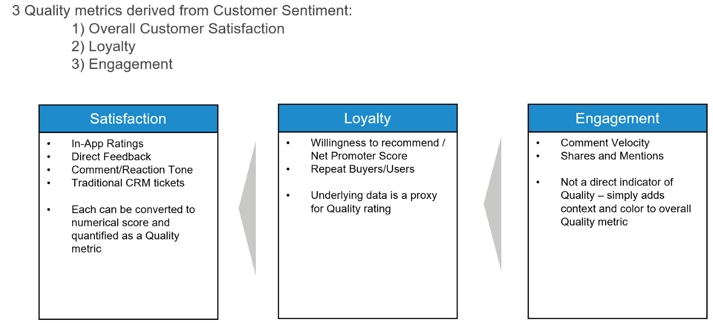
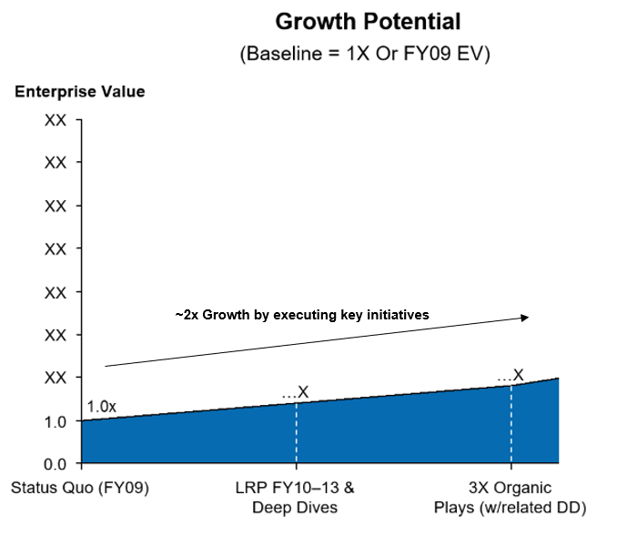
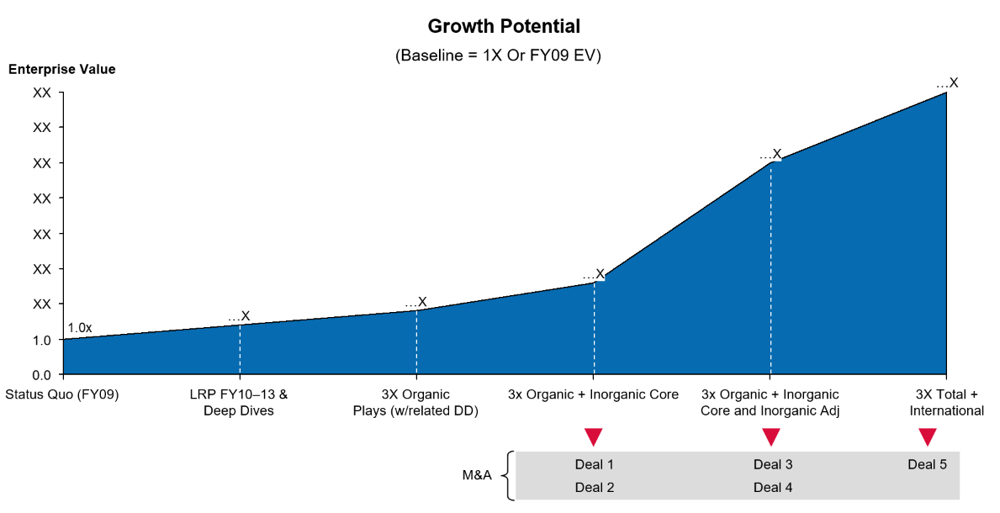
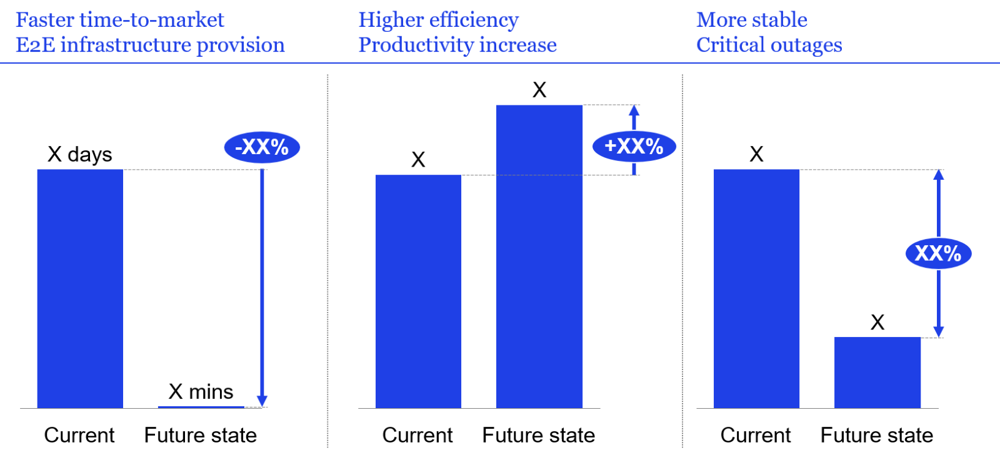
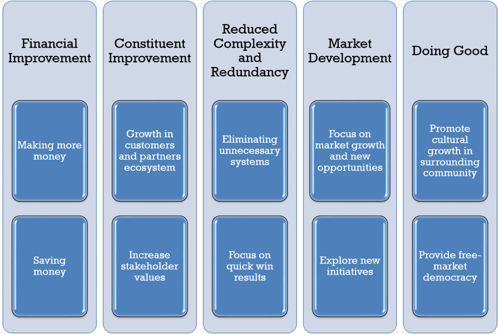
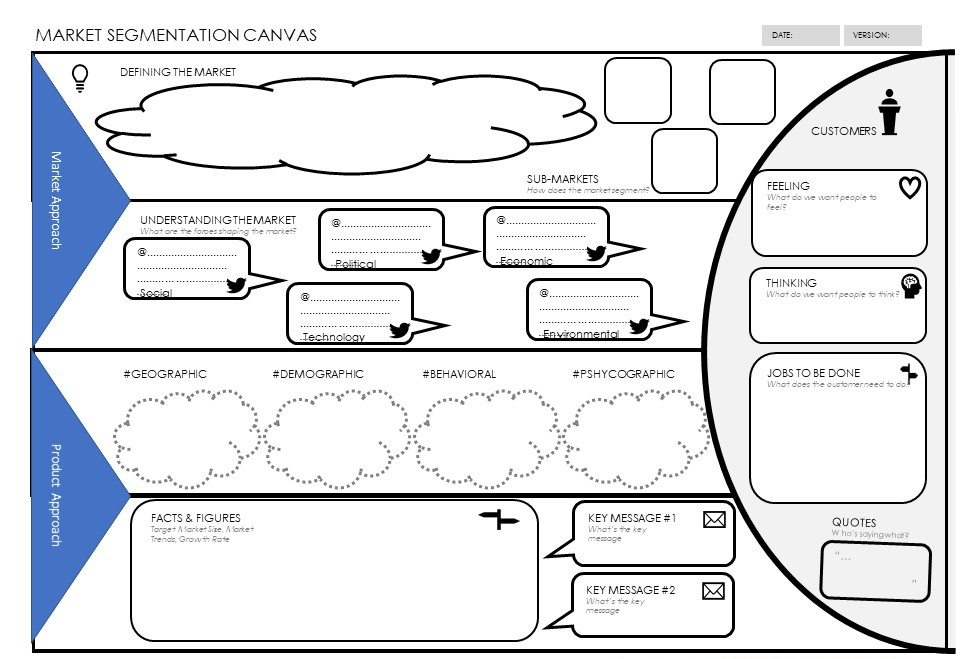

# Value Methods

As the practice improves [competencies](../competency_model/competency_model_m.md){:target="_blank"} at describing value in order to get projects funded, it can provide measurement tooling so the operations team can capture evidence based on metrics and can capture additional evidence over time. Once done, it provides the CxO the information they need to provide evidence of business impact delivered through technology. Through effort, this can over time or sometimes quickly shift attitudes about architecture and allow earlier access in the lifecycle which can be leveraged to create even greater impact.

But what about business functions that are perceived to have no direct relationship to value creation?

From a business perspective, Architecture is in many cases not seen as contributing to the creation of value. In fact, it is frequently viewed as a drag on value creation. A value sinkhole, or cost center, potentially even one that slows time to value.

This has several causes. Among them are some architects' penchant for philosophical 'ivory tower' thinking, various overzealous attempts at governance and control that slows product development, the perceived lack of actionable Architecture work products, overreliance on complex frameworks and models and what often appears to be no quantifiable ROI. In short, the business often believes Architecture costs too much, takes too long, delivers nothing tangibly useful and interferes with activities that do (e.g. Product Development). 

The reality is that Architecture is not a business function and doesn't show up as a plus or minus in the value equation. It is a *discipline* that impacts how well each of the business functions that create value are performed. Bad application architecture results in bad Development outcomes which impacts the value of the product or service delivered. No one wants to buy bad products. Revenue isn't what it could have been. Better Architecture would have increased the quality of the product. Better products leads to increased revenue. With this as the lens, Architecture is revealed to be directly tied to delivery of value.

Architecture as a business discipline creates value. And this holds true whether it is Enterprise Architecture, Business Architecture, Software Architecture, Information Architecture, Integration Architecture, Infrastructure Architecture, Security Architecture, or any other form of Architecture. Wherever the Architect is practicing his or her craft, the chances that value will be realized go up. Way up.

# Why Are Value Methods Important to Architects

*Because everyone wants better business and technology outcomes.*

The reality is that stronger Architecture results in better outcomes. It is therefore incumbent upon Architects to understand how to identify, measure and articulate the value they provide that ultimately drive better outcomes.

One cannot measure what has not been defined. Therefore, begin with defining the value an Architect brings to the table.

As mentioned earlier, an Architect's value is related to the rigor or discipline that their activities impart to the effort in question. It isn't as simple as saying "A logical architecture is worth $5K of value," however, it is possible to look at the activities performed by the Architect to help get to an answer.

**What are the architects activities?**

Depending on the context, the business function, and the company in question, an Architect may be performing many different tasks. They may not all be related to the Value Story, but at the highest level we can say that an Architect's activities and work products seek to improve the overall performance of a function. These activities are performed in some fashion and in varying degrees by all types of Architects and can be bundled into several key meta-activities:

1.  Describe the Context of the Change
    -   Why is change needed in this context?
    -   What is happening in the market/business/program/application that is driving this change?
    -   What does this change affect?
2.  Define the Improvement
    -   What is being changed?
    -   What does the current state look like?
    -   What will the target state look like? (i.e. How will it be changed?)
3.  Collect the Data
    -   What will it take to make the change?
    -   What are the costs (financial, performance, quality, resources, time, functionality)?
    -   What are the benefits (same possible aspects as above)?
4.  Perform the Analyses
    -   How well do the proposed changes meet the need? (i.e. What will success look like?)
    -   Are there alternative options for making the change?
    -   What are the costs vs. benefits over time?
    -   What are the associated risks of making or not making the change?
5.  Report the Results
    -   How will this change be explained to stakeholders?
    -   What does this change tell us about other changes? (i.e. What is being learned?)
    -   Is this change actually achieving the desired outcome?

In the development of an engagement model these activities are called 'The Red Thread' and are included in the Design Traceability as well as [Business Technology Strategy](strategy.md){:target="_blank"} competencies.

f these activities are not performed, or not performed well, the overall effort in question will suffer and expected benefit may not be realized. The Architect delivers value by executing these activities themselves (e.g. developing solution architecture) or ensuring that someone else executes them according to a standard (e.g. [governance](governance.md){:target="_blank"}, [analysis](analysis.md){:target="_blank"} and [extended team](extended_team.md){:target="_blank"}.

If the Architect performing these activities results in better outcomes, but there isn't a measure for how much each activity is worth to the effort in dollars, how is value defined?

**What is it Worth?**

The word 'value' itself has some problems in this context. The main issue is that value can be extremely subjective. What is of value to one Director of Application Development may not be of value to a Senior Manager of Risk and Compliance both [stakeholders](stakeholders.md){:target="_blank"} then have differing perspective on value for initiatives.

For this reason, architects need to be looking at outcomes when we are defining value. Outcomes in the BTABoK are defined using objectives. Acceptable or expected outcomes of an effort will be core to the effort, defined up front, and will provide the standard against which to measure for value.

To apply a formula to the Architect and their activities, the outcomes reflect the result of the effort in question as a measure against the cost of that effort against the time to achieve that effort. In effect, value is defined as follows:

**Value Aspect**

**Attributes**

Did we do what we said we'd do?

-   What were the expectations (OKRs, KPIs) for the effort?
-   Were they achieved, not achieved, exceeded?
-   Are they quantitative or qualitative in nature?
-   KPI's may reflect a level of quality, performance, growth, reduction, be denominated in dollars, time, people... in effect KPIs and OKRs are complicated

What did it cost?

-   Costs incurred delivering the change 
-   Costs required to operate and maintain the change 
-   New costs resulting from the change 
-   Hidden costs (brand, morale, reputation, etc.) 
-   Costs include hardware and software, people, office space,  other overhead costs (electricity), OpEx, CapEx... this is where understanding the fundamentals of valuation are so necessary for Architects

How long did it take?

-   Time to deliver versus the expectation laid out as part of the KPIs 
-   The impact of being behind or ahead of schedule (for the entire effort, for just a phase of the effort) 
-   Must include all lifecycle phases (e.g. Plan -- Build -- Deploy) 

Each of these components of value will have differing units of measurement associated with them depending on the context.

But this definition of "Value" is for the value of entire effort and doesn't reflect any individual role's part in delivering that value. How do we represent what part the Architect is playing for each Value Aspect? How does the Architect is contribute to the overall delivery of Value?

**Value Aspect**

**What is the Architect Contributing?**

Did we do what we said we'd do? 

-   Create and/or Review Business Case 
-   Manage and Prioritize Initiative Portfolio [Investment Prioritization](investment_planning.md){:target="_blank"} 
-   Risk/Compliance Analyses and Assessments 
-   Capture and Analyze Architecturally Significant Requirements 
-   Reference Architectures: Master, Context, Product-Specific 
-   Specialists in the Architecture Practice: Solution, Security, Data, Integration, etc. 
-   Capability Models [Business Capabilities](business_capabilities.md){:target="_blank"}, Technical Services) 
-   Standards and Frameworks [Principles](principles.md){:target="_blank"} 
-   Define and Articulate Solution Options [Decisions](decisions.md){:target="_blank"} 
-   [Objectives](objectives.md){:target="_blank"} (Key Performance Indicators / Success Metrics) 
-   [Stakeholder](stakeholders.md){:target="_blank"} Alignment 

What did it cost? 

-   Cost/Benefit Definition and Data Collection 
-   Cost-Benefit Analyses 
-   Standards and Frameworks (For Financial Analyses) 
-   Workforce Management Analyses 
-   Budgeting 
-   Financial Management and Reporting 

How long did it take? 

-   [Roadmaps](roadmap.md){:target="_blank"} 
-   Sequencing and Prioritization  
-   [Governance](governance.md){:target="_blank"} (Reviews, Toll-Gates) 
-   [Stakeholder](stakeholders.md){:target="_blank"} Communication 
-   Engagement Models 

The Architect doesn't deliver value simply by drawing a Technical Services Model for the SuperWidget product. After all, if it were a bad or confusing or incomplete diagram it wouldn't be viewed as adding value but probably the opposite. The value is not in the drawing itself but in the information that it captures, the manner in which it codifies that information and the clarity with which it conveys it to [stakeholders](stakeholders.md){:target="_blank"}.

It is the quality of the work product delivered (or activity performed) by the Architect that determines the degree of Value they contribute to the overall effort. It is these work products, or activities, that capture, codify and convey that help determine the overall outcomes. The better these are, the more positive the outcome, the more Value delivered.

Which begs the question, how does one measure that?

# The Four Most Common Methods

The purpose of measuring value is to help make decisions on whether to invest or not and once executed, to determine if that investment is realizing the expected benefits. As a result, value measurements may require some hard work, math, and plenty of analysis. Measuring value can sometimes have limits where the return on investment is non-financial or where it merely enables some other value-producing effort. For example, to measure the Value of the SuperWidget to the company, we may be looking at any of the following:

-   Improved Customer Satisfaction
-   Reduced Production Incidents
-   Improved Adherence to Regulatory and Compliance Standards
-   Protection of the Company Brand
-   Increased Revenue

And there could be others. This points to the importance of ongoing assessments of outcomes delivered, which are measured against a baseline, and they value they provide not just at the end of an initiative, but on a continuous basis. Given their skillset and typical presence across many domains of business technology, Architects are well-positioned to perform this valuation work.

In order to measure the value of an Architect's contributions they are often stuck trying to determine whether or not the work-products produced, or activities performed by the Architect were 'good' and therefore contributed to successful outcomes. As this can become subjective, a useful proxy can be found by looking at the [lifecycle](architecture_lifecycle.md){:target="_blank"} of work in which the Architect is engaged and objectively measuring one or more of the following key attributes:

1.  the **Quality** of the output
2.  the **Cost** of delivery
3.  the **Revenue** realized
4.  the T**imeliness** of the effort.

## Quality

Measuring Value by assessing quality of what has been delivered is useful across many delivery scenarios. In addition, it is especially useful in cases where risk and compliance, security and privacy or even simple customer experience issues are paramount. Did quality improve? If so, by how much?

Quality as a Value metric can be measured objectively in several ways:

1.  Production Incidents Over Time

1.  User or Customer Sentiment

1.  Speed of Delivery and "Doneness" of Requirements\
    In most development environments, especially those using Agile delivery, new iterations of applications are rapidly released to users. Rate of delivery is an important quality metric due to the fact that new releases typically contain fixes or enhancements to address user needs or wants. A higher frequency of releases that are delivered to the user should results in higher user satisfaction and better application quality.

    This can be measured quantitatively in several ways:

    1.  Number of releases -- This is the basic count of how frequently new features are delivered to users.
    2.  Agile stories which are "done" in a certain time period -- Counting the number of "stories," or user requirements, which are actually shipped to the user, provides a more granular measure of the rate of delivery and thus quality.
    3.  User consumption of releases -- For example, measuring the number of users who download or install a new patch or software update.
2.  Exemption and Tollgate Pass Ratio\
    The rate at which applications progress through the Software Development Lifecycle is often controlled by quality checks at specific points in the process. These tollgates exist to prevent poor quality applications or applications that may generate incidents from moving into production as-is.

    Assessing the number of times an application passes each of these reviews versus how many times it fails that check is a metric that can be used to describe quality. While the raw score lacks context (i.e. why did it fail the check?), it is a measurable and comparable metric. In addition the number of exemptions (failures during analysis which get overridden can be exceptionally valuable in understand architect influence and the value of engagement model and directly lead to the accrual of healthy vs unhealthy technical debt.

Not every approach is valid all of the time. But chances are good that one of these methods will work when faced with a scenario where the objective measurement of Quality resonates the most in articulating Value delivered.

Tenet: Aggressively Find Stakeholder Value Metrics.

The architect practice should consistently and aggressively discover objectives, KPIs and other capability analysis measures in common use in the organization. This should include all architects and tracked as a part of the engagement model and be included in the [role](roles.md){:target="_blank"} and [job descriptions](job_description.md){:target="_blank"}.

Quality as a Measure

In order to leverage Quality as the measurement, an effective baseline and established KPIs are necessary. For example, to know what 'good' looks like in terms of Production Incidents, a baseline or target must have first been defined at the outset of the effort (Something an Architect can do, incidentally).

An Architect impacts Quality by delivering or performing any of the following:

-   Engagement Models
-   Exemptions/Pass/Fail Rates (Architecture Analysis)
-   Risk/Compliance Analyses and Assessments
-   Capture and Analyze Architecturally Significant Requirements
-   Reference Architectures: Master, Context, Product-Specific
-   Specialists in the Architecture Practice: Solution, Security, Data, Integration, etc.
-   Standards and Frameworks (Principles)
-   Define and Articulate Solution Options (Decisions)
-   Objectives (Key Performance Indicators / Success Metrics)

Any positive Quality measurement is attributable, at least in part, to the Architect and Architecture. This would then become part of the Value Story and articulated as such.

## Cost

A cost perspective on delivering Value would be useful in scenarios where operational efficiencies are being sought. For example, application rationalizations, budget cuts or post-merger integrations are prime scenarios for this type of measure. In these cases, a large reduction in run-rate operating cost (cost reduction) or a large planned cost not incurred (cost avoidance) is associated with a large amount of Value delivered. What was the cost of delivering the output and was this less than expected?

Cost as a Value metric can be measured objectively in two main ways:

1.  Cost Reduction\
    **Cost reduction, also called Cost-saving measures,** are any actions that lower current spending, investment, or debt levels. They result in a tangible financial benefit for the organization and are measurable. The amount of money saved as a result of these measures should always be reflected in the financial statements and next year's budget. Actual cost savings should be visible in the financial statements compared to prior periods; planned cost savings should be reflected in the budget.

    Some examples of cost saving measures are: reduction of employees, renegotiation of existing contracts, negotiated price decreases for materials, elimination of software or hardware costs.

2.  Cost Avoidance\
    **Cost avoidance measures** are any actions that result in avoiding costs in the future. They represent potential increases in costs that are averted through specific preemptive actions. These measures will never be reflected in the budget or the financial statements.

    Some examples of cost avoidance measures are: a reduction of a proposed price increase from a vendor, the elimination of the need for additional headcount through process improvements, or a change in maintenance schedules for critical equipment to avoid work stoppages. A common example is implementing a new process for $X that negates the need to continue to do something else that costs $2X.

In some cases, both reduction and avoidance are part of the same cost-based Value measure. However, most scenarios that Architects are familiar with (e.g. program delivery) cost avoidance is the metric that is most often associated with Value. That is, we planned on the SuperWidget project costing $350K to deliver, but because of the Workforce Management Analysis conducted by the Architecture team, we are able to save on labor and deliver for $200K. A cost avoidance of $150K. The Architecture team can and should claim some part of that Value delivery.

Cost as the measurement requires a baseline. In order to know what a Cost Reduction is worth in terms of value, the existing run-rate must be known. Similarly, for Cost Avoidance, it must be known up front what costs are expected to be incurred so that the avoidance can be calculated.

*Tenet: How Many Business Cases Does the Team Write Themselves*

*The practice should be challenged and have a shared objective to write as many business cases as are possible and submit them through the same channels other business units do. This provides a measure of innovation.*

An Architect impacts Cost when delivering or performing any of the following:

-   Create and/or Review Business Case
-   Manage and Prioritize Initiative Portfolio
-   Capture and Analyze [Requirements](requirements.md){:target="_blank"}
-   Define and Articulate Solution Options [Decisions](decisions.md){:target="_blank"}
-   Cost/Benefit Definition and Data Collection
-   Cost-Benefit Analyses
-   Standards and Frameworks (For Financial Analyses)
-   Workforce Management Analyses [Assignment](assignment.md){:target="_blank"}
-   Budgeting (Benefits Realization)
-   Financial Management and Reporting (Benefits Realization)
-   Sequencing and Prioritization [Investment Planning](investment_planning.md){:target="_blank"} and Prioritization

Any successful Cost Reduction or Cost Avoidance effort is attributable to analysis and activities primarily performed by an Architect. It is a powerful metric for demonstrating the Value that Architecture can deliver.

## Revenue

The measurement of Value most often used is based on the metric of Revenue. This makes sense since revenue is perhaps the most clearly visible result of the delivery of Project X or Program Y and is reported monthly, quarterly and annually. Measuring Value by comparing revenue is most useful in scenarios that involve discreet products and services or other offerings with a direct association to a line of business. What was the revenue derived from the output of the effort?

Revenue as a Value metric is usually measured objectively in one of two ways:

1.  Existing Revenue Increase Over Time\
    Organic Growth of existing revenue streams is a useful way of measuring the value of Project XYZ and the impact of architecture on growing the business. The example below is existing revenue growth that is PROJECTED, but the measurement of ACTUAL growth after the projects have gone live is similar.

1.  New Revenue Added\
    Growth of revenue by adding new business as a result of Project XYZ that didn't already exist previously is a variation on the theme. In the example below, specific projects are projected to lead to new revenue by way of mergers and acquisitions.

There is a fine line between these two Revenue metrics and usually only one is applicable in a given context. In the case of existing revenue lines that are enhanced, the context typically involves an existing product or service that is having an update or new version. That is, the Revenue baseline for that business activity already exists and absent any other changes the increase (or decrease) in Revenue post-delivery is attributable to the work effort. In the case of new Revenue, the context involves a new product or service offering where none previously existed. In this case, even without a baseline for the related business activity, resulting revenue is entirely attributable to the work effort.

An Architect impacts Revenue when delivering or performing any of the following:

-   Create and/or Review Business Case
-   Manage and Prioritize Initiative Portfolio
-   Capture and Analyze Requirements
-   Reference Architectures: Master, Generic, Product-Specific
-   Other Architectures: Solution, Security, Data, Integration, etc.
-   Capability Models (Business, Technical)
-   Standards and Frameworks (Define, Publish, Socialize)
-   Define and Articulate Solution Options
-   Key Performance Indicators / Success Metrics
-   Stakeholder Alignment
-   Budgeting
-   Financial Management and Reporting
-   Roadmaps
-   Stakeholder Communication
-   Engagement Models

New Revenue or Increased Existing Revenue is a result of the entire effort. It is difficult to attribute any portion of this Value directly to, say, a really good Capability Model. But as in the examples above, the rigor that Architecture brings to delivering the product or service is an important aspect of the Value equation and should be front and center in the Value Story.

## Timeliness

The fourth most common way to measure Value is to assess the time to market. The oft-quoted phrase that time is money has some bearing on this. This is a useful metric for determining Value in scenarios involving net-new products or services, partnerships with third parties, regulatory compliance efforts, and efforts that are tied to the calendar year (e.g. open enrollment at a health payor). How long did it take to deliver the output and was this less than expected?

Time as a Value metric is typically measured objectively in one of two ways:

1.  On-time Delivery\
    This metric effectively depends on two things: the SCOPE of what is being done and WHEN it is expected to be delivered. In the example tracker below, targeted savings are measured by initiative over time.

1.  Accelerated Delivery\
    Value is measured by the degree to which various business and IT activities are sped up. These are quantitative measures that can be directly tied to dollars if need be.

These metrics are mutually exclusive and only one is applicable in any context. In the on-time scenario, the Value delivered is that expectations were met, i.e. things worked as they should have. This isn't always the most powerful argument except in cases where the business is routinely impacted by delayed delivery. In those instances, the Value of delivering on-time is comparatively enhanced. Accelerated Delivery scenarios involve leveraging Architecture to accelerate the lifecycle usually by streamlining existing processes (for example via frameworks or new methodologies) or enabling large scale reuse of existing capabilities.

Time as a Value metric requires a baseline to be meaningful. If the program doesn't know how long it expects to take to deliver the SuperWidget, then shaving 3 months off by reusing existing Integration Architectures won't be perceived as Value delivery. This is true for any Time as a Value metric.

An Architect impacts Timeliness when delivering or performing any of the following:

-   Manage and Prioritize Initiative Portfolio
-   Capture and Analyze Requirements
-   Reference Architectures: Master, Generic, Product-Specific
-   Other Architectures: Solution, Security, Data, Integration, etc.
-   Capability Models (Business, Technical)
-   Standards and Frameworks (Define, Publish, Socialize)
-   Define and Articulate Solution Options
-   Stakeholder Alignment
-   Roadmaps
-   Sequencing and Prioritization
-   Governance (Reviews, Toll-Gates)
-   Stakeholder Communication
-   Engagement Models

## The Value Measure

While these four approaches to measuring outcomes will produce the metric needed to demonstrate Value delivery by Architecture, the metric alone is useless if it is not paired with a compelling narrative. In the case of Revenue as a Value metric, it is extremely difficult to tie part of a revenue increase directly to an Architecture activity or work-product. The case can still be made, however, with a good narrative produced for the right audience backed by the underlying data.

Understanding how to compose and deliver a Value Story that resonates with the audience is one of the most critical skills for an Architect. It isn't just smoke and mirrors. It is a data-driven story that demonstrates how and where Architecture delivers Value.

Another Method for Assessing Value

The challenge with trying to describe value is in determining how value will be measured and where the value will come from. In the example, customers can complete a sales in person, on the phone, and online. The cost of sale online is least expensive and cost in store is most expensive.

## Constituent and Operational Value

This value category includes operational measures and stakeholder measures. These are business measures which are used by stakeholders to make decisions but which may not be directly related to financial outcomes. For example a customer survey done on the website or the time to clean an airplane are useful measures whether they are related back to financial returns or not.

To understand how to measure success in this category think about the way you would measure a successful manufacturing line. How quickly items come off the line? How many defects are there per 100 items?

## Simplicity and Reuse

Simplicity and reuse are one of the most commonly mentioned value categories but surprisingly little is known about how to measure them. Making something simpler is difficult to describe in relation to making it more flexible.

| **Outcome** | **Description** | **Measure** |
| --- | --- | --- |
| Reduced Technical Debt | The amount of technical debt is the number of poor decisions which lock the orgaization into a single technology choice. | Measure technical debt as the cost to reverse a decision. |
| Increased Reuse | Reuse refers to the number of systems which utilize a single business or technical function. | Measure API level calls and which systems are dependent. |

## Market Dynamics

Critical market changes are driven by technology innovation whether it is disruptive or incremental. The architect team should measure impacts and use innovation methods to look at possible market impacts. Competitive analysis tools and market trend techniques are invaluable.

| **Tool** | **Description** | **Use** |
| --- | --- | --- |
| PESTLE | Used to derive the forces at work on the enterprise such as political, environment, legal forces. | Focus on the impacts to the particular portion of your business being impacted. |
| SWOT | Tool to understand the strengths, weaknesses, opportunities and threats within a particular activity. | Requires a multi-disciplinary approach to correctly understand the organization. |
| Platform Design Toolkit | The toolkit provides platform thinking which enables organizations to understand themselves as a part of an ecosystem of change. | [https://platformdesigntoolkit.com/](https://platformdesigntoolkit.com/){:target="_blank"} |

## Doing Good

Most government agencies and non-profits use separate tools from their for profit counterparts as they are not in the business to make money but to provide value to their citizen, stakeholder or mission. The do good category is used to describe value in these scenarios.

| Mission Model Canvas |   |   |
| --- | --- | --- |
| A Unit of Good | A measured shared unit which correlates to goodness for the primary constituent of the organization. | This may come from the achievement section of the MMC. |

To be effective in growing and innovating in this space it is necessary to extend beyond the cost savings and reuse space and extend into the benefits space. To do this for a business case rate the business case on its target achievements and give them a score in relation to your overall mission. For example, at Iasa, holding an event for architects may get a value to membership rating of 2 (on a scale from one to ten) but the development of a accreditation for masters degrees in architecture gets a 8. These may be arbitrary scales but they will keep you focused on innovation as opposed to simple cost reduction.

# References

**IT Value Network: From Investement to Stakeholder Value**

BTABoK 3.0 by [IASA](https://iasaglobal.org/) is licensed under a [Creative Commons Attribution-NonCommercial 4.0 International License](http://creativecommons.org/licenses/by-nc/4.0/). Based on a work at [https://btabok.iasaglobal.org/](https://btabok.iasaglobal.org/)