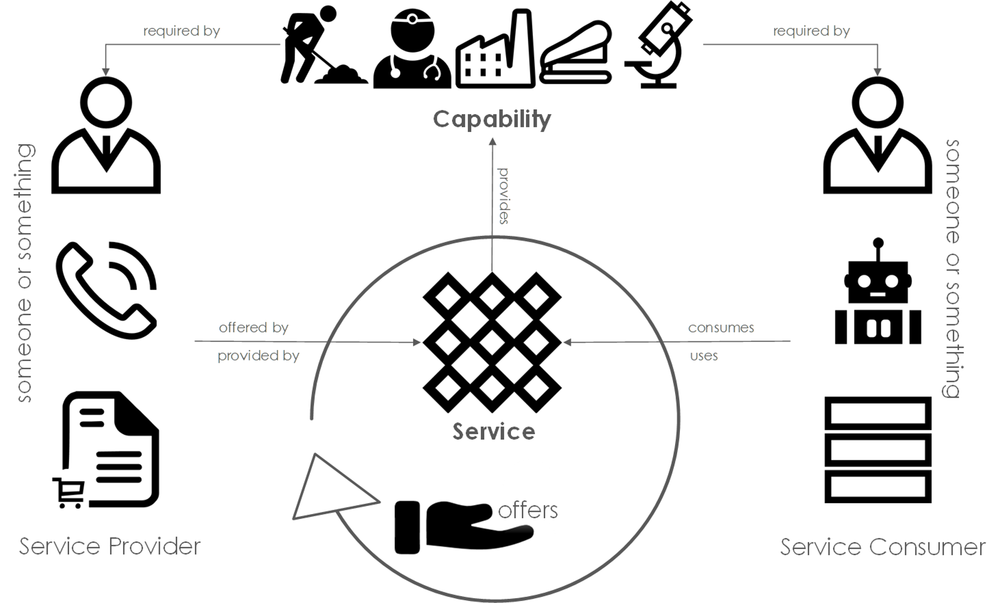
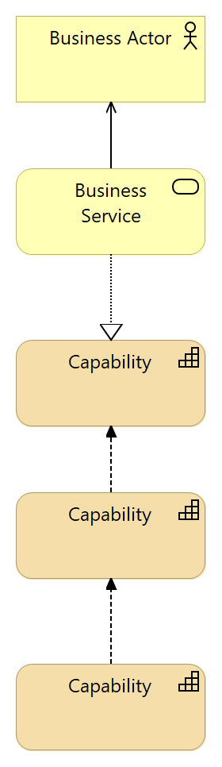
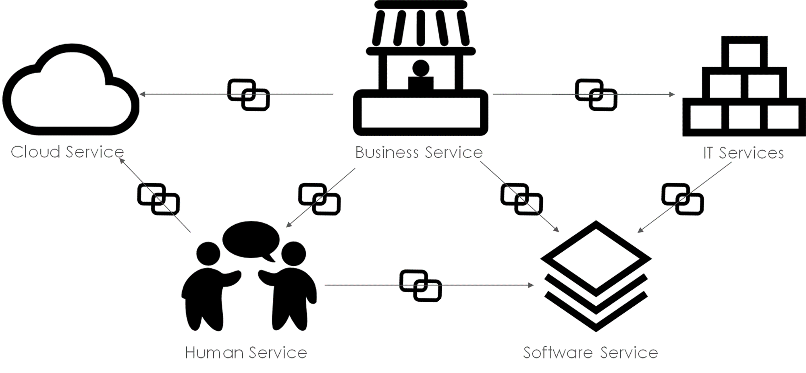

# Definition

Value Streams represent  how and organisation configures it's [business capabilities](business_capabilities.md){:target="_blank"} to deliver value to an internal or external [stakeholder](stakeholders.md){:target="_blank"} typically a customer. The value streams explains how the core value proposition or elements of that value proposition are enabled by the organisations business capabilities. Within more complex Value Chains or within [Ecosystems](ecosystem.md){:target="_blank"} this will include Business Capabilities performed by partners or other Ecosystem participants.

Value streams respond to events or signals that trigger or indicate that a stakeholder wants, needs or desires the outcome 'the value' from that value stream. Value Streams include the signal/event, stakeholders (value recipients), stakeholders (enabling participants), value proposition elements

**Disambiguation**: Lean Value Stream mapping -- Lean Value Stream Maps also describe the flow of value resulting from the execution of a set of steps to deliver value to the customer. Value Stream Maps describe the flow of both materials, information and activities within an organisation. Value Stream Maps are 'how' focused, they describe the detail of flows with an objective of identifying and eliminating waste. Value Streams as defined here are 'what' focused (business capabilities are 'what and organisation does. The objective is to understand value flow and value configuration. Both techniques are valuable however the level of detail and is different value stream mapping is typically implementation level detail -- who, with what. Value streams are design and analytical tools at a less granular level of detail.

# Why it matters?

Whether you are trying to bring a new product or service to market, merge or acquire, change your sourcing, transform digitally, enter new markets or optimise operations you will need to understand how value flows to customers and other stakeholders through your organisations capabilities. Value Streams are a method for value configuration in your organisation and allow architects to understand how value flows can be optimised. The challenges that can be revealed and solved using this technique include indiscrimination of customer segments (i.e. standardising where specialisation was more appropriate), understanding dependencies of and linkages between capabilities, understanding impact of regulatory or legislative changes, identifying structural waste and inefficiencies, internationalisation or customisation of products/services, creating new value streams using existing capabilities and last but not least Service Orientation and the designing loosely coupled systems.

# Details

Value Streams a or Capability Value Streams represent a viewpoint that capture value flow through capabilities. This method depends on the concept of business capabilities and the discipline of capability mapping [explained BUSINESS CAPABILITIES]. The practices emerged  as a result of the inadequacies of other methods namely  organisation charts, process flow diagrams and technical blueprints as ways of explaining what an organisation does and how if delivers value. Value Streams are an extension of business capability models and allow an architect to map the flow of value through and organisation and understand what services are involved in the delivery of that value.

## Capabilities, Services  & Value Streams

Capabilities are linked to each other by services, services in this context are used in a general sense and should not be assumed to be 'web services' or 'micro-services'. The connection between Business Capabilities is via Services and each pair form a consumer/provider pair. From a stakeholder perspective the capabilities are only experienced via the services that expose them, they act as a semi-porous skin on the organisation. From outside and organisation capabilities are only apparent through the services that realise them, their internal working are unclear and may be inferred but not obvious e.g. Uber provides a car-ordering service and a trip-payment service.  These provide tangible evidence that Uber must have some sort of car logistics capability, and payments capabilities but its precise inner workings are not visible.

Figure 1: Business Services

## Events, Demand Signals & Value Streams

Value Streams are triggered by specific events resulting from external stakeholder actions e.g. placing an order for a domino's pizza. Events can result from specific commands from stakeholders e.g. Command: Place Order/Event: Order Received , time-based e.g. fixed: end of month or relative: 5 days since event occurred. Demand Signals are the signals passed along the Value Stream between services you can think of them as messages exchanged between cooperating services that enable value to flow.

# Proven Practices

## Key Deliverables

There are many ways of capturing and the output from a Capability Value Stream, however there is no one standard approach or definition of output. The key to this as with other techniques is to ensure that the deliverable addresses the concerns of the stakeholders. Formal modelling and analysis are useful and create tangible outputs however, the techniques do not depend on any language or toolset

## Finding Value Streams

Step 1 in any Value Stream activity is finding the value streams. A number of starting points exist depending on the context.

## Customer Starting Points

-   Option 1: Products/Service -- The easiest starting point is with Products/Services as the tangible manifestation of value as understood by a customer
-   Option 2: Business Model  -- start with the companies business model and explore the value proposition
-   Option 3: Ancillary Business Services -- Pre/Post activities- returns, faults, complaints, billing, information

## Other Stakeholder Starting Points

-   Option 4: Financial -- find and follow the money
-   Option 5: Operational -- find and follow the activity
-   Option 6: [Governance](governance.md){:target="_blank"} -- find and follow the outcomes (rules, policies, principles)

## Capability Value Stream Mapping

*Goal: Understand the value flow*

*Purpose: Exploration*

Capability Value Stream Mapping is a technique that involves exploring and understanding the capabilities required to deliver on an organisations value proposition to a stakeholder. A generic model looks something like Figure 2: Generic Capability Value stream.

Figure 2: Archimate 3 -- Generic Capability Value Stream -- Descriptive

The Value Stream describes the value flow, the connections between capabilities indicate boundaries. Concepts such as Bounded Contexts from Domain Driven Design provide a useful way of organising elements of the map. Each exchange between capabilities can be subsequently modelled as a Service Interaction between a consumer & a provider. This approach lends itself to the identification and development of Service Models supporting collaboration across Capabilities.

## Scenarios for Use

-   Scenario 1: Organisation has an existing Business Capability Model covering the domain
-   Scenario 2: Organisation has no business capability model and no familiarity with business capability thinking

## Steps

Step 1: Value Stream Storming

-   Capture the capabilities (Scenario 1: Use the existing Capability Model/Scenario 2:
-   Capture the events
-   Capture the services

Step 2: Describe the Service(s) -- service consumer/service provider viewpoints

Step 3: Find the Value Flows -- how does value flow

Capability Value Streams & Understanding Systems
------------------------------------------------

Systems have a set of characteristics

-   ***Boundaries*****:**  boundaries help us understand what's in and what's outside of the system, in the context of a value stream we are looking to find where the boundaries lie.
-   ***Hierarchy*****:**  systems are often composed of smaller systems which in turn encompass even smaller systems, hierarchies typically come with systems of control which influence behaviours within, in the context value streams we need to understand the impact of hierarchy on value flow.
-   ***Interdependence*****:**  The elements within a system need to collaborate to achieve the objectives of the whole system.  Often, systems must also collaborate with other systems in the wider environment.  Interdependence and collaboration requires the flow of energy, material and information. In the context of value streams we need to understand inter/intra system dependencies and flows.
-   ***Differentiation*****:**  Units within a system can be specialised to perform specific functions, such as a Human Resources Department, an Information Technology Department, a Marketing Department, a Production Department and an Executive Board. In the context
-   ***Goals*****:**  Systems have a purpose, which they attempt to fulfil.  Subordinate elements within an organisation have their own objectives, which may sometimes be counter-productive.  This was recently demonstrated by bankers working towards bonuses in a way that threatened the banks they worked for with collapse.
-   ***Regulation*****:**  Systems respond to feedback to adjust their behaviour.  The banking industry failed to identify, measure and respond to increasing levels of risk, and therefore did not adjust its behaviour to reduce endemic risk levels before the banking crisis took hold

Capability Value Stream Performance Analysis
--------------------------------------------

*Inputs: Capability Value Stream Map, Business Capability Model*

*Goal: Understand impact of capability performance on value flow*

*Purpose: Find the pain*

Each Capability exhibits a level of Performance based on the efficiency and effectiveness of that capability. There are a number of approaches to establishing the performance both absolute numbers, performance indicators, expert judgement. The goal is to quickly establish a map of performance as it relates to value streams.

TODO: Figure 4: Capability Value Stream

## Scenarios for Use

-   Scenario 1: Organisation has an existing Business Capability Model covering the domain with performance pre-measured (see Figure 3)
-   Scenario 2: Organisation has no business capability model, capabilities must be captured and performance measured

## Steps

Step 1: Map Capability Performance to the Capability Value Stream

Step 2: Identify Key Pain Points (Performance Impacts)

Step 3: Identify Structural or Flow Pain Points i.e. the configuration of capabilities in the flow

Step 4: Identify Information Gaps/Assumptions/Inconsistencies

Step 5: Identify Pain Relief/Value Maximising Options

Step 6: Describe/Set future state performance characteristics

Capability Value Stream Contribution Analysis
---------------------------------------------

Inputs: Capability Value Stream Map, Business Capability Model, Capability Performance Map

Goal: Understand capability contribution on value flow

Purpose: Find what's important

Capabilities come in all shapes and sizes. Capability Contribution captures the impact of the capability along 2 dimensions -- Strategic/Value Proposition and Financial (Cost/Revenue). Capabilities classified as

-   Advantage: Capabilities with high value proposition impact AND drive financial results
-   Strategic Support: Capabilities with high value proposition impact AND little financial impact
-   Essential: Capabilities that drive financial performance but not little value proposition impact
-   Business Necessity: Capabilities that are necessary but not seen as creating value or driving financial performance

Figure 5: Capability Contribution

## Scenarios for Use

-   Scenario 1: Organisation has an existing Business Capability Model covering the domain with contribution pre-measured (see Figure 3)
-   Scenario 2: Organisation has no business capability model, capability contribution is no

## Steps

Step 1: Map Capability Contribution to the Capability Value Stream

Step 2: Identify High Impact Capabilities

Step 3: Identify Business Necessity/Essential capabilities participation in the Value Stream

Step 4: Identify Information Gaps/Assumptions/Inconsistencies

Step 5: Identify Value Maximising Options

Capability Value Stream Service Orientation Analysis
----------------------------------------------------

Inputs: Capability Value Stream Map, Business Capability Model

Goal: Understand Service Boundaries, Service Interactions and Value Flow

Purpose: Find Services, Service Boundaries

Figure 6: Services are Connected

Capability Value Stream Financial Analysis
------------------------------------------

Inputs: Capability Value Stream Map, Business Capability Model, Business Capability Contribution Maps

Goal: Understand Service Boundaries, Service Interactions and Value Flow

Purpose: Find Financial Impacts Cost/Revenue

Capability Value Stream Regulatory Impact
-----------------------------------------

Inputs: Capability Value Stream Map, Business Capability Model, Business Capability Contribution Maps, Regulatory Frameworks

Goal: Understand Impact of New/Updated Regulation

Purpose: Find Regulatory Impact

-   Scenario: Example -- GDPR implications for a value

Related Concepts
================

-   Customer Journey Mapping
-   Service Blueprinting
-   Business Capability Modelling
-   Event-storming

References
==========

**Value Streams Wikipedia**
[https://en.m.wikipedia.org/wiki/Value_stream](https://en.m.wikipedia.org/wiki/Value_stream){:target="_blank"}

**SAFE 2.0**
[http://www.scaledagileframework.com/value-streams/](http://www.scaledagileframework.com/value-streams/){:target="_blank"}

**Entabula -- Sehmi, Lloyd, Deacon, Mac Críosta BIZBOK**
[http://www.businessarchitectureguild.org/page/About](http://www.businessarchitectureguild.org/page/About){:target="_blank"}

**SOA Patterns  -- Thomas Erl**
[http://www.soapatterns.org/](http://www.soapatterns.org/){:target="_blank"}

**Service Choreography**
[https://en.wikipedia.org/wiki/Service_choreography](https://en.wikipedia.org/wiki/Service_choreography){:target="_blank"}

**Identifying Value Streams**
[http://www.scaledagileframework.com/identify-value-streams-and-arts/](http://www.scaledagileframework.com/identify-value-streams-and-arts/){:target="_blank"}

BTABoK 3.0 by [IASA](https://iasaglobal.org/) is licensed under a [Creative Commons Attribution-NonCommercial 4.0 International License](http://creativecommons.org/licenses/by-nc/4.0/). Based on a work at [https://btabok.iasaglobal.org/](https://btabok.iasaglobal.org/)