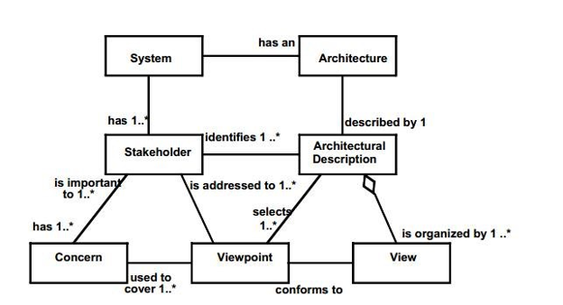
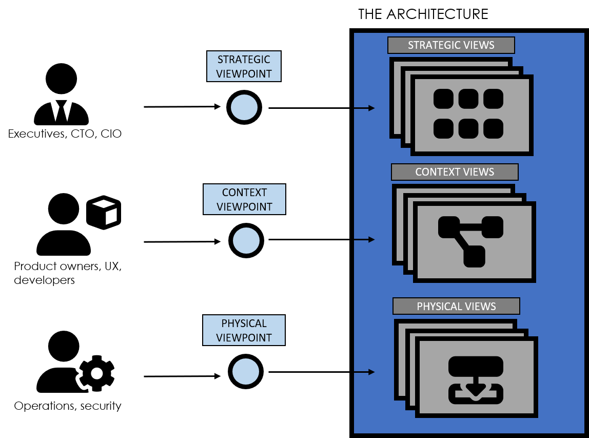

# What is a View

"what you can see from a particular place, or the ability to see from a
particular place" **-- definition of View, Cambridge Dictionary**

As the name suggests a view shows a part of an architecture from a
particular perspective. This is the primary method for communicating an
architecture to many different stakeholders. In order to organize,
construct and structure views, viewpoints are used. A viewpoint provides
the rules for constructing views and provides guidance on where to use
the views.

Views and Viewpoints are a fundamental part of architecture work, and
are included in many books or courses which teach architecture.  

They must be important, so why do they exist? Basically, they provide a
a structured approach to thinking about and describing an architecture, so
let\'s think about that a little bit.  

Describing an architecture isn't just a fun activity. The purpose is to
satisfy the needs of multiple stakeholders who are in fact the customers
of the architectural activities.  

We can draw an analogy with a car. There are lots of people who have an
interest in the features of the car, some need to understand how the car
works in different ways or provides input into how it should behave.
These include: 

- **People who use the car** -- these are probably the main
  stakeholders and include drivers and passengers. They need to have
  features which allow them to control the car and make driving
  easier, such as cruise control and ABS. 

- **People who service the car** -- mechanics need technical
  descriptions of the inner workings and specifications of service
  procedures 

- **People who sell the car** -- salesmen need the facts and figures
  available in a way that will tempt the customer to buy the car 

- **Fuel stations or charging providers** -- these are interested in
  the demand for their products and how they will be delivered 

In the car example, there are many more groups with a specific interest,
but these are perhaps the main stakeholders. All of these people are
looking for something different, they are focusing on different
concerns. In other words, they view the car from different viewpoints,
and to address these stakeholder concerns different views (technical
descriptions, interior design, facts and figures) can be used.

# Why Views are important

Views are the central way in which architecture is described to
stakeholders. The stakeholders may be other architects or roles which
have an interest in the architecture, for example, executives, product
owners, developers or operations teams. The views which describe the
architecture address the concerns of these stakeholders, since they
describe how the architecture solves a particular problem.

The views of the architecture provide a basis for describing the design
of the architecture. The views are often collected in a set of
architectural documents where designs are described and motivated. The
availability of views provides a basis for sustaining and maintaining
the architecture.

Views are a valuable tool for the architect. The architect can use views
as a thinking tool, to consider alternative architectures. The architect
also uses views to assess the effect of change on the architecture, and
the consequences for stakeholders. When making modifications to the
architecture it is important that the stakeholders are aware of any
consequences. Several views may be affected, by the modification and
these views play an essential part in communicating the consequence of
the changes.

# Views Approach

## Keep Views Simple

Views are the primary method for communicating an architecture to both architects and other stakeholders. Putting too much information in a single view can make the view difficult to understand. If an aspect of the architecture is complex, try using serval views to make each view understandable.

## Models Facilitate Views

Using models (and modelling tools) rather than static diagrams to design an architecture provides distinct advantages in creating views. Since the views are connected to the model, changes in the model can be will be reflected immediately in any views. This provides the architect with a very useful way to assess the impact of change. Changes can be made to the model and the impact on the architecture views can be analysed together with the different stakeholders.

# The Origins of Views and Viewpoints

<mark>COMMENT:SD: _We should look at the structure of this section, perhaps describe viewpoints clearly before moving on to views. Some of the following sections felt like a mix.</mark>

The concept of views and viewpoints originated back in the 1970's (ref:
Ross's Structure Analysis and Design Technique) the Views became widely
accepted following the development of Kruchten's 4 + 1 architecture
model, they have since been formalized in the *"[ISO/IEC/IEEE
42010:2011], Systems and software engineering --- Architecture description"*(http://en.wikipedia.org/wiki/ISO/IEC_42010). The model below
shows the context and relationships of views and viewpoints with the
architecture description, stakeholders and concerns: 

 

**Figure 1. Excerpt from Conceptual Framework of ISO42010 **

Views and viewpoints are defined in slightly different ways by different
organizations. The definitions adopted by IASA are:

> "A **Viewpoint** is a collection of patterns, templates, and conventions
> for constructing one type of view. It defines the stakeholders whose
> concerns are reflected in the viewpoint and the guidelines,
> principles, and template models for constructing its views. "
> 
> "A **View** is a representation of one or more aspects of an architecture
> that illustrates how the architecture addresses the concerns held by
> one or more of its stakeholders." 

# Working With Views in Practice

When developing an architecture for any business need there are a many
of challenging questions the architect needs to answer, for example: 

- What functionality is required at the business capability level and
  who will use it? 

- What information needs to be managed, and how is it stored and sourced? 

- How will the elements of your system interact with each other,
  internally and externally, will it provide an API? 

- Where will the system run, on-prem or in the cloud and what software
  components are needed 

- How will the system be developed and what environments such as dev,
  test, performance test are needed? 

- What are the operational needs of your system? 

When the architect considers such questions, the groups of
stakeholders start to take shape and the architect can determine what is
important for the architecture depending on where the areas of
complexity are.

Presenting anything other than the simplest of architectures in one
diagram makes the architecture difficult to communicate and the diagram
rapidly becomes unusable and unwieldy. The use of views provides
different ways to describe the architecture representing the needs of
the different stakeholder groups who care about what is being delivered.
This lets stakeholders focus on the things that are important to them
and ensure that the architecture will successfully deliver business
value.

This results in the architecture documentation being a collection of
descriptions of the architecture being developed focusing on different
aspects, hence providing different Views of the architecture.

## Viewpoint Selection

The architect creates or uses viewpoints to communicate the architecture in a way that addresses a particular set of stakeholder concerns. The viewpoint provides the basis and tools for constructing views for the stakeholders. The following diagram shows several viewpoints the architect may use with different types of stakeholders.

Often an organization will mandate a set of viewpoints defined in the
template for the architecture description, but sometimes it will be up
to the architect to make the selection. A number of factors may influence the selection of viewpoints:

- the complexity of the architecture being defined 
- the type of system or systems being described
- the stakeholder whose concerns are being addressed 

However, experience will allow the architect to extend the set of views
as needed, especially if the mandated framework only has a few views.
For example: in frameworks where Security is not explicitly defined, it
often gets added as an extra view.

The number of views created varies greatly depending on the size and
complexity of the project and organization and the choice of which
architecture views to develop is one of the key decisions that the
architect has to make. 

In summary, the architect is responsible for:

- The completeness (fitness-for-purpose) of the architecture, in terms of adequately addressing all the pertinent concerns of its stakeholders

- the integrity of the architecture, in terms of connecting all the various views to each other, satisfactorily reconciling the conflicting concerns of different stakeholders 

- showing the trade-offs made in so doing (as between security and performance, for example).  

- The architect should choose viewpoints from a viewpoint repository. 

- The architect can then prepare models to detail views and make each of the views conform to a viewpoint. 

## Viewpoint Libraries

There are many Viewpoints sets or libraries which are used in different
architecture methods. The number of Viewpoints in each set varies
depending on the scope and level of granularity of the architecture
method being applied. A comprehensive list of frameworks are available
at [iso-architecture.org](http://www.iso-architecture.org/42010/afs/frameworks-table.html).

Each Viewpoint library has different strengths and they are targeted at
different aspects of the architecture description. Software-intensive
systems commonly use the following models:

- Kruchten's 4 + 1 architecture view model

- Views and Beyond -- Documenting Software Architectures

- Rozanski and Woods Software Systems Architecture 

- C4 model from Simon Brown (https://c4model.com/) 

There is also a wide range of frameworks for Enterprise Architecture.
The following are examples of commonly used frameworks:

- [Tom Graves Approach](https://itabok.iasaglobal.org/itabok3_0/views-and-viewpoints/views-viewpoints-3-0-tom_graves/) 

- [Architmate and TOGAF](https://itabok.iasaglobal.org/itabok3_0/views-and-viewpoints/views-viewpoints-3-0-archimate/)

- [FEAF](https://itabok.iasaglobal.org/itabok3_0/engagement-model-overview-3-0/federal-enterprise-architecture-framework/) 

Organizations have very different levels of maturity with regard to
developing architectures, and the architect needs to determine if there
are viewpoints already defined in the organization's
<u>repository</u>, if a library is already assembled that can be
used and if the viewpoints are appropriate to the problem space which is
being described. If there are no appropriate viewpoints, the architect
may use one of the available frameworks listed above.

Well-formed viewpoints will answer the challenging questions asked of an
architecture. When reviewing a viewpoint, determine what information to
include in the views that are to be created. A viewpoint can be thought
of as a template which can be used to provide predictable artefacts in a
repeatable fashion. 

# Examples of Viewpoints and Views

## Strategic Viewpoint

<mark>Describe...</mark>

Examples of information which may be communicated in strategic views are:

- Strategic Roadmap
- Capability Map
- Organisation

## Landscape Viewpoint

<mark>Describe...</mark>

Examples of information which may be communicated in as part of a landscape view are:

- Systems
- Services
- Information flows

## Context Viewpoint

<mark>Describe...</mark>

Examples of information which may be communicated in context views are:

- Systems and components
- Interaction/Information flows
- Actors

## Process Viewpoint

<mark>Describe...</mark>

Examples of information which may be communicated in process views are:

- Processes
- Activities
- Control flows

## Development Viewpoint

<mark>Describe...</mark>

Examples of information which may be communicated in development views are:

- Components
- Classes
- Information Structure
- Relationships (association, generalization, etc...)

## Physical Viewpoint

<mark>Describe...</mark>

Examples of information which may be communicated in physical views are:

- Execution environments
- Hardware
- Communication flows and protocols

# References and Further Reading

**Developing Architecture Views**

[https://pubs.opengroup.org/architecture/togaf8-doc/arch/chap31.html](https://pubs.opengroup.org/architecture/togaf8-doc/arch/chap31.html) 

**Architecture Viewpoints**

[https://pubs.opengroup.org/architecture/archimate2-doc/m/chap08.html](https://pubs.opengroup.org/architecture/archimate2-doc/m/chap08.html) 

**Generic Viewpoints**

https://en.wikipedia.org/wiki/View_model#Viewpoints 

**An introduction to the IBM Views and Viewpoints Framework for IT
systems -**
[https://www.ibm.com/developerworks/rational/library/08/0108_cooks-cripps-spaas/index.html](https://www.ibm.com/developerworks/rational/library/08/0108_cooks-cripps-spaas/index.html) 

**ISO/IEC/IEEE 42010:2011  Systems and software engineering --- Architecture description**
http://en.wikipedia.org/wiki/ISO/IEC_42010 

https://www.iso.org/standard/50508.html
