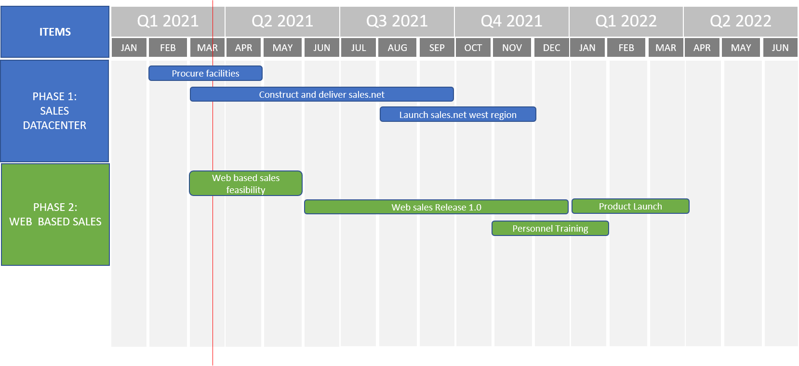
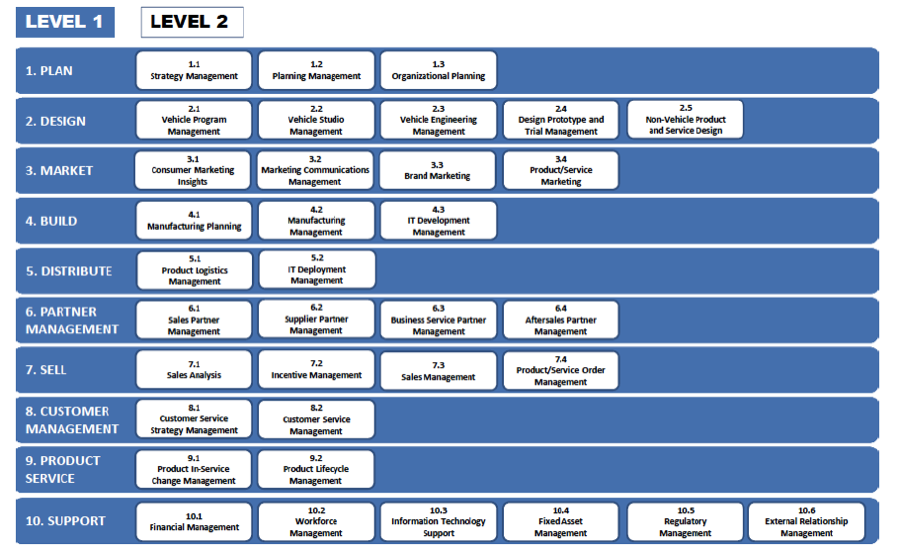
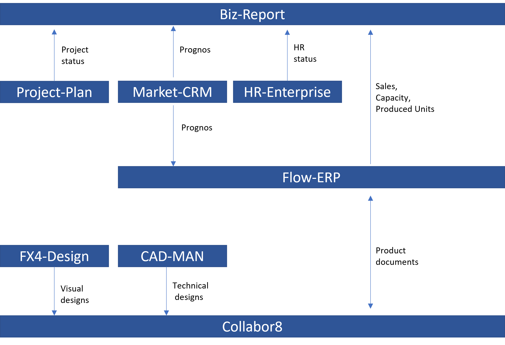
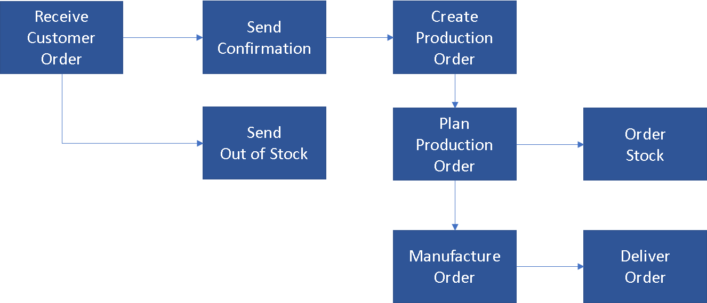
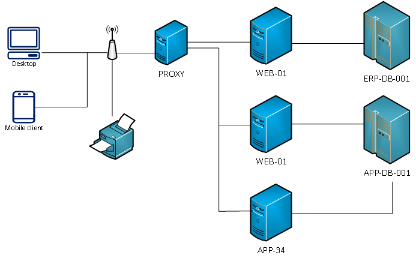

> "What you can see from a particular place, or the ability to see from a particular place"
**definition of View, Cambridge Dictionary**

# What is a View

As the name suggests a view shows a part of an architecture from a particular perspective. This is the primary method for communicating an
architecture to many different stakeholders. In order to organize, construct and structure views, viewpoints are used. A viewpoint provides
the rules for constructing views and provides guidance on where to use the views.

Views and Viewpoints are a fundamental part of architecture work, and are included in many books or courses which teach architecture.  

They must be important, so why do they exist? Basically, they provide a a structured approach to thinking about and describing an architecture, so let\'s think about that a little bit.  

Describing an architecture isn't just a fun activity. The purpose is to satisfy the needs of multiple stakeholders who are in fact the customers
of the architectural activities.  

We can draw an analogy with a car. There are lots of people who have an interest in the features of the car, some need to understand how the car
works in different ways or provides input into how it should behave.
These include: 

- **People who use the car** -- these are probably the main   stakeholders and include drivers and passengers. They need to have
  features which allow them to control the car and make driving   easier, such as cruise control and ABS. 

- **People who service the car** -- mechanics need technical   descriptions of the inner workings and specifications of service procedures 

- **People who sell the car** -- salesmen need the facts and figures available in a way that will tempt the customer to buy the car 

- **Fuel stations or charging providers** -- these are interested in the demand for their products and how they will be delivered 

In the car example, there are many more groups with a specific interest, but these are perhaps the main stakeholders. All of these people are
looking for something different, they are focusing on different concerns. In other words, they view the car from different viewpoints,
and to address these stakeholder concerns different views (technical descriptions, interior design, facts and figures) can be used.

# Why Views are important

Views are the central way in which architecture is described to stakeholders. The stakeholders may be other architects or roles which
have an interest in the architecture, for example, executives, product owners, developers or operations teams. The views which describe the
architecture address the concerns of these stakeholders, since they describe how the architecture solves a particular problem.

The views of the architecture provide a basis for describing the design of the architecture. The views are often collected in a set of
architectural documents where designs are described and motivated. The availability of views provides a basis for sustaining and maintaining
the architecture.

Views are a valuable tool for the architect. The architect can use views as a thinking tool, to consider alternative architectures. The architect
also uses views to assess the effect of change on the architecture, and the consequences for stakeholders. When making modifications to the
architecture it is important that the stakeholders are aware of any consequences. Several views may be affected, by the modification and
these views play an essential part in communicating the consequence of the changes.

# Views Approach

## Keep Views Simple

Views are the primary method for communicating an architecture to both architects and other stakeholders. Putting too much information in a single view can make the view difficult to understand. If an aspect of the architecture is complex, try using serval views to make each view understandable.

## Models Facilitate Views

Using models (and modeling tools) rather than static diagrams to design an architecture provides distinct advantages in creating views. Since the views are connected to the model, changes in the model can be will be reflected immediately in any views. This provides the architect with a very useful way to assess the impact of change. Changes can be made to the model and the impact on the architectural views can be analyzed together with the different stakeholders.

## Views are for the Stakeholders

When constructing views of the architecture it is important to consider the stakeholder concerns. The view should be easy for the stakeholder to understand and address a concern that the stakeholder has. Presenting views to stakeholders in the wrong format can cause confusion and make the view seemingly irrelevant. For example, presenting views of the architecture using UML models may not be suitable executive stakeholders, it may be better suited to use high level visual presentations.

# The Origins of Views and Viewpoints

The concept of views and viewpoints originated back in the 1970s (ref: Ross's Structure Analysis and Design Technique) the Views became widely
accepted following the development of Kruchten's 4 + 1 architecture model, they have since been formalized in the ISO42010 standard ***"[ISO/IEC/IEEE 42010:2011], Systems and software engineering --- Architecture description"***[http://en.wikipedia.org/wiki/ISO/IEC_42010](http://en.wikipedia.org/wiki/ISO/IEC_42010){:target="_blank"}. The following diagram shows part of the model in the ISO standard with the context and relationships of views and viewpoints.

**Figure 1. Excerpt from Conceptual Framework of ISO42010 **

The ISO42010 model is a good starting point, the definitions for views and viewpoints are often defined in slightly different ways by different organizations. 

The definitions adopted by IASA are as follows:

> "A **Viewpoint** is a collection of patterns, templates, and conventions for constructing one type of view. It defines the stakeholders whose concerns are reflected in the viewpoint and the guidelines, principles, and template models for constructing its views. "

> "A **View** is a representation of one or more aspects of an architecture that illustrates how the architecture addresses the concerns held by one or more of its stakeholders." 

# Working With Views in Practice

When developing an architecture for any business need there are a many
of challenging questions the architect needs to answer, for example: 

- What functionality is required at the business capability level and
  who will use it? 

- What information needs to be managed, and how is it stored and sourced? 

- How will the elements of your system interact with each other,
  internally and externally, will it provide an API? 

- Where will the system run, on-prem or in the cloud and what software
  components are needed 

- How will the system be developed and what environments such as dev,
  test, performance test are needed? 

- What are the operational needs of your system? 

When the architect considers such questions, the groups of
stakeholders start to take shape and the architect can determine what is
important for the architecture depending on where the areas of
complexity are.

Presenting anything other than the simplest of architectures in one
diagram makes the architecture difficult to communicate and the diagram
rapidly becomes unusable and unwieldy. The use of views provides
different ways to describe the architecture representing the needs of
the different stakeholder groups who care about what is being delivered.
This lets stakeholders focus on the things that are important to them
and ensure that the architecture will successfully deliver business
value.

This results in the architecture documentation being a collection of
descriptions of the architecture being developed focusing on different
aspects, hence providing different Views of the architecture.

## Viewpoint Selection

The architect creates or uses viewpoints to communicate the architecture in a way that addresses a particular set of stakeholder concerns. The viewpoint provides the basis and tools for constructing views for the stakeholders. The following diagram shows several viewpoints the architect may use with different types of stakeholders.

Often an organization will mandate a set of viewpoints defined in the template for the architecture description, but sometimes it will be up
to the architect to make the selection. A number of factors may influence the selection of viewpoints:

- the complexity of the architecture being defined 
- the type of system or systems being described
- the stakeholder whose concerns are being addressed 

However, experience will allow the architect to extend the set of views as needed, especially if the mandated framework only has a few views.
For example: in frameworks where Security is not explicitly defined, it often gets added as an extra view.

The number of views created varies greatly depending on the size and complexity of the project and organization and the choice of which
architecture views to develop is one of the key decisions that the architect has to make. 

In summary, the architect is responsible for:

- The completeness (fitness-for-purpose) of the architecture, in terms of adequately addressing all the pertinent concerns of its stakeholders

- the integrity of the architecture, in terms of connecting all the various views to each other, satisfactorily reconciling the conflicting concerns of different stakeholders 

- showing the trade-offs made in so doing (as between security and performance, for example).  

- The architect should choose viewpoints from a viewpoint repository. 

- The architect can then prepare models to detail views and make each of the views conform to a viewpoint. 

## Viewpoint Libraries

There are many Viewpoints sets or libraries which are used in different architecture methods. The number of Viewpoints in each set varies
depending on the scope and level of granularity of the architecture method being applied. A comprehensive list of frameworks is available
at [iso-architecture.org](http://www.iso-architecture.org/42010/afs/frameworks-table.html){:target="_blank"}.

Each Viewpoint library has different strengths and they are targeted at different aspects of the architecture description. Software-intensive
systems commonly use the following models:

- Kruchten's 4 + 1 architecture view model

- Views and Beyond -- Documenting Software Architectures

- Rozanski and Woods Software Systems Architecture 

- C4 model from Simon Brown (https://c4model.com/) 

There is also a wide range of frameworks for Enterprise Architecture.
The following are examples of commonly used frameworks:

- [Tom Graves Approach](https://btabok.iasaglobal.org/views-and-viewpoints-2/views-viewpoints-3-0-tom_graves/){:target="_blank"} 

- [Architmate and TOGAF](https://btabok.iasaglobal.org/views-and-viewpoints-2/views-viewpoints-3-0-archimate/){:target="_blank"}

- [FEAF](https://btabok.iasaglobal.org/btabok_3/engagement-model-overview-3-0/federal-enterprise-architecture-framework/){:target="_blank"}

Organizations have very different levels of maturity with regard to developing architectures, and the architect needs to determine if there
are viewpoints already defined in the organization's <u>repository</u>, if a library is already assembled that can be
used and if the viewpoints are appropriate to the problem space which is being described. If there are no appropriate viewpoints, the architect
may use one of the available frameworks listed above.  

Well-formed viewpoints will answer the challenging questions asked of an architecture. When reviewing a viewpoint, determine what information to
include in the views that are to be created. A viewpoint can be thought of as a template that can be used to provide predictable artefacts in a
repeatable fashion. 

# Examples of Viewpoints and Views

## Strategic Viewpoint

Strategic viewpoints are concerned with providing a high-level view of enterprise or business architecture. This viewpoint provides the direction and many of the business fundamentals required for an architecture to succeed. 

Examples of stakeholder concerns which are addressed by this viewpoint are:

- What are the objectives of the organization?

- Which capabilities do I need in order to achieve the desired objectives?

- When do the objectives need to be completed?

- What is the structure of the organization?

The following view is an example view of a roadmap for an organisation planning the expansion of its sales capability. This addresses the concerns of stakeholders regarding when objectives need to be completed.

The following view is an example of a capability map for an organisation which manufactures and sells vehicles. In the view, several capabilities are shown at two levels. As an example, the organisation may have an expand the business. This view may address the concerns of stakeholders regarding which capabilities are required in order to succeed with the expansion.

## Landscape Viewpoint

Another commonly used viewpoint is a landscape viewpoint. This viewpoint provides different views of a system landscape. 

Examples of stakeholder concerns which are addressed by this viewpoint are:

- Which systems are required to effectively support the capabilities?

- Which systems are dependent on other systems?

- How does information flow between the systems in the landscape?

- In which systems should investment be placed?

- Are there systems which can be decommissioned?

- Which systems are affected by a given change request?

The following view is an example view of a mapping between some of the capabilities in an organisation and systems which support these capabilities. This may help address the concerns of stakeholders regarding which systems effectively support the capabilities of the organization.

The following is an example view of a system landscape from a logical perspective. This view shows the systems in the organization and the flow of information between these systems. This may help address the concerns of stakeholders regarding which systems are dependent och each other, thus providing a basis for assessing the scope of change.

## Context Viewpoint

The context viewpoint is derived from Rosanski Woods Software System Architecture and is often the foundation for a solution architecture. This viewpoint provides views which describe how the solution interacts with its surrounding environment.

Examples of stakeholder concerns which are addressed by this viewpoint are:

- Which users interact with the solution?

- Which systems interact with the solution?

- What is the form of the interaction?

- Are there dependencies on the solution?

- How does data flow in and out of the solution?

The following is a simple example context view for an ERP (Enterprise Resource Planning) system. The view shows the systems, users and other entities which interact with the system. This may help address the concerns of stakeholders regarding which information flows in and out of the system, and who is dependent on the system.

## Process Viewpoint

Process viewpoints describe behaviour often as a sequence of activities. This viewpoint can address business processes or technology processes. 

Examples of stakeholder concerns which are addressed by this viewpoint are:

- Which activities need to be done, and in which order to achieve the desired outcome?
- Who is involved in the execution of activities?
- What information is required in order to perform an activity?

The following is an example of a high-level process view. This view shows the sequence of activities required to process a customer order, from reciept to delivery. This may help address the concerns of stakeholders regarding which activities need to be performed, and in which order.

## Application Viewpoint

Application viewpoints are concerned with describing the technical design of an application, which provides the design for software implementation. The views from this viewpoint may describe components, information structures, objects (classes) and thier relationships.

Examples of stakeholder concerns which are addressed by this viewpoint are:

- How is data structured in the database?
- Which components does the solution consist of and what is thier dependencies?
- How do objects in the solution interact with each other?
- Which design patterns can we use to make the implementation maintainable?

The following is an example of a component view. This view shows the components in a solution using UML notation. This may help address the concerns of stakeholders regarding what are the dependencies between the solution components.

## Physical Viewpoint

Physical viewpoints, as the name suggests, concerned with descibing the phyiscal components in an architecture. The views from this viewpoint may describe datacenters, execution environments, servers, networks, hardware or communication links.

Examples of stakeholder concerns which are addressed by this viewpoint are:

- What physical infrastructure need to be in place for the solution?
- Where are the software releases deployed?
- How is the infrastructure secured?
- How is data transported between datacenters?

The following is an example of a network view. This view shows how the devices and servers in a network are connected. This may help address the concerns of stakeholders regarding what infrastructure need to be in place for a given solution.

# References and Further Reading

**Developing Architecture Views**
[https://pubs.opengroup.org/architecture/togaf8-doc/arch/chap31.html](https://pubs.opengroup.org/architecture/togaf8-doc/arch/chap31.html){:target="_blank"}  

**Architecture Viewpoints**
[https://pubs.opengroup.org/architecture/archimate2-doc/m/chap08.html](https://pubs.opengroup.org/architecture/archimate2-doc/m/chap08.html){:target="_blank"}  

**Generic Viewpoints**
[https://en.wikipedia.org/wiki/View_model#Viewpoints](https://en.wikipedia.org/wiki/View_model#Viewpoints){:target="_blank"}  

**An introduction to the IBM Views and Viewpoints Framework for IT systems -**
[https://www.ibm.com/developerworks/rational/library/08/0108_cooks-cripps-spaas/index.html](https://www.ibm.com/developerworks/rational/library/08/0108_cooks-cripps-spaas/index.html){:target="_blank"}

**ISO/IEC/IEEE 42010:2011  Systems and software engineering --- Architecture description**
[http://en.wikipedia.org/wiki/ISO/IEC_42010](http://en.wikipedia.org/wiki/ISO/IEC_42010){:target="_blank"}

[https://www.iso.org/standard/50508.html](https://www.iso.org/standard/50508.html){:target="_blank"}

BTABoK 3.0 by [IASA](https://iasaglobal.org/) is licensed under a [Creative Commons Attribution-NonCommercial 4.0 International License](http://creativecommons.org/licenses/by-nc/4.0/). Based on a work at [https://btabok.iasaglobal.org/](https://btabok.iasaglobal.org/)
