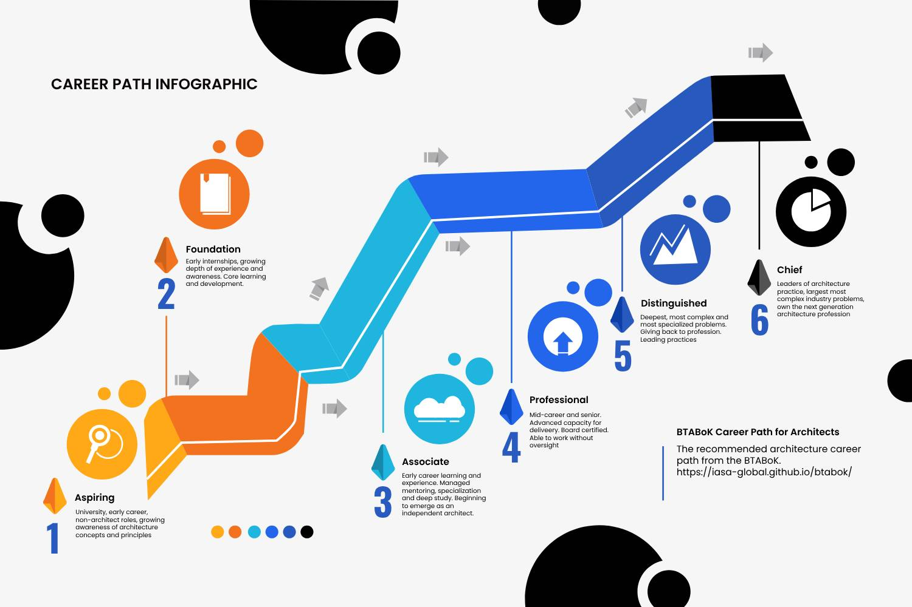

```
title: "BTABoK Mentoring"
keywords: 
sidebar: mydoc_sidebar
toc: true
permalink: mentoring.html
folder: top_menu
summary: ""
```

# A Mentoring Method for Professional Architects

As the landscape of business and technology evolves, the role of Business Technology(BT) Architects becomes increasingly critical. To support the development of these professionals, the profession needs a comprehensive mentoring method to guide the development of architect competencies and measured results. 

A mentoring program aims to provide BT Architects with the knowledge, skills, and guidance needed to excel in their roles and drive successful business transformations. The program combines structured components with flexible, free mentoring hours to create a well-rounded and supportive learning environment. 

## Understanding Mentoring

There are three broad areas of architecture mentoring. These correspond to the career level of the architect and the goal of the mentoring as mentoring activities need to be slightly different for each area and type of learning and experience acquisition. 



### 1. Early Stage Mentoring

The first is the guided or structured mentoring that an early-stage architect would receive. This stage of learning is for architects who are getting practical experience in the building blocks of architecture. Generally this type of mentoring is focused on specific tasks and learning that the mentee needs to repeat to grow. This stage is characterized by structured learning, task assignment and repetition to grow the baseline skills of a more senior architect. 

**Career Path Leve**l: Foundation and Associate

**Type of mentoring**: Structure Learning, Multiple Assignments

**Length of mentoring**: 3-6 mo engagements for 2-3 years

**Mentoring goals**: Repeatable baseline in primary competencies and core concepts

**Expected Cost**: Charged for every 3mo engagement or annualized for accredited organization programs

#### Available Options:

**Core Structured Mentoring** - For all early-stage architects, the core structure mentoring program guides you through experiential learning and task assignments for the development of primary business, change management, technology structure, decisions management, requirements, and stakeholder management skills. Length: 3 mo

**Solution Architecture Mentoring** - For change focused architects delivering business technology solutions, the solution mentoring track focuses on a balanced depth in all applicable specializations (B,I,I,S,S). This is a generalist track meant to create change and transformation leaders throughout the lifecycle of architecture. The focus is change management, execution, stakeholder management, depth in technology interactions and impacts, patterns and reference models, systems thinking, decision management, and value management through execution. Additional experience focuses on partner management, vendor support and strategic interaction with Business and Technical specializations. 

One level of architecture mentoring has been identified for advanced architects. Length: 6 mo each 

**Business Architecture Mentoring** - For architects enhancing their primary business architecture specialization, business mentoring consists of deep practical exercises in the development of business-to-technology strategy, road mapping, value management, operations, business management, and further stakeholder management practices. In addition, the mentee must learn to properly align their outputs to solution, software and infrastructure architects. Focus is also given to maintaining and fulfilling the required depth in technology and operations areas. 

Two levels of architecture mentoring have been identified for early-stage architects and advanced architects. Length: 6 mo each

**Software Architecture Mentoring** - For specialization in software architecture, the focus is on construction, engineering, and depth excellence in software design, service management, data and domain interaction, integration, and quality attributes. 

Two levels of architecture mentoring have been identified for early-stage architects and advanced architects. Length: 6 mo each

**Infrastructure Architecture Mentoring**

For a specialization in infrastructure architecture, the goal is to manage modern data centers, cloud hybrid and native models, operations, application support and provisioning, security, cost, risk, and reliability measures, as well as overall operations, support, and incidence management. The focus is on integration with software, solution and other technology depth architects, while also focused on outcomes for the enterprise. 

Two levels of architecture mentoring have been identified for early-stage architects and advanced architects. Length: 6 mo each

### 2. Professional Mentoring

Professional mentoring is the most important part of career development for senior architects. The difference between professional and early-stage mentoring is the focus on expert-level skill acquisition in particular competencies. In addition, professional mentoring describes a deep relationship between mentee and mentor. Many of these relationships last for years or even decades. The goal is to prepare the mentee for extremely senior architecture activities. 

#### Mentoring Method

The professional mentoring method is characterized by guidance, advice and review. It is a much more free-form mentoring activity based on the needs of the mentee. However, it is also the goal of mentor to prepare the mentee for professional or distinguished certification milestones in their career. Thus is it necessary to document competency advancement and milestones as a part of a mentoring plan. 

**Career Path Leve**l: Professional, Distinguished

**Type of mentoring**: Scenario evaluation, advice, discussion, review of outcomes, expert guidance

**Length of mentoring**: 1-3 years (or longer)

**Mentoring goals**: Repeatable expertise at the desired level (professional, distinguished)

**Expected Cost**: Annualized, either internal (see accredited organizations) or external (personal mentor)

### 3. Topic Area (Instance) Mentoring

The final type of mentoring available makes use of short interactions between the expert and the mentee. The goal of this mentoring is learning on a particular depth topic area. This might include deep technology outcomes or specific techniques. Example topic areas: canary releases, technology debt management, web application patterns, SPA/PWA, async integration, roadmapping. 

**Career Path Leve**l: Any

**Type of mentoring**: Question/Answer, Co-Design, Assignments, Reading, Experimentation

**Length of mentoring**: 1-3 mo individual engagements 

**Mentoring goals**: Repeatable baseline in primary competencies and core concepts

**Expected Cost**: Variable, by mentor

## Program Details

The Iasa Global Mentoring Program for BT Architects is structured to address the diverse needs of both novice and experienced professionals. The program includes: 

1. Structured Learning: Covering key areas of BT architecture, these modules provide a solid foundation in essential concepts and practices.  

2. Mentoring Circles: Small group sessions focused on peer learning and discussion, facilitated by experienced certified mentors. 

3. One-on-One Mentoring Hours: Personalized mentoring sessions tailored to the individual needs of each mentee. 

4. Workshops and Seminars: Interactive sessions led by industry experts on emerging trends and advanced topics in BT architecture. 

5. Online Resources and Community: Access to a repository of learning materials and a community forum for ongoing support and networking. 

#### Structured Learning

The core of the mentoring program is a series of structured learning modules designed to provide comprehensive coverage of BT architecture principles and practices.  

6. Introduction to BT Architecture: An overview of BT architecture, its importance, and its role in the ecosystem. 

7. BT Strategy and Planning: Techniques for developing and implementing effective BT strategies. 

8. Architecture Frameworks and Methodologies: Exploration of popular frameworks and methodologies used in BT architecture. 

9. Technology Integration and Innovation: Strategies for integrating new technologies and fostering innovation within an organization. 

10. Change Management and Leadership: Approaches to leading change and managing the human aspects of business transformation. 

11. Metrics and Value Measurement: Tools and techniques for measuring the success and impact of BT initiatives. 

Each module includes readings, case studies, practical exercises, and assessments to ensure thorough understanding and application of the material. 

#### Mentoring Circles

Mentoring Circles are small group sessions designed to foster collaborative learning and peer support. Each circle consists of 5-8 mentees and is facilitated by an experienced BT Architect. These sessions provide a platform for: 

- Sharing Experiences: Participants share their experiences and insights, learning from each other’s successes and challenges. 

- Collaborative Problem Solving: The group works together to tackle real-world problems and develop innovative solutions. 

- Networking: Building relationships with peers who share similar professional interests and goals. 

Mentoring Circles meet bi-weekly and focus on topics relevant to the participants' current projects and interests. The structure of these sessions encourages active participation and continuous learning. 

#### One-on-One Mentoring Hours

Personalized mentoring is a cornerstone of a Mentoring Program. Each mentee is paired with a mentor who provides individualized guidance and support. One-on-One Mentoring Hours are designed to address specific needs and goals, including: 

- Career Development: Guidance on career planning, skill development, and professional growth. 

- Project Support: Advice on specific projects or challenges, including troubleshooting and best practices. 

- Goal Setting and Accountability: Assistance with setting and achieving professional goals, with regular check-ins to track progress. 

Mentees can schedule these sessions at their convenience, ensuring flexibility and accessibility. 

#### Workshops and Seminars

To complement the structured learning modules and mentoring sessions, the program includes a series of workshops and seminars. These interactive sessions are led by industry experts and cover a range of advanced topics and emerging trends in BT architecture. Examples might include: 

- Digital Transformation and Industry 4.0: Understanding the impact of digital technologies on business models and operations. 

- Advanced Data Analytics and AI: Leveraging data and artificial intelligence for strategic decision-making. 

- Cybersecurity and Risk Management: Ensuring the security and resilience of business transformation initiatives. 

Workshops and seminars provide opportunities for hands-on learning, in-depth exploration of complex topics, and direct interaction with thought leaders in the field. 

#### Online Resources and Community

The Mentoring Program offers a wealth of online resources to support continuous learning and professional development. These resources include: 

- Learning Materials: Access to a comprehensive repository of articles, white papers, e-books, and videos covering various aspects of BT architecture. 

- Case Studies and Best Practices: Real-world examples of successful BT initiatives, highlighting best practices and lessons learned. 

- Discussion Forums: An online community where mentees can ask questions, share insights, and engage in discussions with peers and mentors. 

The online platform is designed to facilitate easy access to information and foster a sense of community among participants. 

#### Program Enrollment and Participation

Enrollment in the Iasa Global Mentoring Program is open to BT Architects at all stages of their careers. The application process involves: 

- Application Submission and Payment: Interested individuals submit an application detailing their professional background, current role, and goals for the program. 

- Assessment and Matching: Applications are reviewed to ensure a good fit with the program. Mentees are then matched with mentors based on their needs and areas of expertise. 

- Orientation: New participants attend an orientation session to familiarize themselves with the program structure, resources, and expectations. 

Participation in the program requires a commitment to active engagement, including attending sessions, completing assignments, and contributing to the community.

## Corporate Mentoring Programs

For organizations that need scaled mentoring through internal development, we have designed a mentoring program accreditation and management program. This program provides the ability to scale mentoring to where it belongs, directly into the workplace. The program requires three major components to be accredited by the BTABoK.

- **Educated and Certified Mentors:** It is essential that mentors have the experience and competency to guide mentees in their learning tasks. Internal mentors need to achieve the appropriate education in the pathways they will be mentoring and must be able to achieve the Professional (CITA-P level) board certification within 1 year of becoming a mentor.

- **Mentee Assignment Review:** For architects to gain the appropriate experience, they must be able to work on measured tasks. The employer must undergo a review of how mentees will be assigned work based on the BTABoK competency model tasks and assignment.

- **Complete Mentee Documentation:** Architects grow in each phase of their career, thus mentors and mentees must be willing to show demonstrated work as a part of their architecture career record, the storage of their achieved and verified tasks and outcomes. This information is private to the employer and the mentee.

### Corporate Mentoring Options

Different companies may want to achieve different levels of mentoring support. We have designed the corporate mentoring program to provide options for these employers so that it is as flexible as they need.

1. **Level 1 Bronze Structured Mentoring Provider** - this level is to adopt the structure mentoring pathways within the organization. It is primarily a training/mentoring program based solely on the Iasa provided courses and learning pathways of the mentoring program. **Minimum 50 participants.**

2. **Level 2 Silver Experiential Mentoring Provider** - this level identifies organizations that want to adopt the structure mentoring program as well as go further into experiential mentoring. This level requires adapting the internal career path to allow architects to practice the competencies in their work assignments. **Minimum 100 participants. Architect career path review and accreditation**

3. **Level 3 Gold Distinguished Mentoring Provider** - this level identifies organizations that want to create acclaimed and globally visible mentoring programs. This level will fully adopt the BTABoK competencies, concepts and techniques and the organizaiton will commit to support the entire architecture career journey as well as to give back contribution to the body of knowledge. **Minimum 100 participants, career path review, and architecture practice review and accreditation.**

## Program Accreditation for Corporations

For organizations who need to create a large number of skilled architects or where business technology strategy is considered a critical differentiator to the business, or even simply to reduce the cost of architecture, it makes sense to build an internal mentoring program. For this to work however, it needs to map to the depth of skill acquisition found in the Iasa BTABoK mentoring and career path management framework. These companies may develop a mentoring program and have it accredited by the Iasa or by a certified BTABoK partner. 

The development of the program may map to any of the three levels listed above and may be focused internally or may also include external mentoring resources. To be accredited, the organization must be reviewed by the Iasa or an external certified BTABoK partner. The organizations must show the following program activities:

1. Career path support for phases of the architect learning and experience journey mapped effectively to the BTABoK competency and career path model. 

2. Support for measured competency acquisition in both work assignments at all levels of the career path. Or designated levels for partial accreditation. This may include rotation schedules, extra work assignments or other methods for competency learning. 

3. A large enough pool of board-certified architects to act as mentors and to guide the learning program. 

4. A large enough grouping of learning resources that cover the primary concept areas of the BTABoK for general architecture and specialization areas is supported in the program. 

5. A standard for mentor-recommended career progression, whether or not manager promotions exist (this is to prevent arbitrary level advancement). This stipulation need not relate to the internal level (promotion), but the earning of advanced architect levels must be independent of promotion. 

6. A repository of mentee submissions and mentor feedback to demonstrate long-term career growth. 

7. Sufficient architecture tooling to support all types of architecture delivery. 

The elements of the mentoring program are already provided by Iasa and may be adopted for internal use by the management of any accredited mentoring organization. In addition, third parties may also be certified to provide these tools. 

 

## Conclusion

The Iasa Global Mentoring Program for BT Architects is designed to provide a comprehensive, supportive, and flexible learning environment for professionals seeking to advance their careers and drive successful business transformations. By combining structured learning with personalized mentoring and community engagement, the program equips BT Architects with the skills, knowledge, and confidence needed to excel in their roles and contribute to the success of their organizations. 

For more information about the Iasa Global Mentoring Program and how to enroll, please visit [Iasa Global Website] or contact us at [Your Email Address].
