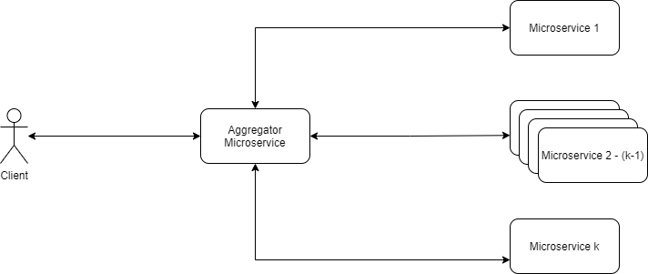

## Problem Statement

A microservice based application can have multiple services, each performing a unique individual task. A client to the application may require combinations of data obtained from each of those microservices. Microservices usually provide fine-grained APIs, which means that the client would need to interact with every individual microservice of interest.

The Aggregator Pattern attempts to solve a similar problem as the API Gateway Pattern.

## The Aggregator Pattern

The Aggregator is a microservice by itself. It provides a unified API to a client obtain data from various microservices. Unlike the API Gateway pattern, the Aggregator is usually not be an entry point to the system.

This is a composite service that is used when we need to apply a set of rules while preparing the result data created from the outputs of multiple microservices. The aggregator pattern is meant for the composition of data (and if necessary, the caching of that data with defined conditions/rules) from several endpoints and to act as a single endpoint to the client.

It can be used anywhere in the architecture between any layer, and quite often in Microservice architecture to provide a capability/feature.

 

The Aggregator pattern sends requests to multiple services for data, and then aggregates the data for the requestor.

Aggregator composes a response by collecting data from different points. When all of the data has been collected (with some optional processing), it responds to the client that requested it. It **can** cache those responses or composition of data for a defined period or conditions. It can reduce the chatter between client and service by having a single endpoint.

The Aggregator allows for endpoint consolidation which can perform an entire operation requested by the client. This allows the Aggregator to retry a request if it fails, and to some extent provide some level of fault tolerance. The Aggregator can then decide to send the data it has composed thus far (based on rules/priorities), or an error response, or alternatively a response that’s been developed part of the design back to the client if it wasn’t able to complete the operation due to an endpoint failure.

## Usage of the Aggregator Pattern

The Aggregator is efficient when:

*   Used as a collection point for data from microservices, and not as a switch or router;
*   When the collected data must be processed according to certain rules
*   When the transaction rate is low
*   When the risk due to the Fan-out Antipattern is low (ie. when multiple services fail leading to a potential slowing down or disruption of services)
*   When data provider services are asynchronous

## Advantages of the Aggregator Pattern

*   Reduces the communication overhead between a client and the services from whom it requires data
*   Architecturally, allows for simple endpoint consolidation of discrete functionality.
*   Aggregator can be positioned anywhere in the in the architecture to provide a single point of composition.
*   Aggregator allows for changes in the backend without clients having to worry about service endpoint definitions changing.

## Disadvantages of the Aggregator Pattern

Some issues with the usage of this pattern may be:

*   Updates to the implementation due to new service additions may require us to redesign the code.
*   Increased risk of latency or failure when one or more of the data provider microservices (or their dependencies) fail
*   Troubleshooting may be laborious

## Comparison: Aggregator vs API Gateway

*   API gateway can also be position anywhere in the system but this pattern is traditionally used more as an entry point.
*   API gateway functions as a single entry point as well just like the aggregator but it traditionally does not store data, however, technically it will partially store the information whilst performing API composition. Data is not retained once the composition is complete.
*   API gateway will drop the entire operation during API composition and return an error to client If one of the endpoints returns a failure.
*   API gateway provides request routing for the client based on rules defined. The Aggregator may not.
*   API gateway can provide authentication and authorization for incoming requests from clients based on defined conditions.

## Contextual Example

An example can be found in \[[6](https://docs.microsoft.com/en-us/azure/architecture/patterns/gateway-aggregation){:target="_blank"}\].

## Online Code Examples

\[Example 1\] [https://github.com/iluwatar/java-design-patterns/tree/master/aggregator-microservices](https://github.com/iluwatar/java-design-patterns/tree/master/aggregator-microservices){:target="_blank"}

## References

\[1\] DZone on the Aggregator Pattern: [https://dzone.com/articles/design-patterns-for-microservices](https://dzone.com/articles/design-patterns-for-microservices){:target="_blank"}

\[2\] API Gateway Pattern: [https://medium.com/nerd-for-tech/design-patterns-for-microservices-aggregator-pattern-99c122ac6b73](https://medium.com/nerd-for-tech/design-patterns-for-microservices-aggregator-pattern-99c122ac6b73){:target="_blank"}

\[3\] Aggregator vs. API Gateway: [https://stackoverflow.com/questions/68044745/api-gateway-pattern-vs-aggregator-pattern-in-the-context-of-microservices](https://stackoverflow.com/questions/68044745/api-gateway-pattern-vs-aggregator-pattern-in-the-context-of-microservices){:target="_blank"}

\[4\] Aggregator on the AKF page: [https://akfpartners.com/growth-blog/microservice-aggregator-pattern](https://akfpartners.com/growth-blog/microservice-aggregator-pattern){:target="_blank"}

\[5\] Fan-out Antipattern : [https://akfpartners.com/growth-blog/microservice-anti-pattern-service-fan-out](https://akfpartners.com/growth-blog/microservice-anti-pattern-service-fan-out){:target="_blank"}

\[6\] Gateway aggregation : [https://docs.microsoft.com/en-us/azure/architecture/patterns/gateway-aggregation](https://docs.microsoft.com/en-us/azure/architecture/patterns/gateway-aggregation){:target="_blank"}