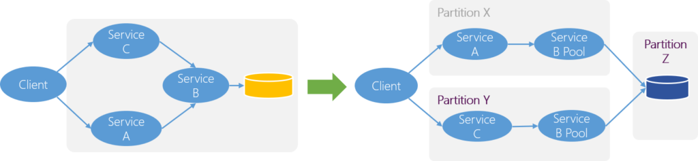

The bulkhead pattern enforces the principle of damage containment and provides a higher degree of resilience by partitioning the system.

By defining the pool of services, each client must be more accurate about their needs as they have only limited resources available to them. If the pool of services are combined, then access demand from one client could be compensated by surplus capacity from the other. There is more overall tolerance.

Physical redundancy is the most common form of bulkheads where independent farms of servers are made available with certain farms reserved for use by critical applications and others available for non-critical uses.

While implementing Bulkhead, it is important to pick the right level of granularity for partitioning. You can partition thread pools inside an application, CPUs in a server, or servers in a cluster.

Bulkheads pattern enables to isolate failures to one area and prevent the entire system to crash. The primary drawback of bulkheads is that they add additional computational overhead.