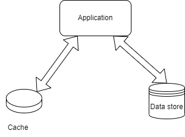

## The Cache-Aside Pattern

This pattern is used to load data from a data store into a cache. It can improve performance and maintain consistency between the cache and the store.

## Motivation
In many commercial systems, data is retrieved by applications by referencing a cache. If this data is not in the cache, it can be retrieved from the data store and stored in the cache.

If the cache does not provide this functionality "under the hood" with read-through and write-through/write-behind operations, then the application becomes responsible for the maintenance of the data.

## Structure
This pattern is a "lazy-load" solution to the problem above. The application fetches data from the data store when required and stores it in the cache. When it updates the data, it deletes the data in the cache and updates the data store.

## Advantages
- The cache only contains data that the application actually needs.
- This is quite straightforward to implement.

## Disadvantages
- Data expiration policies must be implemented in the application.
- Potential delays are possible as data is only loaded into the cache after a cache miss.

## References
[1] https://docs.aws.amazon.com/whitepapers/latest/database-caching-strategies-using-redis/caching-patterns.html

[2] https://learn.microsoft.com/en-us/azure/architecture/patterns/cache-aside
