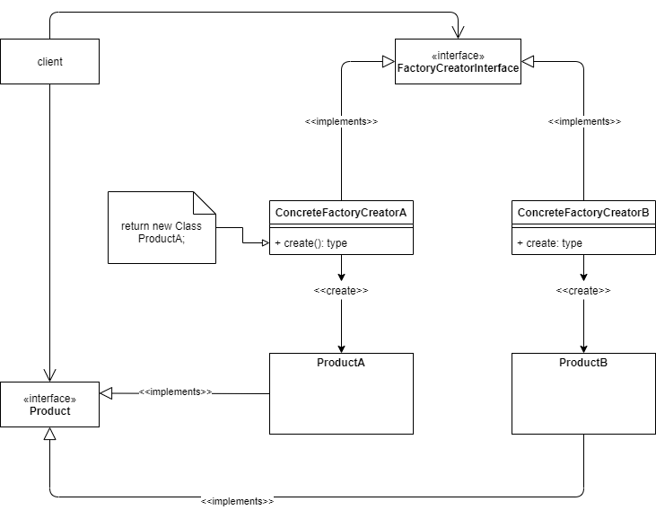

The Factory Method pattern is extremely useful when a class cannot decide in advance the class of objects it must create. The task of specifying the objects is given to the subclasses, instead. The class delegates responsibility to one of several helper subclasses, and the user localizes the knowledge of the delegate.

Factory Method Pattern

There can exist slight variations of the Factory Method.

The advantage of this pattern is:

*   The need to bind very specific classes to the code does not exist anymore. The exact class of the object that will be created need not be specified anymore.

The disadvantage of this pattern is:

*   Clients may have to subclass the FactoryCreatorInterface, to just create a specific Product object.

## Examples

These are some examples from the internet. More will follow, as we receive contributions.

*   Java Design Patterns : [https://github.com/iluwatar/java-design-patterns/tree/master/factory-method](https://github.com/iluwatar/java-design-patterns/tree/master/factory-method){:target="_blank"}
*   A slightly different implementation in C++ : [https://github.com/JakubVojvoda/design-patterns-cpp/tree/master/factory-method](https://github.com/JakubVojvoda/design-patterns-cpp/tree/master/factory-method){:target="_blank"}

## References

*   Wikipedia: [https://en.wikipedia.org/wiki/Factory\_method\_pattern](https://en.wikipedia.org/wiki/Factory_method_pattern){:target="_blank"}
*   Article on O’Reilly: [https://www.oreilly.com/library/view/head-first-design/0596007124/ch04.html](https://www.oreilly.com/library/view/head-first-design/0596007124/ch04.html){:target="_blank"}
*   “Design Patterns: Elements of Reusable Object-Oriented Software”, by [Richard Helm](https://www.amazon.ca/Richard-Helm/e/B000AQ1ZP8/ref=dp_byline_cont_book_2){:target="_blank"} , [Ralph Johnson](https://www.amazon.ca/Ralph-Johnson/e/B000AQ6RMY/ref=dp_byline_cont_book_3), [John Vlissides](https://www.amazon.ca/John-Vlissides/e/B000AQ4MV2/ref=dp_byline_cont_book_4){:target="_blank"}