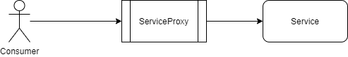

## Problem Statement

When upgrading from a monolithic architecture to a microservice-based architecture, the designer(s) can encounter situations where one service depends upon another. Upgrading the dependency can potentially disrupt the service, and in an extreme situation, the entire system, and possibly affect the development of the system. The solution to this problem is the Proxy pattern.

## The Proxy Pattern

 

The Proxy pattern could be considered similar to the Aggregator pattern; however, the aggregation does not happen on the client-side. It differs in that we create a microservice to invoke other microservices based on the business case.

It allows for upgrades to services without affecting the consumer. The actual interfaces are “hidden” behind the proxy. However the API presented to the Consumer of the service remains preserved, thereby allowing upgrades or changes to the Service without impacting the Consumer adversely.

In other words, the Proxy contains the logic to interact with new or updated microservices while supplying data and original logic to the Consumers without affecting continuity in usage.

The Proxy may be dumb, in that it just delegates a request to the services it represents; it may be smart, in which case it would apply data transformation before the data is presented to the client.

## Advantages of the Proxy Pattern

*   Easy to implement
*   Security associated with the service(s) under consideration can be easily implemented and encapsulated in the proxy.

## Disadvantages of the Proxy Pattern

*   An improperly designed Proxy can become a bottleneck
*   Adds some latency overhead
*   Cannot be used when latency is critical

## Contextual Example

An example of the Proxy is provided in \[[1](https://medium.com/nerd-for-tech/proxy-microservice-design-pattern-91d455b0d05a)\].

## Online Code Examples

An example for code can be found [here](https://github.com/iluwatar/java-design-patterns/tree/master/proxy).

## References

\[1\] Proxy Microservice Design Pattern – [https://medium.com/nerd-for-tech/proxy-microservice-design-pattern-91d455b0d05a](https://medium.com/nerd-for-tech/proxy-microservice-design-pattern-91d455b0d05a)

\[2\] Proxy Design Pattern – [https://www.geeksforgeeks.org/proxy-design-pattern/](https://www.geeksforgeeks.org/proxy-design-pattern/)

\[3\] The Ambassador Pattern – [https://docs.microsoft.com/en-us/azure/architecture/patterns/ambassador](https://docs.microsoft.com/en-us/azure/architecture/patterns/ambassador)