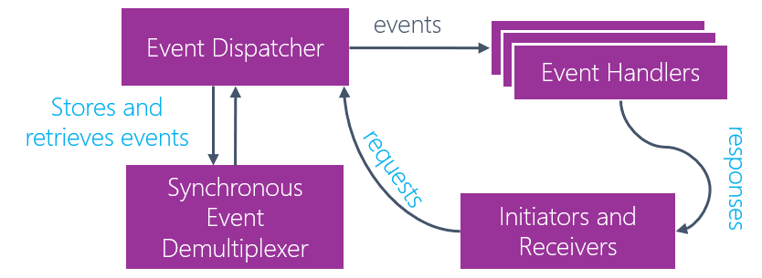

The reactor pattern already underpins many of the platforms you use today, and is now one of the most common ways to deal with concurrency. It is also one implementation technique of an event-driven architecture.

The reactor pattern has moved from being a fairly obscure pattern used in high traffic C/C++ applications to being one of the most common patterns underpinning Webscale systems (along with its little brother, the Proactor pattern)

Reactor takes synchronous (or async) input but handles events asynchronously, and allows for extremely high concurrency versus synchronous, thread based models.

It works by receiving messages or events from initiating systems, passing them to a demultiplexer, then serving these events one-at-a-time to waiting event handlers via an event dispatcher. The dispatcher does not wait for a response, since it treats responses as just another type of incoming message.

It allows for extremely fast concurrency. At trivial loads, reactor-based systems perform no better than thread-based competitors. However, as loads increase, performance degradation is extremely slow, and reactor can often handle tens of thousands of concurrent requests (where thread based systems can handle hundreds)

Reactor underpins extremely common libraries such as libevent, twisted, node.js, eventmachine, Reactor (Java), Flux, nginx (via libevent)

## References

*   Article on DZone: [https://dzone.com/articles/understanding-reactor-pattern-thread-based-and-eve](https://dzone.com/articles/understanding-reactor-pattern-thread-based-and-eve){:target="_blank"}