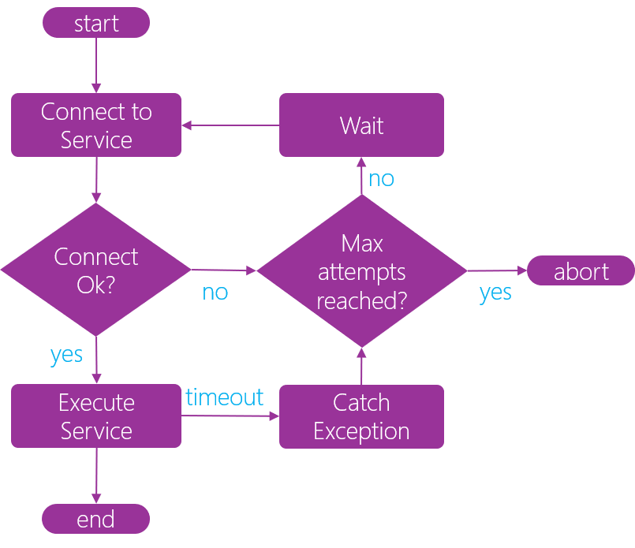

Retry pattern improves the stability of a system by enabling a service consumer to handle anticipated, temporary failures of the service by retrying to invoke the same service operation that has previously failed.

There are some consideration when using retry pattern:

When there is an indication that the fault is not transient or unlikely for service request to be successful if repeated (for example, an authentication failure caused by invalid user credentials or bad request send to service , e.g., HTTP status code 4xx received from the service), the application should not try to retry , but abort the operation invocation and report a suitable exception.

If the specific fault is unusual or rare, it may have been caused by extraordinary circumstances such as a network packet lost in transit. In this case, the application could immediately retry the same request again because the same failure is unlikely to happen again and the request will probably be successful.

If the fault is caused by issues such as service being not fully responsive (e.g., “service busy “) the service consumer should wait for a suitable time before retrying the request.