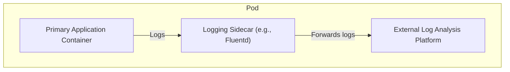

## Problem Statement

In traditional monolithic applications, various functionalities (business logic, logging, error handling, configuration, etc.) are often intertwined. This creates a tightly coupled system that's difficult to modify, scale, or update. Microservices often use a mix of languages, frameworks, and technologies. Implementing consistent features across them (e.g., logging, monitoring) requires replicated coding effort in each language.

## The Sidecar Pattern

The sidecar pattern is fundamentally about co-deployment. A sidecar container is packaged alongside the primary application container within a single pod (in the Kubernetes world). This co-location ensures proximity and tight integration.

Imagine the sidecar pattern like having a little helper attached to your main application—just like a sidecar on a motorcycle. In the world of cloud-native development, this helper is a separate container that lives right next to your primary application container within something called a "pod" (the basic unit in Kubernetes).

**The best part about the sidecar pattern is how flexible it is. You can use it for tons of things, from handling logging and monitoring to complex security tasks. And because sidecar helpers are in their own containers, they're nicely isolated. This means if one helper gets a little buggy, it won't bring down your whole application.**

- **Shared Resources:** Sidecars within a pod share certain resources:
  - **Network Namespace:** Sidecars and the primary container can communicate seamlessly over localhost, simplifying interaction and data exchange.
  - **Filesystem (sometimes):** Sidecars can sometimes access shared volumes to read or modify files generated by the primary application or to share configuration data.
- **Lifecycle Coupling:** Sidecars and their parent applications have a dependent lifecycle. They are created, started, stopped, and scaled together.

**Example: Sidecar for Logging**

Let's consider a scenario where you want to implement centralized logging for your primary application container:

1. **Primary Container:** Houses your core application logic.
2. **Logging Sidecar:** A containerized log aggregator (e.g., Fluentd) responsible for collecting, filtering, and forwarding logs to an external log analysis platform.

**Expanded Use Cases and Capabilities**

Beyond the common use cases mentioned earlier, sidecars can play various specialized roles:

- **Security Enhancement:**
  - **API Gateways:** Sidecars can enforce authentication, authorization, and rate-limiting, securing traffic flow to the primary application.
  - **Encryption/Decryption:** Sidecars can encrypt sensitive data at rest or in transit, bolstering security.
- **Service Mesh Functionality:** Sidecars are essential components in service mesh architectures like Istio or Linkerd. They handle routing, circuit breaking, observability, and other mesh-related tasks.
- **Debugging and Introspection:** Sidecars can inject debugging tools or profiling utilities into the application's environment without directly modifying the application.
- **Data Transformation:** Sidecars can act as pre/post-processors, transforming data on the fly to adapt to different formats or protocols.
- **A/B Testing and Canary Deployments:** Sidecars can facilitate routing of a small percentage of traffic to a new application version, enabling gradual rollout and testing.

**Design Considerations**

- **Orchestration:** Kubernetes excels at managing pods containing sidecars and main applications. Its concepts around lifecycle management, scaling, and networking align well with the sidecar pattern.
- **Overhead:** Consider the trade-off between the benefits of a sidecar and its resource consumption. In some cases, directly embedding a feature into the primary application might be more efficient.
- **Observability:** Ensure proper monitoring and logging for both sidecar and primary containers. This is vital for troubleshooting issues within the pod.

**The Essence of the Sidecar Pattern**

The sidecar pattern is a powerful tool in containerized, cloud-native environments. It embodies the principles of:

- **Modularity:** Break down applications into well-defined components with clear responsibilities.
- **Extensibility:** Add features in a non-intrusive way, maintaining the core application's focus.
- **Resilience:** Isolate failure points and promote independent scaling of different components.

## Contextual Example

An example of the Proxy is provided in \[[1](https://medium.com/nerd-for-tech/proxy-microservice-design-pattern-91d455b0d05a){:target="_blank"}\].

## Online Code Examples

**Example 1: Logging Sidecar**

**Scenario:** You want to centralize log collection and analysis to diagnose issues within your applications.

- **Java:**
  
  - **Logback or Log4j:** Popular logging libraries for Java applications.
  - **Fluentd:** A log collector that can be deployed as a sidecar container.
  - **Configuration:** You'd configure your Java application to write logs to a shared volume or use network forwarding. The Fluentd sidecar would collect and ship these logs to an analysis platform (e.g., Elasticsearch).

- **C#**
  
  - **NLog or Serilog:** Common logging libraries for .NET applications.
  - **Fluent Bit:** A lightweight log processor/forwarder suitable as a sidecar.
  - **Configuration:** Similar to Java, your C# application would write logs to a shared location or use network communication. The Fluent Bit sidecar would then handle processing and sending the logs.

## References

\[1\] Sidecar Demo – [[GitHub - AndreyVMarkelov/devopspro2018-sidecar-demo: Demo for Devopspro2018](https://github.com/AndreyVMarkelov/devopspro2018-sidecar-demo):target="_blank"}

\[2\]  [[Sidecar pattern - Azure Architecture Center | Microsoft Learn](https://learn.microsoft.com/en-us/azure/architecture/patterns/sidecar)](https://www.geeksforgeeks.org/proxy-design-pattern/){:target="_blank"}

\[3\] The Ambassador Pattern – [https://docs.microsoft.com/en-us/azure/architecture/patterns/ambassador](https://docs.microsoft.com/en-us/azure/architecture/patterns/ambassador){:target="_blank"}