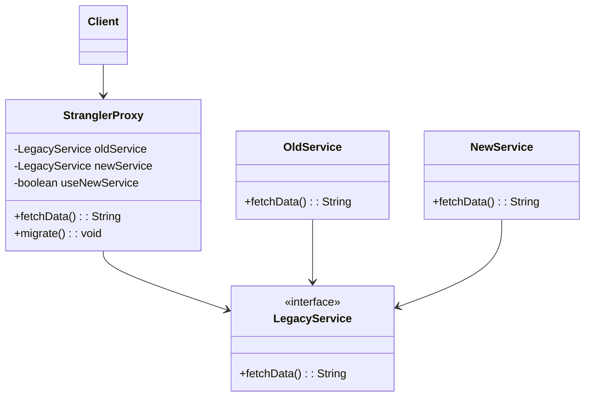

# Strangler Pattern

## Overview

The Strangler Pattern is a software modernization strategy that allows gradual replacement of a legacy system by incrementally introducing a new system alongside it. This approach enables teams to phase out the old system piece by piece, reducing risks associated with a full system rewrite and ensuring business continuity.

## Intent

The intent of the Strangler Pattern is to modernize an existing application by incrementally replacing its components with a new system, without disrupting the overall functionality. This pattern ensures a smooth transition while maintaining service availability.

## Structure

1. **Legacy System**: The existing system that needs to be replaced.
2. **Strangler Interface**: A layer that intercepts requests and redirects them to the appropriate component (legacy or new).
3. **New System**: The progressively developed system that will replace the legacy system over time.

## Responsibilities

- **Incremental Migration**: Gradually move functionality from the legacy system to the new system.
- **Risk Mitigation**: Avoids the risks of a big-bang rewrite by ensuring a continuous transition.
- **Parallel Operation**: Allows both the old and new systems to run simultaneously during the migration period.
- **Feature Parity Verification**: Ensures that new components match the functionality of their legacy counterparts before deprecating the old system.

## Implementation

Below are code examples illustrating the Strangler Pattern in Java and Python, followed by a Mermaid diagram for visualization.

### Java Example

```java
interface LegacyService {
    String fetchData();
}

class OldService implements LegacyService {
    @Override
    public String fetchData() {
        return "Data from legacy system";
    }
}

class NewService implements LegacyService {
    @Override
    public String fetchData() {
        return "Data from new system";
    }
}

class StranglerProxy implements LegacyService {
    private final LegacyService newService;
    private final LegacyService oldService;
    private boolean useNewService = false;

    public StranglerProxy(LegacyService oldService, LegacyService newService) {
        this.oldService = oldService;
        this.newService = newService;
    }

    public void migrate() {
        useNewService = true;
    }

    @Override
    public String fetchData() {
        return useNewService ? newService.fetchData() : oldService.fetchData();
    }
}

public class Client {
    public static void main(String[] args) {
        StranglerProxy proxy = new StranglerProxy(new OldService(), new NewService());
        System.out.println(proxy.fetchData()); // Uses legacy system
        proxy.migrate();
        System.out.println(proxy.fetchData()); // Uses new system
    }
}
```

### Python Example

```python
class LegacyService:
    def fetch_data(self):
        raise NotImplementedError

class OldService(LegacyService):
    def fetch_data(self):
        return "Data from legacy system"

class NewService(LegacyService):
    def fetch_data(self):
        return "Data from new system"

class StranglerProxy(LegacyService):
    def __init__(self, old_service, new_service):
        self.old_service = old_service
        self.new_service = new_service
        self.use_new_service = False

    def migrate(self):
        self.use_new_service = True

    def fetch_data(self):
        return self.new_service.fetch_data() if self.use_new_service else self.old_service.fetch_data()

if __name__ == "__main__":
    proxy = StranglerProxy(OldService(), NewService())
    print(proxy.fetch_data())  # Uses legacy system
    proxy.migrate()
    print(proxy.fetch_data())  # Uses new system
```

### Mermaid Diagram



## Benefits

- **Minimized Risk**: The system evolves gradually, reducing the chance of failures associated with full rewrites.
- **Continuous Operation**: Business functions remain operational while transitioning from the old to the new system.
- **Incremental Deployment**: Developers can migrate features one at a time rather than rewriting the entire system at once.

## Use Cases

- **Legacy System Modernization**: When a system needs to be updated without downtime.
- **Microservices Migration**: Transitioning from a monolithic architecture to microservices in a controlled manner.
- **API Gateway Integration**: Using an API gateway to manage routing between the legacy and new implementations.

By implementing the Strangler Pattern, organizations can modernize their applications without significant disruptions, making the transition smoother and more maintainable.

## Related Patterns

- **Adapter Pattern**: Helps the new system interact with legacy components.
- **Facade Pattern**: Provides a unified interface to different system components.
- **Proxy Pattern**: Acts as an intermediary, similar to the Strangler Proxy.

