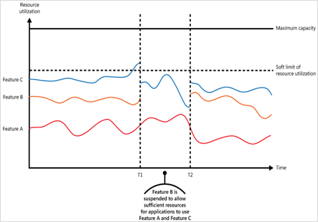

The throttling pattern is used to allow a service to maintain a steady pace when process multiple customer requests.

**Throttling can be implemented using multiple strategies:**

•Rejecting requests from an individual user who has already accessed the service more than n times over a given period of time.

•Disabling or degrading the functionality of selected nonessential services so that essential services can run unimpeded with sufficient resources.

•Using load leveling to smooth the volume of activity. Note, that in a multitenant environment, this approach will reduce the performance for every tenant.

•Deferring operations being performed on behalf of lower priority applications or tenants. These operations can be suspended or curtailed, with an exception generated to inform the tenant that the system is busy and that the operation should be retried later.

