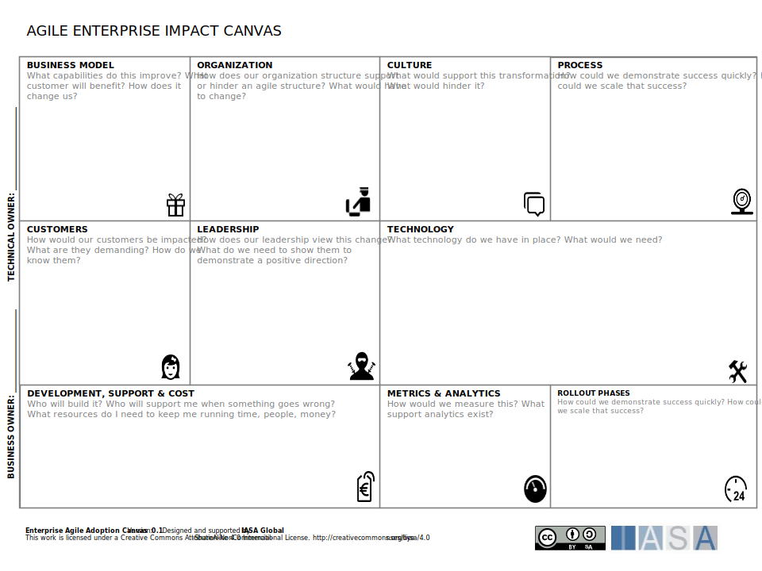

## Overview

The agile impact canvas is used to describe the overall impact of agile methods on an enterprise, team, or domain. The canvas is a tool for thinking about impacts to business models, organization structures, culture, and more. It works best if used as a facilitation tool with a multi-faceted team who are brainstorming the best ways to make agile work in their organizations. 

[Download PPT](media/ppt/agile_enterprise_impact_canvas.ppt){:target="_blank"}

| Area                        | Description                                                                                                                                                      | Links To                                    |
| --------------------------- | ---------------------------------------------------------------------------------------------------------------------------------------------------------------- | ------------------------------------------- |
| Business Model              | How well does the business model adapt to an agile mindset? Highly regulated business models would be more difficult than smaller or more easily adaptable ones. | Business Model Canvas, Mission Model Canvas |
| Organization                | How well is the organization setup for agility? Are there strongly entrenched leaders or more nimble teams?                                                      | (informed by) Stakeholder Canvases          |
| Culture                     | Is the culture ready for agile? Is the mindset adaptable and ready for change?                                                                                   |                                             |
| Processes                   | What processes would be impacted by the switch to agility? How would they have to adapt? Also can be used for capabilities.                                      | Capability cards and business processes.    |
| Customers                   | How will the switch to agile impact the customer journey?                                                                                                        | Customer Journey, Customer Personas         |
| Leadership                  | Is the leadership behind the agile shift? Do they understand the impact on their decision making style.                                                          | Stakeholder Empathy Map                     |
| Technology                  | Is the organization ready for agile technology?                                                                                                                  | NABC                                        |
| Development, Support & Cost | Is the switch to agile budgeted effectively? Will the organization be able to handle agile funding methods?                                                      | Risk/Cost Cards                             |
| Metrics & Analytics         | Are agile metrics and analytics supported? What would need to be done to support them.                                                                           |                                             |
| Roll Out Phases             | How will agile be rolled out? What will be the major transitions and milestones?                                                                                 | Roadmap                                     |

## Common usage scenarios

The agile enterprise impact canvas is a strategic tool to help understand how ready the organization is for agile concepts and whether those are business agility related and/or development agility related. 

The Agile Enterprise Canvas connects with many of the other agile canvases such as Value Stream Designer, Agile Team Designer, Agile Automation Designer and the standard (agile built in) canvases like ARS, ASDs and Core canvases. 

When considering whether the organization, domain and teams are ready for agile it is very important to how the process will impact planning and financing. The notion of product thinking and roadmapping are essential as well as clear connection between roadmap elements. This portion of architecture is often overlooked on early agile adoptions. 