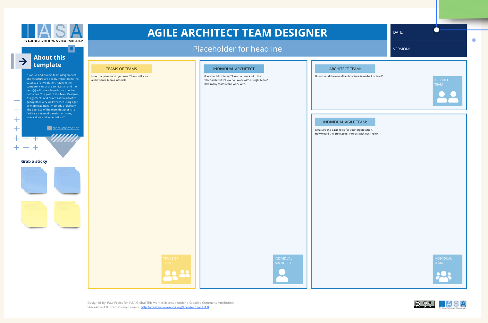

Product and project team assignments and structure are deeply important to the success of any solution. Aligning the competencies of the architect(s) and the team(s) will have a huge impact on the outcomes. The goal of the Team Designer, Assignments and prioritization activities go together very well whether using agile or more traditional methods of delivery. 

Agile team design is based on the idea that small, cross-functional teams are more effective at delivering software in an iterative and incremental way than large, siloed teams. These teams are typically made up of developers, testers, product managers, and designers.

Here are some of the benefits of using agile team design:

- Increased productivity and efficiency
- Improved communication and collaboration
- Faster time to market
- Higher quality software
- Better responsiveness to change

Good agile architecture is the foundation for successful agile team design. It involves creating a architecture that is flexible, modular, and easy to change. This allows agile teams to adapt to changing requirements and deliver value quickly.

The best use of the team designer is to facilitate a team discussion on roles, interactions and expectations. 

## How to use this canvas

Start by deeply understanding the problem space your agile structure needs to address. This could involve pinpointing bottlenecks in your current development process, challenges with cross-team communication, or difficulties in adapting to rapidly changing requirements. Once you have a clear picture of the problems, define specific goals you want to achieve with this agile team design. For example, you might aim to shorten product delivery times, improve responsiveness to customer feedback, or enhance overall product quality.

**Filling Out the Canvas**

**1. Individual Agile Team**

Consider the ideal composition of this team, listing essential roles like developers, testers, product owners, and Scrum Masters. Think about optimal team size (typically around 5-9 members). Identify the core skills and expertise needed for the team to fulfill its mission. Finally, define the level of autonomy this team will have in making decisions within its area of responsibility.

**2. Architect Team**

Describe the core responsibilities of this team, which usually include high-level system design, establishing architectural standards, and mentoring individual teams. Outline the collaboration model that will guide how the Architect Team interacts and coordinates with the Individual Agile Teams.

**3. Individual Architect**

Focus on the role of this individual who oversees the system-wide architectural vision and ensures it aligns with long-term business goals. Define the strategic architectural choices this person will have primary decision-making power over.

**4. Teams of Teams (If applicable)**

If you'll be grouping multiple teams, clarify the purpose of doing so (perhaps for working on a large-scale feature). Determine how teams within this 'team of teams' structure will coordinate dependencies, knowledge sharing, and overall planning.

**Additional Tips**

Remember, your agile team design should be an iterative process; initial designs won't always be perfect. Be prepared to make adjustments based on feedback you gather. Involve stakeholders throughout the design process, getting input from team members, managers, and others impacted by the structure. Finally, use the canvas as a visual tool to communicate your design clearly to everyone involved.

## Downloads

[Download PPT](media/ppt/Agile-Architect-Team-Designer.ppt)

| Area                  | Description                                                                                                                                                                   | Links To                                                                                                  |
| --------------------- | ----------------------------------------------------------------------------------------------------------------------------------------------------------------------------- | --------------------------------------------------------------------------------------------------------- |
| Team of Teams         | Take your project/product and divide it into the number of teams and their names. This is often done on a functional or service basis.                                        | Service View, Functional View                                                                             |
| Individual Architect  | Describe the role of the architect in relation to all of the team of teams, as well as the other architects in the company as well as the relationship to an individual team. | [Role Description](/../engagement_model/roles.md){:target="_blank"}                                       |
| Architect Team        | What other architects will be involved with the primary architect? Mentors, reviewers, specialists?                                                                           | [Architect Stakeholder Canvas](/../structured_canvases/architect_stakeholder_canvas.md){:target="_blank"} |
| Individual Agile Team | What is the make up of an individual team? How many people will be on it and what are their roles? How will they relate to the architect?                                     |                                                                                                           |

## Use this in Miro

We in the BTABoK are so very excited about the native support for architecture canvases in Miro! Find this canvas in the Miroverse!

Resources
---------

- [Assignment article](/../engagement_model/assignment.md){:target="_blank"}
- [Extended team article](/../engagement_model/extended_team.md){:target="_blank"}
- [Job Descriptions article](/../engagement_model/job_description.md){:target="_blank"}
