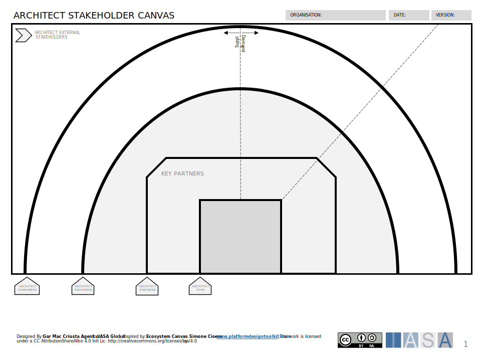
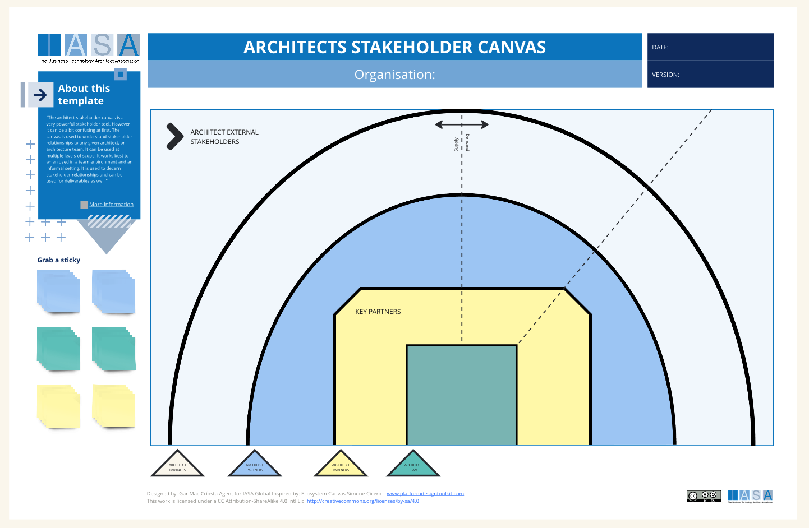

The architect stakeholder canvas is a very powerful stakeholder tool. However it can be a bit confusing at first. The canvas is used to understand stakeholder relationships to any given architect, or architecture team. It can be used at multiple levels of scope. It works best to when used in a team environment and an informal setting. It is used to decern stakeholder relationships and can be used for deliverables as well. Successful architecture initiatives require collaboration between architects, business stakeholders, and IT teams. Stakeholders bring valuable perspectives to the table, including:

- **Business Needs:** Stakeholders can articulate the business problems that architecture needs to address and the business goals that architecture should support.
- **Domain Expertise:** Stakeholders may have deep knowledge of specific business areas and processes, which is vital for designing solutions that align with real-world needs.
- **Decision-Making Power:** Stakeholders often have the authority to approve or veto architectural decisions. Involving them early on increases the likelihood of successful implementation.

## How to use this canvas

The stakeholder canvas is divided into two broad categories, demand, and supply. These categories are based on the concept that there is demand for arhitect(ures) and there is the supply of architecture. This normally translates to Demand = Business Partners and Supply = Technology Partners, but not always (as is often the case with infrastructure architecture teams). That means a VP of marketing would go on the right and the CIO on the left. However, feel free to play. In addition, the extra dotted line on the right is a divisor meant to help group stakeholders into sections related to the org chart, the operating model or other useful divisors.

While the Stakeholder Engagement Canvas might not be the primary tool used in Architecture, considering stakeholder needs throughout the architecture lifecycle is critical for success. By involving stakeholders in a meaningful way, you can improve the quality of your architectural solutions and increase the likelihood of successful implementation.

## Downloads

[Download PPT](media/ppt/architect_stakeholder_canvas.ppt)

## Canvas Sections and Links to BTABoK

| Area                            | Description                                                                                                                                                                                                              | Links To                                               |
| ------------------------------- | ------------------------------------------------------------------------------------------------------------------------------------------------------------------------------------------------------------------------ | ------------------------------------------------------ |
| Architect External Stakeholders | External stakeholders such as vendors or suppliers can go on the outside of the circles. However, this is optional and can be placed like any other stakeholder.                                                         | Stakeholder Planning Sheet                             |
| Architect Consumers             | Consumers are those who are primarily interested in receiving information, collaboration, or outputs from architecture.                                                                                                  | Stakeholder Planning Sheet, [Stakeholder Engagement Map](https://iasa-global.github.io/btabok/stakeholder_engagement_map_card.html){:target="_blank"}
 |
| Architect Providers             | Providers are those stakeholders who primarily give information or inputs to the architecture. This might include developers or operations or other line employees.                                                      | Stakeholder Planning Sheet, [Stakeholder Engagement Map](https://iasa-global.github.io/btabok/stakeholder_engagement_map_card.html){:target="_blank"} |
| Architect Partners              | Key partners are stakeholders who are essential to the deliver of the architecture. In solution architecture these might be product owners or technology leads. In business they may be specific business partner roles. | Stakeholder Planning Sheet, [Stakeholder Engagement Map](https://iasa-global.github.io/btabok/stakeholder_engagement_map_card.html){:target="_blank"} |
| Architect Team                  | The team, architect or other primary architecture providers.                                                                                                                                                             | Stakeholder Planning Sheet                             |

## Use this in Miro

We in the BTABoK are so very excited about the native support for architecture canvases in Miro! Find this canvas in the Miroverse!

