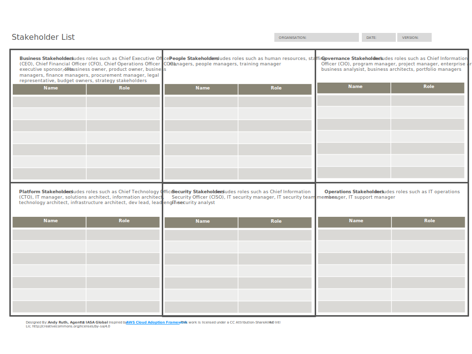

[Download PPT](media/ppt/architect_stakeholder_card.ppt){:target="_blank"}

| Area                    | Description                                                                                                                                                                                                                                                                                         | Links To                   |
| ----------------------- | --------------------------------------------------------------------------------------------------------------------------------------------------------------------------------------------------------------------------------------------------------------------------------------------------- | -------------------------- |
| Business Stakeholders   
| Includes roles such as Chief Executive Officer (CEO), Chief Financial Officer (CFO), Chief Operations Officer (COO), executive sponsor, line-of-business owner, product owner, business managers, finance managers, procurement manager, legal representative, budget owners, strategy stakeholders 
| Stakeholder Planning Sheet |
| People Stakeholders     
| Includes roles such as human resources, staffing managers, people managers, training manager
| Stakeholder Planning Sheet |
| Governance Stakeholders 
| Includes roles such as Chief Information Officer (CIO), program manager, project manager, enterprise architect, business analysist, business architects, portfolio managers
| Stakeholder Planning Sheet |
| Platform Stakeholders   | Includes roles such as Chief Technology Officer (CTO), IT manager, solutions architect, information architect, technology architect, infrastructure architect, dev lead, lead engineer                                                                                                              | Stakeholder Planning Sheet |
| Security Stakeholders   | Includes roles such as Chief Information Security Officer (CISO), IT security manager team member, IT security analyst                                                                                                                                                                              | Stakeholder Planning Sheet |
| Operations Stakeholders | Includes roles such as IT operations manager, IT support manager                                                                                                                                                                                                                                    |                            |