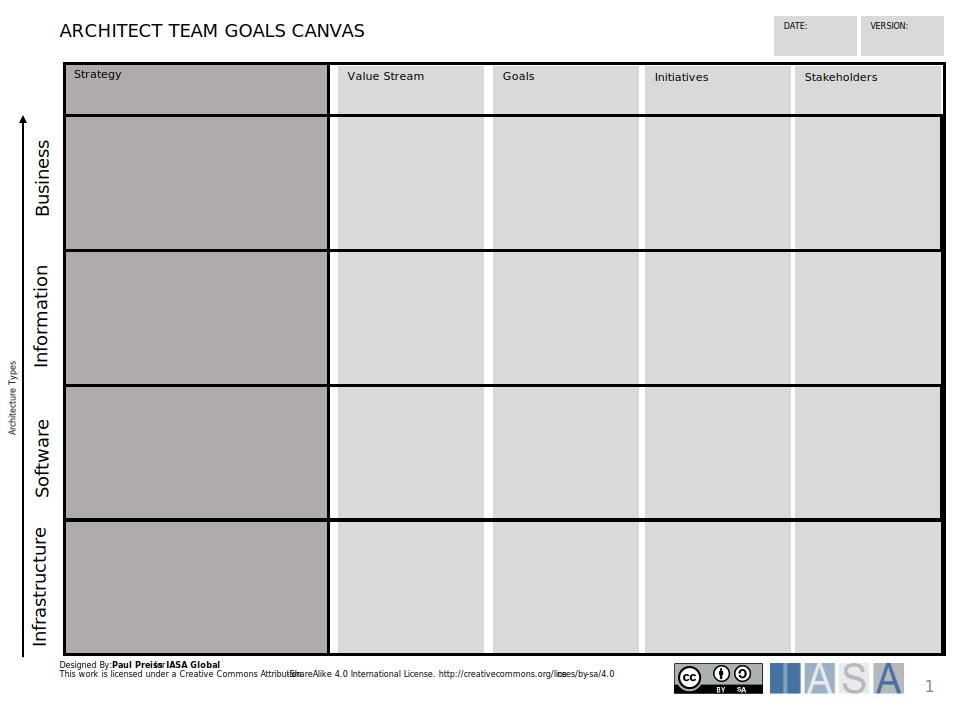

The team goals canvas is a tool to understand the relationship to architecture practice objectives. The goal of the canvas is to define outcomes related to value streams and OKRs for the architecture team itself. It is a play on the Strategy Scorecard. 

[Download PPT](media/ppt/architect_team_goals_canvas.ppt)

Using the team goals canvas, you will bring the architects together to help understand their strategy for the architecture practice along with business targets. See below. The team should look at specific measures related to Value, Customer(s), Processes, and People to understand how the team can best create outcomes. This will tie their initiatives back to measurable objectives and value dashboarding. Measures should be done in the target state with time. 

| Area         | Description | Links To |
| ------------ | ----------- | -------- |
| Strategy     |             |          |
| Objectives   |             |          |
| Measures     |             |          |
| Initiatives  |             |          |
| Stakeholders |             |          |
| Value        |             |          |
| Customer     |             |          |
| Processes    |             |          |
| People       |             |          |