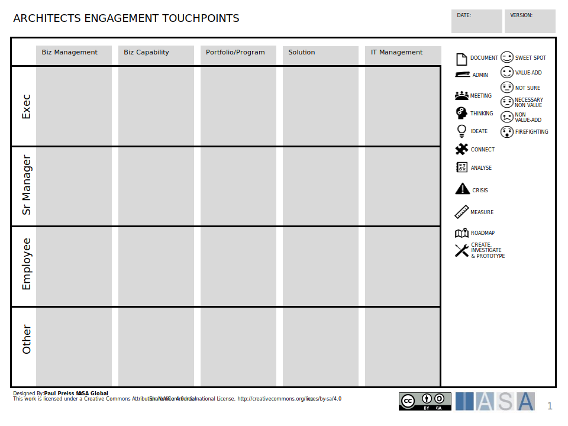
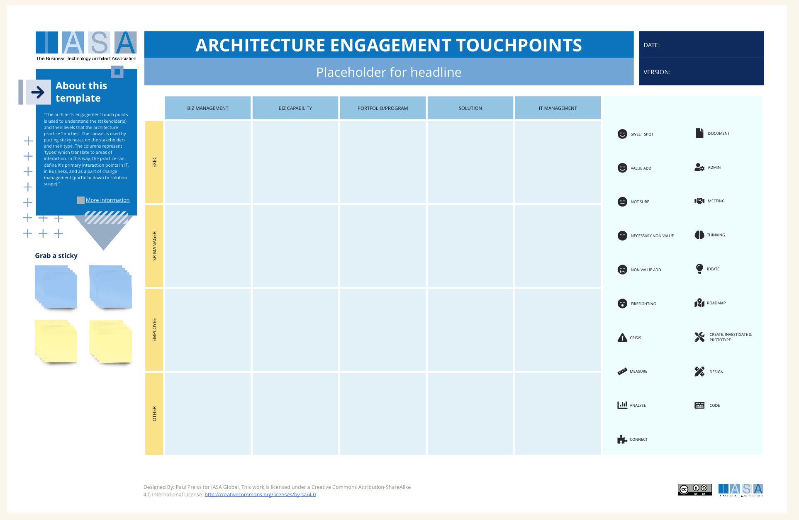

# Overview

The architects engagement touch points is used to understand the stakeholder(s) and their levels that the architecture practice 'touches'. The canvas is used by putting sticky notes on the stakeholders and their types of interactions. The columns represent 'types' which translate to areas of interaction. For example the Sr VP of Sales would be in the Biz Management, Exec cell. If this is a meeting or document use corresponding icons. In this way, the practice can define it's primary interaction points in IT, in Business, and as a part of change management (portfolio down to solution scope).

## How to use the Canvas

1. Identify stakeholders across rows, such as executives, senior managers, employees, and others.

2. Across the columns, list key architectural aspects like business management and IT management.

3. Utilize the symbols on the right to mark activities, such as meetings or ideation, in the intersecting cells, based on where stakeholders engage with each aspect.

Understanding these interactions is critical because it aligns the architectural work with stakeholder needs, ensuring that decisions are informed, relevant, and strategically sound. This understanding promotes effective communication, fosters collaboration, and ultimately contributes to the success of the architecture within the organization.

## Downloads

[Download PPT](media/ppt/architects_engagement_touchpoints.ppt)

## Canvas Sections and Links to BTABoK

| Area              | Description                                                                                                                                                          | Links To                                                 |
| ----------------- | -------------------------------------------------------------------------------------------------------------------------------------------------------------------- | -------------------------------------------------------- |
| Biz Management    | Executives and their direct reports. Generally, interactions down to senior director or similar. These engagements would be highly business focused.                 | [Stakeholder Power/Interest Grid](https://iasa-global.github.io/btabok/power_interest_grid.html){:target="_blank"}                          |
| Biz Capability    | This links to business capabilities and the people involved in them. For example the "Grow Sales Pipeline" would involve multiple, people processes, and technology. | [Capability Card](https://iasa-global.github.io/btabok/capability_card.html){:target="_blank"}, [Capability Canvas](https://iasa-global.github.io/btabok/capability_card.html){:target="_blank"}, Capabilities Article |
| Portfolio/Program | This cell contains those that are involved with change management decision making and investment.                                                                    | [Roadmap](https://iasa-global.github.io/btabok/roadmap.html){:target="_blank"}, [Business Case](https://iasa-global.github.io/btabok/business_case_nabc_card.html){:target="_blank"}, [Objectives](https://iasa-global.github.io/btabok/objectives.html){:target="_blank"}                       |
| Solution          | This area involves those directly engaged in solution delivery and solution descriptions.                                                                            | NABC, Investment Prioritization Article                  |
| IT Management     | These are IT stakeholders who manage the delivery and operations of IT.                                                                                              | [Stakeholder Power/Interest Grid](https://iasa-global.github.io/btabok/power_interest_grid.html){:target="_blank"}                          |
| Executive         | Senior most executives of the client.                                                                                                                                | [Stakeholder Power/Interest Grid](https://iasa-global.github.io/btabok/power_interest_grid.html){:target="_blank"}                          |
| Sr Manager        | Middle management of the client.                                                                                                                                     | [Stakeholder Power/Interest Grid](https://iasa-global.github.io/btabok/power_interest_grid.html){:target="_blank"}                          |
| Employee          | Line and direct employees of the client.                                                                                                                             | [Stakeholder Power/Interest Grid](https://iasa-global.github.io/btabok/power_interest_grid.html){:target="_blank"}                          |
| Other             | Any other stakeholders such as vendors/SIs.                                                                                                                          | [Stakeholder Power/Interest Grid](https://iasa-global.github.io/btabok/power_interest_grid.html){:target="_blank"}                          |

## Use this in Miro

We in the BTABoK are so very excited about the native support for architecture canvases in Miro! Find this canvas in the Miroverse!

## Examples