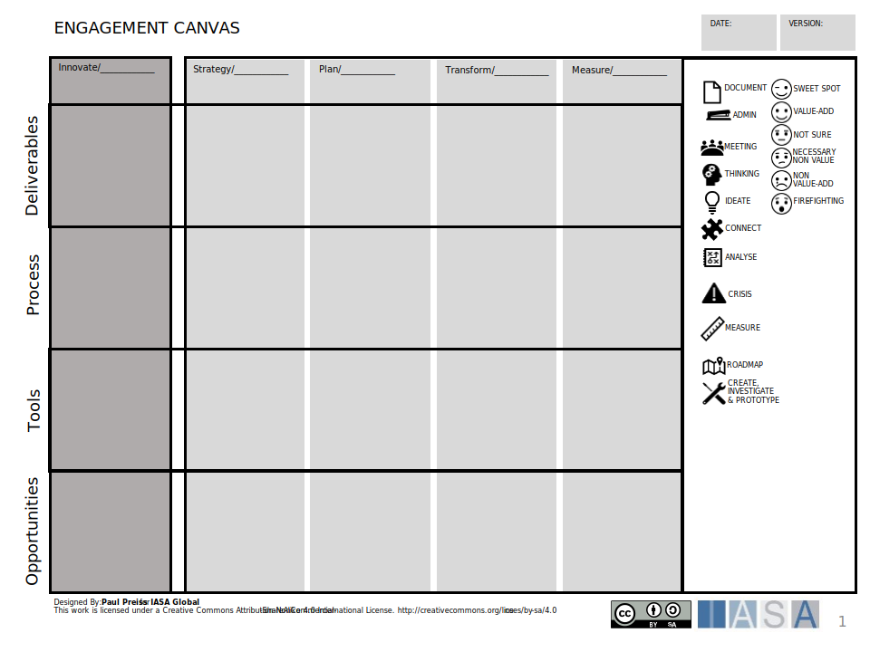

The architect engagement canvas is used by the architecture practice to understand and plan its engagement model. It is used to define artifacts, tasks and tools which would support or deliver better architecture outcomes. 

[Download PPT](media/ppt/architects_process_engagement_canvas.ppt){:target="_blank"}

| Area          | Description                                                                                                                                                                                                                                                                           | Links To                                                                                         |
| ------------- | ------------------------------------------------------------------------------------------------------------------------------------------------------------------------------------------------------------------------------------------------------------------------------------- | ------------------------------------------------------------------------------------------------ |
| Innovate      | This portion of the lifecycle is used to describe any innovation and how it is captured. This is the relationship between architecture and the innovative aspects of the organization. For example, brainstorming sessions, innovation cards, or innovation in business architecture. | Innovate Article, Blue Ocean Canvas, Innovation Canvas (TBD), Product Canvas (TBD)               |
| Strategy      | The strategy phase is the ongoing management and strategy elements of the organizaiton and lifecycle. Most commonly business architects and strategic elements and deliverables are created here.                                                                                     | Strategy Article,  Scorecard, Business Model Canvas, Business Capabilities, Benefits Realization |
| Plan          | This is the planning for change portion of the lifecycle. It is where architecture connects with the planning and investment portion of products/projects. For example, road mapping is commonly a major component of this phase.                                                     | Investment Planning Article, Roadmapping Article, Value Methods Article                          |
| Transform     | The portion of the lifecycle where change occurs. Programming, production and delivery are all a part of this phase including rollout and post-delivery stabilization. It is most commonly the purview of solution architects.                                                        | All change and structure related articles.                                                       |
| Measure       | The measurement phase of the lifecycle is where change is measured against planned strategic outcomes and learning takes place.                                                                                                                                                       | Benefits realization, Architecture Lifecyles                                                     |
| Decommission  | This is the part of the lifecycle where business and technology programs are released and decommissioned. The architecture engagment is to ensure smooth transition to emerging capabilities.                                                                                         |                                                                                                  |
| Deliverables  | The artifacts, interfaces, documents and deliverables which are owned or influenced by the architecture practice. Can be done in both as is and to be states.                                                                                                                         | Deliverables Article, Views Article                                                              |
| Process       | The activities, tasks, meetings (official or unofficial) which are required or desired for architects to engage in to achieve architecture maturity during the phase of the lifecycle. Examples include things like business case reviews, architecture review boards.                |                                                                                                  |
| Tools         | Any tools which support the architects in the phase and how they do so. These include any tools (physical, online, purchased, SAAS).                                                                                                                                                  |                                                                                                  |
| Opportunities | Ideas to improve architecture success in this phase with new tools, new learning, new approaches and techniques.                                                                                                                                                                      |                                                                                                  |