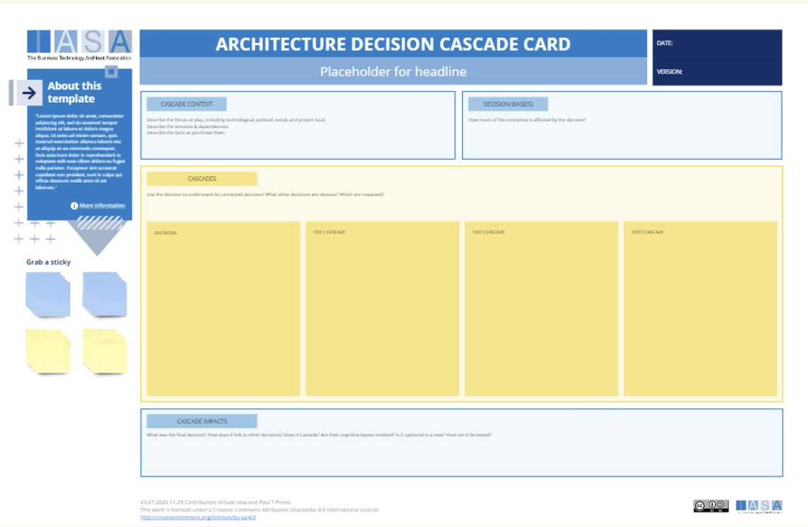

Overview

The decision cascade card looks for downstream impacts from a technology decision. The notion of a decision cascade is to track how one decision impacts another. For example, the operating environment (cloud, hybrid, private cloud) will impact the decision on technology vendors as well as what architectural style to use for service implementation (serverless, microservices, macroservices). 

## How to use this card

1. **Add a Headline.** This should be a brief and descriptive summary of the architectural decision being made. For instance, “Move to a Microservices Architecture.”
2. **About this Template Section.** There is a placeholder for explanatory text about the template itself.
3. **Cascade Context.** In this section, provide background information that gives context to the decision. This might include business drivers, technical constraints, and alternative solutions that were considered.
4. **Decision Biases.** Identify any potential biases that could influence the decision-making process. This could be technical preferences or industry trends.
5. **Cascades.** This section is for the decision itself and all the secondary decisions that flow from it. These secondary decisions can be written on sticky notes and placed on the card. Think about decisions implied by the primary decision. A react interface needs to be hosted in certain ways or needs to connect with microservices or is secured in other ways. 
6. **Cascade Impacts.** Here, outline the anticipated positive and negative downstream consequences of the architectural decision. This might involve impacts on development time, scalability , security, and so on.
7. **Resources.** List any resources that were consulted when making the decision such as reference architectures, white papers, or industry standards.

## Downloads

[Download PPT](media/ppt/architecture_decision_cascade_card.ppt){:target="_blank"}

| Area            | Description                                                                                                                                                                                                                                                   | Links To                 |
| --------------- | ------------------------------------------------------------------------------------------------------------------------------------------------------------------------------------------------------------------------------------------------------------- | ------------------------ |
| Cascade Context | The factors and context of the cascade. Why are we doing this? What forces are causing us to look at related decisions?                                                                                                                                       | ADR, Context View        |
| Bias(es)        | Is there a decision bias prompting this?                                                                                                                                                                                                                      | Decision Bias Calibrator |
| Cascades        | Use this area to look for immediate and downstream decisions that are impacted.                                                                                                                                                                               |                          |
| Decisions       | Primary decisions under evaluation. Use decision records (generally 1-3) as a starting point for the cascade evaluations.                                                                                                                                     | ADR                      |
| Tiers           | Each 'tier' represents levels of abstraction or 'distance from the decsion'. this is not an exact science. For example a service implementation pattern like CQRS might link to caching decisions immediately which might link to database product decisions. | Context View             |
| Cascade Impacts | Any descriptions of the impacts, rationale or consequences uncovered in the cascade.                                                                                                                                                                          |                          |

## Use this in Miro

We in the BTABoK are so very excited about the native support for architecture canvases in Miro! Find this canvas in the Miroverse!

