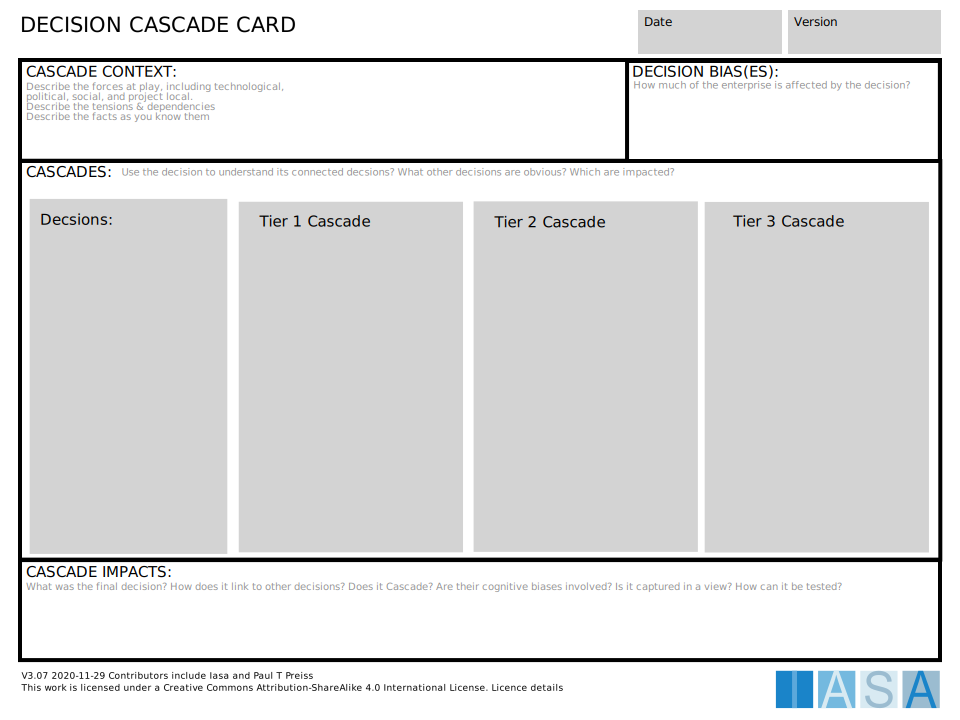

The decision cascade card looks for downstream impacts from a technology decision.

[Download PPT](media/ppt/architecture_decision_cascade_card.ppt){:target="_blank"}

| Area            | Description                                                                                                                                                                                                                                                   | Links To                 |
| --------------- | ------------------------------------------------------------------------------------------------------------------------------------------------------------------------------------------------------------------------------------------------------------- | ------------------------ |
| Cascade Context | The factors and context of the cascade. Why are we doing this? What forces are causing us to look at related decisions?                                                                                                                                       | ADR, Context View        |
| Bias(es)        | Is there a decision bias prompting this?                                                                                                                                                                                                                      | Decision Bias Calibrator |
| Cascades        | Use this area to look for immediate and downstream decisions that are impacted.                                                                                                                                                                               |                          |
| Decisions       | Primary decisions under evaluation. Use decision records (generally 1-3) as a starting point for the cascade evaluations.                                                                                                                                     | ADR                      |
| Tiers           | Each 'tier' represents levels of abstraction or 'distance from the decsion'. this is not an exact science. For example a service implementation pattern like CQRS might link to caching decisions immediately which might link to database product decisions. | Context View             |
| Cascade Impacts | Any descriptions of the impacts, rationale or consequences uncovered in the cascade.                                                                                                                                                                          |                          |
