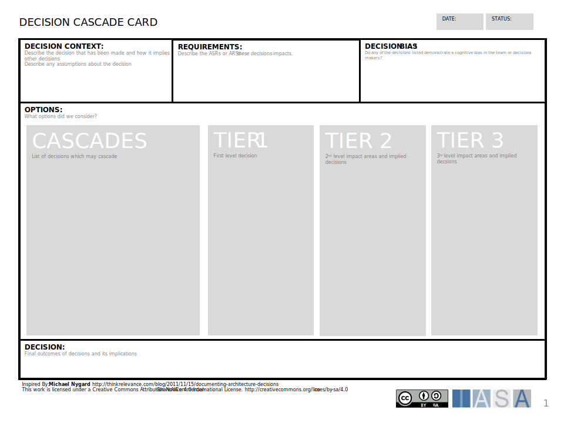

The decision cascade card looks for downstream impacts from a technology decision.

[Download PPT](media/ppt/architecture_decision_cascade_card.ppt){:target="_blank"}

| Area             | Description | Links To |
| ---------------- | ----------- | -------- |
| Decision Context |             |          |
| Requirements     |             |          |
| Decision Bias    |             |          |
| Options          |             |          |
| Decision         |             |          |
