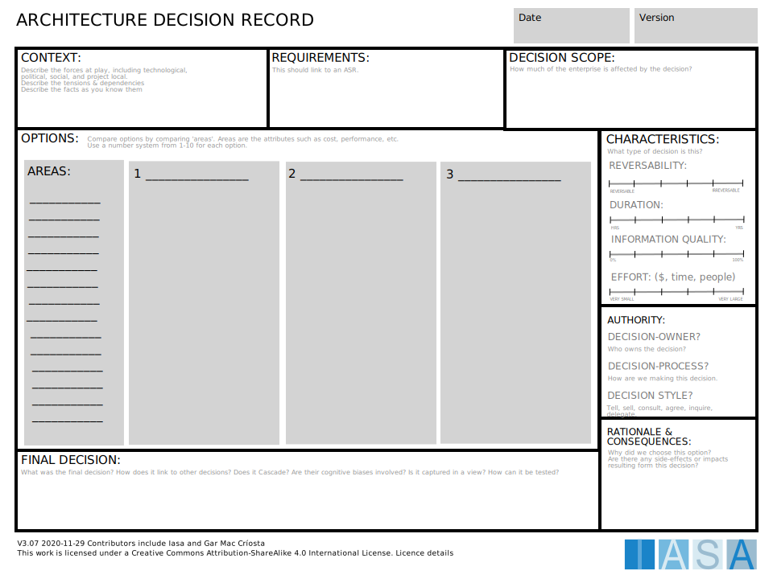

The ADR provides a decision management tool for discrete decisions for traceability to ASR and usage.

[Download PPT](media/ppt/architecture_decision_record.ppt){:target="_blank"}

| Area | Description | Links To |
| --- | --- | --- |
| Context | The overall name and description of the decision to be made |   |
| Requirements | The requirements (ASR) that drive the decision | ASR |
| Decision Scope | The scope of impact of the decision | Scope |
| Characteristics | Duration, information quality, effort and reversibility of the decision |   |
| Authority | How the decision will be made and by whom |   |
| Rationale and Consequences | Any additional thinking or consequences of the decision |   |
| Options (Areas) | The areas or topics to compare against for all of the options. |   |
| Options | The different choices available in the decision. |   |
| Final Decision | Which decision was made and any description. |   |