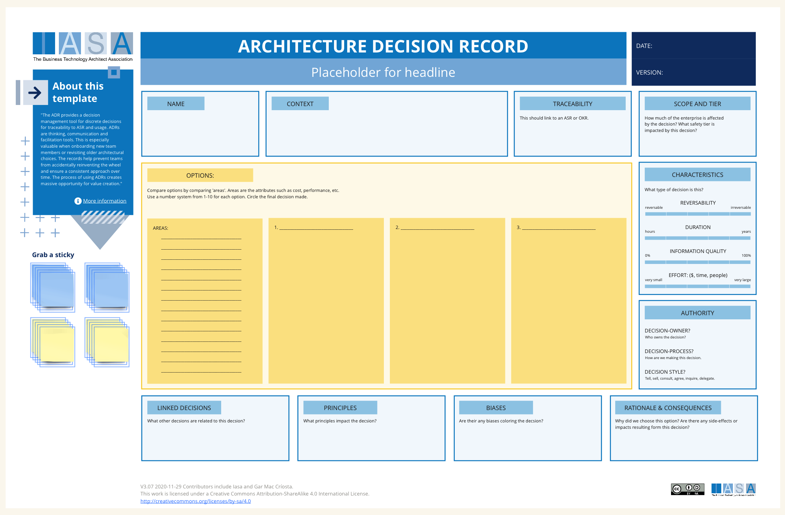

The ADR provides a decision management tool for discrete decisions for traceability to ASR and usage. ADRs are thinking, communication and facilitation tools. This is especially valuable when onboarding new team members or revisiting older architectural choices. The records help prevent teams from accidentally reinventing the wheel and ensure a consistent approach over time. Additionally, by thoughtfully outlining the rationale behind decisions and their potential consequences, ADRs contribute to risk mitigation. They give teams the framework to assess the impacts of changing requirements on the architecture and the potential necessity to backtrack on previous decisions.

Overall, ADRs offer several significant benefits. They foster informed decision-making by providing context for future choices. They contribute to sound architectural governance by creating an easily auditable trail of how and why architectural choices were made. Finally, ADRs streamline collaboration, improve knowledge sharing, and ultimately contribute to better alignment between architectural initiatives and overall business goals.

ADRs are essential for several reasons:

- **Improved Communication and Transparency:** They provide a centralized location to document and share architectural decisions with all stakeholders. This fosters transparency and reduces misunderstandings.
- **Knowledge Transfer and Learning:** ADRs serve as a historical record of past architectural decisions. This information is valuable for new team members and helps prevent re-inventing the wheel.
- **Traceability and Consistency:** ADRs help trace architectural decisions back to business requirements and ensure consistency in architectural approaches over time.
- **Reduced Risks:** By carefully documenting the rationale behind decisions, ADRs help mitigate risks associated with changing architectural direction.

## How to use this card

**. Define the Decision**

- **Title:** Concisely state the architectural decision being recorded (e.g., "Adopt Microservices Architecture").
- **Date & Version:** Record the date the decision was made and any subsequent revisions.
- **Context:** Provide background on the problem or business need the decision addresses. Consider:
  - What prompted this decision?
  - What are the relevant business requirements?
  - What technical or design constraints apply?
- **Decision:** State the chosen solution or approach in clear terms. Use unambiguous language.

**2. Explore and Explain**

- **Consequences:** List both positive and negative outcomes of the decision. Think about:
  - Impact on other parts of the system or architecture
  - Potential scalability challenges
  - Trade-offs in security, complexity, or performance
  - Long-term implications for maintenance or evolution
- **References:** Link to diagrams, code, or supporting documents that provide context.

**3. Document Status and Approvals**

- **Status:** Indicate if the decision is active, deprecated, or superseded by other ADRs.
- **Approver:** Identify the person or team authorized to make this architectural decision.

**Tips for Effective ADRs**

**Keep it Concise:** Focus on the essentials, avoiding excessive technical jargon.

**Collaborative Process:** Involve stakeholders in discussions leading to the decision and encourage their feedback before finalizing the ADR.

**Version Control:** Use a system to track changes and updates to the ADRs over time.

**Living Document:** Revisit and update ADRs when requirements or the context shift.

**Accessible Repository:** Store ADRs in a central location for easy reference.

#### Information Sources:

- Meeting notes from architectural discussions
- Technical documentation
- Business requirements documents
- Existing ADRs related to the current decision

## Downloads

[Download PPT](media/ppt/architecture_decision_record.ppt){:target="_blank"}, [Download MD](media/adr_md_download.md){:target="_blank"}

To use the decision record you will need to either print it out or put it in a diagramming tool. The card is easy to fill out. We have found the best method for doing so is to use a scale of 1-10 for the different options. So for each 'area' rate the option with a scale. This also works extremely well in groups. 

| Area              | Description  | Links To |
| :---------------- | :------: | ----: |
| Context        |   The overall name and description of the decision to be made   | [Context View](context_view_card.md){:target="_blank"} |
| Requirements           |   The requirements (ASR) that drive the decision   | [ASR Card](https://iasa-global.github.io/btabok/asr_card.html){:target="_blank"} |
| Decision Scope    |  The scope of impact of the decision   | [Scope](https://iasa-global.github.io/btabok/scope_context.html){:target="_blank"} |
| Characteristics |  Duration, information quality, effort and reversibility of the decision   | [ASR Card](https://iasa-global.github.io/btabok/asr_card.html){:target="_blank"}, [OKR](https://iasa-global.github.io/btabok/okr_card.html){:target="_blank"}, [Context View](context_view_card.md){:target="_blank"} |
| Authority |  How the decision will be made and by whom.  | [Stakeholder Ecosystem](https://iasa-global.github.io/btabok/stakeholder_ecosystem_canvas.html){:target="_blank"} |
| Options (Areas) |  The areas or topics to compare against for all of the options.  | N/A |
| Options |  The different choices available in the decision.   | [Roadmap](https://iasa-global.github.io/btabok/architects_roadmap_canvas.html){:target="_blank"} |
| Rationale and Consequences |  Any additional thinking or consequences of the decision.   | [OKR](https://iasa-global.github.io/btabok/okr_card.html){:target="_blank"}, [Cascade](https://iasa-global.github.io/btabok/architecture_decision_cascade_card.html){:target="_blank"} |
| Final Decision | Which decision was made and any description.| N/A |

## Use this in Miro

We in the BTABoK are so very excited about the native support for architecture canvases in Miro! Find this canvas in the Miroverse!

