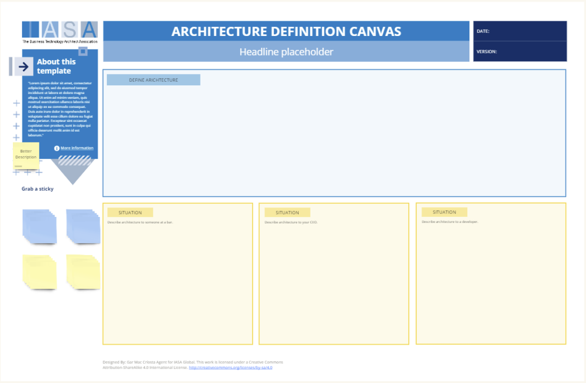

# Overview

The architecture definition canvas is a tool to help get architects and other to understand what they mean by the term. That is useful as the title is poorly understood even by its senior practicioners. 

## How to use this canvas

## Downloads

[Download PPT](media/ppt/architecture_definition_canvas.pptx){:target="_blank"}

| Area                | Description                                                                                                                                                                                                                                                                                                                 | Links To |
| ------------------- | --------------------------------------------------------------------------------------------------------------------------------------------------------------------------------------------------------------------------------------------------------------------------------------------------------------------------- | -------- |
| Define Architecture | Put your definition of architecture in this area. Try to think in terms of a global definition for architecture that would apply to all 'types' of architects.                                                                                                                                                              | None     |
| Situation (areas)   | These situation areas allow you to describe architecture to a particular type of person or stakeholder. Think in terms of what they would understand about an architects value to a company or to society as a whole. For example, doctors 'heal people' and specific types of doctors provide particular types of healing. | None     |

## [Use this in Miro](https://miro.com/miroverse/architecture-definition-canvas-template/)

We in the BTABoK are so very excited about the native support for architecture canvases in Miro! Find this canvas in the Miroverse!

