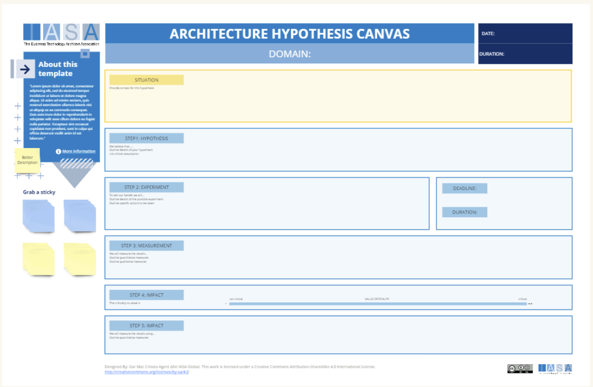

The hypothesis card is used to brainstorm hypothesis development in experimentation.

This can help to:

- **Reduce Risk:** By surfacing and testing assumptions early, architects can expose potential problems before significant time and resources are invested in an unsuitable architecture.
- **Improve Decision Making:** The process of experimenting and analyzing results forces architects to gather data to support their decisions. This data-driven approach can lead to more informed choices throughout the development lifecycle.
- **Facilitate Communication:** The Architecture Hypothesis Canvas provides a shared language and structure for architects to collaborate and communicate their ideas with stakeholders and development teams.

Experimentation is increasingly finding its way into architecture teams, particularly within software architecture. Teams experiment by building prototypes and simulations to rapidly test architectural models without full implementation. A/B testing compares the performance of different architectural options under real user loads, while shadow deployments allow observation of new components alongside a production system without causing disruptions. Even chaos engineering, the deliberate introduction of failures, helps assess an architecture's resilience. This experimental approach reduces uncertainty by validating assumptions, fosters innovation, and promotes data-driven decision-making. The result is improved system quality in terms of scalability, security, and maintainability. However, challenges like the cost of experimentation, the need for specialized technical infrastructure, and potential shifts in development culture need to be carefully considered when adopting these practices.

**Types of Experimentation**

- **Prototypes and Simulations:** Architects can experiment with different architectural patterns and technologies by building small-scale prototypes or simulations. This allows them to visualize and test ideas quickly without committing to a full-blown implementation.
- **A/B Testing:** When multiple architectural options seem viable, A/B testing can be applied. This involves rolling out different variants of an architecture to subsets of users and comparing key metrics (like performance, reliability) to determine the superior approach.
- **Shadow Deployments:** New architectural components can be deployed "in the shadows" alongside existing production systems. This lets teams observe the behavior of the new architecture under real-world load and traffic without impacting users.
- **Chaos Engineering:** Intentionally introducing failures or unexpected conditions (think server outages, network disruptions) into a system helps assess an architecture's resilience and identify potential weaknesses.

**Benefits of Experimentation for Architecture Teams**

- **Reducing Uncertainty:** Experimentation helps mitigate risk by turning architectural assumptions into testable hypotheses. Teams can make more confident decisions backed by data rather than relying solely on intuition.
- **Agility and Innovation:** The ability to test architectural ideas quickly fosters a culture of experimentation, encouraging innovation and increasing the team's responsiveness to changing requirements.
- **Data-Driven Decision-Making:** Metrics gathered from experiments provide objective evidence to guide architectural choices, moving away from purely subjective preferences.
- **Improved System Quality:** Through continuous experimentation and validation, architects can progressively refine the system's architecture, boosting non-functional qualities like scalability, security, and maintainability.

## How to use this card

**Preparation**

- **Select Participants:** Assemble a small, cross-functional team. Include the lead architect, key developers, potentially a product manager, and any domain experts relevant to the project.
- **Distribute Resources:** Send participants the blank Architecture Hypothesis Canvas template in advance, along with any background materials about the project (problem statements, existing architecture if applicable). Encourage them to come prepared with ideas and questions.
- **Set the Agenda:** Clearly outline the meeting's objective: to collaboratively fill out the Architecture Hypothesis Canvas. Allocate tentative time slots for each section to manage expectations.

**The Meeting**

1. **Warm-Up and Context Setting:** Begin by reiterating the problem the architecture is intended to solve. Briefly review any existing documentation or decisions that are relevant.
2. **Situation and Hypothesis:** Guide the team in defining the context—what's the goal, and what other systems interact with this solution? Lead the discussion into the core hypothesis about the right architectural approach.
3. **Experiment and Measurement:** Brainstorm potential experiments that validate the hypothesis. Be specific about what needs to be tested and the metrics that will determine success.
4. **Impact:** Encourage the group to visualize the outcome of these experiments. How will the results support or refute the architectural decisions? What would a successful outcome enable?
5. **Logistics:** Fill in the header information (date, deadlines, owners) for easy reference.

## Downloads

[Download PPT](media/ppt/architecture_hypothesis_card.ppt){:target="_blank"}

| Area                  | Description                                                                                                                                                                                                | Links To           |
| --------------------- | ---------------------------------------------------------------------------------------------------------------------------------------------------------------------------------------------------------- | ------------------ |
| Situation             | This section prompts you to describe the context surrounding the project. What problem are you trying to solve? What existing systems will this new architecture integrate with?                           | Innovation article |
| Hypothesis            | This is the core of the canvas. Here, you articulate your assumptions about the new architecture. What architectural decisions will you make? Why do you believe these decisions are the most appropriate? |                    |
| Experiment            | Describe how you will validate your architectural hypotheses. What tests or experiments will you conduct to assess your assumptions?                                                                       |                    |
| Measure (measurement) | Define the metrics you will use to measure the success of your experiments. How will you know if your architectural decisions are paying off?                                                              |                    |
| Value Impact          | Here, you analyze the outcome of your experiments. Did your architectural decisions hold true? What did you learn from the validation process?                                                             | Valuations         |
| Measure (criteria)    | Fill in the date the hypothesis was created and set a deadline for when the validation should be completed.                                                                                                | Objectives         |

## Use this in Miro

We in the BTABoK are so very excited about the native support for architecture canvases in Miro! Find this canvas in the Miroverse!

