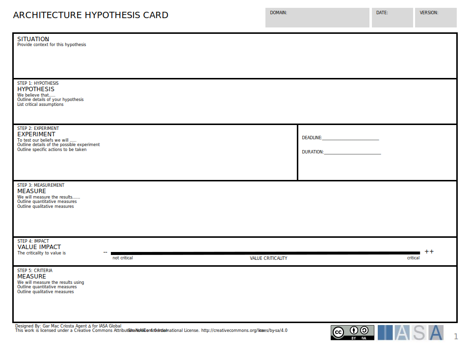

The hypothesis card is used to brainstorm hypothesis development in experimentation.

[Download PPT](media/ppt/architecture_hypothesis_card.ppt){:target="_blank"}

| Area                  | Description | Links To |
| --------------------- | ----------- | -------- |
| Situation             |             |          |
| Hypothesis            |             |          |
| Experiment            |             |          |
| Measure (measurement) |             |          |
| Value Impact          |             |          |
| Measure (criteria)    |             |          |