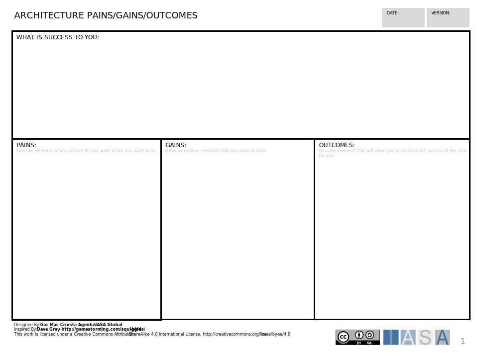
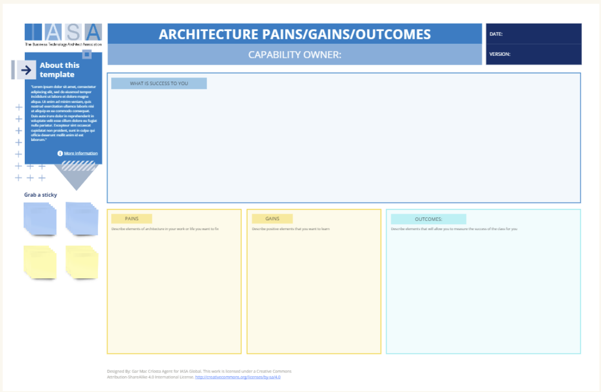

The architecture pains gains canvas is a tool to help a team envision their current state as an architecture practice. Things that are working and not working, things that are wonderful, things they want to learn. It also helps to understand how that success will be measured. 

[Download PPT](media/ppt/architecture_pains_and_gains.ppt){:target="_blank"}

| Area                   | Description | Links To |
| ---------------------- | ----------- | -------- |
| What is success to you |             |          |
| Pains                  |             |          |
| Gains                  |             |          |
| Outcomes               |             |          |

## Use this in Miro

We in the BTABoK are so very excited about the native support for architecture canvases in Miro! Find this canvas in the Miroverse!

